title: DockerCon EU 2018
description: A Recap Of DockerCon EU 2018 at Barcelona

# DockerCon EU 2018 - Recap

## Generally outline

From my perspective, there were a few red threads throughout the conference.

### Security begins at the Developer

A shift left of security, bringing the responsibility of knowing your dependencies and their quality firmly to the developer. Most of this tooling is still aimed at enterprises though, being part of paid solutions mostly. At least that which was shown at the conference.

* docker-assemble, that can build in an image from a Maven pom.xml and will include meta-data of all your dependencies (transitive included)
* JFrog X-Ray
* Docker EE tooling such as Docker Trusted Registry (DTR)

### Broader Automation

More focus on the entire lifecycle of a system and not just an application. It seems people are starting to understand that doing CI/CD and Infrastructure As Code is not a single event for a single application. There is likely to be a few applications belonging together making a whole system which will land on more than one type of infrastructure and possibly more types of clusters.

What we see is tools looking at either a broader scope, a higher level abstraction or more developer focussed (more love for the Dev in DevOps) to allow for easier integration with multiple platforms. For example, Pulumi will enable you to create any type of infrastructure - like Hashicorp's Terraform - but then in programming languages, you're used to (TypeScript, Python, Go).

* Pulumi
* Docker App
* CNAB
* Build-Kit

### Containerization Influences Everything

Containerization has left deep and easy to spot imprints in our industry from startups building entirely on top of containers to programming languages changing their ways to stay relevant.

There are new monitoring kings in the world, DataDog, Sysdig, Honeycomb.io and so on. They live and breathe containers and are not afraid of being thrown around different public clouds, networks and what not. In contrast to traditional monitoring tools, which are often bolting on container support and struggle with the dynamic nature of containerized clusters.

Another extraordinary influence is that on the Java language. Declared dead a million times over and deemed obsolete in the container era due to its massive footprint in image size and runtime size. Both are being addressed, and we see a lot of work done on reducing footprint and static linking (JLink, Graal).

The most significant influence might be on the software behemoth that has rejuvenated itself. Microsoft has sworn allegiance to open source, Linux and containers. Windows 2019 server can run container workloads natively and work as nodes alongside a Docker EE cluster - which can include Kubernetes workloads. The next step would be support for Kubernetes integration, and as in the case of Java, smaller container footprint.

* Java & Docker
* Windows Container & Windows Server Support
* Observability tools
* Kubernetes offerings everywhere...

## Docker Build with Build-Kit

Instead of investing in improving docker image building via the Docker Client, Docker created a new API and client library.

This library called BuildKit, is completely independent. With Docker 18.09, it is included in the Docker Client allowing anyone to use it as easily as the traditional `docker image build`.

BuildKit is already used by some other tools, such as Buildah and IMG, and allows you to create custom DSL "Frontends". As long as the API of BuikdKit is adhered to, the resulting image will be OCI compliant.

So further remarks below and how to use it.

* [BuildKit](https://github.com/moby/buildkit)
* In-Depth session [Supercharged Docker Build with BuildKit](https://europe-2018.dockercon.com/videos-hub)
* Usable from Docker `18.09`
* HighLights:
    * allows custom DSL for specifying image (BuildKit) to still be used with Docker client/daemon
    * build cache for your own files during build, think Go, Maven, Gradle...
    * much more optimized, builds less, quicker, with more cache in less time
    * support mounts (cache) such as secrets, during build phase

```bash
# Set env variable to enable
# Or configure docker's json config
export DOCKER_BUILDKIT=1
```

```dockerfile
# syntax=docker/dockerfile:experimental
#######################################
## 1. BUILD JAR WITH MAVEN
FROM maven:3.6-jdk-8 as BUILD
WORKDIR /usr/src
COPY . /usr/src
! RUN --mount=type=cache,target=/root/.m2/  mvn clean package -e
#######################################
## 2. BUILD NATIVE IMAGE WITH GRAAL
FROM oracle/graalvm-ce:1.0.0-rc9 as NATIVE_BUILD
WORKDIR /usr/src
COPY --from=BUILD /usr/src/ /usr/src
RUN ls -lath /usr/src/target/
COPY /docker-graal-build.sh /usr/src
RUN ./docker-graal-build.sh
RUN ls -lath
#######################################
## 3. BUILD DOCKER RUNTIME IMAGE
FROM alpine:3.8
CMD ["jpc-graal"]
COPY --from=NATIVE_BUILD /usr/src/jpc-graal /usr/local/bin/
RUN chmod +x /usr/local/bin/jpc-graal
#######################################
```

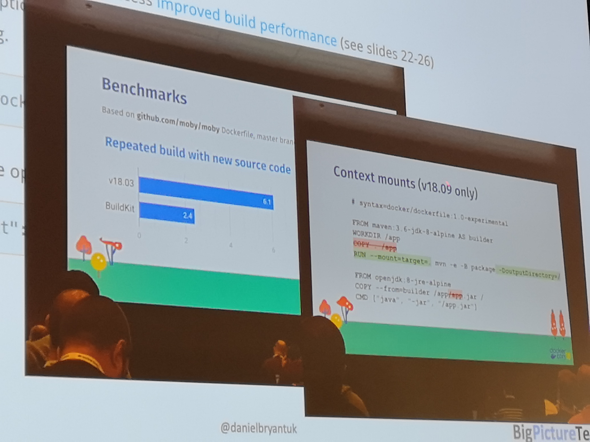

## Secure your Kubernetes

* https://www.openpolicyagent.org + admission controller
* Network Policies
* Service Accounts

## Broader Cloud Automation

Two of the `broader cloud automation` initiatives that impressed me at DockerCon were Pulumi and CNAB.

Where Pulumi is an attempt to provide a more developer-friendly alternative to Terraform, CNAB is an attempt to create an environment agnostic installer specification.

Meaning, you could create a CNAB installer which uses Pulumi to install all required infrastructure, applications and other resources.

### CNAB: cloud native application bundle

* Bundle.json
* invocation image (oci) = installer
* https://cnab.io
* docker app implements it
* helm support
* https://github.com/deislabs

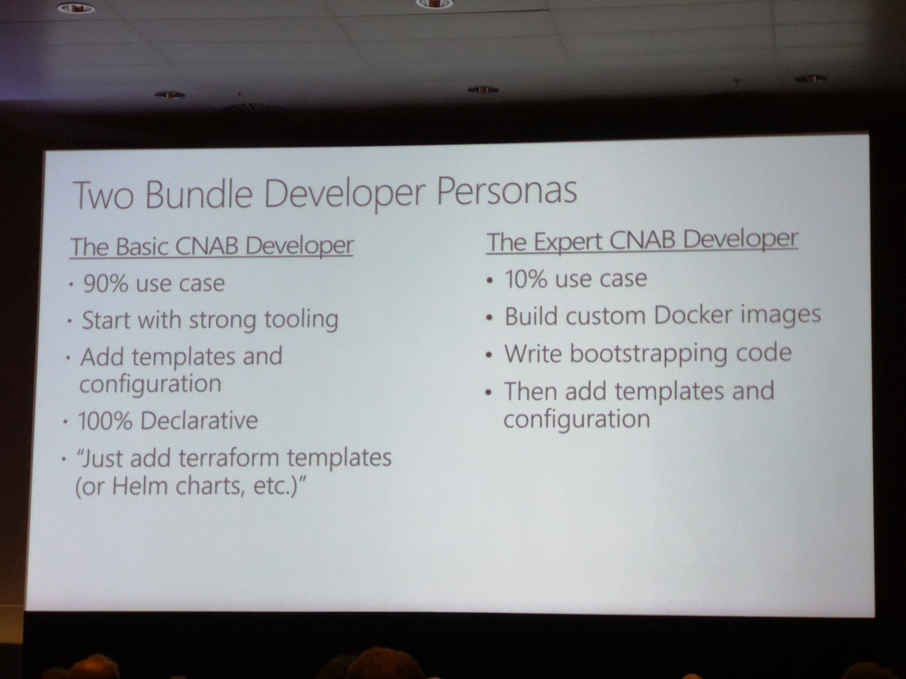

#### Install an implementation

There are currently two implementations - that I found.
Duffle from DeisLabs - open source from Azure - and Docker App - From Docker Inc..

#### Duffle

* create a new repo
* clone the repo
* init a duffle bundle
* copy duffle bundle data to our repo folder

```bash
git clone git@github.com:demomon/cnab-duffle-demo-1.git
duffle create cnab-duffle-demo-2
mv cnab-duffle-demo-2/cnab cnab-duffle-demo-1/
mv cnab-duffle-demo-2/duffle.json cnab-duffle-demo-1/
```

* edit our install file (`cnab/run`)
* build our duffle bundle (`duffle build .`)

We can now inspect our bundle with duffle.

```bash
duffle show cnab-duffle-demo-1:0.1.0 -r

-----BEGIN PGP SIGNED MESSAGE-----
Hash: SHA256

{
  "name": "cnab-duffle-demo-1",
  "version": "0.1.0",
  "description": "A short description of your bundle",
  "keywords": [
    "cnab-duffle-demo-1",
    "cnab",
    "demo",
    "joostvdg"
  ],
  "maintainers": [
    {
      "name": "Joost van der Griendt",
      "email": "joostvdg@gmail.com",
      "url": "https://joostvdg.github.io"
    }
  ],
  "invocationImages": [
    {
      "imageType": "docker",
      "image": "deislabs/cnab-duffle-demo-1-cnab:2965aad7406e1b651a98fffe1194fcaaec5e623c"
    }
  ],
  "images": null,
  "parameters": null,
  "credentials": null
}
-----BEGIN PGP SIGNATURE-----

wsDcBAEBCAAQBQJcL3L8CRDgq4YEOipZ/QAAjDYMAJI5o66SteUP2o4HsbVk+Viw
3Fd874vSVmpPKcmN3tRCEDWGdMdvqQiirDpa//ghx4y5oFTahK2ihQ35GbJLlq8S
v9/CK6CKGJtp5g38s2LZrKIvESzEF2lTXwHB03PG8PJ37iWiYkHkxvMpyzded3Rs
4d+VgUnip0Cre7DemaUaz5+fTQjs88WNTIhqPg47YvgqFXV0s1y7yN3RTLr3ohQ1
9mkw87nWfOD+ULpbCUaq9FhNZ+v4dK5IZcWlkyv+yrtguyBBiA3MC54ueVBAdFCl
2OhxXgZjbBHPfQPV1mPqCQudOsWjK/+gqyNb6KTzKrAnyrumVQli/C/8BVk/SRC/
GS2o4EdTS2lfREc2Gl0/VTmMkqzFZZhWd7pwt/iMjl0bICFehSU0N6OqN1d+v6Sq
vWIZ5ppxt1NnCzp05Y+NRfVZOxBc2xjYTquFwIa/+qGPrmXBKamw/irjmCOndvx+
l1tf/g0UVSQI2R2/19svl7dlMkYpDdlth1YGgZi/Hg==
=8Xwi
-----END PGP SIGNATURE-----
```

#### Demo

I've created a demo on GitHub: [github.com/demomon/cnab-duffle-demo-1](https://github.com/demomon/cnab-duffle-demo-1)

Its goal is to install [CloudBees Core](https://www.cloudbees.com/products/cloudbees-core) and its prerequisites in a (GKE) Kubernetes cluster.

It wraps a Go (lang) binary that will execute the commands, for which you can find the source code [on GitHub](https://github.com/joostvdg/k8s-gitops-installer).

##### Components

A CNAB bundle has some components by default, for this demo we needed the following:

* **duffle.json**: Duffle configuration file
* **Dockerfile**: the CNAB installer runtime
* **run**(script): the installer script
* **kgi**(binary): the binary executable from my k8s-gitops-installer code, that we will leverage for the installation

##### Dockerfile

The installer tool (`kgi`) requires `Helm` and `Kubectl`, so we a Docker image that has those.
As we might end up packaging the entire image as part of the full CNAB package, it should also be based on Alpine (or similar minimal Linux).

There seems to be one very well maintained and widely used (according to GitHub and Dockerhub stats): `dtzar/helm-kubect`.
So no need to roll our own.

```Dockerfile
FROM dtzar/helm-kubectl:2.12.1
COPY Dockerfile /cnab/Dockerfile
COPY app /cnab/app
COPY kgi /usr/bin
RUN ls -lath /cnab/app/
RUN kgi --help
CMD ["/cnab/app/run"]
```

##### duffle.json

The only thing we need to add beyond the auto-generated file, is the credentials section.

```json
"credentials": {
    "kubeconfig": {
        "path": "/cnab/app/kube-config"
    }
}
```

##### kgi

I pre-build a binary suitable for Linux that works in Alpine and included it in the CNAB folder.

##### run script

First thing we need to make sure, is to configure the Kubeconfig location.

```bash
export KUBECONFIG="/cnab/app/kube-config"
```

This should match what we defined in the `duffle.json` configuration - as you might expect - to make sure it gets bound in the right location.
The `kubectl` command now knows which file to use.

For the rest, we can do what we want, but convention tells us we need at least support `status`, `install` and `uninstall`.
I'm lazy and only implemented `install` at the moment.

In the install action, we will use the `kgi` executable to install CloudBees Core and it's pre-requisites.

```bash
action=$CNAB_ACTION

case $action in
    install)
        echo "[Install]"
        kgi validate kubectl
    ;;
esac
```
For the rest, I recommend you look at the sources.

##### Run the demo

First, we have to build the bundle.

```bash
duffle build .
```

Once the build succeeded, we can create a credentials configuration. This will be a separate configuration file managed by Duffle.
This configuration config must then be used with any installation that requires it - which makes it reusable as well.

We have to populate it with the credential. In this case a path to a kube-config file.
If you do not have one that you can export - e.g. based on GCloud - you can create a new user/certificate with a script.

This is taken from [gravitational](https://gravitational.com/blog/kubectl-gke/), which were nice enough to create a script for doing so.

You can find the script on [GitHub (get-kubeconfig.sh)](https://github.com/gravitational/teleport/blob/master/examples/gke-auth/get-kubeconfig.sh).

Once you have that, store the end result at a decent place and configure it as your credential.

```bash
duffle creds generate demo1 cnab-duffle-demo-1
```

With the above command we can create a credential config object based on the build bundle `cnab-duffle-demo-1`.
The credential object will be `demo-1`, which we can now use for installing.

```bash
duffle install demo1 cnab-duffle-demo-1:1.0.0 -c demo1
```

#### Further reading

* [Howto guide on creating a Duffle Bundle](https://github.com/deislabs/duffle/blob/master/docs/guides/bundle-guide.md)
* [Howto on handling credentials](https://github.com/deislabs/cnab-spec/blob/master/802-credential-sets.md)
* [Wordpress with Kubernetes and AWS demo by Bitnami](https://github.com/bitnami/cnab-bundles/tree/master/wordpress-k8s-rds)
* [Example bundles](https://github.com/deislabs/bundles)

### Pulumi

Just pointing to the documentation and GitHub repository is a bit boring and most of all, lazy. So I've gone through the trouble to create a demo project that shows what Pulumi can do.

One of the things to keep in mind is that Pulumi keeps its state in a remote location by default - Pulumi's SaaS service. Much like using an S3 bucket to store your Terraform state.

The goal of the demo is to show what you can do with Pulumi. My personal opinion is that Pulumi is excellent for managing entire systems as code. From public cloud infrastructure to public open source resources right down to your applications and their configurations.

The system that I've written with Pulumi is a CI/CD system running in a GKE cluster. The system contains Jenkins, Artifactory and a custom LDAP server.

To make it interesting, we'll use different aspects of Pulumi to create the system. We will create the GKE cluster via Pulumi's wrapper for the `gcloud` cli - in a similar way as JenkinsX does -, install Jenkins and Artifactory via Helm and install the LDAP server via Pulumi's Kubernetes resource classes.

#### Steps taken

* For more info [Pulumi.io](pulumi.io)
* install: `brew install pulumi`
* clone demo: `git clone https://github.com/demomon/pulumi-demo-1`
* init stack: `pulumi stack init demomon-pulumi-demo-1`
    * connect to GitHub
* set kubernetes config `pulumi config set kubernetes:context gke_ps-dev-201405_europe-west4_joostvdg-reg-dec18-1`
* `pulumi config set isMinikube false`
* install npm resources: `npm install` (I've used the TypeScript demo's)
* `pulumi config set username administrator`
* `pulumi config set password 3OvlgaockdnTsYRU5JAcgM1o --secret`
* `pulumi preview`
* incase pulumi loses your stack: `pulumi stack select demomon-pulumi-demo-1`
* `pulumi destroy`

Based on the following demo's:

* https://pulumi.io/quickstart/kubernetes/tutorial-exposed-deployment.html
* https://github.com/pulumi/examples/tree/master/kubernetes-ts-jenkins

#### Artifactory via Helm

To install the helm charts of Artifactory using Helm, we will first need to add JFrog's repository.

* `helm repo add jfrog https://charts.jfrog.io`
* `helm repo update`

#### GKE Cluster

Below is the code for the cluster.

```typescript
import * as gcp from "@pulumi/gcp";
import * as k8s from "@pulumi/kubernetes";
import * as pulumi from "@pulumi/pulumi";
import { nodeCount, nodeMachineType, password, username } from "./gke-config";

export const k8sCluster = new gcp.container.Cluster("gke-cluster", {
    name: "joostvdg-dec-2018-pulumi",
    initialNodeCount: nodeCount,
    nodeVersion: "latest",
    minMasterVersion: "latest",
    nodeConfig: {
        machineType: nodeMachineType,
        oauthScopes: [
            "https://www.googleapis.com/auth/compute",
            "https://www.googleapis.com/auth/devstorage.read_only",
            "https://www.googleapis.com/auth/logging.write",
            "https://www.googleapis.com/auth/monitoring"
        ],
    },
});
```

##### GKE Config

As you could see, we import variables from a configuration file `gke-config`.

```typescript
import { Config } from "@pulumi/pulumi";
const config = new Config();
export const nodeCount = config.getNumber("nodeCount") || 3;
export const nodeMachineType = config.get("nodeMachineType") || "n1-standard-2";
// username is the admin username for the cluster.
export const username = config.get("username") || "admin";
// password is the password for the admin user in the cluster.
export const password = config.require("password");
```

##### Kubeconfig

As you probably will want to install other things (Helm charts, services) inside this cluster, we need to make sure we get the `kubeconfig` file of our cluster - which is yet to be created.
Below is the code - courtesy of [Pulumi's GKE Example](https://github.com/pulumi/examples/tree/master/gcp-ts-gke) - that generates and exports the Kubernetes Client Configuration.

This client configuration can then be used by Helm charts or other Kubernetes services.
Pulumi will then also understand it depends on the cluster and create/update it first before moving on to the others.

```typescript
// Manufacture a GKE-style Kubeconfig. Note that this is slightly "different" because of the way GKE requires
// gcloud to be in the picture for cluster authentication (rather than using the client cert/key directly).
export const k8sConfig = pulumi.
    all([ k8sCluster.name, k8sCluster.endpoint, k8sCluster.masterAuth ]).
    apply(([ name, endpoint, auth ]) => {
        const context = `${gcp.config.project}_${gcp.config.zone}_${name}`;
        return `apiVersion: v1
clusters:
- cluster:
    certificate-authority-data: ${auth.clusterCaCertificate}
    server: https://${endpoint}
  name: ${context}
contexts:
- context:
    cluster: ${context}
    user: ${context}
  name: ${context}
current-context: ${context}
kind: Config
preferences: {}
users:
- name: ${context}
  user:
    auth-provider:
      config:
        cmd-args: config config-helper --format=json
        cmd-path: gcloud
        expiry-key: '{.credential.token_expiry}'
        token-key: '{.credential.access_token}'
      name: gcp
`;
    });

// Export a Kubernetes provider instance that uses our cluster from above.
export const k8sProvider = new k8s.Provider("gkeK8s", {
    kubeconfig: k8sConfig,
});
```

#### Pulumi GCP Config

* https://github.com/pulumi/examples/blob/master/gcp-ts-gke/README.md

```bash
export GCP_PROJECT=...
export GCP_ZONE=europe-west4-a
export CLUSTER_PASSWORD=...
export GCP_SA_NAME=...
```

Make sure you have a Google SA (Service Account) by that name first, as you can [read here](https://pulumi.io/quickstart/gcp/index.html). For me it worked best to NOT set any environment variables mentioned.
They invairably caused authentication or authorization issues. Just make sure the SA account and it's credential file (see below) are authorized and the `gcloud` cli works.

```bash
gcloud iam service-accounts keys create gcp-credentials.json \
    --iam-account ${GCP_SA_NAME}@${GCP_PROJECT}.iam.gserviceaccount.com
gcloud auth activate-service-account --key-file gcp-credentials.json
gcloud auth application-default login
```

```bash
pulumi config set gcp:project ${GCP_PROJECT}
pulumi config set gcp:zone ${GCP_ZONE}
pulumi config set password --secret ${CLUSTER_PASSWORD}
```

##### Post Cluster Creation

```bash
gcloud container clusters get-credentials joostvdg-dec-2018-pulumi
kubectl create clusterrolebinding cluster-admin-binding  --clusterrole cluster-admin  --user $(gcloud config get-value account)
```

##### Install failed

Failed to install `kubernetes:rbac.authorization.k8s.io:Role         artifactory-artifactory`.

Probably due to missing rights, so probably have to execute the admin binding before the helm charts.

```bash
error: Plan apply failed: roles.rbac.authorization.k8s.io "artifactory-artifactory" is forbidden: attempt to grant extra privileges: ...
```

#### Helm Charts

Using Pulumi to install a Helm Chart feels a bit like adding layers of wrapping upon wrapping.
The power of Pulumi becomes visible when using more than one related service on the same cluster - for example a SDLC Tool Chain.

This example application installs two helm charts, Jenkins and Artifactory, on a GKE cluster that is also created and managed by Pulumi.

Below is an example of installing a Helm chart of Jenkins, where we provide the Kubernetes config from the GKE cluster as Provider.
This way, Pulumi knows it must install the helm chart in that GKE cluster and not in the current Kubeconfig.

```typescript
import { k8sProvider, k8sConfig } from "./gke-cluster";

const jenkins = new k8s.helm.v2.Chart("jenkins", {
    repo: "stable",
    version: "0.25.1",
    chart: "jenkins",
    }, { 
        providers: { kubernetes: k8sProvider }
    }
);
```

#### Deployment & Service

First, make sure you have an interface for the configuration arguments.

```typescript
export interface LdapArgs {
    readonly name: string,
    readonly imageName: string,
    readonly imageTag: string
}
```

Then, create a exportable Pulumi resource class that can be reused.

```typescript
export class LdapInstallation extends pulumi.ComponentResource {
    public readonly deployment: k8s.apps.v1.Deployment;
    public readonly service: k8s.core.v1.Service;

    // constructor
}
```

Inside the constructor placehold we will create a constructor method.
It will do all the configuration we need to do for this resource, in this case a Kubernetes Service and Deployment.

```typescript
constructor(args: LdapArgs) {
    super("k8stypes:service:LdapInstallation", args.name, {});
    const labels = { app: args.name };
    const name = args.name
}
```

First Kubernetes resource to create is a container specification for the Deployment.

```typescript
const container: k8stypes.core.v1.Container = {
    name,
    image: args.imageName + ":" + args.imageTag,
    resources: {
        requests: { cpu: "100m", memory: "200Mi" },
        limits: { cpu: "100m", memory: "200Mi" },
    },
    ports: [{
            name: "ldap",containerPort: 1389,
        },
    ]
};
```

As the configuration arguments can be any TypeScript type, you can allow people to override entire segments (such as Resources).
Which you would do as follows:

```typescript
    resources: args.resources || {
        requests: { cpu: "100m", memory: "200Mi" },
        limits: { cpu: "100m", memory: "200Mi" },
    },
```

The Deployment and Service construction are quite similar.

```typescript
this.deployment = new k8s.apps.v1.Deployment(args.name, {
    spec: {
        selector: { matchLabels: labels },
        replicas: 1,
        template: {
            metadata: { labels: labels },
            spec: { containers: [ container ] },
        },
    },
},{ provider: cluster.k8sProvider });
```

```typescript
this.service = new k8s.core.v1.Service(args.name, {
    metadata: {
        labels: this.deployment.metadata.apply(meta => meta.labels),
    },
    spec: {
        ports: [{
                name: "ldap", port: 389, targetPort: "ldap" , protocol: "TCP"
            },
        ],
        selector: this.deployment.spec.apply(spec => spec.template.metadata.labels),
        type: "ClusterIP",
    },
}, { provider: cluster.k8sProvider });
```

## JFrog Jenkins Challenge

Visited the stand of JFrog where they had stories about two main products: Artifactory and X-Ray.

For both there is a Challenge, [an X-Ray Challenge](https://jfrog.com/content/xray-challenge/) and [a Jenkins & Artifactory Challenge](https://jfrog.com/content/jenkins-challenge).

### Jenkins Challenge

The instructions for the Challenge were simply, follow what is stated [in their GitHub repository](https://github.com/jbaruch/jenkins-challenge) and email a screenshot of the result.

The instruction were as follows:

1. Get an Artifactory instance (you can start a free trial on prem or in the cloud)
1. Install Jenkins
1. Install Artifactory Jenkins Plugin
1. Add Artifactory credentials to Jenkins Credentials
1. Create a new pipeline job
1. Use the Artifactory Plugin DSL documentation to complete the following script:

With a Scripted Pipeline as starting point:

```groovy
node {
    def rtServer
    def rtGradle
    def buildInfo
    stage('Preparation') {
        git 'https://github.com/jbaruch/gradle-example.git'
        // create a new Artifactory server using the credentials defined in Jenkins 
        // create a new Gradle build
        // set the resolver to the Gradle build to resolve from Artifactory
        // set the deployer to the Gradle build to deploy to Artifactory
        // declare that your gradle script does not use Artifactory plugin
        // declare that your gradle script uses Gradle wrapper
    }
    stage('Build') {
        //run the artifactoryPublish gradle task and collect the build info
    }
    stage('Publish Build Info') {
        //collect the environment variables to build info
        //publish the build info
    }
}
```

I don't like scripted, so I opted for Declarative with Jenkins in Kubernetes with the Jenkins Kubernetes plugin.

Steps I took:

* get a trial license from the [JFrog website](https://www.jfrog.com/artifactory/free-trial/)
* install Artifactory
    * and copy in the license when prompted
    * change admin password
    * create local maven repo 'libs-snapshot-local'
    * create remote maven repo 'jcenter' (default remote value is jcenter, so only have to set the name)
* install Jenkins
    * Artifactory plugin
    * Kubernetes plugin
* add Artifactory username/password as credential in Jenkins
* create a gradle application (Spring boot via start.spring.io) which [you can find here](https://github.com/demomon/gradle-jenkins-challenge)
* create a Jenkinsfile

#### Installing Artifactory

I installed Artifactory via Helm. JFrog has their own Helm repository - of course, would weird otherwise tbh - and you have to add that first.

```bash
helm repo add jfrog https://charts.jfrog.io
helm install --name artifactory stable/artifactory
```

#### Jenkinsfile

This uses the Gradle wrapper - as per instructions in the challenge.

So we can use the standard JNLP container, which is default, so `agent any` will do.

```groovy
pipeline {
    agent any
    environment {
        rtServer  = ''
        rtGradle  = ''
        buildInfo = ''
        artifactoryServerAddress = 'http://..../artifactory'
    }
    stages {
        stage('Test Container') {
            steps {
                container('gradle') {
                    sh 'which gradle'
                    sh 'uname -a'
                    sh 'gradle -version'
                }
            }
        }
        stage('Checkout'){
            steps {
                git 'https://github.com/demomon/gradle-jenkins-challenge.git'
            }
        }
        stage('Preparation') {
            steps {
                script{
                    // create a new Artifactory server using the credentials defined in Jenkins 
                    rtServer = Artifactory.newServer url: artifactoryServerAddress, credentialsId: 'art-admin'

                    // create a new Gradle build
                    rtGradle = Artifactory.newGradleBuild()

                    // set the resolver to the Gradle build to resolve from Artifactory
                    rtGradle.resolver repo:'jcenter', server: rtServer
                    
                    // set the deployer to the Gradle build to deploy to Artifactory
                    rtGradle.deployer repo:'libs-snapshot-local',  server: rtServer

                    // declare that your gradle script does not use Artifactory plugin
                    rtGradle.usesPlugin = false

                    // declare that your gradle script uses Gradle wrapper
                    rtGradle.useWrapper = true
                }
            }
        }
        stage('Build') {
            steps {
                script {
                    //run the artifactoryPublish gradle task and collect the build info
                    buildInfo = rtGradle.run buildFile: 'build.gradle', tasks: 'clean build artifactoryPublish'
                }
            }
        }
        stage('Publish Build Info') {
            steps {
                script {
                    //collect the environment variables to build info
                    buildInfo.env.capture = true
                    //publish the build info
                    rtServer.publishBuildInfo buildInfo
                }
            }
        }
    }
}
```

#### Jenkinsfile without Gradle Wrapper

I'd rather not install the Gradle tool if I can just use a pre-build container with it.

Unfortunately, to use it correctly with the Artifactory plugin and a Jenkins Kubernetes plugin, we need to do two things.

1. create a `Gradle` Tool in the Jenkins master
    * because the Artifactory plugin expects a `Jenkins Tool` object, not a location
    * Manage Jenkins -> Global Tool Configuration -> Gradle -> Add
    * As value supply `/usr`, the Artifactory build will add `/gradle/bin` to it automatically
1. set the user of build Pod to id `1000` explicitly
    * else the build will not be allowed to touch files in `/home/jenkins/workspace`

```groovy
pipeline {
    agent {
        kubernetes {
        label 'mypod'
        yaml """apiVersion: v1
kind: Pod
spec:
  securityContext:
    runAsUser: 1000
    fsGroup: 1000
  containers:
  - name: gradle
    image: gradle:4.10-jdk-alpine
    command: ['cat']
    tty: true
"""
        }
    }
    environment {
        rtServer  = ''
        rtGradle  = ''
        buildInfo = ''
        CONTAINER_GRADLE_TOOL = '/usr/bin/gradle'
    }
    stages {
        stage('Test Container') {
            steps {
                container('gradle') {
                    sh 'which gradle'
                    sh 'uname -a'
                    sh 'gradle -version'
                }
            }
        }
        stage('Checkout'){
            steps {
                // git 'https://github.com/demomon/gradle-jenkins-challenge.git'
		checkout scm
            }
        }
        stage('Preparation') {
            steps {
                script{
                    // create a new Artifactory server using the credentials defined in Jenkins 
                    rtServer = Artifactory.newServer url: 'http://35.204.238.14/artifactory', credentialsId: 'art-admin'

                    // create a new Gradle build
                    rtGradle = Artifactory.newGradleBuild()

                    // set the resolver to the Gradle build to resolve from Artifactory
                    rtGradle.resolver repo:'jcenter', server: rtServer
                    
                    // set the deployer to the Gradle build to deploy to Artifactory
                    rtGradle.deployer repo:'libs-snapshot-local',  server: rtServer

                    // declare that your gradle script does not use Artifactory plugin
                    rtGradle.usesPlugin = false

                    // declare that your gradle script uses Gradle wrapper
                    rtGradle.useWrapper = true
                }
            }
        }
        stage('Build') {
            //run the artifactoryPublish gradle task and collect the build info
            steps {
                script {
                    buildInfo = rtGradle.run buildFile: 'build.gradle', tasks: 'clean build artifactoryPublish'
                }
            }
        }
        stage('Publish Build Info') {
            //collect the environment variables to build info
            //publish the build info
            steps {
                script {
                    buildInfo.env.capture = true
                    rtServer.publishBuildInfo buildInfo
                }
            }
        }
    }
}
```

## Docker security & standards

* security takes place in every layer/lifecycle phase
* for scaling, security needs to be part of developer's day-to-day
* as everything is code, anything part of the sdlc should be secure and auditable
* use an admission controller
* network policies
* automate your security processes
* expand your security automation by adding learnings

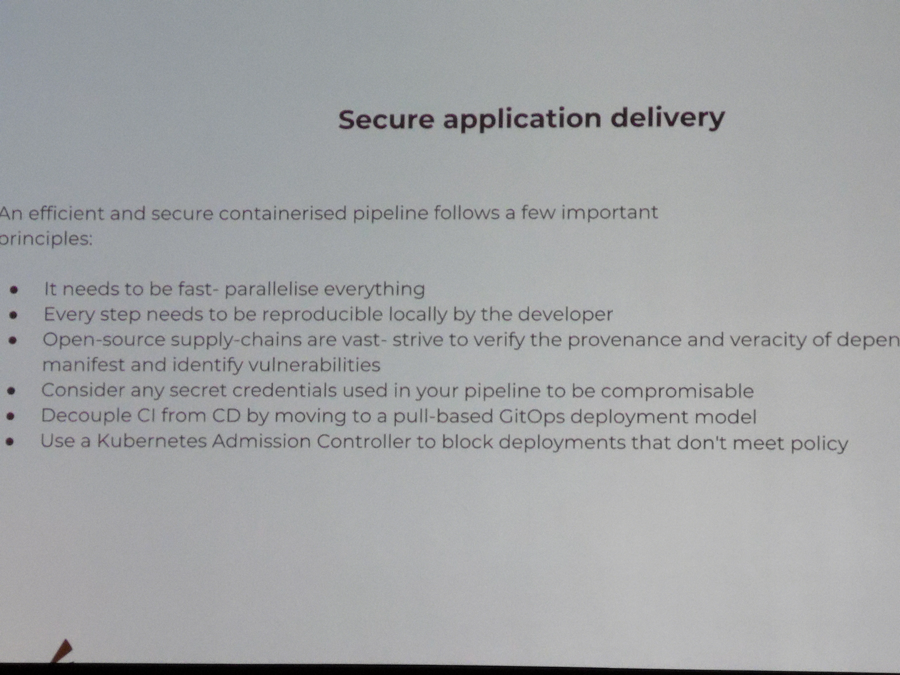

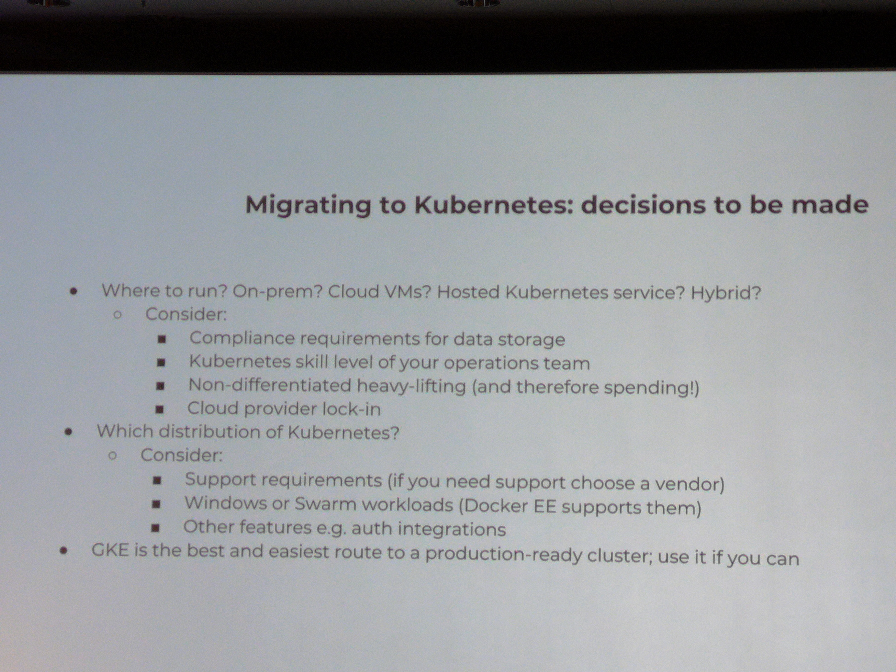

## Docker & Java & CICD

* telepresence
* Distroless (google mini os)
* OpenJ9
* Portala (for jdk 12)
* wagoodman/dive
* use jre for the runtime instead of jdk
* buildkit can use mounttarget for local caches
* add labels with Metadata (depency trees)
* grafeas & kritis
* FindSecBugs
* org.owasp:dependency-check-maven
* arminc/clair-scanner
* jlink = in limbo

## Docker & Windows

* specific base images for different use cases
* Docker capabilities heavily depend on Windows Server version

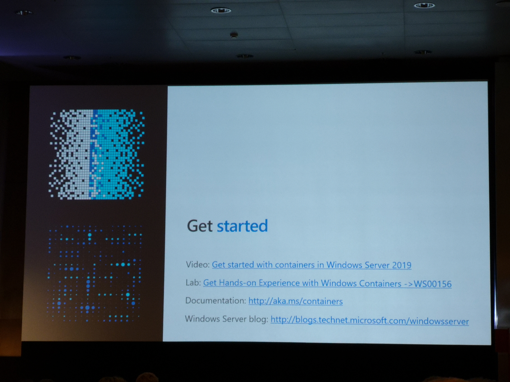

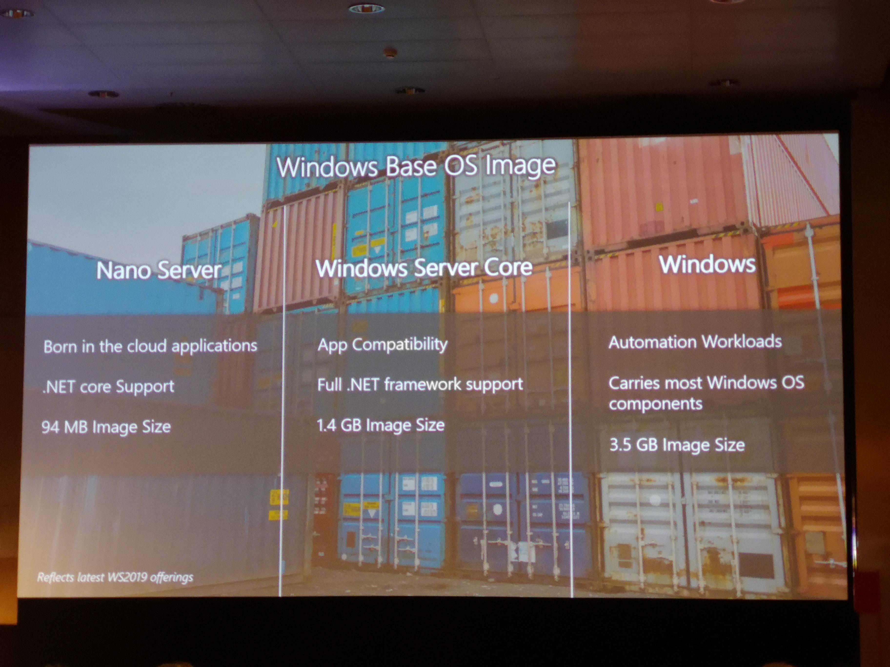

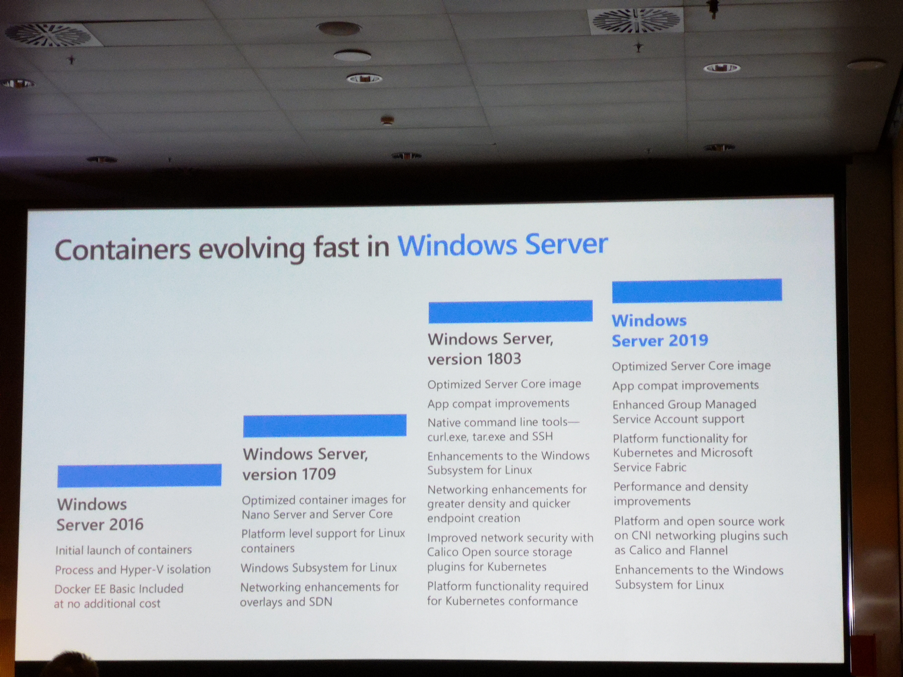

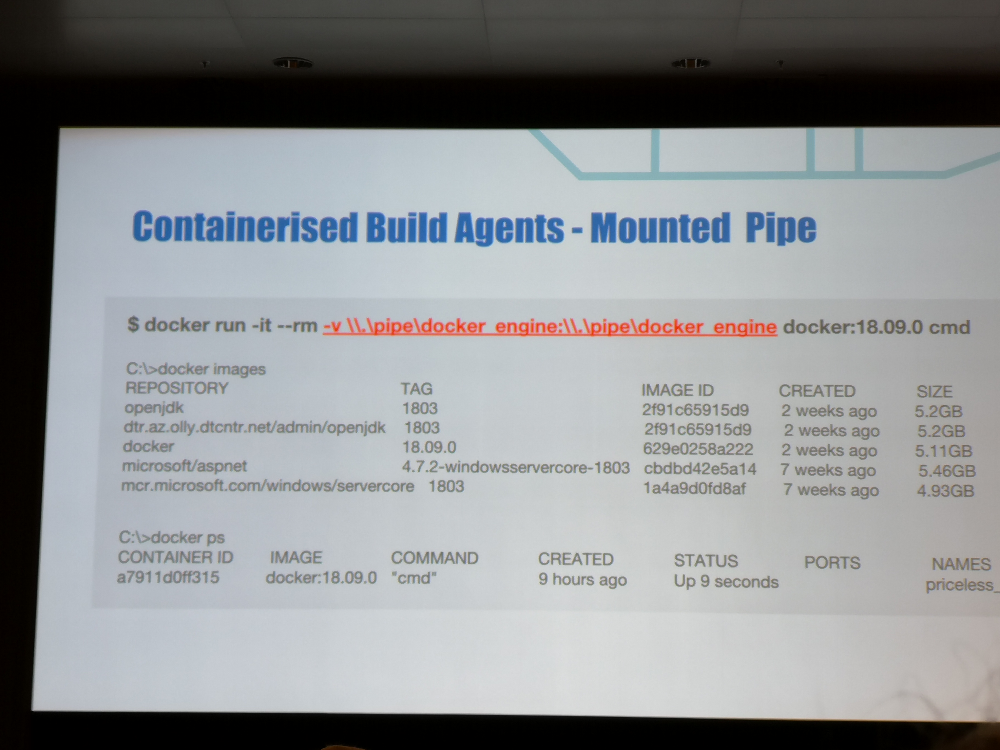

## Other

### Docker pipeline

* Dind + privileged
* mount socket
* windows & linux
* Windows build agent provisioning with docker EE & Jenkins
* Docker swarm update_config

### Idea: build a dynamic ci/cd platform with kubernetes

* jenkins evergreen + jcasc
* kubernetes plugin
* gitops pipeline
* AKS + virtual kubelet + ACI
* Jenkins + EC2 Pluging + ECS/Fargate
* jenkins agent as ecs task (fargate agent)
* docker on windows, only on ECS

### Apply Diplomacy to Code Review

* apply diplomacy to code review
* always positive
* remove human resistantance with inclusive language
* improvement focused
* persist, kindly

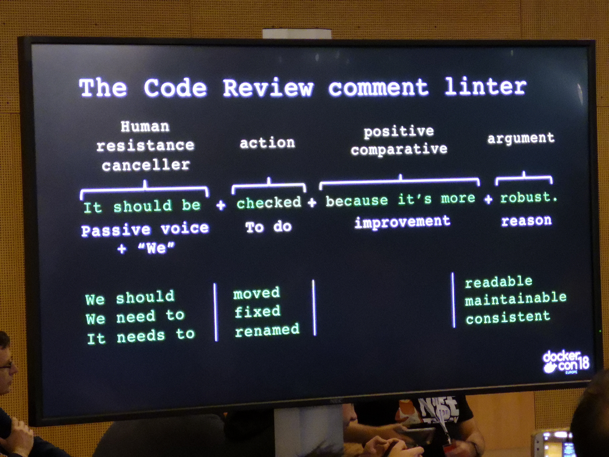

### Citizens Bank journey

* started with swarm, grew towards kubernetes (ucp)
* elk stack, centralised operations cluster

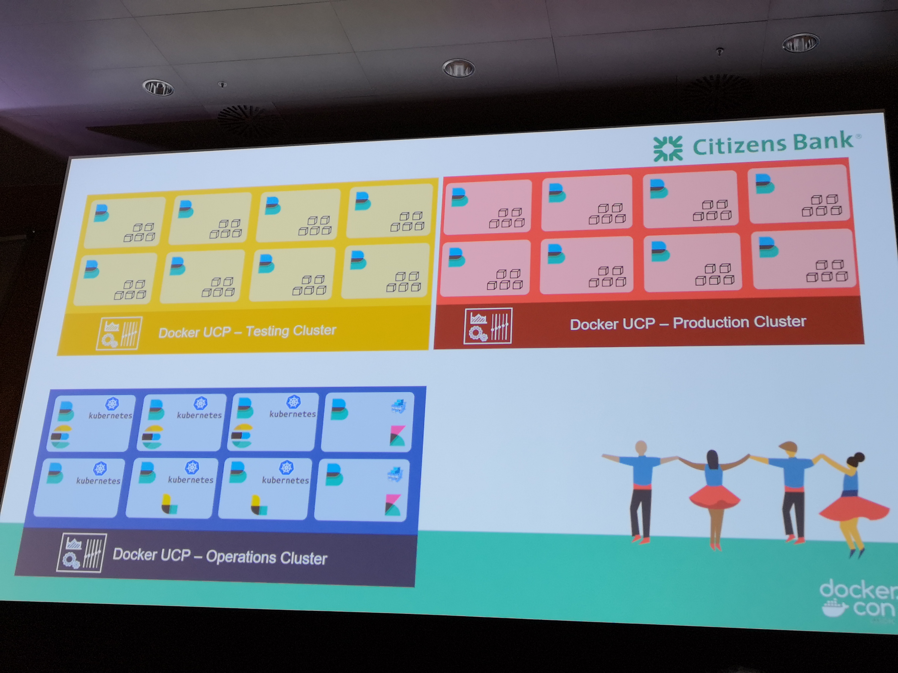

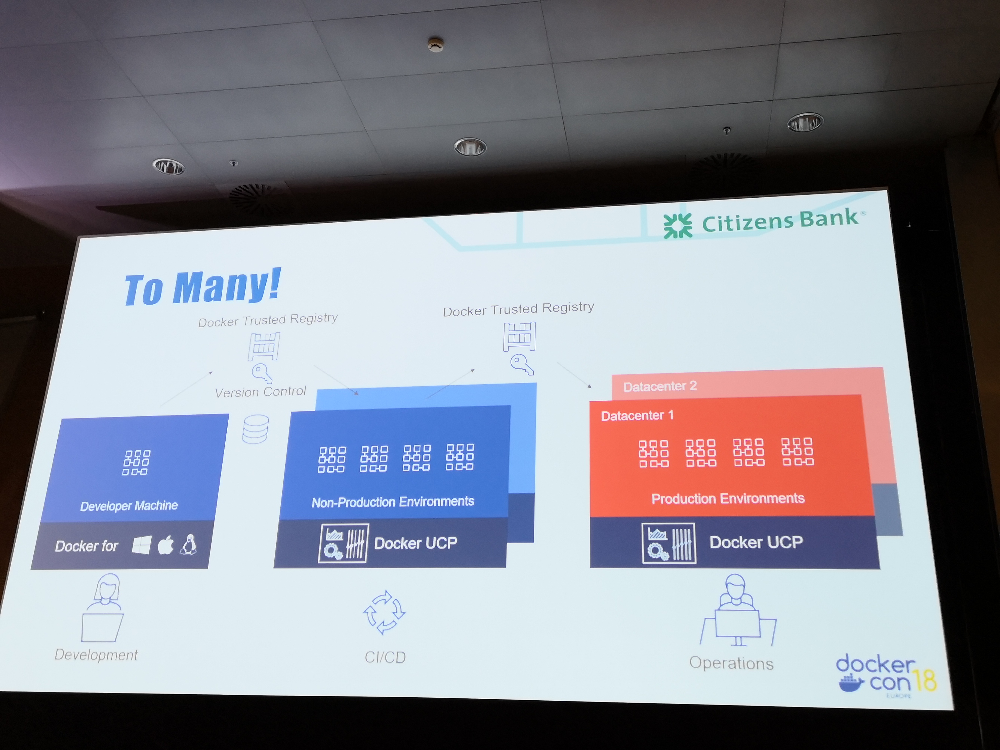

### Docker EE - Assemble

Docker EE now has a binary called `docker-assemble`.
This allows you to build a Docker image directly from something like a pom.xml, much like JIB.

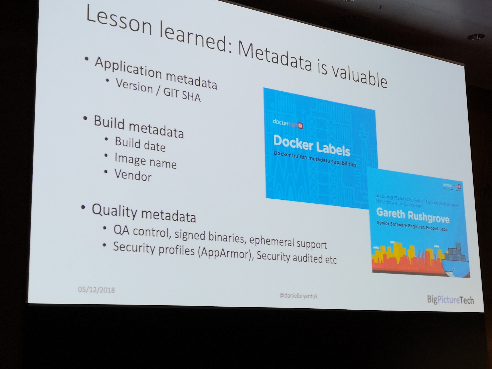

### Other

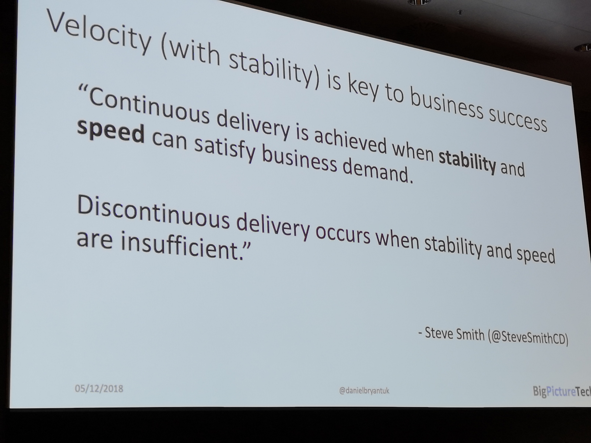
