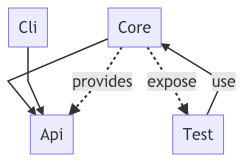

# Jenkins Pipeline Support Tools

With Jenkins now becoming Cloud Native and a first class citizen of Kubernetes, it is time to review how we use build tools.

This content assumes you're using Jenkins in a Kubernetes cluster, but most of it should also work in other Docker-based environments.

## Ideal Pipeline

Anyway, one thing we often see people do wrong with Jenkins pipelines is to use the Groovy Scripts as a general-purpose programming language. This creates many problems, bloated & complicated pipelines, much more stress on the master instead of on the build agent and generally making things unreliable.

A much better way is to use Jenkins pipelines only as orchestration and lean heavily on your build tools - e.g., Maven, Gradle, Yarn, Bazel - and shell scripts. Alas, if you created complicated pipelines in Groovy scripts, it is likely you'll end up the same with Bash scripts. An even better solution would be to create custom CLI applications that take care of large operations and convoluted logic. You can test and reuse them.

```groovy
pipeline {
    agent any
    stages {
        stage('Build') {
            steps {
                sh './build.sh'
            }
        }
        stage('Test') {
            steps {
                sh './test.sh'
            }
        }
        stage('Deploy') {
            steps {
                sh './deploy.sh'
            }
        }
    }
    post  {
        success {
      	    sh './successNotification.sh'
        }
        failure {
          sh './failureNotification.sh'
        }
    }
}
```

Now, this might look a bit like a pipe dream, but it illustrates how you should use Jenkins Pipeline. The groovy script engine allows for a lot of freedom, but only rarely is its use justified. To create robust, modular and generic pipelines, it is recommended to use build tools, shell scripts, [Shared Libraries](https://jenkins.io/doc/book/pipeline/shared-libraries/) and **custom CLI's**.

It was always a bit difficult to manage generic scripts and tools across instances of Jenkins, pipelines, and teams. But with  Pod Templates we have an excellent mechanism for using, versioning and distributing them with ease.

## Kubernetes Pods

When Jenkins runs in Kubernetes, it can leverage it via the [Kubernetes Plugin](https://github.com/jenkinsci/kubernetes-plugin). I realize Jenkins conjures up mixed emotions when it comes to plugins, but this setup might replace most of them.

How so? By using a [Kubernetes Pod](https://kubernetes.io/docs/concepts/workloads/pods/pod/) as the agent where instead of putting all your tools into a single VM you can use multiple small scoped containers.

You can specify Pod Templates in multiple ways, where my personal favorite is to define it as yaml inside a **declarative pipeline** - see example below. For each tool you need, you specify the container and its configuration - if required.  By default, you will always get a container with a [Jenkins JNLP client](https://hub.docker.com/r/jenkinsci/jnlp-slave/) and the workspace mounted as a volume in the pod.

This allows you to create several tiny containers, each containing only the tools you need for a specific job. Now, it could happen you use two or more tools together a lot - let's say npm and maven - so it is ok to sometimes deviate from this to lower the overall memory of the pod.

When you need custom logic, you will have to create a script or tool. This is where PodTemplate, Docker images and our desire for small narrow focus tools come together.

### PodTemplate example

```groovy
pipeline {
    agent {
        kubernetes {
        label 'mypod'
        defaultContainer 'jnlp'
        yaml """
apiVersion: v1
kind: Pod
metadata:
  labels:
    some-label: some-label-value
spec:
  containers:
  - name: maven
    image: maven:alpine
    command:
    - cat
    tty: true
  - name: busybox
    image: busybox
    command:
    - cat
    tty: true
        """
        }
    }
    stages {
        stage('Run maven') {
            steps {
                container('maven') {
                    sh 'mvn -version'
                }
                container('busybox') {
                    sh '/bin/busybox'
                }
            }
        }
    }
}
```

## Java Example

I bet most people do not think about Java when it comes lightweight CLI applications, but I think that is a shame. Java has excellent tooling to help you build well-tested applications which can be understood and maintained by a vast majority of developers.

To make the images small, we will use some of the new tools available in Java land. We will first dive into using Java Modularity and JLink to create a compact and strict binary package, and then we move onto Graal for creating a Native image.

### Custom JDK Image

All the source code of this example application is at [github.com/joostvdg/jpb](https://github.com/joostvdg/jpb).

It is a small CLI which does only one thing; it parses a git commit log to see which folders changed. Quite a useful tool for Monorepo's or other repositories containing more than one changeable resource.

Such a CLI should have specific characteristics:
* testable
* small memory footprint
* small disk footprint
* quick start
* easy to setup
* easy to maintain

These points sound like an excellent use case for Java Modules and JLink. 
For those who don't know, [read up on Java Modules here](https://www.baeldung.com/java-9-modularity) and [read up on JLink here](https://dzone.com/articles/jlink-in-java-9). JLink will create a binary image that we can use with Alpine Linux to form a minimal Java (Docker) Image.

Unfortunately, the plugins for Maven (JMod and JLink) seem to have died. The support on Gradle side is not much better.

So I created a solution myself with a multi-stage Docker build. Which does detract a bit from the ease of setup. But overall, it hits the other characteristics spot on. 

#### Application Model

For ease of maintenance and testing, we separate the parts of the CLI into Java Modules, as you can see in the model below. For using JLink, we need to be a module ourselves. So I figured to expand the exercise to use it to not only create boundaries via packages but also with Modules.



#### Build

The current LTS version of Java is 11, which means we need at least that if we want to be up-to-date. As we want to run the application in Alpine Linux, we need to build it with Alpine Linux - if you create a custom JDK image its OS specific. To my surprise, the official LTS release is not released for Alpine, so we use OpenJDK 12.

Everything is built via a Multi-Stage Docker Build. This Dockerfile can be divided into five segments.

1. creation of the base with a JDK 11+ on Alpine Linux
1. compiling our Java Modules in into Module Jars
1. test our code
1. create our custom JDK image with just our code and whatever we need from the JDK
1. create the runtime Docker image

The Dockerfile looks a bit complicated, but we did get a Java runtime that is about 44MB in size and can run as a direct binary with no startup time.
The Dockerfile can be much short if we use only a single module, but as our logic grows it is a thoughtful way to separate different concerns.

Still, I'm not too happy with this for creating many small CLI's. To much handwork goes into creating the images like this. Relying on unmaintained Maven or Gradle Plugins doesn't seem a better choice.

Luckily, there's a new game in town, [GraalVM](https://github.com/oracle/graal). We'll make an image with Graal next, stay tuned.

##### Dockerfile

```dockerfile
###############################################################
###############################################################
##### 1. CREATE ALPINE BASE WITH JDK11+
#### OpenJDK image produces weird results with JLink (400mb + sizes)
FROM alpine:3.8 AS build
ENV JAVA_HOME=/opt/jdk \
    PATH=${PATH}:/opt/jdk/bin \
    LANG=C.UTF-8

RUN set -ex && \
    apk add --no-cache bash && \
    wget https://download.java.net/java/early_access/alpine/18/binaries/openjdk-12-ea+18_linux-x64-musl_bin.tar.gz -O jdk.tar.gz && \
    mkdir -p /opt/jdk && \
    tar zxvf jdk.tar.gz -C /opt/jdk --strip-components=1 && \
    rm jdk.tar.gz && \
    rm /opt/jdk/lib/src.zip
####################################
## 2.a PREPARE COMPILE PHASE
RUN mkdir -p /usr/src/mods/jars
RUN mkdir -p /usr/src/mods/compiled
COPY . /usr/src
WORKDIR /usr/src

## 2.b COMPILE ALL JAVA FILES
RUN javac -Xlint:unchecked -d /usr/src/mods/compiled --module-source-path /usr/src/src $(find src -name "*.java")
## 2.c CREATE ALL JAVA MODULE JARS
RUN jar --create --file /usr/src/mods/jars/joostvdg.jpb.api.jar --module-version 1.0 -C /usr/src/mods/compiled/joostvdg.jpb.api .
RUN jar --create --file /usr/src/mods/jars/joostvdg.jpb.core.jar --module-version 1.0 -C /usr/src/mods/compiled/joostvdg.jpb.core .
RUN jar --create --file /usr/src/mods/jars/joostvdg.jpb.cli.jar --module-version 1.0  -e com.github.joostvdg.jpb.cli.JpbApp\
    -C /usr/src/mods/compiled/joostvdg.jpb.cli .
RUN jar --create --file /usr/src/mods/jars/joostvdg.jpb.core.test.jar --module-version 1.0  -e com.github.joostvdg.jpb.core.test.ParseChangeListTest \
    -C /usr/src/mods/compiled/joostvdg.jpb.core.test .
####################################
## 3 RUN TESTS
RUN rm -rf /usr/bin/jpb-test-image
RUN jlink \
    --verbose \
    --compress 2 \
    --no-header-files \
    --no-man-pages \
    --strip-debug \
    --limit-modules java.base \
    --launcher jpb-test=joostvdg.jpb.core.test \
    --module-path /usr/src/mods/jars/:$JAVA_HOME/jmods \
    --add-modules joostvdg.jpb.core.test \
    --add-modules joostvdg.jpb.core \
    --add-modules joostvdg.jpb.api \
     --output /usr/bin/jpb-test-image
RUN /usr/bin/jpb-test-image/bin/java --list-modules
RUN /usr/bin/jpb-test-image/bin/jpb-test
####################################
## 4 BUILD RUNTIME - CUSTOM JDK IMAGE
RUN rm -rf /usr/bin/jpb-image
RUN jlink \
    --verbose \
    --compress 2 \
    --no-header-files \
    --no-man-pages \
    --strip-debug \
    --limit-modules java.base \
    --launcher jpb=joostvdg.jpb.cli \
    --module-path /usr/src/mods/jars/:$JAVA_HOME/jmods \
    --add-modules joostvdg.jpb.cli \
    --add-modules joostvdg.jpb.api \
    --add-modules joostvdg.jpb.core \
     --output /usr/bin/jpb-image
RUN /usr/bin/jpb-image/bin/java --list-modules
####################################
##### 5. RUNTIME IMAGE - ALPINE
FROM panga/alpine:3.8-glibc2.27
LABEL authors="Joost van der Griendt <joostvdg@gmail.com>"
LABEL version="0.1.0"
LABEL description="Docker image for running Jenkins Pipeline Binary"
ENV DATE_CHANGED="20181014-2035"
ENV JAVA_OPTS="-XX:+UseCGroupMemoryLimitForHeap -XX:+UnlockExperimentalVMOptions"
COPY --from=build /usr/bin/jpb-image/ /usr/bin/jpb
ENTRYPOINT ["/usr/bin/jpb/bin/jpb"]
```


#### Image disk size

```bash
REPOSITORY                                   TAG                 IMAGE ID            CREATED              SIZE
jpb                                          latest              af7dda45732a        About a minute ago   43.8MB
```

#### Container footprint


### Graal

* https://github.com/demomon/jpc-graal--maven

### Resources

* https://github.com/spring-io/spring-javaformat
* https://github.com/testcontainers/testcontainers-java

## Go Example


## Python Example

