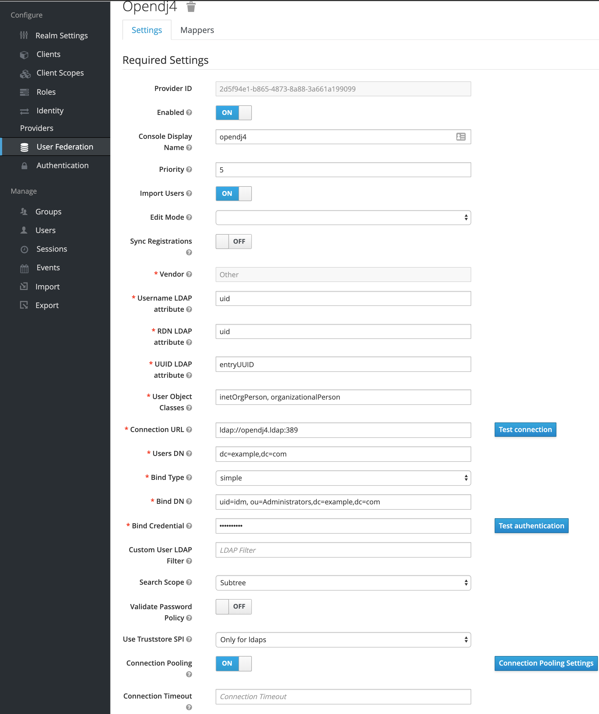
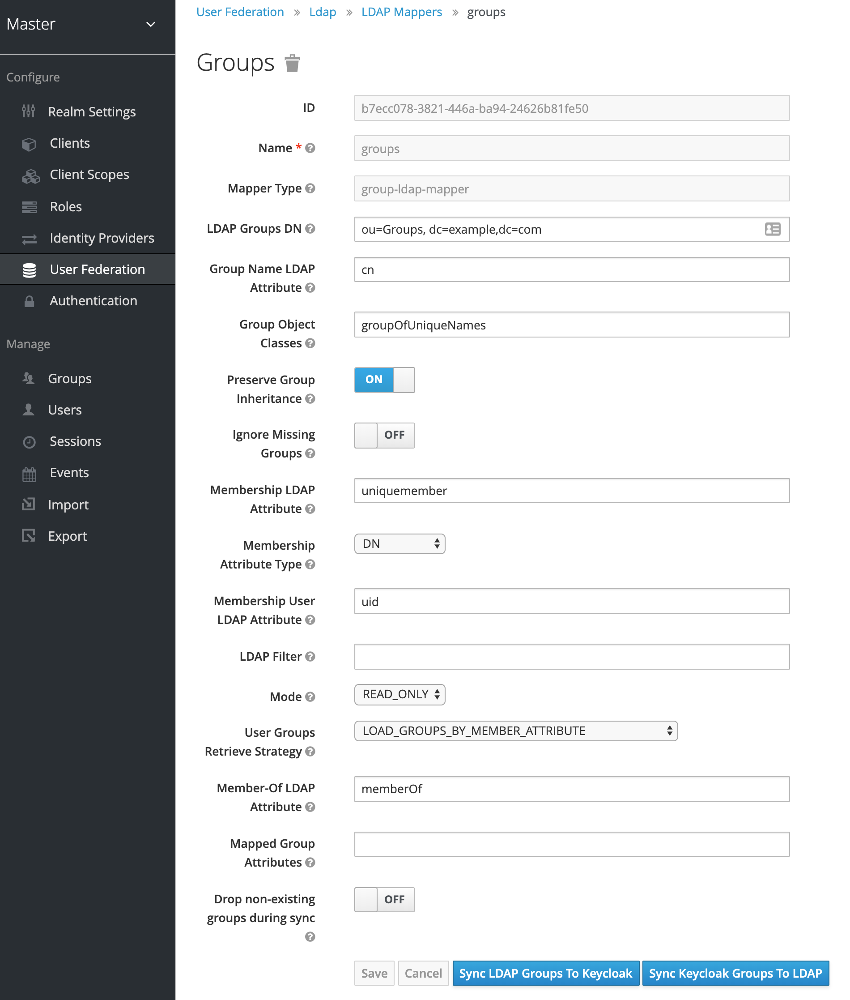
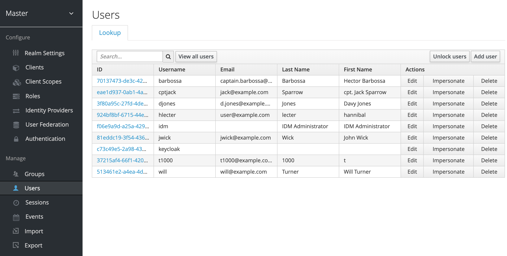
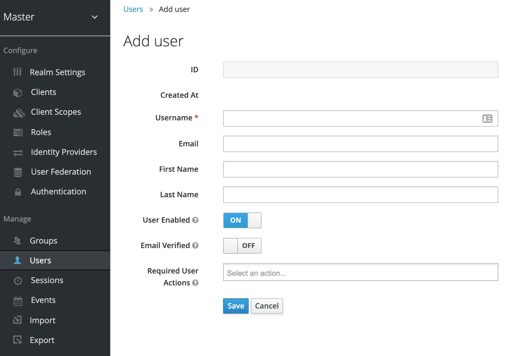
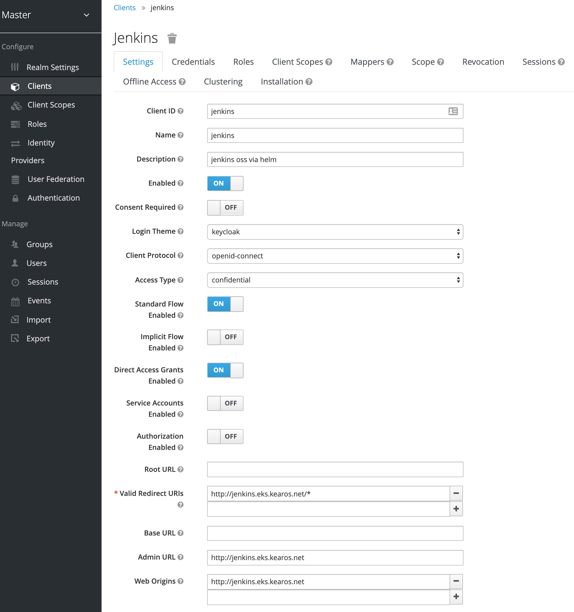
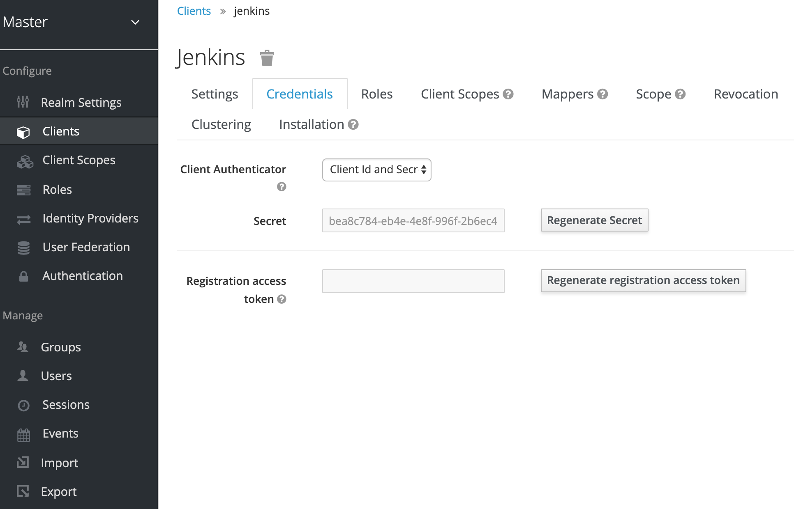
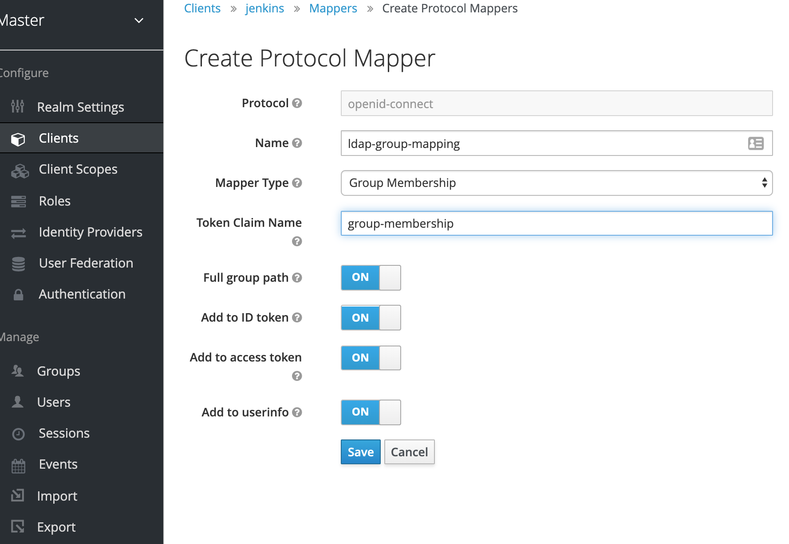
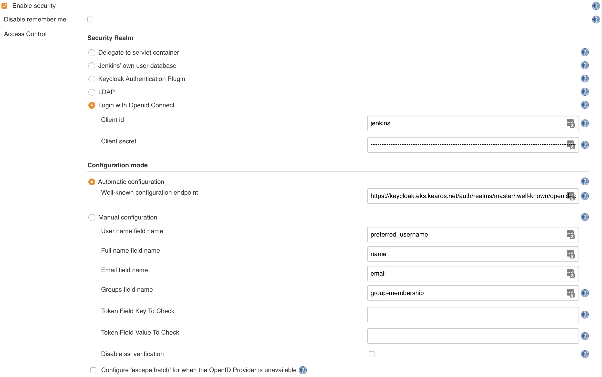

title: SSO Jenkins With Keycloak On Kubernetes
description: Setup Single Sign-On for Jenkins with Apache Keycloak

# Single Sign On on Kubernetes with Keycloak

This article is about setting up an Apache Keycloak[^1] instance for Single Sign-On[^2] (SSO) on Kubernetes.

!!! important
    This guide is created to help you show how you can do this from a technical point of view. If you are in an enterprise, please consult your in-house - if available - or external security professionals before running tools such as Keycloak in production.

## Goal

The goal is to show why using Keycloak as SSO can be valuable and guide on how to do so.

For what's in the `How`, look at the next paragraph: `Steps`.

At the outset, this article is not about comparing SSO solutions or about claiming Keycloak is the best. Its a solution, and if you're interested in using this, it helps you with the how.

Below are some links to alternatives as reference, but are not discussed.

## Audience

The expected audience are those who are using Kubernetes[^3] and are:

* looking to host a SSO solution themselves
* want to use LDAP[^4] as `User Federation` for Keycloak
* want to setup a SSO with Jenkins[^5] and/or SonarQube[^6]

## Steps

These are the steps we will execute.

* configure an LDAP server with a test data set
* package LDAP server in a Docker container and run it as an kubernetes `Deployment`
    * you might think, why not a `StatefulSet`, but our LDAP will have static data
    * and the idea of this setup, is that we do not control LDAP, meaning, we should expect LDAP's data to be immutable
* install Keycloak with Helm[^8]
    * we use Helm 2, as Helm 3[^9] is still in beta at the time of writing (September 2019)
* configure Keycloak to use LDAP for `User Federation`
* install Jenkins and SonarQube with Helm[^8]
* configure SSO with Keycloak in Jenkins
* configure SSO with Keycloak in SonarQube

## LDAP

We will use OpenDJ[^7] as LDAP implementation. There are many alternatives out there, feel free to use those.
But for this guide, we will use OpenDJ's community edition, it works well and is easy to configure.

We need the following:

* configured with a test data set including users and groups
* Docker container image definition
* Kubernetes `Deployment` definition to run
* Kubernetes `Service` definition to access a stable address

### Test Data Set

??? example "example.ldiff"
    This a full example.
    
    The different parts will be explained below.

    ```
    dn: dc=example,dc=com
    objectclass: top
    objectclass: domain
    dc: example

    dn: ou=People, dc=example,dc=com
    objectclass: top
    objectclass: organizationalunit
    ou: People
    aci: (targetattr="*||+")(version 3.0; acl "IDM Access"; allow (all)
    userdn="ldap:///uid=idm,ou=Administrators,dc=example,dc=com";)

    dn: uid=cptjack, ou=People, dc=example,dc=com
    cn: cpt. Jack Sparrow
    sn: Sparrow
    givenname: Jack
    objectclass: top
    objectclass: person
    objectclass: organizationalPerson
    objectclass: inetOrgPerson
    ou: Operations
    ou: People
    l: Caribbean
    uid: cptjack
    mail: jack@example.com
    telephonenumber: +421 910 123456
    facsimiletelephonenumber: +1 408 555 1111
    roomnumber: 666
    userpassword: MyAwesomePassword

    dn: uid=djones, ou=People, dc=example,dc=com
    cn: Davy Jones
    sn: Jones
    givenname: Davy
    objectclass: top
    objectclass: person
    objectclass: organizationalPerson
    objectclass: inetOrgPerson
    ou: Operations
    ou: People
    l: Caribbean
    uid: djones
    mail: d.jones@example.com
    telephonenumber: +421 910 382735
    facsimiletelephonenumber: +1 408 555 1112
    roomnumber: 112
    userpassword: MyAwesomePassword

    dn: ou=Groups, dc=example,dc=com
    objectclass: top
    objectclass: organizationalunit
    ou: Groups
    aci: (targetattr="*||+")(version 3.0; acl "IDM Access"; allow (all)
    userdn="ldap:///uid=idm,ou=Administrators,dc=example,dc=com";)

    dn: cn=Pirates,ou=Groups,dc=example,dc=com
    objectclass: top
    objectclass: groupOfUniqueNames
    cn: Pirates
    ou: Groups
    uniquemember: uid=cptjack, ou=People, dc=example,dc=com
    uniquemember: uid=djones, ou=People, dc=example,dc=com
    description: Arrrrr!

    dn: cn=Catmins,ou=Groups,dc=example,dc=com
    objectclass: top
    objectclass: groupOfUniqueNames
    cn: Catmins
    ou: Groups
    uniquemember: uid=djones, ou=People, dc=example,dc=com
    description: Purrrr!

    dn: ou=Administrators, dc=example,dc=com
    objectclass: top
    objectclass: organizationalunit
    ou: Administrators

    dn: uid=idm, ou=Administrators,dc=example,dc=com
    objectclass: top
    objectclass: person
    objectclass: organizationalPerson
    objectclass: inetOrgPerson
    uid: idm
    cn: IDM Administrator
    sn: IDM Administrator
    description: Special LDAP acccount used by the IDM
    to access the LDAP data.
    ou: Administrators
    userPassword: MySecretAdminPassword
    ds-privilege-name: unindexed-search
    ds-privilege-name: password-reset
    ```

#### Basics

We need some basic meta data for our server. 
The two most important elements being:

* the base `dn` (_Distinguished Name_), where all of our data lives
    * build up out of `dc` (_domainComponent_) elements, representing a domain name, usually _companyName.com_
* the `dn` where our user data will live and which user owns it (the `userdn` assigned in the `aci`)

```
dn: dc=example,dc=com
objectclass: top
objectclass: domain
dc: example

dn: ou=People, dc=example,dc=com
objectclass: top
objectclass: organizationalunit
ou: People
aci: (targetattr="*||+")(version 3.0; acl "IDM Access"; allow (all)
  userdn="ldap:///uid=idm,ou=Administrators,dc=example,dc=com";)
```

#### User Entries

After these two main metadata `dn` elements, we have all the user entries.

We start with the identifier of the entry, designated by the `dn`, followed by attributes and classifications.
While LDAP stands for _Lightweight_, it has a lot of attributes which are not easily understood because they are commonly used by their two-letter acronym only. Below we explain a few of the attributes, but there are more complete lists available[^10].

* **dn**: the full identifier of the data entry, in reverse tree
* **uid**: the unique id of the user within the organizational structure
* **cn**: _Common Name_, generally how humans would identify this resource
* **l**: _Location_
* **ou**: _Organizational Unit_, these commonly represent departments
* **objectclass**: defines a object hierarchy, derived from Object Oriented Programming
    * **top**: is commonly the root object class, every other object inheriting from there
    * object classes are used to create typed objects which have their own schema
    * this allows you to define what values are required and which are optional
    * object classes are also used in search filters, so you can distinguish different value types (users, groups)

!!! note "Organizational Tree"
    ```
    .
    ├── com
    │   └── example
    │       ├── Operations
    │       └── People
    │           └── jwick
    ```


```
dn: uid=jwick, ou=People, dc=example,dc=com
cn: John Wick
sn: Wick
givenname: John
objectclass: top
objectclass: person
objectclass: organizationalPerson
objectclass: inetOrgPerson
ou: Operations
ou: People
l: New York
uid: jwick
mail: jwick@example.com
telephonenumber: +1 408 555 1236
facsimiletelephonenumber: +1 408 555 4323
roomnumber: 233
userpassword: myawesomepassword
```

#### Group

We first create the `OU` housing our Groups, including which object classes it represents.

Then we can attach groups to this `OU` by creating `dn`'s under it.
There are two flavors of groups, we have `groupOfNames` and `groupOfUniqueNames`, I'm sure you understand what the difference is.

We explain wich kind of group we are by the `objectclass: groupOfUniqueNames`, and include a list of members.
In the case of `groupOfNames` we use `member: <member dn>`, in our case we user `uniquemember: uid=cptjack, ou=People, dc=example,dc=com`. To make it a list, add more than one entry, each with a unique value.

```
dn: ou=Groups, dc=example,dc=com
objectclass: top
objectclass: organizationalunit
ou: Groups
aci: (targetattr="*||+")(version 3.0; acl "IDM Access"; allow (all)
  userdn="ldap:///uid=idm,ou=Administrators,dc=example,dc=com";)

dn: cn=Pirates,ou=Groups,dc=example,dc=com
objectclass: top
objectclass: groupOfUniqueNames
cn: Pirates
ou: Groups
uniquemember: uid=cptjack, ou=People, dc=example,dc=com
uniquemember: uid=will, ou=People, dc=example,dc=com
uniquemember: uid=djones, ou=People, dc=example,dc=com
description: Arrrrr!
```

#### Administrator

We have to configure our main administrator, as we've already given it a lot of privileges to manage the other resources (via the `aci` rules). As usual, we start with defining a `ou` that houses our `Administrators`.

In this case, we give it two more special permissions via `ds-privilege-name`. So this user can also reset passwords, just in case.


```
dn: ou=Administrators, dc=example,dc=com
objectclass: top
objectclass: organizationalunit
ou: Administrators

dn: uid=idm, ou=Administrators,dc=example,dc=com
objectclass: top
objectclass: person
objectclass: organizationalPerson
objectclass: inetOrgPerson
uid: idm
cn: IDM Administrator
sn: IDM Administrator
description: Special LDAP acccount used by the IDM
  to access the LDAP data.
ou: Administrators
userPassword: MySecretAdminPassword
ds-privilege-name: unindexed-search
ds-privilege-name: password-reset
```

### Configure OpenDJ

One of the reasons I like OpenDJ is because it is very easy to operate. It has many tools to help you manage the server. Some are separate tools that interact with a running server, others interact with the configure while the server is offline.

We have to do two configuration actions, 1) we intialize it with our root `dn`, which port to use and so on, 2) we add our test data set, so we have our groups and users to work with.

```bash
/opt/opendj/setup --cli \
    -p 1389 \
    --ldapsPort 1636 \
    --enableStartTLS \
    --generateSelfSignedCertificate \
    --baseDN dc=example,dc=com \
    -h localhost \
    --rootUserDN "$ROOT_USER_DN" \
    --rootUserPassword "$ROOT_PASSWORD" \
    --acceptLicense \
    --no-prompt \
    --doNotStart
```

```bash
/opt/opendj/bin/import-ldif \
    --includeBranch dc=example,dc=com \
    --backendID userRoot \
    --offline \
    --ldifFile example.ldiff
```

### Dockerfile

For completeness I will also include my Docker image.

We use Tini[^11] order to manage the process of OpenDJ nicely, even in the face of being shutdown. For more information, read [my article on Docker Graceful Shutdown](/blogs/graceful-shutdown/).

We use a `jre` as we only need to run Java, so no need for a JDK. We use the OpenJDK distribution from `Azul`[^15] in order to avoid possible violations of Oracle's License[^12]. We use Azul's Alpine[^13] based image as it is much smaller than those based of full-fledged OS's. This makes the image smaller in size on disk and in memory and reduces the attack vector and recommended by the likes of Docker and Snyk[^14].

We download the latest version available which, as of this writing in September 2019, is `4.4.3` which you can retrieve from the OpenDJ Community's `releases` page on GitHub[^13].

```Dockerfile
FROM azul/zulu-openjdk-alpine:8u222-jre

LABEL authors="Joost van der Griendt <joostvdg@gmail.com>"
LABEL version="0.2.0"
LABEL description="OpenDJ container"

WORKDIR /opt
EXPOSE 1389 1636 4444

ENV CHANGE_DATE='20190916-2100'
ENV JAVA_HOME /usr/lib/jvm/zulu-8
ENV OPENDJ_JAVA_HOME /usr/lib/jvm/zulu-8
ENV VERSION=4.4.3
ENV ROOT_USER_DN='cn=admin'
ENV ROOT_PASSWORD='changeme'
RUN apk add --no-cache tini

ENTRYPOINT ["/sbin/tini", "-vv","-g","-s", "--"]
CMD ["/opt/opendj/bin/start-ds", "--nodetach"]

RUN wget --quiet \
    https://github.com/OpenIdentityPlatform/OpenDJ/releases/download/$VERSION/opendj-$VERSION.zip && \
    unzip opendj-$VERSION.zip && \
    rm -r opendj-$VERSION.zip

RUN /opt/opendj/setup --cli \
    -p 1389 \
    --ldapsPort 1636 \
    --enableStartTLS \
    --generateSelfSignedCertificate \
    --baseDN dc=example,dc=com \
    -h localhost \
    --rootUserDN "$ROOT_USER_DN" \
    --rootUserPassword "$ROOT_PASSWORD" \
    --acceptLicense \
    --no-prompt \
    --doNotStart

ADD Example.ldif /var/tmp/example.ldiff
# RUN /opt/opendj/bin/import-ldif --help
RUN /opt/opendj/bin/import-ldif --includeBranch dc=example,dc=com --backendID userRoot --offline --ldifFile /var/tmp/example.ldiff
```

### Kubernetes Deployment

In production you might want to run LDAP in a `StatefulSet` and give it some permanent storage. But in this guide the goal of LDAP is to show how to use it with Keycloak and we stick to a `Deployment` as it is easier.

```yaml
apiVersion: apps/v1
kind: Deployment
metadata:
  name: opendj4
  labels:
    app: opendj4
spec:
  replicas: 1
  selector:
    matchLabels:
      app: opendj4
  template:
    metadata:
      labels:
        app: opendj4
    spec:
      containers:
      - name: opendj4
        image: caladreas/opendj:4.4.3-1
        ports:
        - containerPort: 1389
          name: ldap
        resources:
          requests:
            memory: "250Mi"
            cpu: "50m"
          limits:
            memory: "500Mi"
            cpu: "250m"
```

### Kubernetes Service

When we use a `Deployment` our container instance will have a generated name and a new ip address on every (re-)start. So we use a `Service` to create a stable endpoint, which means that we will now access our LDAP server via our service: `ldap://opendj4:389`.

```yaml
apiVersion: v1
kind: Service
metadata:
  labels:
    app: opendj4
  name: opendj4
spec:
  ports:
    - name: http
      port: 389
      targetPort: 1389
      protocol: TCP
  selector:
    app: opendj4
```

!!! caution
    If you deploy the `Service` and `Deployment` in a different namespace than where you want to access them from, you will have to add the namespace to the access url.

    If you've configured them in namespace `ldap`, the access url becomes `ldap://opendj4.ldap:389`.

### Homegrown Helm chart with GitHub

You can also package the above explained Docker Image + Kubernetes Yaml definition as a Helm package in a GitHub repository[^16].

So if you do not want to use any of the above, feel free to use my personal Helm Repository[^17].

```bash
helm repo add joostvdg https://raw.githubusercontent.com/joostvdg/helm-repo/master/
helm repo update
```

```bash
helm install joostvdg/opendj4 --name ldap --namespace ldap
```

The service, retrieved by `kubectl get service` now has a different name.

```bash
NAME           TYPE        CLUSTER-IP       EXTERNAL-IP   PORT(S)   AGE
ldap-opendj4   ClusterIP   10.100.19.29     <none>        389/TCP   105s
```

So now we access the LDAP server via `ldap://ldap-opendj4:389`.

## Keycloak

### Pre-requisites

* Helm installed
* TLS certificate

Using a tool as Keycloak to do SSO well, feels wrong without using TLS certificates. So I wholeheartedly recommend configuring Keycloak with a Domain name and TLS Certificate.

For the TLS certificate, you use Let's Encrypt[^20] with Cert Manager[^19], if you unsure how to proceed in Kubernetes [read my guide on Let's Encrypt on Kubernetes](/blogs/k8s-lets-encrypt/).

### Install Via Helm

```bash
helm repo add codecentric https://codecentric.github.io/helm-charts
helm repo update
```

```bash
kubectl apply -f keycloak-certificate.yaml
```

```bash
helm install --name keycloak codecentric/keycloak -f keycloak-values.yaml
```

!!! note
    Make sure you replace the dns name `keycloak.my.domain.com` with your own domain.
    If you do not have a domain, you can use `nip.io[^18].

!!! example "keycloak-certificate.yaml"

    ```yaml
    apiVersion: certmanager.k8s.io/v1alpha1
    kind: Certificate
    metadata:
    name: keycloak.my.domain.com
    spec:
    secretName: tls-keycloak
    dnsNames:
    - keycloak.my.domain.com
    acme:
        config:
        - http01:
            ingressClass: nginx
        domains:
        - keycloak.my.domain.com
    issuerRef:
        name: letsencrypt-prod
        kind: ClusterIssuer
    ```

!!! example "keycloak-values.yaml"

    ```yaml
    keycloak:
      password: notsosecret
      ingress:
        enabled: true
        path: /
        annotations: 
        kubernetes.io/ingress.class: nginx
        kubernetes.io/tls-acme: "true"
        ingress.kubernetes.io/affinity: cookie
        hosts:
        - keycloak.my.domain.com
        tls:
        - hosts:
            - keycloak.my.domain.com
        secretName: tls-keycloak
    ```

### LDAP As User Federation

Assuming you have Keycloak running now, login with the admin user, `keycloak`, and the password you set in the `keycloak-values.yaml`.

In the left hand menu, you can select `User Federation`, this is where we can add `ldap` and `kerberos` providers. As Keycloak supports multiple sources, these will be listed by their priority (the smaller the number, the higher). The federations are consulted in the order according to their priority.

#### Create LDAP

Let's create the new LDAP provider, select the `Add provider` dropdown - top right - and choose `ldap`.

You will now see a whole list of values to fill in, don't worry, many can be kept as default. And to be sure, I will list them all here. For more information, each field has a little question mark, hover over it.

!!! info
    When you've filled in the `Connection URL`, you should test the configuration with the `Test connection` button.
    The same is true for when you've configured the fields `Users DN`, `Bind Type`, `Bind DN`, `Bind Credential` with the button `Test authentication`.

* **Console Display Name**: display name, should be a name that tells you what this provider is
* **Priority**: the priority of this provider, will be used for the order that the federation is accessed
* **Import Users**: wether or not to import the users, I just leave this to `On` as to cache the users
* **Import Users**: `READ_ONLY`, in this guide we assume the LDAP server is not under your control, so read only
* **Vendor**: `Other`
* **Username LDAP attribute**: `uid`
* **RDN LDAP attribute**: `uid`
* **UUID LDAP attribute**: `entryUUID`
* **User Object Classes**: `inetOrgPerson, organizationalPerson`
* **Connection URL**: `ldap://opendj4:389`
* **Users DN**: `dc=example,dc=com`
* **Bind Type**: `simple`
* **Bind DN**: `uid=idm, ou=Administrators,dc=example,dc=com`
* **Bind Credential**: `secret` -> or what ever you've set it in the `example.diff`
* **Custom User LDAP Filter**: ``
* **Search Scope**: `Subtree`
* **Validate Password Policy**: `OFF`
* **Use Truststore SPI**: `Only for ldap`
* **Connection Pooling**: `ON`
* **Connection Timeout**: ``
* **Read Timeout**: ``
* **Pagination**: `ON`

Sync Settings:

* **Cache Policy**: 1000
* **Periodic Full Sync**: `On`
* **Full Sync Period**: `604800`
* **Periodic Changed Users Sync**: `On`
* **Changed Users Sync Period**: `86400`

Cache Settings:

* **Cache Policy**: `DEFAULT`



#### Add Group Mapping

If the value is not mentioned, the default value should be fine.

Some values listed here are default, but listed all the same.

* **Name**: `groups`
* **Mapper Type**: `group-ldap-mapper`
* **LDAP Groups DN**: `ou=Groups, dc=example,dc=com`
* **Group Name LDAP Attribute**: `cn`
* **Group Object Classes**: `groupOfUniqueNames`
* **Membership LDAP Attribute**: `uniquemember`
* **User Groups Retrieve Strategy**: `LOAD_GROUPS_BY_MEMBER_ATTRIBUTE`

When you hit `Save`, you can synchronize the groups to Keycloak - if you don't need to, it will confirm the configuration works. Hit the `Sync LDAP Groups To Keycloak` button, and on top there should be a temporary banner stating how many groups were synchronized (if all categories are `0`, something is wrong).

!!! note
    Everytime you change a value, you first have to save the page before you can synchronize again.



### Mix LDAP Users With Other Sources

One of the reasons for this guide to exist, is to be able to encapsulate an LDAP over which you have no control and add additional accounts and groups. There's multiple ways forward here, you can use `Identity Providers` and `User Federation` to create more sources of user accounts.

Perhaps the simplest way is to manage these extra accounts in Keycloak itself. It has its own User database and Groups database. In addition to that, it allows you to assign users created in Keycloak to be a member of a group derived from LDAP - if you've synched them.

#### UI

We can use the UI in Keycloak to manage Users and Groups.

We initiate this by going to the `Users` view and hit `Add user`.



We can then fill in all the details of the User.



#### REST API

Keycloak has a rich REST API with good decent documentation[^21]. The thing missing is some examples for how to use them correctly.

I recommend using HTTPie[^28] rather than cUrl, as it is easier to use for these more complex calls.

##### Get Token

!!! warning
    The Bearer Token is only valid for a short period of time. If you wait too long, you will get `401 unauthorized`.

The default REALM is `master`.

```bash tab="httpie"
http --form POST "${KEYCLOAK_URL}/auth/realms/${REALM}/protocol/openid-connect/token" username="keycloak" password="${PASS}" client_id="admin-cli" grant_type="password"
```

```bash tab="curl"
curl ${KEYCLOAK_URL}/auth/realms/${REALM}/protocol/openid-connect/token -u keycloak:${PASS}
```

##### Get Users

```bash tab="httpie"
http "${KEYCLOAK_URL}/auth/admin/realms/${REALM}/users" "Authorization: Bearer $TOKEN"
```

```bash tab="httpie - get user"
http "${KEYCLOAK_URL}/auth/admin/realms/${REALM}/users/${userId}" "Authorization: Bearer $TOKEN"
```

```bash tab="curl"
curl -v ${KEYCLOAK_URL}/auth/admin/realms/${REALM}/users -H "Authorization: Bearer $TOKEN" | jq
```

##### Create User

```bash tab="httpie"
http POST "${KEYCLOAK_URL}/auth/admin/realms/${REALM}/users" \
    "Authorization: Bearer $TOKEN" \
    credentials:="[{\"value\" : \"mypass\", \"type\": \"password\" }]" \
    email="user@example.com" \
    firstName="hannibal" \
    lastName="lecter" \
    username="hlecter" \
    groups:='["Robots"]' \
    emailVerified:=true \
    enabled:=true
```

```bash tab="curl"
curl -v ${KEYCLOAK_URL}/auth/admin/realms/${REALM}/users -H "Authorization: Bearer $TOKEN" | jq
```

### Verify

To verify everything is working as it should, you can go to the `Groups` and `Users` pages within the `Manage` menu (left hand side).

With Groups you have `View all groups`, which should have the groups from LDAP and any group you have created within Keycloak - if not yet, you can do so here as well.

To view details of a Group, double click the name - it's not obvious you can do so - and you will go to the details page. Here you can also see the members of the Group.

You can do the same with the Users menu item. By default the page is empty, if your list of users is not too large, click on `View all users`. You can view the details page of a user by clicking the link of the User ID. Within the Groups tab you can add the user to more groups, this should contain all the groups known to Keycloak - both Keycloak internal and from LDAP.

## SSO with Jenkins

To configure Jenkins to use Keycloak we have two plugins at our disposal, OpenId Connect(`oic-auth`)[^22] and Keycloak[^23]. While the Keycloak plugin is easier to configure for authentication, I found it difficult to configure groups. As I feel the group management is mandatory we're going with the OpenId Connect plugin.

You can install plugins in Jenkins via the UI[^24], via the new Jenkins CLI[^25], or via the `values.yaml` when installing via the Helm Chart[^27].

!!! important
    Install the OpenId Connect plugin before configuring the next parts, and restart your Jenkins instance for best results.

In order to configure OpenId Connect with Jenkins, it is the easiest to use the `well-known` endpoint url. This endpoint contains all the configuration information the plugin needs to configure itself.

Usually, this is `${KEYCLOAK_URL}/auth/realms/${REALM}/.well-known/openid-configuration`.

From Keycloak's perspective we have to register Jenkins as a Client.

### Keycloak Client

We go to the `Clients` screen in Keycloak and hit the `Create` button.

In the next screen, we need to supply three values:

* **Client ID**: the name of your client, `jenkins` would be good example
* **Client Protocol**: `openid-connect` is recommended
* **Root URL**: the main url of your installation, for example `https://jenkins.my.domain.com`

#### Main Settings

Once we hit save, we get a details view.

We have to change some values here.

* **Access Type**: we need a Client ID and Client Secret, we only get this when we select `confidential`
* **Valid Redirect URIs**: confirm this is `${yourJenkinsURL}/*`



Once you hit save, you get a new Tab in the Details screen of this Client. It is called `Credentials`, and here you can see the Client `Secret` which we will need to enter in Jenkins.



#### Group Mappings

Just as we had to add the Group mapping to the LDAP configuration, we will need to configure the Group mapping in the Client.

If we go into the Client details, we see there's a Tab called `Mappers`. We create a new Mapping here by hitting the `Create` button.

Give the mapping a name and then select the ***Mapper Type*** `Group Membership`.

The ***Token Claim Name*** is important as well, we use this in our Jenkins configuration, give it a descriptive name such as `group-membership`.



### Configure Via UI

In Jenkins we go to `Manage Jenkins` -> `Configure Global Security` and here we select `Login with Openid Connect` in the `Security Realm` block.

* **Client id**: the client we've configured in Keycloak, if you've followed this guide, it should be `jenkins`
* **Client secret**: the secret of the client configured in Keycloak, if you've lost it, go back to `Keycloak` -> `Clients` -> `jenkins` -> `Credentials` and copy the value in the field `Secret`.

We now get a `Configuration mode` block where we can select either `Automatic configuration` on `Manual configuration`. We select `Automatic` and enter our `Well-known` configuration endpoint URL from Keycloak we've written down earlier. If you don't remember, the format is usually this: `${KEYCLOAK_URL}/auth/realms/${REALM}/.well-known/openid-configuration`.

* **User name field name**: `preferred_username`
* **Full name field name**: `name`
* **Email field name**: `email`
* **Groups field name**: `group-membership`

!!! note
    The field **Groups field name** refers back to the ***Token Claim Name*** we configured in Keycloak within our Client's Mapping for Group Membership.



### Configure Via Configuration-as-Code

We can use the amazing Jenkins Configuration-as-Code[^26] to make sure our SSO configuration is configured out-of-the-box!

In order to avoid the having to store the Client ID and Client Secret, we're going to create these as Kubernetes Secrets first.

There's more ways to create these, but this is to keep it simple.

```bash
kubectl create secret generic oic-auth \
  --from-literal=clientID="${CLIENT_ID}" \
  --from-literal=clientSecret="${CLIENT_SECRET}" \
  --from-literal=keycloakUrl=${keycloakUrl} \
  --namespace jenkins
```

!!! example "JCASC-config.yaml"

    ```yaml
      jenkins:
        securityRealm:
        oic:
          clientId: "${clientID}"
          clientSecret: "${clientSecret}"
          wellKnownOpenIDConfigurationUrl: "${keycloakUrl}/auth/realms/master/.well-known/openid-configuration"
          tokenServerUrl: "${keycloakUrl}auth/realms/master/protocol/openid-connect/token"
          authorizationServerUrl: "${keycloakUrl}/auth/realms/master/protocol/openid-connect/auth"
          userInfoServerUrl: "${keycloakUrl}/auth/realms/master/protocol/openid-connect/userinfo"
          userNameField: "preferred_username"
          fullNameFieldName: "name"
          emailFieldName: "email"
          groupsFieldName: "group-membership"
          scopes: "web-origins address phone openid offline_access profile roles microprofile-jwt email"
          disableSslVerification: false
          logoutFromOpenidProvider: true
          endSessionUrl: "${keycloakUrl}/auth/realms/master/protocol/openid-connect/logout"
          postLogoutRedirectUrl: ""
          escapeHatchEnabled: false
          escapeHatchSecret: ""
    ```

??? example "complete-jenkins-helm-values.yaml"

    ```yaml
    master:
      ingress:
        enabled: true
        hostName: jenkins.my.doamain.com
      csrf:
        defaultCrumbIssuer:
          enabled: true
          proxyCompatability: true
      cli: false
      installPlugins:
        - kubernetes:latest
        - kubernetes-credentials:latest
        - workflow-aggregator:latest
        - workflow-job:latest
        - credentials-binding:latest
        - git:latest
        - blueocean:latest
        - prometheus:latest
        - matrix-auth:latest
        - keycloak:latest
        - oic-auth:latest
      JCasC:
        enabled: true
        pluginVersion: "1.30"
        configScripts:
          welcome-message: |
            jenkins:
              systemMessage: Welcome, this Jenkins is configured and managed as code.
          ldap-settings: |
            jenkins:
              securityRealm:
                oic:
                  clientId: "${clientID}"
                  clientSecret: "${clientSecret}"
                  wellKnownOpenIDConfigurationUrl: "${keycloakUrl}/auth/realms/master/.well-known/openid-configuration"
                  tokenServerUrl: "${keycloakUrl}/auth/realms/master/protocol/openid-connect/token"
                  authorizationServerUrl: "${keycloakUrl}/auth/realms/master/protocol/openid-connect/auth"
                  userInfoServerUrl: "${keycloakUrl}/auth/realms/master/protocol/openid-connect/userinfo"
                  userNameField: "preferred_username"
                  fullNameFieldName: "name"
                  emailFieldName: "email"
                  groupsFieldName: "group-membership"
                  scopes: "web-origins address phone openid offline_access profile roles microprofile-jwt email"
                  disableSslVerification: false
                  logoutFromOpenidProvider: true
                  endSessionUrl: "${keycloakUrl}/auth/realms/master/protocol/openid-connect/logout"
                  postLogoutRedirectUrl: ""
                  escapeHatchEnabled: false
                  escapeHatchSecret: ""
          matrix-auth: |
            jenkins:
              authorizationStrategy:
                globalMatrix:
                  permissions:
                    - "Overall/Read:authenticated"
                    - "Overall/Administer:barbossa"
                    - "Overall/Administer:Catmins"
                    - "Overall/Administer:Robots"
                    - "Overall/Administer:/Catmins"
                    - "Overall/Administer:/Robots"
    persistence:
      enabled: true
      volumes:
      - name: oic-auth-clientid
        secret:
          secretName: oic-auth
          items:
            - key: clientID
              path: clientID
      - name: oic-auth-clientsecret
        secret:
          secretName: oic-auth
          items:
            - key: clientSecret
              path: clientSecret
      - name: oic-auth-keycloakurl
        secret:
          secretName: oic-auth
          items:
            - key: keycloakUrl
              path: keycloakUrl
      mounts:
        - name: oic-auth-clientid
          mountPath: /run/secrets/clientID
          subPath: clientID
        - name: oic-auth-clientsecret
          mountPath: /run/secrets/clientSecret
          subPath: clientSecret
        - name: oic-auth-keycloakurl
          mountPath: /run/secrets/keycloakUrl
          subPath: keycloakUrl
    ```


### Use Keycloak Groups In Jenkins

!!! warning
    Unfortuantely, there is one caveat about using Keycloak as intermediary between LDAP and Jenkins.

    Groups do not come across the same as before, they're now prefixed with `/`. I'm sure it is down to a misconfiguration on my end, so please let me know how to resolve that if you figure it out. 

    This means, that a LDAP group called ***Catmins*** will have to be used in Jenkins via `/Catmins` in `Matrix`, `Project Matrix` or other authorization schemes.

### Verify

To verify, take the leap of faith to save the configuration, logout (top right) and then log back in.
If everything goes well, you will be redirected to Keycloak, once successfully logged in, redirected back to Jenkins!

!!! note
    One thing to remark, that if you're logged into Jenkins and you want to see the Groups, you can select your User (top right, click on your name). 

    Alternatively, you can go to `${JENKINS_URL}/whoAmI` (notice the capital casing of the 'A' and 'I', it is required).

## References

[^1]: [Apache Keycloak Home](https://www.keycloak.org/)
[^2]: [Wikipedia Definition on Single sign-on](https://en.wikipedia.org/wiki/Single_sign-on)
[^3]: [Kubernetes Home](https://kubernetes.io/)
[^4]: [Lightweight Directory Access Protocol (LDAP)](https://en.wikipedia.org/wiki/Lightweight_Directory_Access_Protocol)
[^5]: [Jenkins Home](http://jenkins.io)
[^6]: [SonarQube Home](https://www.sonarqube.org/)
[^7]: [OpenDJ Community Edition](https://github.com/OpenIdentityPlatform/OpenDJ)
[^8]: [Helm - Package Manager for Kubernetes](https://helm.sh/)
[^9]: [Helm 3 Beta](https://medium.com/better-programming/helm-3-fun-with-the-new-beta-8f91c70891ff)
[^10]: [Common Used LDAP Attributes Explained](http://www.zytrax.com/books/ldap/ape/#attributes)
[^11]: [tini - process manager](https://github.com/krallin/tini)
[^12]: [Overops Article on Java License in Docker images](https://blog.overops.com/running-java-on-docker-youre-breaking-the-law/)
[^13]: [OpenDJ Community Releases](https://github.com/OpenIdentityPlatform/OpenDJ/releases)
[^13]: [Alpine Docker Image](https://hub.docker.com/_/alpine)
[^14]: [Snyk - 10 docker image security best practices](https://snyk.io/blog/10-docker-image-security-best-practices/)
[^15]: [Azul OpenJDK Alpine Image](https://hub.docker.com/r/azul/zulu-openjdk-alpine)
[^16]: [Hosting Helm Private Repository from GitHub](https://blog.softwaremill.com/hosting-helm-private-repository-from-github-ff3fa940d0b7)
[^17]: [Joost van der Griendt's Helm Repository](https://github.com/joostvdg/helm-repo)
[^18]: [Nip Io - Dead simple wildcard DNS for any IP Address](https://nip.io/)
[^19]: [Cert Manager](https://github.com/jetstack/cert-manager)
[^20]: [Let's Encrypt - Let's Encrypt the world!](https://letsencrypt.org/)
[^21]: [Keycloak Admin REST API](https://www.keycloak.org/docs-api/6.0/rest-api/index.html#_uri_scheme)
[^22]: [Jenkins OpenId Connect Plugin](https://github.com/jenkinsci/oic-auth-plugin)
[^23]: [Jenkins Keycloak Plugin](https://wiki.jenkins.io/display/JENKINS/keycloak-plugin)
[^24]: [Jenkins Plugin Management](https://jenkins.io/doc/book/managing/plugins/)
[^25]: [Jenkins JCLI](https://jenkins.io/blog/2019/08/30/jenkins-cli/)
[^26]: [Jenkins Configuration As Code](https://github.com/jenkinsci/configuration-as-code-plugin/blob/master/README.md)
[^27]: [Jenkins Helm Chart](https://github.com/helm/charts/tree/master/stable/jenkins)
[^28]: [HTTPie http commandline interface](https://httpie.org)
