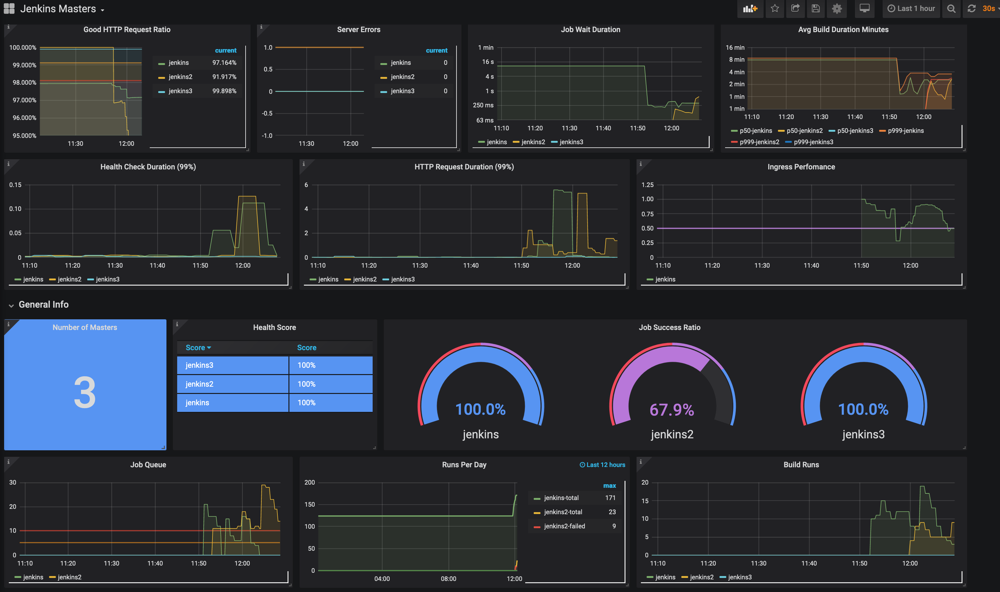

# Grafana Dashboard

## Example Screenshot

## Grafana Variables

* cluster
    * **type**: `datasource`
    * **datasource type**: `prometheus`
* node
    * **type**: `query`
    * **query**: `label_values(node_boot_time{job="node-exporter"}, instance)`
    * **multivalue**
    * **include all**
* namespace
    * **type**: `query`
    * **query**: `label_values(kube_pod_info, namespace)`
    * **multivalue**
    * **include all**