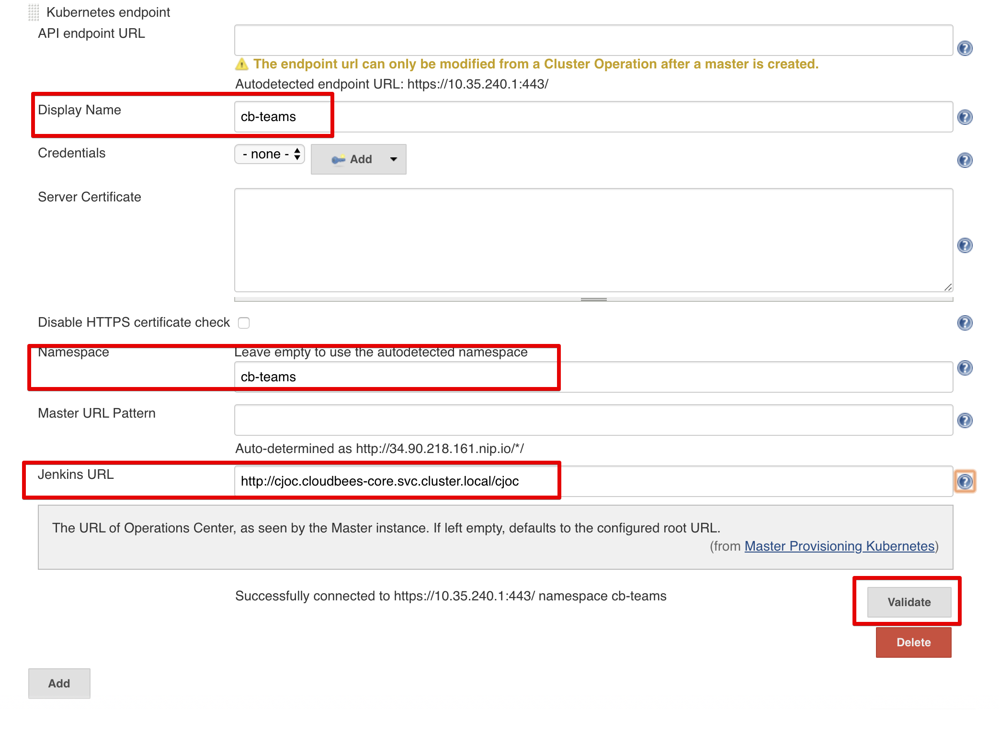
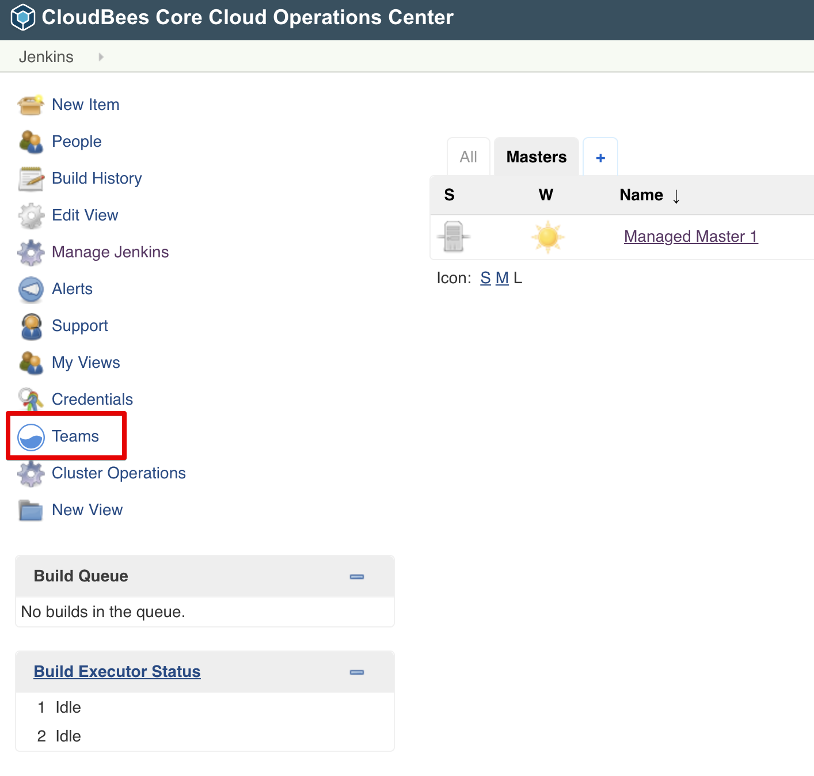
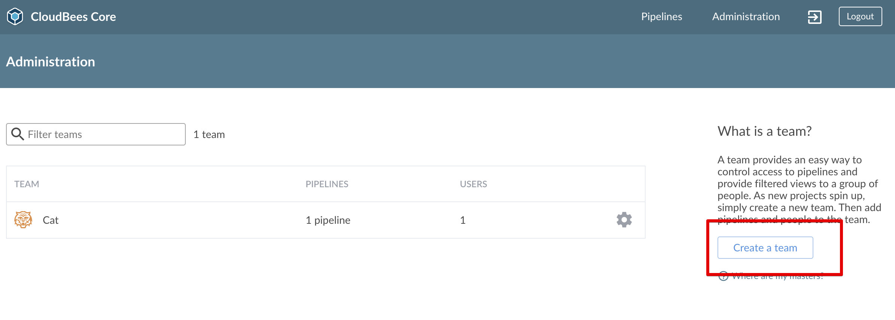
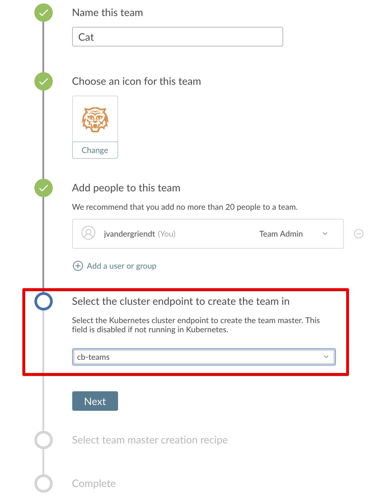

title: Team Master In Alternative Namespace
description: How to create a Team Master in a alternative namespace

# Team Master In Alternative Namespace

## Pre-requisites

* working installation of CloudBees Core Modern
* kubectl access to the cluster with sufficient rights to set permissions
* helm installed
* cloudbees helm chart configured
* kubectx installed

### Prepare Helm

* `helm repo add cloudbees https://charts.cloudbees.com/public/cloudbees`
* `helm repo update`

## Process

* create Namespace
* create helm values file
* create kubernetes yaml configuration for namespace via helm template
* apply yaml configuration to the namespace
* configure additional kubernetes endpoint in CJOC
* create Team Master via Team UI using new Kubernetes Endpoint

## Create Namespace

```bash
NAMESPACE=
```

```bash
kubectl create namespace $NAMESPACE
```

```bash
kubens $NAMESPACE
```

## Create Helm Values File

We need to set two values at least:

* **Master.OperationsCenterNamespace**=`${NAMESPACE}`
* **OperationsCenter.Enabled**=`false`

Or in yaml form (`namespace-values.yaml`):

```yaml
Master:
    OperationsCenterNamespace: cloudbees

OperationsCenter:
    Enabled: false
```

## Create Config Via Helm Template

### Fetch Helm Chart

```bash
helm fetch \
  --repo https://charts.cloudbees.com/public/cloudbees \
  --version 3.8.0+a0d07461ae1c \
    cloudbees-core
```

### Create Config

```bash
helm template cloudbees-core-namespace \
    cloudbees-core-3.8.0+a0d07461ae1c.tgz \
     -f namespace-values.yaml \
    --namespace ${NAMESPACE} \
    > cloudbees-core-namespace.yml
```

## Apply Namespace Configuration

```bash
kubectl apply -f cloudbees-core-namespace.yml --namespace ${NAMESPACE}
```

## Configure Kubernetes Endpoint In Operations Center

Where: `Operations Center` -> `Manage Jenkins` -> `Configure System` -> `Kubernetes Master Provisioning`
What: Click `Add`

Now you have to configure the endpoint.

Assuming you will only change the namespace and not a different cluster, you can leave the following fields blank.

* `API endpoint URL`
* `Credentials`
* `Server Certificate`

You have to fill in the fields `Display Name` and `Namespace`, I'd recommend using the same value for both, the namespace we just created and configured.

We also have to fill in the field `Jenkins URL`, we can take the base name from the default endpoint (should be `http://cjoc.cloudbees-core.svc.cluster.local/cjoc`).
We then have to add the namespace of where Operations Center is in, to the URL. Which in my case is, is in `cloudbees-core`.
The end result being: `http://cjoc.cloudbees-core.svc.cluster.local/cjoc`.

!!! info
    Make sure to hit the `Validate` button to ensure the configuration works.



## Create Team Master In Alternative Namespace

First, open the Teams UI.



Second, start the New Team Wizard.



And finally, select your new endpoint.



