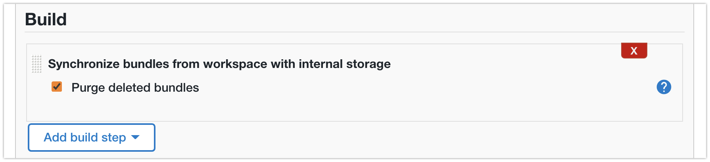

title: CloudBees CI - Configuration As Code
description: Use Configuration as Code to automate the configuration of CloudBees CI
Hero: Automate CBCI (Modern) with CasC

# Configuration As Code

What we will do is leverage CloudBees CI's(CBCI) Configuration as Code (CasC) to automate as much of the CBCI installation as possible.

## Solution

!!! attention "CBCI Modern only!"
    This solution is for CloudBees CI Modern, on a recent Kubernetes cluster.

### Prerequisites

* A running Kubernetes cluster
* [Helm](https://helm.sh/)
* [Helmfile](https://github.com/roboll/helmfile)
* [Kubectl](https://kubernetes.io/docs/tasks/tools/) with access to the Kubernetes cluster
* CloudBees CI license

### Steps to take

* Bootstrap the Kubernetes cluster
* Setup Helm configuration (we'll use Helmfile)
* Setup Configuration as Code for the Operations Center
* Setup Configuration as Code for Controllers

### Tools Included

* [nginx-ingress](https://kubernetes.github.io/ingress-nginx/deploy/): our Ingress Controller for accessing web applications in the cluster
* [external-dns](https://github.com/kubernetes-sigs/external-dns): manages the DNS entries in our Google CloudDNS Zone, so each Ingress resource gets its own unique DNS entry, this also enables us to generate specfic certificates via cert-manager
* [cert-manager](https://cert-manager.io/): manages certificate requests, so all our web applications can use TLS
* [openldap](https://www.openldap.org/): an LDAP server, for having an actual representative authentication realm for CBCI
  * We use [Geek-Cookbook](https://geek-cookbook.funkypenguin.co.nz/recipes/openldap/)'s version.
* [prometheus](https://prometheus.io/docs/introduction/overview/): we use Prometheus to collect metrics from the resources in the cluster
* [grafana](https://grafana.com/grafana/): we use Grafana to turn the metrics from Prometheus into viewable dashboards
    * the dashboard that is installed comes from [here](https://joostvdg.github.io/blogs/monitor-jenkins-on-k8s/dashboard/)

## Bootstrap Kubernetes Cluster

### Create Namespaces

We need a namespace for nginx-ingress, cert-manager, and CloudBees CI.

```sh
kubectl create namespace cbci
kubectl create namespace cert-manager
kubectl create namespace nginx-ingress
```

### Configure cert-manager namespace

Cert Manager will perform some validations on Ingress resources.
It cannot do that on _its own_ Ingress resource, so we label the `cert-manager` namespace so Cert Manager ignores itself.

```sh
kubectl label namespace cert-manager certmanager.k8s.io/disable-validation=true
```

### External DNS Config

In my case, I am using the [External DNS Controller](https://github.com/kubernetes-sigs/external-dns) with Google Cloud and a Cloud DNS Zone.

For this I have created a GCP Service Account with a credentials file (the JSON file).
If you want both `cert-manager` and `nginx-ingress` to directly use the Cloud DNS configuration to bypass the more lenghty alternatives (such as http verification) you need to supply them with the GCP Service Account.

[Read here](https://github.com/kubernetes-sigs/external-dns/blob/master/docs/tutorials/nginx-ingress.md) for more on using the External DNS Controller with GCP.

For other options, please refer to the [External DNS Controller docs](https://github.com/kubernetes-sigs/external-dns#deploying-to-a-cluster), which has guides for all the supported environments.

=== "Cert Manager"

    ```sh
    kubectl -n cert-manager create secret generic external-dns-gcp-sa --from-file=credentials.json
    ```

=== "Nginx Ingress Controller"

    ```sh
    kubectl -n nginx-ingress create secret generic external-dns-gcp-sa --from-file=credentials.json 
    ```

### Configure CBCI namespace

We need to configure the LDAP password secret, so our CasC for OC bundle can configure LDAP while JCasC translates the placeholder to the actual password.

This should be the same value as the `ldapGlobalPassword` in the `helmfile-values.yaml`.

```sh
kubectl create secret generic ldap-manager-pass --from-literal=pass=${LDAP_GLOBAL_PASSWORD} --namespace cbci
```

## Helm(file) Configuration

### Helmfile Layout

The files that matter to Helmfile are the following.

```sh title="helmfile directory structure"
.
├── helmfile-values.yaml
├── helmfile.yaml
└── values
    └── *.yaml.gotmpl
```

### Helmfile.yaml

The `helmfile.yaml` file has several sections.

Let's look at each section separately, before I share the whole file.

We start with the environments. 
In this case, I have just one environments, `default`, but you can choose to have more, opting to have seperate value files for Staging and Production for example.

```yaml title="helmfile.yaml (enviroments)"
environments:
  default: # (1)
    values:
    - helmfile-values.yaml 
```

1.  the default environment is chosen if you do not choose an environment

As Helmfile will interact with Helm for us, we can properly manage our Helm repositories.
If we give Helmfile a list of Helm repositories, it will make to update them prior to any installation, so you don't have to worry about that.

```yaml title="helmfile.yaml (repositories)"
repositories:
- name: stable
  url: https://charts.helm.sh/stable
- name: cloudbees
  url: https://charts.cloudbees.com/public/cloudbees
- name: jetstack
  url: https://charts.jetstack.io
- name: bitnami
  url: https://charts.bitnami.com/bitnami
- name: geek-cookbook
  url: https://geek-cookbook.github.io/charts/
- name: grafana
  url: https://grafana.github.io/helm-charts
- name: prometheus-community
  url: https://prometheus-community.github.io/helm-charts
```

Another thing we cannot steer if Helmfile does the interaction with Helm for us, are Helms flags.
Some of these flags might be important for you, I've chosen to set these.

```yaml title="helmfile.yaml (defaults)"
helmDefaults:
  wait: true # (1)
  timeout: 600 # (2)
  historyMax: 25 # (3)
  createNamespace: true # (4)
```

1.  We will wait on the resources becoming ready before creating the next. This ensures our dependencies are honored.
2.  I personally always set an explicit timeout, so it is easy to spot if we hit a timeout. The timeout refers to how long we wait for the resources to be ready.
3.  How many update versions Hel tracks. I like to be able to rollback and have a bit of history.
4.  Some namespaces we created in the bootstrap, the rest should get created when required. This setting will make sure that any Helm installation in a new namespace, will have it created.

Next up are the releases. These are the Helm chart releases.
For the latest versions and the configurable properties, I recommend using [ArtifactHub.io](https://artifacthub.io/).

Releases need a name, chart, version, and values.
The chart, is a combination of the source repository (how you named it) and the chart name _in_ that repository.
In our case, this would be `cloudbees`, because I called the CloudBees Helm repository that, and then `/cloudbees-core`.
While the product has been renamed, the Helm chart has kept the CloudBees Core name.

Another thing you can see, is the `needs` list.
This tells Helmfile to install those releases (by name) before installing this one.

```yaml title="helmfile.yaml (releases)"
releases:
- name: cbci
  namespace: cbci
  chart: cloudbees/cloudbees-core # (1)
  version: '3.37.2+7390bf58e3ab' 
  values:
  - values/cbci.yaml.gotmpl  # (2)
  needs: # (3)
  - nginx-ingress
  - external-dns
  - cert-manager
  - ldap

- name: cm-cluster-issuer
  namespace: cert-manager
  chart: incubator/raw # (4)
  values:
  - values/cluster-issuer.yaml.gotmpl
  needs:
  - cbci
  - cert-manager
```

1.  The name of a Chart, `<Repository Name>/<Chart Name>`
2.  The values to use for this Helm installation. In this case we're specifying a [Go template](https://blog.gopheracademy.com/advent-2017/using-go-templates/), signified by the `yaml.gotmpl` extension.
3.  Informs Helmfile there is a dependency relationship between this Release and others, making sure it install them in the proper order.
4.  `incubator/raw` lets you include templated files directly, without having a Helm release

Helmfile supports various ways of supplying the Helm values.
In this example I'm using a [Go template](https://blog.gopheracademy.com/advent-2017/using-go-templates/) which lets us template the Helm chart installations.
By using a template values file, we can re-use values accross Helm charts to ensure that if two or more Charts reference the same value, we can guarantee it is the same.

The second release, `cm-cluster-issuer` is a file that is in the same repository as the Helmfile configuration.
This is why the chart is listed as `incubator/raw`, it lets you include templated Kubernetes manifests directly, without creating a Helm release.

??? example "Full Helmfile"

    ```yaml title="helmfile.yaml" linenums="1"
    environments:
      default:
        values:
        - helmfile-values.yaml

    repositories:
    - name: stable
      url: https://charts.helm.sh/stable
    - name: cloudbees
      url: https://charts.cloudbees.com/public/cloudbees
    - name: jetstack
      url: https://charts.jetstack.io
    - name: bitnami
      url: https://charts.bitnami.com/bitnami
    - name: geek-cookbook
      url: https://geek-cookbook.github.io/charts/
    - name: grafana
      url: https://grafana.github.io/helm-charts  
    - name: prometheus-community
      url: https://prometheus-community.github.io/helm-charts

    helmDefaults:
      wait: true
      timeout: 600
      historyMax: 25
      createNamespace: true  

    releases:
    - name: cbci
      namespace: cbci
      chart: cloudbees/cloudbees-core 
      version: 3.37.2+7390bf58e3ab 
      values:
      - values/cbci.yaml.gotmpl
      needs:
      - nginx-ingress
      - external-dns
      - cert-manager
      - ldap

    - name: nginx-ingress
      namespace: nginx-ingress
      chart: bitnami/nginx-ingress-controller
      version: 7.6.21
      values:
      - values/nginx-ingress.yaml.gotmpl

    - name: external-dns
      namespace: nginx-ingress
      chart: bitnami/external-dns
      version: 5.4.8
      values:
      - values/external-dns.yaml.gotmpl

    - name: cert-manager
      namespace: cert-manager
      chart: jetstack/cert-manager
      version: 1.5.3
      values:
      - values/cert-manager.yaml.gotmpl
      needs:
      - nginx-ingress

    - name: cm-cluster-issuer
      namespace: cert-manager
      chart: incubator/raw
      values:
      - values/cluster-issuer.yaml.gotmpl
      needs:
      - cbci
      - cert-manager

    - name: ldap
      namespace: cbci
      chart: geek-cookbook/openldap
      version: 1.2.4
      values:
      - values/ldap.yaml.gotmpl

    - name: prometheus
      namespace: mon
      chart: prometheus-community/prometheus
      version: 14.8.1
      values:
      - values/prom.yaml.gotmpl

    - name: grafana
      namespace: mon
      chart: grafana/grafana
      version: 6.16.11
      values:
      - values/grafana.yaml.gotmpl
      needs:
      - prometheus
    ```

### Helmfile-values.yaml

As stated in the previous section, I have opted for using templated Helm values files.
This lets me add placeholder values, which I can replace with values via Helmfile.

In the `environments` section, I referenced the file `helmfile-values.yaml` for the default, and only, environment.
So let's take a look at this file.

There are mostly passwords in there, for Grafana and LDAP.
There are also two values related to the External DNS Controller configuration,  `googleProject` and `googleASSecret`.

Feel free to remove these, if you're not using GCP or you're not using the External DNS Controller.

```yaml title="helmfile-values.yaml"
adminEmail: # (1)
googleProject: # (2)
googleASSecret: external-dns-gcp-sa # (3)
ldapGlobalPassword: 
ldapUser1Password: 
ldapUser2Password: 
ldapUser3Password: 
grafanaUser: 
grafanaPass: 
```

1.  the admin email address used for the Cluster Issuer, and will receive notifications from Cert Manager for certificate expirations
2.  the Google Project _id_ where the Cloud DNS Zone resides
3.  the name of the Kubernetes secret containing the GCP Service Account JSON file

### Values Files

I won't list each of them here, they are all available in my [CloudBees CI CasC](https://github.com/joostvdg/cloudbees-ci-casc/) repo on GitHub.


The Cluster Issuer is an optional resource.
I personally always prefer having an automated DNS setup and HTTPS with matching Certificates (e.g., no wildcard certificates).

!!!	tip "Optional"
    Only use this if you are using GCP, the External DNS Controller, and Cert Manager.

```yaml title="values/cluster-issuer.yaml.gotmpl"
resources:
  - apiVersion: cert-manager.io/v1
    kind: ClusterIssuer
    metadata:
      name: letsencrypt-prod
    spec:
      acme:
        email: {{ .Values.adminEmail }}
        server: https://acme-v02.api.letsencrypt.org/directory
        privateKeySecretRef:
          name: letsencrypt-prod
        solvers: # (1)
        - selector: {} 
          dns01:
            cloudDNS:
              project: {{ .Values.googleProject }}
              serviceAccountSecretRef:
                name: {{ .Values.googleASSecret }}
                key: credentials.json
```

1.  An empty 'selector' means that this solver matches all domains

The most important one of couse, is the Helm values for the CloudBees CI installation.
It already contains some secret sauce that will help us with synchronizing the CasC for OC Bundle.

```yaml title="values/cbci.yaml.gotmpl" linenums="1"
OperationsCenter:
  HostName: {{ .Values.cbciHostname }}
  CSRF:
    ProxyCompatibility: true
  Annotations: # (1)
    prometheus.io/path: "/prometheus"
    prometheus.io/port: "8080"
    prometheus.io/scrape: "true"
  Ingress:
    Annotations:
      cert-manager.io/cluster-issuer: letsencrypt-prod # (2)
      kubernetes.io/tls-acme: 'true'
      kubernetes.io/ingress.class: nginx
    tls:
      Enable: true
      Host: {{ .Values.cbciHostname }}
      SecretName: my-cbci-tls-secret
  JavaOpts: # (3)
    -Djenkins.install.runSetupWizard=false
    -Dcore.casc.config.bundle=/var/jenkins_config/oc-casc-bundle-from-git/cloudbees-ci-casc/casc-for-oc/bundle
  ContainerEnv: # (4)
    - name: LDAP_MANAGER_PASSWORD
      valueFrom:
        secretKeyRef:
          name: ldap-manager-pass
          key: pass
  ExtraContainers: # (5)
  - name: git-sync
    image: gcr.io/k8s-staging-git-sync/git-sync@sha256:866599ca98bcde1404b56152d8601888a5d3dae7fc21665155577d607652aa09
    args:
      - --repo=https://github.com/joostvdg/cloudbees-ci-casc
      - --branch=main
      - --depth=1
      - --wait=20
      - --root=/git
    volumeMounts:
      - name: content-from-git
        mountPath: /git

  ExtraVolumes: # (6)
  - name: content-from-git
    emptyDir: {}
  ExtraVolumeMounts: # (7)
  - name: content-from-git
    mountPath: /var/jenkins_config/oc-casc-bundle-from-git
    readOnly: true

Agents: # (8)
  Enabled: true
  SeparateNamespace:
    Enabled: true
    Name: ci-agents
    Create: true

Hibernation: # (9)
  Enabled: true
```

1.  OC Pod Annotations for Prometheus, so our Prometheus installation can scrape the Metrics from the OC
2.  Annotations for the Ingress resource, so we get a valid certificate from Cert Manager via our referenced Certificate Issuer
3.  Disable the Installation Wizard, and tell the OC where it can find its CasC Bundle
4.  Map the LDAP password secret as an environment variable, so JCasC can interpolate it
5.  Define a sidecar container with the [Git Sync](https://github.com/kubernetes/git-sync)
6.  Define additional Pod volumes
7.  Define additional OC Container Volume Mounts
8.  Let CloudBees CI run Kubernetes agent in a separate namespace
9.  Enable the CloudBees CI [Hibernation feature](https://docs.cloudbees.com/docs/cloudbees-ci/latest/cloud-admin-guide/managing-masters#_hibernation_in_managed_masters)

Some of the things we're doing in this Helm file configuration:

* OC Pod Annotations for Prometheus, so our Prometheus installation can scrape the Metrics from the OC
* Annotations for the Ingress resource, so we get a valid certificate from Cert Manager via our referenced Certificate Issuer
* Tell the OC where it can find its CasC Bundle
* Define a sidecar container with the [Git Sync](https://github.com/kubernetes/git-sync) with additional volume mounts (more at [git-sync-for-casc-oc-bundle](/cloudbees/cbci-casc/#git-sync-for-casc-oc-bundle)) 
* Let CloudBees CI run Kubernetes agent in a separate namespace
* Enable the CloudBees CI [Hibernation feature](https://docs.cloudbees.com/docs/cloudbees-ci/latest/cloud-admin-guide/managing-masters#_hibernation_in_managed_masters)

### Install Via Helmfile

To verify the Helm and Helmfile configuration is correct, you can run the validate command.

```sh
helmfile lint
```

The output will be something like this:

!!! Success
    ```sh
    Adding repo cloudbees https://charts.cloudbees.com/public/cloudbees
    "cloudbees" has been added to your repositories

    Fetching cloudbees/cloudbees-core

    Linting release=cbci, chart=/var/folders/f_/mpwdv8s16r7_zt43r3r7k20w0000gn/T/helmfile2581490205/cbci/cbci/cloudbees/cloudbees-core/3.37.2+7390bf58e3ab/cloudbees-core
    ==> Linting /var/folders/f_/mpwdv8s16r7_zt43r3r7k20w0000gn/T/helmfile2581490205/cbci/cbci/cloudbees/cloudbees-core/3.37.2+7390bf58e3ab/cloudbees-core
    [WARNING] templates/cjoc-ingress.yaml: extensions/v1beta1 Ingress is deprecated in v1.14+, unavailable in v1.22+; use networking.k8s.io/v1 Ingress
    [WARNING] templates/managed-master-hibernation-monitor-ingress.yaml: extensions/v1beta1 Ingress is deprecated in v1.14+, unavailable in v1.22+; use networking.k8s.io/v1 Ingress

    1 chart(s) linted, 0 chart(s) failed
    ```

Assuming all your configuration is valid, you can now safely apply it to the cluster.

```sh
helmfile apply
```

The output of that depends on your charts and their versions, and you will see the post-install messages of each chart. If, like me, you've configured the option `helmDefaults.wait`, then there will be pauses in the process, as Helmfile waits for the Helm install to finish before moving to the next.

## CasC for OC

At the time of writing this (November 2021), [Configuration as Code (CasC) for the Operations Center](https://docs.cloudbees.com/docs/cloudbees-ci/latest/casc-oc/) (OC) is still a [Preview](https://docs.beescloud.com/docs/lexicon/latest/preview) feature.

But aside from a few wrinkles that are about to be ironed out, CasC for OC is ready for prime time. Where applicable, I will mention the wrinkle and the workaround if required.

We will look at the following things:

* How to make OC use CasC
* How to structure the CasC Bundle
* How to configure some common items
* How to keep the Bundle up to date
* How to manage Items (such as Jobs, Folders, Controllers)

For all the details, my full working [CasC for OC example](https://github.com/joostvdg/cloudbees-ci-casc/tree/main/casc-for-oc/bundle) is on GitHub.

!!! Info "What is a Bundle"
    CloudBees CI extends [Jenkins Configuration as Code](https://www.jenkins.io/projects/jcasc/) (JCasC) with additional configuration files, for a full Configuration as Code experience. This collection of files, is called a Bundle. A Bundle has a fixed structure.

    For more information, please read [creating a OC Bundle](https://docs.cloudbees.com/docs/cloudbees-ci/latest/casc-oc/create-bundle) in the official documentation.

### Make OC use CasC

!!! warning inline end

    There is a chicken and egg problem; unless you have a wildcard license, you need to start OC with the wizard, and either retrieve a valid license based on its `Instance ID`, or request a trial license. 
    
    From then on, you can use CasC to configure the OC, including the License (if you want).

To make OC use a CasC we need three things:

1. have a valid CasC Bundle
2. have an OC with the CasC plugins installed
3. tell OC where its Bundle is

We will explore the first point in the next section.
For the second point, we can use CasC to install those plugins and that ability is there by default.
So luckily, we can ignore the chicken and egg problem there.

To tell OC to use a Bundle, we set a Java property with the directory where it can find the Bundle.
We can set Java properties in the Helm chart, via the `OperationsCenter.JavaOpts` property.
The property to set, is `-Dcore.casc.config.bundle=`, as you can see in the example below.

```yaml title="values/cbci.yaml.gotmpl"
OperationsCenter:
  # other config ignored for example
  JavaOpts:
    -Djenkins.install.runSetupWizard=false
    -Dcore.casc.config.bundle=/var/jenkins_config/oc-casc-bundle-from-git/cloudbees-ci-casc/casc-for-oc/bundle

  # other config ignored for example
  ExtraVolumes: # (6)
  - name: casc-oc-volume
    configMap:
      name: casc-oc
  ExtraVolumeMounts: # (7)
  - name: casc-oc-volume
    mountPath: /var/jenkins_config/oc-casc-bundle
    readOnly: true
```

!!! help
    If you're wondering how we configure that sidecar container and why, we'll dive into this, in the section: [Keep Bundle up-to-date with Git Sync](/cloudbees/cbci-casc/#keep-bundle-up-to-date-with-git-sync).

In this example, we use a sidecar container to synchronize the OC Bundle to a directory.
Due to the structure of that repository, the Bundle is accessible at `/var/jenkins_config/oc-casc-bundle-from-git/cloudbees-ci-casc/casc-for-oc/bundle`. 

### Bundle Structure

Below is a snippet of my CasC for OC Bundle.

```sh
.
├── bundle.yaml
├── items
│   ├── controllers
│   │   ├── blue.yaml
│   │   └── yellow.yaml
│   ├── items.yaml
│   └── jobs
├── jenkins.yaml
├── plugins.yaml
└── rbac.yaml
```

The main items here are as follows:

* `bundle.yaml`: the Bundle descriptor, informs CasC about the contents of this Bundle
* `items/`: folder with with subfolders and items in their separate files
* `jenkins.yaml`: the main configuration, essentially leveraging JCasC
* `plugins.yaml`: list of plugins to install, limited to CAP plugins
* `rbac.yaml`: where we configure Role Based Access Control, global roles and global groups

!!! hint "RBAC Configuration"
    The `rbac.yaml` contains the _global_ configuration.
    Configuration for folders or Controllers is defined in their respective item manifest files.
    We'll explore these later.

Let's take a look at some of these files.

```yaml title="bundle.yaml"
apiVersion: "1"
id: "jenkins"
description: "OC Bundle"
version: "1.12" # (1)
plugins:
  - "plugins.yaml"
jcasc:
  - "jenkins.yaml"
rbac:
  - "rbac.yaml"
items: # (2)
  - "items/"
```

1.  updating the version speeds up the detection of a bundle change
2.  we can read configuration from a directory and its subdirectories

The only mandatory files are this `bundle.yaml` and the `jcasc` section with one or more files.
You can either use a named file, like I've done, or use point it to a folder.
CasC will read all the files in the directory and its sub-directories.

We leverage that with our `items` section. We'll explore this in more depth in the [Managing Items](/cloudbees/cbci-casc/#managing-items) section.

### Configure OC via CasC

To configure OC via a Bundle, let's explore some of the files by which you can do so.
Due to the more detailed nature, we'll explore Items and the LDAP configuration separately.

Let's start with the plugins.

```yaml title="plugin.yaml"
plugins:
- {id: notification-api}
- {id: operations-center-notification}
- {id: cloudbees-prometheus}
# skipping some items to reduce example size
```

!!! info
    At the time of writing, the CasC plugins are restructured. So while the example at some point in time used the following two plugins; `cloudbees-casc-api` and `cloudbees-casc-server`.

    They are likely different by the time you're reading this. Please look at the [official docs](https://docs.cloudbees.com/docs/cloudbees-ci/latest/casc-oc/items#_supported_items_using_casc) for the appropriate plugins for your release. 

If you look at the [file](https://github.com/joostvdg/cloudbees-ci-casc/blob/main/casc-for-oc/bundle/plugins.yaml) in my example repository, you'll fine it has ~108 plugins. For the sake of the example, I won't list all of them here.

For plugins in the CAP we do not have to list the versions, as CAP manages those for us.
So we only list the plugin _id_ of the plugins we want. If for some reason the plugin cannot be installed, there will be an explicit warning in the logs.

!!! warning
    When adding plugins, the instance must always be restarted for the change to take effect.

Up next is the RBAC configuration, if you're not using CloudBees' RBAC with CloudBees CI yet, I strongly urge you to reconsider!

```yaml title="rbac.yaml"
removeStrategy:
  rbac: SYNC

roles:
- name: authenticated
- permissions:
  - hudson.model.Hudson.Administer
  name: administer
- name: anonymous
- filterable: 'true'
  permissions:
  - hudson.model.Item.Read
  - hudson.model.Item.Discover
  - hudson.model.Hudson.Read
  - hudson.model.View.Read
  name: browse
groups:
- members:
    external_groups:
      - Administrators
    users:
      - admin
      - jvandergriendt
  roles:
  - name: administer
    grantedAt: current
  name: Administrators
- roles:
  - name: develop
    grantedAt: current
  name: Developers
  members:
    external_groups:
      - BlueAdmins
      - GreenAdmins
- roles:
  - name: browse
    grantedAt: current
  name: Browsers
  members:
    external_groups:
      - Blue
      - Green
```

There are three main sections in my exmaple.

* `removeStrategy`: determines how differences between the CasC configuration and current state is handled
* `roles`: defines the global roles, these are applied to the OC and all Controllers (except those that opt out of global RBAC)
* `groups`: these are the global groups, active from the root from OC all the way down. Which is why we give some external groups the `browse`role, so they can see the items in OC they might be administrator of (such as a Controller)

For the sake of brevity, I have excluded some of the roles. 
These are the roles that are generated when you first initialize RBAC and choose `typical initial setup`.

If you're not sure how the define these, I recommend exploring the options via the UI first, and then exporting the configuration.

!!! warning inline end
    The `removeStrategy` is required, please read the [official docs](https://docs.cloudbees.com/docs/cloudbees-ci/latest/casc-oc/rbac) for the available options.

#### Jenkins.yaml

In the `jcasc` section of the Bundle manifest (`bundle.yaml`), we define the configuration of the OC.
Essentially, anything you can configure via one of the pages of the `Manage Jenkins` screen, can be defined via CasC.

Again, for the sake of brevity, I'll exclude some details that aren't important to discuss.

```yaml title="jenkins.yaml"
jenkins:
  authorizationStrategy: "cloudBeesRoleBasedAccessControl"
  crumbIssuer:
    standard:
      excludeClientIPFromCrumb: true
  primaryView:
    masters:
      columns:
      - "jobName"
      - "status"
      - "weather"
      - "masterConfigurationStaleViewColumn"
      - "jenkinsVersionViewColumn"
      - "cascViewColumn"
      - "manageMaster"
      - "totalJobsViewColumn"
      - "queueSizeViewColumn"
      - "listSelectionColumn"
      jobFilters:
      - "connectedMasterViewFilter"
      name: "Controllers"
      recurse: true
  securityRealm:
    ldap: #  we'll dive into this below
cloudBeesCasCServer:
  defaultBundle: "mc1"
  visibility: true
beekeeper:
  enabled: true

masterprovisioning:
  kubernetes:
    clusterEndpoints:
    # details are explored below
```

!!! danger inline end
    If you want to manage the RBAC configuration via CasC, the `authorizationStrategy` _must_ be set to `"cloudBeesRoleBasedAccessControl"`.

You can see that this file can quickly become quite large and unwieldy.
So you can break it up into different files, and then in the `bundle.yaml` point to a folder with all the file instead.

In case you've used either CasC or JCasC before, this is exactly the same, with the only difference that the OC might not support some plugins and has some plugins which do not exist for Controllers.

When in doubt, configure it via the UI first and then [export the CasC configuration](https://docs.cloudbees.com/docs/cloudbees-ci/latest/casc-oc/create-bundle#_exporting_a_casc_configuration).

#### LDAP Configuration

Let's take a look at the LDAP configuration snippet.
The configuration as based on the LDAP we've configured via the Helmfile configuration earlier in this guide.

```yaml title="jenkins.yaml (jenkins.securityRealm)"
jenkins:
  securityRealm:
    ldap:
      configurations:
      - displayNameAttributeName: "cn"
        groupMembershipStrategy:
          fromGroupSearch:
            filter: "member={0}"
        groupSearchBase: "ou=Groups"
        inhibitInferRootDN: false
        managerDN: "cn=admin,dc=example,dc=org"
        managerPasswordSecret: ${LDAP_MANAGER_PASSWORD}
        rootDN: "dc=example,dc=org"
        server: "ldap://ldap-openldap:389"
        userSearchBase: "ou=People"
      disableMailAddressResolver: false
      groupIdStrategy: "caseInsensitive"
      userIdStrategy: "caseInsensitive"  
```

The password has been set to `${LDAP_MANAGER_PASSWORD}`, which will be automatically interpreted by JCasC, [read here how and what options there are](https://github.com/jenkinsci/configuration-as-code-plugin/blob/master/docs/features/secrets.adoc).

I've opted for leveraging an environment variable.
This environment variable comes from a Kubernetes secret by the name `ldap-manager-pass`, we created in the [Configure CBCI namespace](/cloudbees/cbci-casc/#configure-cbci-namespace) section.

```yaml title="values/cbci.yaml.gotmpl"
OperationsCenter:
  # other config excluded for brevity
  ContainerEnv: 
    - name: LDAP_MANAGER_PASSWORD
      valueFrom:
        secretKeyRef:
          name: ldap-manager-pass
          key: pass
```

#### Controller Provisioning

!!! bug inline end
    While CloudBees CI stands for inclusive naming and works hard to remove any outdated terminology, sometimes they missed. Expect `masterprovisioning` to be renamed to `controllerprovisioning`.

One of the great things about CloudBees CI Modern is its ability of creating and managing Controllers on Kubernetes.
To control the properties of the Kubernetes resources, there is the `masterprovisioning`.

I've configured just the default settings, where the only notable thing is the `-Dorg.csanchez...defaultImage=cloudbees/cloudbees-core-agent:2.303.3.3` property. Which will have to be updated if you upgrade CloudBees CI.

!!! warning
    As we're using YAML in YAML and have multiple layers of interpretation, we have to exclude the `${name}` variables, so the annotations get the correct Controller name. To escape values, such as the `$` in this case, we use the `^`, so `${name}` becomes `^${name}`.

Remember the configuration for Prometheus? Well, if we want our Controller's metrics to be scrapable by Prometheus, we need to ensure they have the proper annotations as well. So I've included the annotations in the `yaml` section, so any new Controller automatically has them.

```yaml title="jenkins.yaml (masterprovisioning)"
masterprovisioning:
  kubernetes:
    clusterEndpoints:
    - id: "default"
      ingressClass: "nginx"
      jenkinsUrl: "http://cjoc.cbci.svc.cluster.local/cjoc/"
      name: "kubernetes"
    cpus: "1.0"
    disk: 50
    fsGroup: "1000"
    globalJavaOptions: "-Djenkins.model.Jenkins.crumbIssuerProxyCompatibility=true\
      \ -Dorg.csanchez.jenkins.plugins.kubernetes.pipeline.PodTemplateStepExecution.defaultImage=cloudbees/cloudbees-core-agent:2.303.3.3\
      \ -Dcom.cloudbees.jenkins.plugins.kube.ServiceAccountFilter.defaultServiceAccount=jenkins-agents\
      \ -Dcom.cloudbees.networking.useSubdomain=false -Dcom.cloudbees.networking.protocol=\"\
      https\" -Dcom.cloudbees.networking.hostname=\"ci.cbci-pm.beescloud.com\" -Dcom.cloudbees.networking.port=443\
      \ -Dcom.cloudbees.networking.operationsCenterName=\"cjoc\""
    javaOptions: "-XshowSettings:vm -XX:+AlwaysPreTouch -XX:+UseG1GC -XX:+DisableExplicitGC\
      \ -XX:+ParallelRefProcEnabled -XX:+UseStringDeduplication -Dhudson.slaves.NodeProvisioner.initialDelay=0"
    livenessInitialDelaySeconds: 300
    livenessPeriodSeconds: 12
    livenessTimeoutSeconds: 12
    memory: 3072
    readinessFailureThreshold: 100
    readinessInitialDelaySeconds: 30
    readinessTimeoutSeconds: 5
    terminationGracePeriodSeconds: 1200
    yaml: |-
      apiVersion: "apps/v1"
      kind: "StatefulSet"
      spec:
        template:
          metadata:
            annotations:
              prometheus.io/path: "/^${name}/prometheus"
              prometheus.io/port: "8080"
              prometheus.io/scrape: "true"
            labels:
              app.kubernetes.io/component: Managed-Controller
              app.kubernetes.io/instance: "^${name}"
              app.kubernetes.io/managed-by: CloudBees-CI-Cloud-Operations-Center
              app.kubernetes.io/name: "^${name}"
```

### Managing Items

As you've seen, we've configured the Bundle to collect Item manifests from the `items` folder.

CasC will automatically read all the files in the specified folder and its subfolders.

In my example Bundle, the items folder looks like this:

```sh
.
├── controllers
│   ├── blue.yaml
│   ├── cyan.yaml
│   ├── green.yaml
│   ├── purple.yaml
│   └── yellow.yaml
├── items.yaml
└── jobs
    └── controller-casc-sync.yaml
```

In the `items.yaml` you can define any item you need, such as Folders.
I've separated Controllers and Jobs from the main file.

This way, if someone wants to add a new Controller or a new Job, all they have to do is add a new file into the folder and synchronise the Bundle to OC.

!!! info "Mandatory Boilerplate"
    In the current iteration of CasC, each file in the Items directory hierarchy, needs some boilerplate configuration, else it throws an error.

    ```yaml
    removeStrategy:
      rbac: SYNC
      items: NONE
    items:
    ```

#### Managed Controller

You might have picked it up already, but yes, you can create and managed Managed Controllers via OC's CasC Bundle!

Below is about as minimal an example as it can get.
It configures some basic properties such as the name and description, and some more specific items.
Such as the RBAC configuration (via `groups:`), which CasC Bundle it should use, and its Kubernetes configuration (overriding or extending `masterprovisioning` from the OC).

!!! bug "Created but not provisioned"
    In the CloudBees CI releases prior to December 2021, Managed Controllers get created, but do not get provisioned. This means their respective Kubernetes resources do not get created automatically.

    You can create a Cluster Operations Job, use the UI, or the CLI to save and restart the Controllers to create their Kubernetes resources.

```yaml title="items/controllers/cyan.yaml"
removeStrategy:
  rbac: SYNC
  items: NONE

items:
- kind: managedController
  displayName: 'Cyan'
  name: mc-cyan
  description: 'Cyan Controller (Managed by CasC)'
  groups:
  - members:
      users:
      - bluedev
      - blueadmin
    name: Blues
  properties:
  - configurationAsCode:
      bundle: purple
  configuration:
    kubernetes:
      domain: cyan
```

### Keep Bundle up-to-date with Git Sync

There are various ways you can get a CasC Bundle to the OC.

For example, you can store the YAML files in a Kubernetes ConfigMap, and then mount that ConfigMap into the OC's volume.

If you have a flat Bundle file hierarchy, or you have a transformation pipeline that creates a customizable output a ConfigMap is an option.

!!! tip
    If you do want to use a ConfigMap, this is how you configure the Helm values, assuming you CasC Bundle's ConfigMap is called `casc-oc`.

    ```yaml
    ExtraVolumes: 
    - name: casc-oc-volume
      configMap:
        name: casc-oc
    ExtraVolumeMounts: 
    - name: casc-oc-volume
      mountPath: /var/jenkins_config/oc-casc-bundle
      readOnly: true
    ```

I've opted to go another route, synchronizing my CasC Bundle directly from Git into a (Kubernetes) Volume.
To do so, I've used [Git Sync](https://github.com/kubernetes/git-sync), a tool from the Kubernetes maintainers for exactly this purpose.

So what we want to achieve, is that when I make a change in my Bundle in Git, it is automatically updated in the OC. To do so, we will add a sidecar container to the OC via the Helm values and some volume mounts, and thats all we need.

I've based my solution based on the [Git Sync documentation example](https://github.com/kubernetes/git-sync/blob/master/docs/kubernetes.md) for raw Kubernetes.

!!! warning
    The example uses a Container repository that is either not accessible, or does not contain the Git Sync images.
    
    After some digging around, I found the `3.x` version images in a GCR; `gcr.io/k8s-staging-git-sync/git-sync:v3.3.4__linux_amd64`. 

    For those who want to use the hash id instead of the tag, that tag is the following `git-sync@sha256:866599ca98bcde1404b56152d8601888a5d3dae7fc21665155577d607652aa09`.

While not documented, there is an option in the CBCI Helm chart to add a side car container.
You do so via `OperationsCenter.ExtraContainers` which is a list item.

This container needs a name and an image. 
For the sake of Git Sync, we need to supply it with arguments which tell it which repository to synchronize, how, and where to store it.

My repository is public, so it does not need credentials, if yours does, all the common solutions [are supported, as per the docs](https://github.com/kubernetes/git-sync/#parameters). Do verify the actual options the version you use supports, as it seems some flags were renamed between the version `4.x` that is the current `main` branch and the `3.4` version I'm using.

We add a Volume Mount to this sidecar container, so it can store the Git checkout on a Volume that is also usable by OC. We can add volumes via the `OperationsCenter.ExtraVolumes` property, which is also a list item.

Then to make sure the OC can _read_ from this Volume, we also mount that same Volume via the `OperationsCenter.ExtraVolumeMounts` property. The `mountPath` is what is the basis of the `-Dcore.casc.config.bundle` flag we set, to tell OC where it can find its Bundle.

```yaml title="values/cbci.yaml.gotmpl"
  ExtraContainers: 
  - name: git-sync
    image: gcr.io/k8s-staging-git-sync/git-sync@sha256:866599ca98bcde1404b56152d8601888a5d3dae7fc21665155577d607652aa09
    args:
      - --repo=https://github.com/joostvdg/cloudbees-ci-casc
      - --branch=main
      - --depth=1
      - --wait=20
      - --root=/git
    volumeMounts:
      - name: content-from-git
        mountPath: /git

  ExtraVolumes: 
  - name: content-from-git
    emptyDir: {}
  ExtraVolumeMounts: 
  - name: content-from-git
    mountPath: /var/jenkins_config/oc-casc-bundle-from-git
    readOnly: true
```

Speaking of the flag `-Dcore.casc.config.bundle`, to save you some of the trouble I had, lets take a good look at the path I've specified. Essentially, the Git Sync checks out the repository into a folder with the same name.

The path starts from the `mountPath`, which is `/var/jenkins_config/oc-casc-bundle-from-git`.
My Bundle's repository is called `cloudbees-ci-casc`, which we'll add next, and then the path to my Bundle within that repository.

```yaml title="values/cbci.yaml.gotmpl"
  JavaOpts:
    -Djenkins.install.runSetupWizard=false
    -Dcore.casc.config.bundle=/var/jenkins_config/oc-casc-bundle-from-git/cloudbees-ci-casc/casc-for-oc/bundle
```

## CasC for Controllers

!!! Note "What is a Bundle"
    CloudBees CI extends [Jenkins Configuration as Code](https://www.jenkins.io/projects/jcasc/) (JCasC) with additional configuration files, for a full Configuration as Code experience. This collection of files, is called a Bundle. A Bundle has a fixed structure.

    For more information, please read [creating a Controller Bundle](https://docs.cloudbees.com/docs/cloudbees-ci/latest/casc-controller/create-bundle) in the official documentation.

As a Controller Bundle is essentially the same as the one for the OC, I'll limit myself to two things.
One, how you can get those Bundles into the OC and usable by Controllers, and two, how to leverage the inheritance.

### Synchronize Controller Bundles to OC

#### Steps to Synchronize Bundles

* install a git client on Operations Center
  * for example: `github-branch-source`
* create a Freestyle job
  * check out from your repository with the casc Bundles
  * use the `Synchronize bundles from workspace with internal storage` build step
* create a Controller and select an available Bundle

#### Update Bundle Configuration

If you're not sure what you'd want to configure in the bundle, or which plugins you really need.

You can first create a Managed Controller how you want it to be. Then export its CasC configuration by the built-in   `casc-exporter`.

You do this, by going to the following URL `<controllerUrl>/core-casc-export`.

#### Freestyle Job - On OC

URL to checkout: `https://github.com/joostvdg/cloudbees-ci-casc.git`
Use the `Synchronize bundles from workspace with internal storage` build step.

Note: this only works if the Bundles are at the top level



??? Example "CasC Sync Job as CasC Item"

    ```yaml title="casc-sync-job-item.yaml" linenums="1"
    - kind: freeStyle
      displayName: casc-sync-new
      name: casc-sync-new
      disabled: false
      description: 'My CasC Bundle Synchronization job'
      concurrentBuild: false
      builders:
      - casCBundlesSyncBuildStep: {}
      blockBuildWhenUpstreamBuilding: false
      blockBuildWhenDownstreamBuilding: false
      scm:
        gitSCM:
          userRemoteConfigs:
          - userRemoteConfig:
              url: https://github.com/joostvdg/cloudbees-ci-casc.git
          branches:
          - branchSpec:
              name: '*/main'
      scmCheckoutStrategy:
        standard: {}
    ```

### Bundle Inheritance

You can have Bundles inherit from each other.
You do so by using the parent property in a Bundle descriptor (`bundle.yaml`).

For example, let's take a look at my [community2](https://github.com/joostvdg/cloudbees-ci-casc/tree/main/community2) Bundle.

```yaml title="bundle.yaml" hl_lines="5"
apiVersion: "1"
version: "1.0"
id: "community2"
description: "Shared Bundle"
parent: "community1"
jcasc:
  - "jenkins.yaml"
plugins:
  - "plugins.yaml"
```

This means the Bundle now extends the `community1` Bundle.
When you use `community2`, you essentially get all the files of both `community1` and `community2`.

!!! attention "Inheritance Limitation"
    At this time of writing, Bundles cannot override configuration they inherit and the configuration _must_ be complimentary. Meaning, once you specify the `jenkins.systemMessage`, the entire inheritance chain has to use the same message.

    What does work, which may not be obvious, is list items. Such as SharedLibraries, PodTemplates, and Tool definitions. Meaning, if you define two SharedLibraries in Bundle A, one SharedLibrary in Bundle B, the Controller using Bundle B, will have _three_ SharedLibraries defined.

Another caveeat to take note of, is that the last found Plugin Catalog is used.
As a Plugin Catalog essentially just lists plugins that _can_ be installed, I suggest you define *one* Plugin Catalog at the root of your hierarchy, and any plugins you need after, you add them to that same *one* Plugin Catalog.

This is what I've done with the `community` chain of Bundles. The Bundle `community1` contains a Plugin Catalog, with all the Tier 3 plugins _all_ downstream Bundles need.

* Bundle `community1` sets up a basic configuration, including a Plugin Catalog listing common Tier 3 (Community) plugins
* Bundle `community2` installs a chunk of these plugins, and sets a system message
* Bubdle `purple` install an additional community plugin (also defined in the Plugin Catalog) and has Controllers specific items (jobs)

```bash
.
├── community1
│   ├── bundle.yaml
│   ├── jenkins
│   │   ├── jenkins.yaml
│   │   ├── podtemplate-golang.yaml
│   │   ├── podtemplate-maven-jdk17.yaml
│   │   └── shared-libraries.yaml
│   ├── plugin-catalog.yaml
│   └── plugins.yaml
├── community2 (inherits community 1)
│   ├── bundle.yaml
│   ├── jenkins.yaml
│   └── plugins.yaml
└── purple (inherits community 2)
    ├── bundle.yaml
    ├── items
    │   └── pipeline-example.yaml
    └── plugins.yaml
```


*[OC]: CloudBees Operations Center
*[CasC]: CloudBees Configuration As Code
*[GCP]: Google Cloud Platform
*[JCasC]: Jenkins Configuration As Code (OSS plugin)
*[CAP]: CloudBees Assurance Program
*[RBAC]: Role Based Access Control