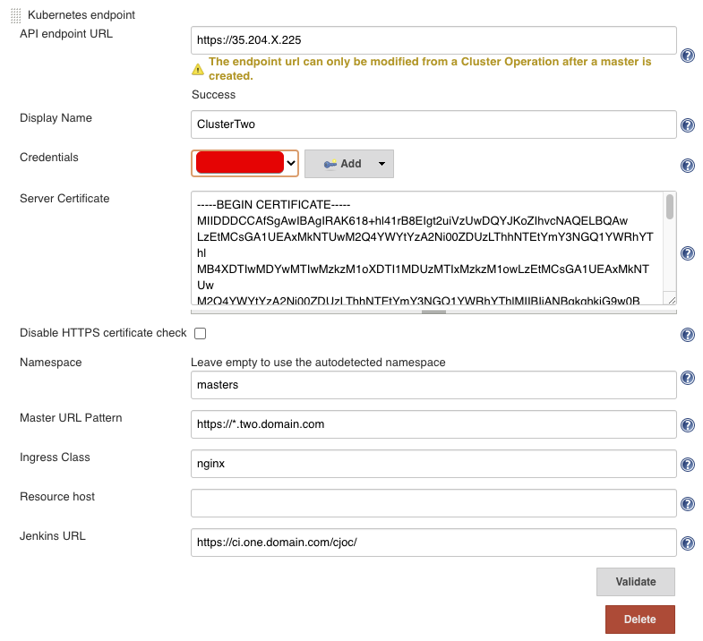

title: CloudBees CI - Multi Cluster EKS
description: Multi Cluster setup with CloudBees CI on EKS

# CloudBees CI - Multi Cluster EKS

* https://medium.com/@Joachim8675309/building-eks-with-eksctl-799eeb3b0efd

To create and configure cluster one, we execute the following steps:

1. Create Cluster via EKSCTL
1. Create Route53 Hosted Zone
1. Install Bootstrapping services (certmanager, ingress controller, external dns)
1. Install CloudBees CI

## 1. Create Cluster via EKSCTL

For some tasks, you need create IAM access for the workloads.

There are various ways to do this, I urge you to explore those that are suitable to you.

For simplicity, you can let EKSCTL generate them for you on the node instances.
Be careful, as this means any Pod on these nodes can use the access.

For production clusters, you either want Service Account IAM access, or multiple node pools where workloads are restricted to node pools related to their level of required access.

[Read here](https://eksctl.io/usage/iam-policies/) more information on `eksctl` and IAM policies.

!!! note
    When using this example for Cluster Two, make sure to change the `metadata.name`.

!!! example "cluster.yaml"

    ```yaml
    apiVersion: eksctl.io/v1alpha5
    kind: ClusterConfig

    metadata:
      name: cluster-jvandergriendt
      region: us-east-1
      version: "1.15"
      tags: 
        CreatedBy: jvandergriendt

    nodeGroups:
      - name: ng1-masters
        instanceType: m5.large
        minSize: 3
        maxSize: 8
        volumeSize: 100
        volumeType: gp2
        labels:
          nodegroup-type: masters
        iam:
          withAddonPolicies:
          autoScaler: true
          externalDNS: true
          certManager: true
          ebs: true

    availabilityZones: ["us-east-1d", "us-east-1f"]
    ```

=== "Setup Profile"
    ```bash
    AWS_PROFILE=cloudbees-iam
    AWS_ROLE_ARN=
    ```
=== "Create Cluster"
    ```sh
    eksctl create cluster  --config-file cluster.yaml --profile cloudbees-eks
    ```


## Create Route53 Hosted Zone

* via the UI: https://docs.aws.amazon.com/Route53/latest/DeveloperGuide/CreatingHostedZone.html
* Via CLI: https://docs.aws.amazon.com/cli/latest/reference/route53/create-hosted-zone.html

## 3. Install Bootstrapping services

### Nginx

=== "Add Helm Repo"
    ```sh
    helm repo add ingress-nginx https://kubernetes.github.io/ingress-nginx
    ```
=== "Update Helm repositories
    ```sh
    helm repo update
    ```
=== "Helm Install Cluster One"
    ```sh
    helm install ingress ingress-nginx/ingress-nginx -f ingress-values-c1.yaml
    ```
=== "Helm Install Cluster Two"
    ```sh
    helm install ingress ingress-nginx/ingress-nginx -f ingress-values-c2.yaml
    ```

!!! example "ingress-values-c1.yaml"

    ```yaml
    service:
        omitClusterIP: true
    controller:
      tcp:
        configMapNamespace: default
      autoscaling:
        enabled: true
        minReplicas: 3
        maxReplicas: 7
      publishService:
        enabled: true
      metrics:
        enabled: true
    tcp: 
      50000: "cloudbees-ci/cjoc:50000"
    ```
!!! example "ingress-values-c2.yaml"

    ```yaml
    service:
        omitClusterIP: true
    controller:
      tcp:
        configMapNamespace: default
      autoscaling:
        enabled: true
        minReplicas: 3
        maxReplicas: 7
      publishService:
        enabled: true
      metrics:
        enabled: true
    ```

### External DNS

* https://github.com/kubernetes-sigs/external-dns/blob/master/docs/tutorials/aws.md
* https://github.com/helm/charts/tree/master/stable/external-dns
* https://github.com/bitnami/charts/tree/master/bitnami/external-dns
* https://github.com/bitnami/charts/tree/master/bitnami/external-dns#tutorials

=== "Add Helm Chart Repo"
    ```sh
    helm repo add bitnami https://charts.bitnami.com/bitnami
    ```
=== "Update Helm Repos"
    ```sh
    helm repo update
    ```
=== "Helm Install w/ values"
    ```sh
    helm install exdns bitnami/external-dns -f exdns-values.yaml
    ```
=== "Helm Install w/ set"
    ```sh
    helm install my-release \
      --set provider=aws \
      --set aws.zoneType=public \
      --set txtOwnerId=HOSTED_ZONE_IDENTIFIER \
      --set domainFilters[0]=HOSTED_ZONE_NAME \
      bitnami/external-dns
    ```

!!! example "exdns-values.yaml"

    ```yaml
    provider: aws
    domainFilters:
      - "eks.kearos.net"
    metrics:
      enabled: true
    aws:
      zoneType: public
    txtOwnerId: HOSTED_ZONE_IDENTIFIER
    ```

#### Apply Policy

!!! caution
    If you have already configured the policies in the `cluster.yaml`, you do **not** need to do this step.

    The documentation warns not to use this policy, as it gives every Pod in the cluster the ability to update Route53 records of the specified hostedzone (by default all, `*`).

```sh
aws iam put-role-policy  --region us-east-1 --profile cloudbees-eks \
    --role-name ${ROLE} \
    --policy-name eks-jvandergriendt1-ExdnsPolicy \
    --policy-document file://exdns-policy.json
```

!!! example "exdns-policy.json"

    * https://awspolicygen.s3.amazonaws.com/policygen.html

    ```json
    {
      "Version": "2012-10-17",
      "Statement": [
        {
          "Sid": "Stmt1591221999371",
          "Action": [
            "route53:ChangeResourceRecordSets"
          ],
          "Effect": "Allow",
          "Resource": "arn:aws:route53:::hostedzone/*"
        },
        {
          "Sid": "Stmt1591222034162",
          "Action": [
            "route53:ListHostedZones",
            "route53:ListResourceRecordSets",
            "route53:GetChange"
          ],
          "Effect": "Allow",
          "Resource": "*"
        }
      ]
    }
    ```

### Certmanager

=== "Add Helm Repo"
    ```sh
    helm repo add jetstack https://charts.jetstack.io
    ```
=== "Helm Repo Update"
    ```sh
    helm repo update
    ```
=== "Install CRDs"
    ```sh
    kubectl apply \
       --validate=false \
       -f https://github.com/jetstack/cert-manager/releases/download/v0.15.1/cert-manager.crds.yaml
    ```
=== "Create Namespace"
    ```sh
    # certmanager expects to run in `cert-manager` namespace
    kubectl create namespace cert-manager
    ```
=== "Helm Install"
    ```sh
    helm install cert-manager jetstack/cert-manager \
      --namespace cert-manager \
      -f certmanager-values.yaml
    ```
=== "Install ClusterIssuer"
    ```sh
    kubectl apply -f cluster-issuer.yaml
    ```

!!! example "certmanager-values.yaml"

    ```yaml
    prometheus:
      enabled: true
    ingressShim:
      defaultIssuerName: letsencrypt-prod
      defaultIssuerKind: ClusterIssuer
    ```

!!! example "cluster-issuer.yaml"

    * https://cert-manager.io/docs/configuration/acme/dns01/route53/

    ```yaml
    apiVersion: cert-manager.io/v1alpha2
    kind: ClusterIssuer
    metadata:
      name: letsencrypt-prod
    spec:
      acme:
        email: joostvdg@gmail.com
        privateKeySecretRef:
          name: letsencrypt-prod
        server: https://acme-v02.api.letsencrypt.org/directory
        solvers:
        # example: cross-account zone management for example.com
        # this solver uses ambient credentials (i.e. inferred from the environment or EC2 Metadata Service)
        # to assume a role in a different account
        - selector:
            dnsZones:
              - "example.com"
          dns01:
            route53:
              region: us-east-1
              hostedZoneID: DIKER8JEXAMPLE 
    ```

## 4. Install CloudBees CI

=== "Create Namespace"
    ```sh
    kubectl create namespace cloudbees-ci
    ```
=== "Helm Install"
    ```sh
    helm install cloudbees-ci cloudbees/cloudbees-core \
       -f cloudbees-ci-values.yaml \
       --namespace cloudbees-ci \
        --version 3.14.0+ebfb4625ad50
    ```

!!! example "cloudbees-ci-values.yaml"

    ```yaml
    OperationsCenter:
      HostName: ci.eks.kearos.net
      Ingress:
        Annotations:
          cert-manager.io/cluster-issuer: letsencrypt-prod
        tls:
          Enable: true
          Host: ci.eks.kearos.net
          SecretName: tls-ci-eks-kearos-net-p
      ServiceType: ClusterIP
    ```

## Prepare Cluster Two Access

First, follow step 1, 2 and 3 in the previous chapter but now for the second cluster.

Then, come back and continue with the next steps below.

### Create & Prepare Namespace

=== "Create Namespace"
    ```sh
    kubectl create namespace masters
    ```
=== "Fetch Helm Chart"
    ```sh
    helm fetch cloudbees/cloudbees-core --untar
    ```
=== "Generate Namespace Manifests"
    ```sh
    helm template cloudbees-core-masters-masters cloudbees-core \
       --namespace masters \
       -f namespace-masters-values.yaml \
       > namespace-masters.yaml
    ```
=== "Apply Namespace Manifests"
    ```sh
    kubectl apply -f namespace-masters.yaml \
      --namespace masters
    ```

!!! Caution
    Make sure you are executing the steps on Cluster Two!

!!! example "namespace-masters-values.yaml"

    ```yaml
    OperationsCenter:
        Enabled: false
    Master:
        Enabled: true
        OperationsCenterNamespace: masters
    Agents:
        Enabled: true
    ```

## Create Managed Master in both clusters

1. Configure Operations Center with Access To EKS Cluster Two
1. Create second Kubernetes endpoint configuration
1. Create Managed Master in Cluster One
1. Create Managed Master in Cluster Two

### Configure Operations Center with Access To EKS Cluster Two

This is complicated, there are various ways of getting access.
These all depend on IAM controls and the policies that exist within your organization.

### AWS IAM Authenticator

For more information, you can [read this PR on the Jenkins Kubernetes Plugin](https://github.com/jenkinsci/kubernetes-plugin/pull/548). And [here](https://docs.aws.amazon.com/eks/latest/userguide/install-aws-iam-authenticator.html) for downloading the `aws-iam-authenticator` binary for the target platform.

A set of steps that can work is the following:

```sh
curl -o aws-iam-authenticator https://amazon-eks.s3.us-west-2.amazonaws.com/1.16.8/2020-04-16/bin/linux/amd64/aws-iam-authenticator
```

```sh
chmod +x ./aws-iam-authenticator
```

```sh
kubectl cp aws-iam-authenticator cjoc-0:/var/jenkins_home/bin
```

Then, you have to update the StatefulSet of Operations Center to include `/var/jenkins_home/bin` in the `PATH`.

You can add the snippet below to the `cloudbees-ci.yaml` and run a `helm upgrade cloudbees-ci ...` command (the same as the `helm install` but replace `install` with `upgrade`).

```yaml
ContainerEnv:
  - name: PATH
    value: "/usr/local/sbin:/usr/local/bin:/usr/sbin:/usr/bin:/sbin:/bin:/var/jenkins_home/bin"
```

Then, you create a `kubeconfig` file with the information for the EKS cluster, see below.
And add this as a `secret file` credential to Operations Center's credentials.
Use this credential in the `Kubernetes Master Provision`'s Endpoint for Cluster Two.

!!! example "kubeconfig"

    ```yaml
    clusters:
    - cluster:
        certificate-authority-data: <redacted>
        server: <redacted>
      name: <redacted>
    contexts:
    - context:
        cluster: <redacted>
        user: <redacted>
      name: <redacted>
    current-context: <redacted>
    kind: Config
    preferences: {}
    users:
    - name: <redacted>
      user:
        exec:
          apiVersion: client.authentication.k8s.io/v1alpha1
          env:
            - name: AWS_ACCESS_KEY
              value: <redacted>
            - name: AWS_SECRET_ACCESS_KEY
              value: <redacted>
          args:
          - token
          - -i
          - eks-cluster-name
          command: aws-iam-authenticator
    ```

### Create second Kubernetes endpoint configuration

Now we create a second Kubernetes Endpoint in the cluster.

The fields to fill in:

1. **API endpoint URL**: the cluster endpoint of Cluster Two
2. **Display Name**: display name so you know which cluster you create a Master in
3. **Credentials**: the credentials you created for IAM access to Cluster Two
4. **Server Certificate**: the server certificate of Cluster Two
5. **Namespace**: the namespace you have prepared, in our case `masters`
6. **Master URL Pattern**: the DNS pattern for Cluster Two, in our case `https://*.two.domain.com`
7. **Ingress Class**: unless you used a different Ingress than in this guide, set to `nginx`
8. **Jenkins URL**: the external URL of the Operations Center

!!! info
    If you don't know the API Endpoint or the Server Certificate, you can retrieve this from your `~/.kube/config` file.
    Assuming you have access to Cluster Two, you will the details of the cluster there.

    For the Server Certificate, you have to Base64 decode this. You can do so on mac/linux by echo + pipe into `base64`.

    For example, on a mac:

    ```sh
    echo "kjhKJSDH13123" | base64 -D
    ```



#### Update Master Provisioning

* `Manage Jenkins` -> `Configure System` -> `Kubernetes Master Provisioning` -> `Advanced` -> `YAML`

!!! example "YAML field"

    ```yaml
    apiVersion: "extensions/v1beta1"
    kind: "Ingress"
    metadata:
      annotations:
        cert-manager.io/cluster-issuer: letsencrypt-prod
    spec:
      tls:
      - hosts:
        - ${host}
        secretName: ${secretName}
    ```

## Cleanup

* https://eksworkshop.com/920_cleanup/eksctl/

For each cluster, we can now run the `eksctl` cleanup.

```sh
eksctl delete cluster -f cluster.yaml --wait
```

!!! important

    If you attached any policies to the nodes, you have to remove them first!

    Else you get this error:

    ```sh
    AWS::IAM::Role/NodeInstanceRole: DELETE_FAILED – "Cannot delete entity, must delete policies first. (Service: AmazonIdentityManagement; Status Code: 409;
    ```

    To do so, you can use `aws iam delete-role-policy`.

    ```sh
    aws iam delete-role-policy --region ${REGION} --profile ${PROFILE} \
        --role-name ${ROLE_NAME} \
        --policy-name ${CLUSTER_NAME}-ExdnsPolicy 
    ```
