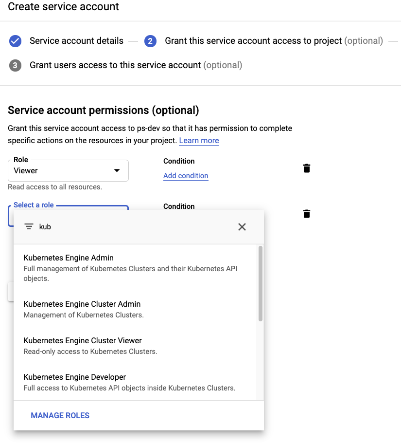
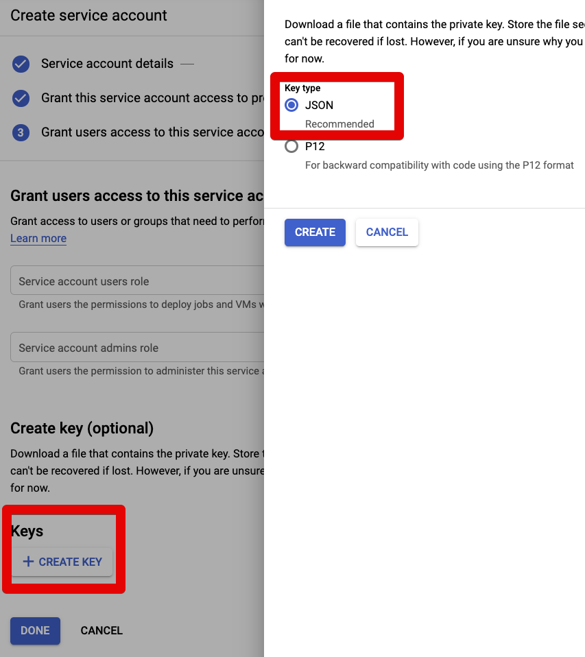
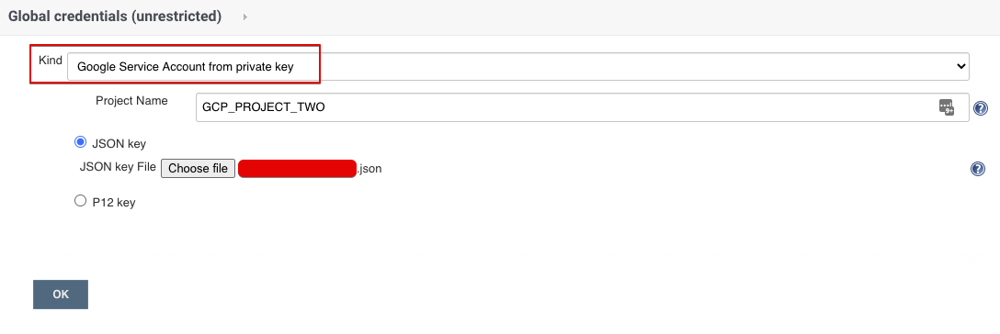
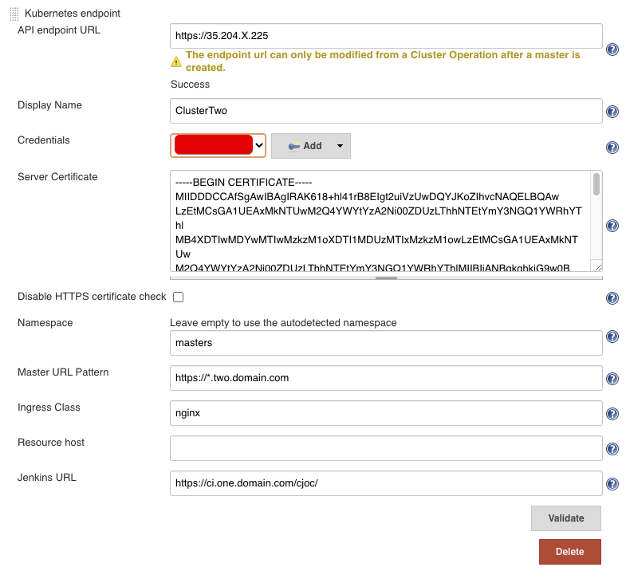
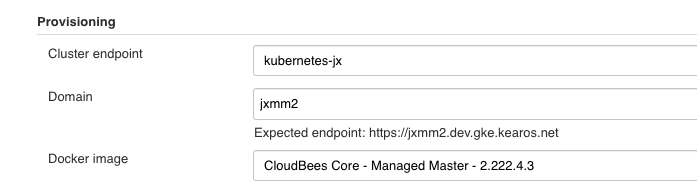

title: CloudBees CI - Multi Cluster GKE
description: Multi Cluster setup with CloudBees CI on GKE

# CloudBees CI - Multi Cluster GKE

Imagine you have a whole range of departments and development teams. Preferably you want to serve them with a standardized SDA(Software Delivery Automation) platform, but at the same time, make sure they pay for their usage.

I don't think this is too far fetched or something terrible. I think it makes sense. In this light, CloudBees Core now [supports running on multiple Kubernetes clusters](https://docs.cloudbees.com/docs/cloudbees-core/latest/cloud-admin-guide/multiple-clusters).

In this guide, we're going to explore how to run CloudBees Core on two GKE cluster at the same time. And how to deal with the details of getting the namespace configured, certificates, Kubernetes API tokens and so on and so forth.

## Prerequisites

* The ability to create two GKE clusters
* CloudDNS enabled
* valid domain name

## Steps to do

High over, we have to do the following steps:

* create and configure GKE cluster One
    * create GCP service account for accessing CloudDNS
        * this is per GCP Project, if cluster two is in another project, repeat this
    * install Operations Center
* create and configure GKE cluster Two
    * create GCP service account for accessing GKE
* create a Managed Master in both clusters
    * configure Operations Center
    * create managed masters

## Create and Configure Cluster One

The easiest way to create _and_ manage a cluster is with Terraform.

!!! note

    I will use `GCP_PROJECT_ONE` and `one.domain.com` as placeholders for the Google Project ID and domain name respectively. You will need to change these to reflect your configuration.

    The assumption in this guide is that the clusters are in two different projects. This doesn't have to be so be, so feel free to use the same project id and domain name for both clusters.

To create and configure cluster one, we execute the following steps:

1. Create Cluster With Terraform
1. Create Cloud DNS Zone
1. Install Bootstrapping services (certmanager, ingress controller, external dns)
1. Install CloudBees CI
1. Configure External Access

### 1. Create Cluster With Terraform

We create four files:

* `main.tf` containing the provider information
* `variables.tf` containg the variables (and their defaults)
* `cluster.tf` cluster definition
* `nodepool.tf`houses our node pool definition, currently one, but should be easy to add more if desired

#### Main

!!! example "main.tf"

    ```terraform
    terraform {
      required_version = "~> 0.12"
    }

    # https://www.terraform.io/docs/providers/google/index.html
    provider "google" {
      version   = "~> 2.18.1"
      project   = var.project
      region    = var.location
    }
    ```

#### Variables

!!! example "variables.tf"

    ```terraform
    variable "project" { }

    variable "name" {
      description = "The name of the cluster (required)"
      default     = "jvandergriendt_cluster_one"
    }

    variable "description" {
      description = "The description of the cluster"
      default     = "CloudBees CI environment for jvandergriendt"
    }

    variable "location" {
      description = "The location to host the cluster"
      default     = "europe-west4"
    }

    variable "cluster_master_version" {
      description = "The minimum kubernetes version for the master nodes"
      default     = "1.15.9-gke.8"
    }

    variable "np1count" {
      description = "The initial Node Count for NodePool 2"
      default     = 1
    }

    variable "np1machinetype" {
      description = "GCP Machine Type for Nodepool 1"
      default     = "e2-standard-2"
    }
    ```

#### Cluster

!!! example "cluster.tf"

    ```terraform
    resource "google_container_cluster" "primary" {
      name        = var.name
      location    = var.location

      # We can't create a cluster with no node pool defined, but we want to only use
      # separately managed node pools. So we create the smallest possible default
      # node pool and immediately delete it.
      remove_default_node_pool  = true
      initial_node_count        = 1
      resource_labels           = {
        environment = "development"
        created-by  = "terraform"
        cb-owner    = "professional-services"
      }

      # Configuration options for the NetworkPolicy feature.
      network_policy {
        # Whether network policy is enabled on the cluster. Defaults to false.
        # In GKE this also enables the ip masquerade agent
        # https://cloud.google.com/kubernetes-engine/docs/how-to/ip-masquerade-agent
        enabled = true

        # The selected network policy provider. Defaults to PROVIDER_UNSPECIFIED.
        provider = "CALICO"
      }
    }
    ```

#### Nodepools

!!! example "nodepool.tf"

    ```terraform
    resource "google_container_node_pool" "nodepool1" {
      name       = "pool1"
      location   = var.location
      cluster    = google_container_cluster.primary.name
      node_count = var.np1count

      management {
        auto_repair  = true
        auto_upgrade = true
      }

      autoscaling {
        min_node_count = 2
        max_node_count = 5
      }

      node_config {
        machine_type = var.np1machinetype
        oauth_scopes = [
          "https://www.googleapis.com/auth/compute",
          "https://www.googleapis.com/auth/devstorage.read_only",
          "https://www.googleapis.com/auth/logging.write",
          "https://www.googleapis.com/auth/monitoring",
          "https://www.googleapis.com/auth/ndev.clouddns.readwrite",
          "https://www.googleapis.com/auth/cloud-platform"
        ]
      }
    }
    ```

#### Execute Terraform Steps

=== "Terraform init"
    ```sh
    terraform init
    ```
=== "Terraform plan"
    ```sh
    terraform plan -out plan.out
    ```
=== "Terraform apply"
    ```sh
    terraform apply "plan.out"
    ```

### 2. Create Cloud DNS Zone

#### Gcloud

```sh
gcloud dns managed-zones create one-domain-com --dns-name one.domain.com. \
      --description "Example DNS zone"
```

#### Terraform

!!! example "main.tf"

    ```terraform
    resource "google_dns_managed_zone" "one-domain-com" {
      name        = "one-domain-com"
      dns_name    = "one.domain.com."
      description = "Example DNS zone"
      labels = {
        foo = "bar"
      }
    }
    ```

#### Create GCP Service Account for accessing Cloud DNS

##### UI

In GCP's IAM/service Account screen, create a new Service Account.

Give the service account two roles:

* Project Viewer
* DNS Admin

Once done, create a JSON key and download this.
Rename the file to `credentials.json`.

##### Gcloud

=== "Create SA"
    ```sh
    gcloud iam service-accounts create sa-name \
        --description="sa-description" \
        --display-name="sa-display-name"
    ```
=== "Give SA Project Permission"
    ```sh
    gcloud projects add-iam-policy-binding my-project-123 \
        --member serviceAccount:my-sa-123@my-project-123.iam.gserviceaccount.com \
        --role roles/viewer
    ```
=== "Give CloudDNS Permission"
    ```sh
    gcloud projects add-iam-policy-binding my-project-123 \
        --member serviceAccount:my-sa-123@my-project-123.iam.gserviceaccount.com \
        --role roles/dns.admin
    ```
=== "Generate JSON Key"
    ```sh
    gcloud iam service-accounts keys create ~key.json \
      --iam-account <YOUR-SA-NAME>>@project-id.iam.gserviceaccount.com
    ```

#### Configure Credentials In Cluster

Create the Kubernetes namespace `bootstrap` and add the credentials to the namespace.

```sh
kubectl create namespace bootstrap
```

```sh
kubectl create secret generic external-dns-gcp-sa --from-file=credentials.json -n bootstrap
```

### 3. Install Bootstrapping

#### Nginx Ingress

!!! important
    We assume Cluster One will be the cluster hosting Operations Center.

    This means Cluster One needs to expose the port `50000` via the LoadBalancer.
    Nginx can do this automatically, if we add a `tcp` configuration in the `values.yaml`.

    Cluster Two should _not_ get this configuration as it will throw errors and polute your Nginx Ingress Controller logs.
    So be mindful that there are two different files and two different commands.

=== "Add Helm Repo"
    ```sh
    helm repo add ingress-nginx https://kubernetes.github.io/ingress-nginx
    ```
=== "Update Helm repositories
    ```sh
    helm repo update
    ```
=== "Helm Install Cluster One"
    ```sh
    helm install ingress ingress-nginx/ingress-nginx -f ingress-values-c1.yaml
    ```
=== "Helm Install Cluster Two"
    ```sh
    helm install ingress ingress-nginx/ingress-nginx -f ingress-values-c2.yaml
    ```

!!! example "ingress-values-c1.yaml"

    ```yaml
    service:
        omitClusterIP: true
    controller:
      tcp:
        configMapNamespace: default
      autoscaling:
        enabled: true
        minReplicas: 3
        maxReplicas: 7
      publishService:
        enabled: true
      metrics:
        enabled: true
    tcp: 
      50000: "cloudbees-ci/cjoc:50000"
    ```

!!! example "ingress-values-c2.yaml"

    ```yaml
    service:
        omitClusterIP: true
    controller:
      tcp:
        configMapNamespace: default
      autoscaling:
        enabled: true
        minReplicas: 3
        maxReplicas: 7
      publishService:
        enabled: true
      metrics:
        enabled: true
    ```

#### Certmanager

=== "Install Repository"
    ```sh
    helm repo add jetstack https://charts.jetstack.io
    ```
=== "Update Helm Repositories"
    ```sh
    helm repo update
    ```
=== "Install Certmanager chart"
    ```sh
    helm install certmanager jetstack/cert-manager \
      -f certmanager-values.yaml \
      -n bootstrap \
       --version v0.15.1 \
       --set installCRDs=true
    ```

!!! example "certmanager-values.yaml"

    ```yaml
    prometheus:
      enabled: true
    ingressShim:
      defaultIssuerName: letsencrypt-prod
      defaultIssuerKind: ClusterIssuer
    ```

!!! example "cluster-issuer.yaml"

    ```yaml
    apiVersion: cert-manager.io/v1alpha2
    kind: ClusterIssuer
    metadata:
      name: letsencrypt-prod
    spec:
      acme:
        email: joostvdg@gmail.com
        privateKeySecretRef:
          name: letsencrypt-prod
        server: https://acme-v02.api.letsencrypt.org/directory
        solvers:
        - dns01:
            clouddns:
              project: GCP_PROJECT_ONE
              serviceAccountSecretRef:
                key: credentials.json
                name: external-dns-gcp-sa
    ```

```sh
kubectl apply -f cluster-issuer.yaml
```

#### External DNS Controller


!!! example "extdns-values.yaml"

    ```yaml
    provider: google
    domainFilters:
      - "one.domain.com"
    metrics:
      enabled: true
    google:
      project: GCP_PROJECT_ONE
      serviceAccountSecret: external-dns-gcp-sa
    ```

### 4. Install CloudBees CI


!!! example "cloudbees-ci-values.yaml"

    ```yaml
    OperationsCenter:
      HostName: ci.one.domain.com
      Ingress:
        tls:
          Enable: true
          Host: ci.dev.jxgke.kearos.net
          SecretName: tls-dev-jxgke-kearos-net-p
      ServiceType: ClusterIP
    ```

=== "Add Helm Repo"
    ```sh
    helm repo add cloudbees https://charts.cloudbees.com/public/cloudbees
    ```
=== "Update Helm Repos"
    ```sh
    helm repo update
    ```
=== "Create Namespace"
    ```sh
    kubectl create namespace cloudbees-ci
    ```
=== "Helm Install"
    ```sh
    helm install cloudbees-ci cloudbees/cloudbees-core \
      -f cloudbees-ci-values.yaml \
      --namespace cloudbees-ci \
      --version 3.14.0+ebfb4625ad50
    ```

### 5. Manually Configure External Access

!!! caution
    This configuration is only required if you do not use the Nginx Ingress Helm Chart.

    If you do, this is already configured for you [in the Nginx Ingress paragraph earlier](/cloudbees/multi-cluster-gke/#nginx-ingress).

    If you're curious how to configure this _manually_, read on!

To allow Master to connect back to Operations Center from another cluster, two ports must be open, `443` (or `80` if no TLS) and `50000` (if you've kept the default).

For this we enable `tcp-services` and configure the `50000` port on the *deployment* and *service* (Kubernetes resources) of our Nginx Ingress.

How to change the Nginx Ingress configuration depends on how you've installed it. For sake of brevity, I will simply edit the resources via a `kubectl edit` (hint: don't do this in production).

#### TCP Services ConfigMap

To enable the TCP services, we need to take three steps:

* create a config map with the configuration
* enable tcp services in the deployment and point to the configmap
* update the service to listen to port `50000`

!!! example "nginx-config-map.yaml"

    ```yaml
    apiVersion: v1
    kind: ConfigMap
    metadata:
      name: tcp-services
      namespace: kube-system
    data:
      50000: cloudbees-ci/cjoc:50000"
    ```

!!! info
	  `cloudbees-ci` is the namespace my CJOC runs in.
  
    Change this if your CJOC runs elsewhere.

```bash
kubectl apply -f nginx-config-map.yaml
```

#### Update Nginx Deployment

Once this is done, we can edit the controller's deployment.

We have to make two changes:

* add the tcp-services coniguration
* add the port `50000` configuration

```bash
kubectl -n ${NAMESPACE} edit deployment nginx-ingress-controller
```

Among the container args, we add `--tcp-services-configmap`.

```yaml
    spec:
      containers:
      - args:
        - /nginx-ingress-controller
        ...
        - --tcp-services-configmap=kube-system/tcp-services
```

Next, we edit the same deployment, and add the tcp port.

We will add the 50000 to the container ports.

```yaml
        - containerPort: 50000
          name: jnlp
          protocol: TCP
```

It will then look something like this.

```yaml
        ports:
        - containerPort: 80
          name: http
          protocol: TCP
        - containerPort: 443
          name: https
          protocol: TCP
        - containerPort: 50000
          name: jnlp
          protocol: TCP
```

#### Update Nginx Service

Last but not least, we also have to update the Nginx Ingress *service* resource.

```bash
kubectl -n $NAMESPACE edit svc nginx-ingress-controller
```

We add a similar port definition.

```yaml
  - name: jnlp
    nodePort: 31559
    port: 50000
    protocol: TCP
    targetPort: jnlp
```

Which will then look something like this (clusterIp and nodePort's will be different).

```yaml
spec:
  clusterIP: .....
  externalTrafficPolicy: Cluster
  ports:
  - name: http
    nodePort: 31406
    port: 80
    protocol: TCP
    targetPort: http
  - name: https
    nodePort: 30391
    port: 443
    protocol: TCP
    targetPort: https
  - name: jnlp
    nodePort: 31559
    port: 50000
    protocol: TCP
    targetPort: jnlp
```

## Create and Configure ClusterTwo

Creating Cluster Two is similar to the creation of Cluster One.
We re-use some steps of the Creation Cluster One segment, and below are the new steps.
Do ensure to replace the placeholders for the cluster name, project id, and domain with the appropriate values for Cluster Two.

To create and configure Cluster Two, we execute the following steps:

1. Create Cluster With Terraform [see step 1](#1-create-cluster-with-terraform)
1. Create Cloud DNS Zone [see step 2](#2-create-cloud-dns-zone)
1. Install Bootstrapping services [see step 3](#3-install-bootstrapping)
1. Create GCP service account for accessing GKE
1. Configure Receiving Namespace

### 4. Create GCP service account for accessing GKE

#### UI

Open the _Hamburger Menu_ on the top left, and select `IAM & Admin` --> `Service Accounts` -> `CREATE SERVICE ACCOUNT` (top middle).

Give it a descriptive name and two roles:

* `Project / Viewer`
* `Kubernetes Engine Cluster Admin` (or, `Kubernetes Engine Developer`)



Then hit the `+ CREATE KEY` button, and select (and download) the JSON key.



#### Gcloud

If you prefer to create the SA via [Gcloud](https://cloud.google.com/sdk/) CLI:

=== "Create SA"
    ```sh
    gcloud iam service-accounts create sa-name \
        --description="sa-description" \
        --display-name="sa-display-name"
    ```
=== "Give SA Project Permission"
    ```sh
    gcloud projects add-iam-policy-binding my-project-123 \
        --member serviceAccount:my-sa-123@my-project-123.iam.gserviceaccount.com \
        --role roles/viewer
    ```
=== "Give GKE Permission"
    ```sh
    gcloud projects add-iam-policy-binding my-project-123 \
        --member serviceAccount:my-sa-123@my-project-123.iam.gserviceaccount.com \
        --role roles/container.clusterAdmin # or roles/container.developer
    ```
=== "Generate JSON Key"
    ```sh
    gcloud iam service-accounts keys create ~key.json \
      --iam-account <YOUR-SA-NAME>>@project-id.iam.gserviceaccount.com
    ```

Read [Google Cloud's](https://cloud.google.com/iam/docs/understanding-roles#predefined_roles) documentation on Roles for further information.

### 5. Configure Receiving Namespace

#### Prepare Namespace

=== "Create Namespace"
    ```sh
    kubectl create namespace masters
    ```
=== "Fetch Helm Chart"
    ```sh
    helm fetch cloudbees/cloudbees-core --untar
    ```
=== "Generate Namespace Manifests"
    ```sh
    helm template cloudbees-core-masters-masters cloudbees-core \
       --namespace masters \
       -f namespace-masters-values.yaml \
       > namespace-masters.yaml
    ```
=== "Apply Namespace Manifests"
    ```sh
    kubectl apply -f namespace-masters.yaml \
      --namespace masters
    ```

!!! Caution
    Make sure you are executing the steps on Cluster Two!

!!! example "namespace-masters-values.yaml"

    ```yaml
    OperationsCenter:
        Enabled: false
    Master:
        Enabled: true
        OperationsCenterNamespace: masters
    Agents:
        Enabled: true
    ```

#### Give User Admin Rights

I'm not sure if you can figure out the user id upfront.
When you create a Master in this cluster, you'll likely see an error that `user 98389745879 has no permission` to create certain resources, such as the StatefulSet.

Run the command below to give this user permission to create these Kubernetes resources.

```sh
kubectl create clusterrolebinding clusterrolebinding-name \
--clusterrole cluster-admin \
--user $USER_ID
```

If you don't know the user id of your GCP Service Account, go ahead with the next chapter.
We refer back to this paragraph.

## Create Managed Master in both clusters

1. Create CloudBees CI Credential with GCP Service Account
1. Create second Kubernetes endpoint configuration
1. Create Managed Master in Cluster One
1. Create Managed Master in Cluster Two

### Create CloudBees CI Credential with GCP Service Account

This requires that you've created the GCP Service Account with access to GKE and generated the JSON Key.

You can then upload this JSON Key as a credential to CloudBees CI via the Credentials kind `Google Service Account from private key`.



### Create second Kubernetes endpoint configuration

Now we create a second Kubernetes Endpoint in the cluster.

The fields to fill in:

1. **API endpoint URL**: the cluster endpoint of Cluster Two
2. **Display Name**: display name so you know which cluster you create a Master in
3. **Credentials**: the credentials we create in [#Create CloudBees CI Credential with GCP Service Account](#Create CloudBees CI Credential with GCP Service Account)
4. **Server Certificate**: the server certificate of Cluster Two
5. **Namespace**: the namespace you have prepared, in our case `masters`
6. **Master URL Pattern**: the DNS pattern for Cluster Two, in our case `https://*.two.domain.com`
7. **Ingress Class**: unless you used a different Ingress than in this guide, set to `nginx`
8. **Jenkins URL**: the external URL of the Operations Center

!!! info
    If you don't know the API Endpoint or the Server Certificate, you can retrieve this from your `~/.kube/config` file.
    Assuming you have access to Cluster Two, you will the details of the cluster there.

    For the Server Certificate, you have to Base64 decode this. You can do so on mac/linux by echo + pipe into `base64`.

    For example, on a mac:

    ```sh
    echo "kjhKJSDH13123" | base64 -D
    ```



### Create Managed Masters

To enable automatic TLS for the Masters in the clusters, you can either edit the Ingress when creating the Mater, or update the Kubernetes Master Provisioning before hand.

#### Update Master Provisioning

* `Manage Jenkins` -> `Configure System` -> `Kubernetes Master Provisioning` -> `Advanced` -> `YAML`

!!! example "YAML field"

    ```yaml
    apiVersion: "extensions/v1beta1"
    kind: "Ingress"
    metadata:
      annotations:
        cert-manager.io/cluster-issuer: letsencrypt-prod
    spec:
      tls:
      - hosts:
        - ${host}
        secretName: ${secretName}
    ```

#### Creating Master

In the top right corner, there's a button "New Master", push it and give your master a name.

In the field `Cluster Endpoint`, select the one for Cluster Two.
Confirm the URL has the correct domain and hit save.



!!! info

    The process for creating a Master in Cluster One and Cluster Two are the same.
    The only difference is the Kubenernetes endpoint used.

#### Give User Permissions In Cluster Two

As discussed in the Create Cluster Two chapter, the paragraph [#Give User Admin Rights](/cloudbees/multi-cluster-gke/#give-user-admin-rights) explains how to do so.
