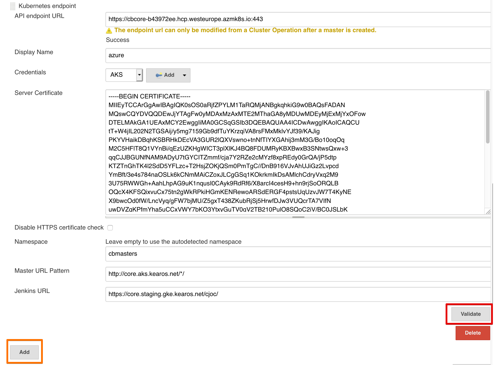
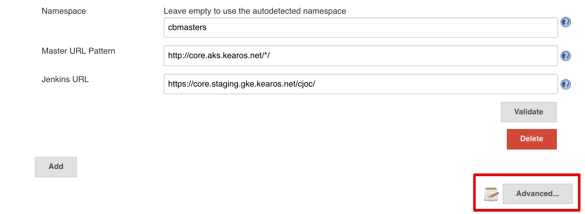
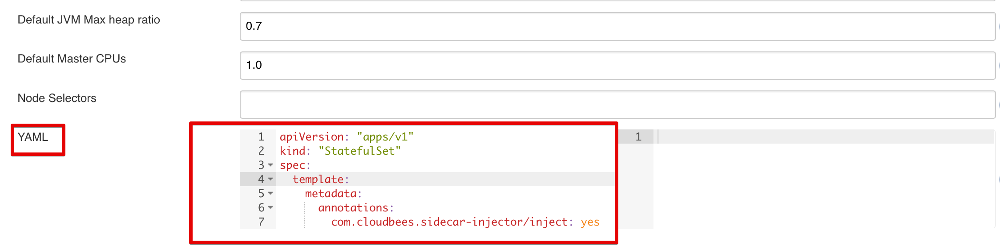
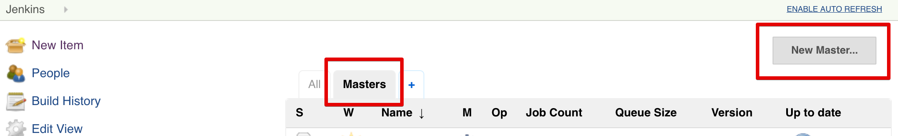
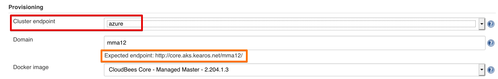
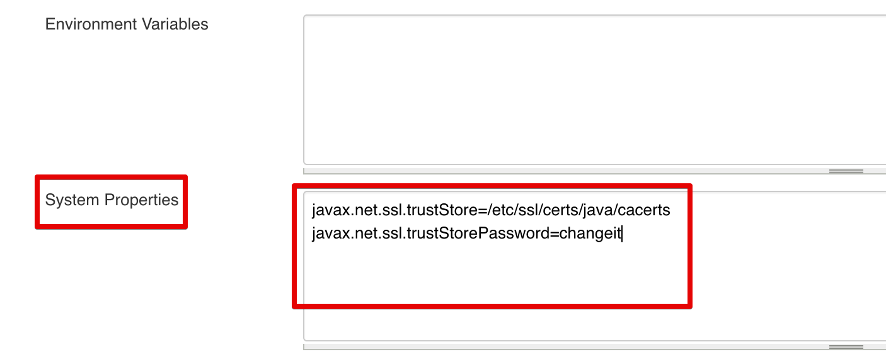

Imagine you have a whole range of departments and development teams. Preferably you want to serve them with a standardized SDA(Software Delivery Automation) platform, but at the same time, make sure they pay for their usage.

I don't think this is too far fetched or something terrible. I think it makes sense. In this light, CloudBees Core now [supports running on multiple Kubernetes clusters](https://docs.cloudbees.com/docs/cloudbees-core/latest/cloud-admin-guide/multiple-clusters). 

In this guide, we're going to explore how to run CloudBees Core on a GKE and AKS cluster at the same time. And how to deal with the details of getting the namespace configured, certificates, Kubernetes API tokens and so on and so forth.

## Prerequisites

First off, we need a [GKE cluster] (/kubernetes/distributions/gke-terraform/) and a [AKS cluster](/kubernetes/distributions/aks-terraform/).

Next, we make the GKE cluster the default one. Here we will install CloudBees Core. You can either install [CloudBees Core directly](/cloudbees/cbc-gke-helm/) or via [Jenkins X](/jenkinsx/aks-boot-core/#install-cloudbees-core).

You're also welcome to follow the [CloudBees documentation](https://docs.cloudbees.com/docs/cloudbees-core/latest/gke-install-guide/installing-gke-using-helm).

The expected state is that you access Operations Center via a proper DNS name with TLS enabled, served via Nginx Ingress. And the AKS cluster is ready to be used - but empty.

Some further assumptions:
you have admin rights on both clusters
the TLS certificate is from Let's Encrypt via Certmanager
the AKS cluster is empty
You can break these assumptions, but that means you have to change the examples to reflect your situation.

## Steps to do

High over, we have to do the following steps:

* tweak the GKE cluster
* configure the AKS cluster
* configure Operations Center
* create a Managed Master

## Tweak GKE Cluster

At this time of writing, Jenkins is suffering from an [outdated OpenSSL library](https://support.cloudbees.com/hc/en-us/articles/360019630132-Issue-connecting-External-Client-Master-with-TLS-setup-at-Ingress). This version doesn't support [SNI](https://en.wikipedia.org/wiki/Server_Name_Indication), which is what the [Nginx Ingress Controller](https://github.com/kubernetes/ingress-nginx/issues/4674#issuecomment-569493421) relies on.

When a Client Master (Managed or not) connects to the Operations Center via the Nginx Controller without SNI, the controller will not route you to the correct path. Because of this, when TLS is enabled, you will get the default controller's TLS certificate. As this certificate, by default, is an invalid one, you get TLS handshake errors.

We have to rectify this. There are many ways to do this. For example, you make the TLS certificate for Operations Center the default TLS certificate. While this might not be nice for other applications, it will suit our case.

!!! info
	If there are many other applications in the same cluster, consider having more than one Nginx Ingress Controller.

	Via the configuration parameters `controller.scope.enabled` and `controller.scope.namespace` , you can limit the controller to a single namespace. This way, you can configure the default TLS certificate only for the Ingress Controller that manages the Operations Center's namespace — limiting the effect of the workaround.

In addition to the change for the default certificate, we also need to make sure external Masters can connect to the Operations Center. They require two ports to be open, `443` (or `80` if no TLS) and `50000` (if you've kept the default). 

For this we enable `tcp-services` and configure the `50000` port on the *deployment* and *service* (Kubernetes resources).

How to change the Nginx Ingress configuration depends on how you've installed it. For sake of brevity, I will simply edit the resources via a `kubectl edit` (hint: don't do this in production).

### TCP Services

To enable the TCP services, we need to do two things:
* create a config map with the configuration
* enable tcp services in the deployment and point to the configmap

```yaml
# nginx-config-map.yaml
apiVersion: v1
kind: ConfigMap
metadata:
 name: tcp-services
 namespace: kube-system
data:
 50000: "<CJOC_NAMESPACE>/cjoc:50000"
```

!!! info
	Do replace `CJOC_NAMESPACE` with the actual namespace!

```bash
kubectl apply -f nginx-config-map.yaml
```

Once this is done, we can edit the controller's deployment.

We have to make two changes:
* add the tcp-services coniguration
* add the port `50000` configuration

```bash
kubectl -n ${NAMESPACE} edit deployment nginx-ingress-controller
```
Among the container args, we add `--tcp-services-configmap`.

```yaml
    spec:
      containers:
      - args:
        - /nginx-ingress-controller
        ...
        - --tcp-services-configmap=kube-system/tcp-services
```

Next, we edit the same deployment, and add the tcp port.

We will add the 50000 to the container ports.

```yaml
        - containerPort: 50000
          name: jnlp
          protocol: TCP
```

It will then look something like this.

```yaml
        ports:
        - containerPort: 80
          name: http
          protocol: TCP
        - containerPort: 443
          name: https
          protocol: TCP
        - containerPort: 50000
          name: jnlp
          protocol: TCP
```

Last but not least, we also have to update the Nginx Ingress *service*  resource.

```bash
kubectl -n $NAMESPACE edit svc nginx-ingress-controller
```

We add a similar port definition.

```yaml
  - name: jnlp
    nodePort: 31559
    port: 50000
    protocol: TCP
    targetPort: jnlp
```

Which will then look something like this (clusterIp and nodePort's will be different).

```yaml
spec:
  clusterIP: .....
  externalTrafficPolicy: Cluster
  ports:
  - name: http
    nodePort: 31406
    port: 80
    protocol: TCP
    targetPort: http
  - name: https
    nodePort: 30391
    port: 443
    protocol: TCP
    targetPort: https
  - name: jnlp
    nodePort: 31559
    port: 50000
    protocol: TCP
    targetPort: jnlp
```

### Set Default TLS Certificate

The first thing you'll have to do is to find out the name of the secret container the certificate. If you've created it yourself, great, else this is a way.

```bash
kubectl get certificate -A
```

The output should look like this:

```bash
NAMESPACE    NAME                           READY   SECRET                         AGE
jx-staging   tls-staging-gke-kearos-net-p   True    tls-staging-gke-kearos-net-p   4d
jx           tls-dev-gke-kearos-net-p       True    tls-dev-gke-kearos-net-p       15d
```

It should tell you which secret belongs to which certificate and in which namespace it resides. Note down both the secret name and the namespace.

!!! info
	Hint, the `-A` flag means `--all-namespaces` but then with less typing.

```bash
kubectl -n ${NAMESPACE} edit deployment nginx-ingress-controller
```
Among the container args, `- --default-ssl-certificate=<namespace>/<secretName>`.

And it should then look something like this:

```yaml
    spec:
      containers:
      - args:
        - /nginx-ingress-controller
	...
        - --default-ssl-certificate=default/tls-fake-kearos-net
```

## Configure AKS Cluster

We need to do the following steps:

* retrieve the Kubernetes API endpoint
* retrieve the Kubernetes API endpoint's certificate
* retrieve the service account token
* install an Ingress controller
* create & configure namespace for Managed Master(s)
* configure CloudBees Sidecar Injector

### Gather Kubernetes Credential & Certificate

If you haven't already retrieved the Kubernetes credentials for your AKS cluster, you can do so via the `az` or *AzureCLI*.

```bash
az aks get-credentials --resource-group ${AKS_RESOURCE_GROUP} --name ${AKS_CLUSTER_NAME}
```
All three parts that we need, the *Kubernetes API endpoint*,  *Kubernetes API endpoint's certificate*, *Service Account Token* will be added to our `.kubeconfig`. In my case, it is located at `~/.kube/config`.

* Kubernetes API endpoint: `cluster.server`
* Kubernetes API endpoint's certificate: `cluster.certificate-authority-data`
* Service Account Token: `users.user.token`

Mind you, the certificate is Base64 encoded. To decode, you can usually use a command line tool. 

```bash tab="macOs"
echo "LS0tLS1C....LS0tCg==" | base64 -D
```

The decoded thing should look like this:

```bash
-----BEGIN CERTIFICATE-----
MIIEyTCCArGgAwIBAgIQK0sOS0aRjfZPYLM1TaRQMjANBgkqhkiG9w0BAQsFADAN
..........
kKrPcnzV0gRdWNGNoJtRh9EGtKDP1VZUBiwdH44=
-----END CERTIFICATE-----
```

Save this into a `.pem` file, we're going to need it. Let's call it `aks-kubernetes-api-server.pem`.

### Install an Ingress controller

We're going to use Helm to install the Nginx Ingres Controller.

Let's start by creating a namespace for your ingress resources

```bash
kubectl create namespace ingress-nginx
```

Add the official stable repository, just to be sure.

```bash
helm repo add stable https://kubernetes-charts.storage.googleapis.com/
```

And update the helm repos.

```bash
helm repo update
```

Create a values file, `ingress-values.yaml`, we will need to change some values.

```yaml
rbac:
 create: true
defaultBackend:
 enabled: false
controller:
 ingressClass: "nginx"
 metrics:
   enabled: "true"
 replicaCount: 2
 nodeSelector: 
   beta\.kubernetes.io/os: linux 
 scope:
   enabled: "true"
   namespace: cbmasters
 service:
   externalTrafficPolicy: "Cluster"
```

```bash tab="Helm V3"
helm install nginx-ingress stable/nginx-ingress \
 --namespace ingress-nginx \
 --values ingress-values.yaml \
 --version 1.29.6
```

```bash tab="Helm V2"
helm install \
 --name nginx-ingress stable/nginx-ingress \
 --namespace ingress-nginx \
 --values ingress-values.yaml \
 --version 1.29.6
```

### Create & Configure Namespace

We're going to use a feature from the official CloudBees Core helm chart. We start by creating the namespace that will house our Managed Master(s).

```bash
NAMESPACE=
```

```bash
kubectl create namespace $NAMESPACE
```

Create a configuration for CloudBees Core Helm chart, called `cloudbees-values.yaml`. The namespace of the Operations Center doesn't really matter, it is in a different cluster anyway.

```yaml
OperationsCenter:
 Enabled: false
Master:
 Enabled: true
 OperationsCenterNamespace: cloudbees-core
Agents:
 Enabled: true
```

To be able to generate the Kubernetes resources files, we first have to use `helm fetch` to retrieve the chart.

```bash
helm fetch \
 --repo https://charts.cloudbees.com/public/cloudbees \
 --version 3.8.0+a0d07461ae1c \
 cloudbees-core
```

Now we can generate the Kubernetes resource definitions and store them as a single yaml file.

```bash
helm template cloudbees-core-namespace \
 cloudbees-core-3.8.0+a0d07461ae1c.tgz \
 -f cloudbees-values.yaml \
 --namespace ${NAMESPACE} \
 > cloudbees-core-namespace.yml
```

Which we then apply.

```bash
kubectl apply -f cloudbees-core-namespace.yml --namespace ${NAMESPACE}
```

### Configure CloudBees Sidecar Injector

Unfortunately, the Let's Encrypt Root CA certificates are not yet in the trust stores of our images. So we have to ensure they end up in the Masters we run in this (AKS) cluster, so they do not run into SSL errors. You can find the certificates on the  [certificates](https://letsencrypt.org/certificates/) page of letsencrypt.org.

Make sure to download and save the PEM of `ISRGRoot X1 (self-signed)`, `Let's Encrypt Authority X3 (IdenTrust Cross-signed)`, and `Let's Encrypt Authority X3 (Signed By ISRG Root X1)`.

Next, we have to add them to a bundle and a truststore, we can then put into a ConfigMap.

We first have retrieve the current bundle and truststore. We can get them from Operations Center via a `kubectl cp `. The process is described in the [CloudBees Cloud Admin Guide](https://docs.cloudbees.com/docs/cloudbees-core/latest/cloud-admin-guide/kubernetes-self-signed-certificates#_create_a_certificate_bundle). Unfortunately, it seems as of CloudBees Core 2.204.+ the location has changed. The new locations are below. 

```bash
kubectl cp cjoc-0:etc/pki/ca-trust/extracted/java/cacerts ca-bundle/cacerts
kubectl cp cjoc-0:etc/pki/ca-trust/extracted/pem/tls-ca-bundle.pem ca-bundle/ca-certificates.crt
```

Now that we have the files to start with, we can add our Let's Encrypt Root and Intermediary certificates.

This assumes we're in the folder `ca-bundle`.

```bash
cat valid-isrgrootx1-letsencrypt-org.pem >> ca-certificates.crt
keytool -import -noprompt -keystore cacerts -file valid-isrgrootx1-letsencrypt-org.pem -storepass changeit -alias letsencrypt;
```

We also have to add the `aks-kubernetes-api-server.pem` to ensure we can talk to the Kubernetes API Endpoint.

```bash
cat aks-kubernetes-api-server.pem >> ca-certificates.crt
keytool -import -noprompt -keystore cacerts -file aks-kubernetes-api-server.pem -storepass changeit -alias kubeapi;
```

!!! info
	If you use custom or self-signed certificates, the process is the same. Simply substitute the Let's Encrypt certificates mentioned by your own / your provider's.

This assumes we're in the folder `ca-bundle`.

```bash
kubectl create configmap --from-file=ca-certificates.crt,cacerts ca-bundles
```

Now we can focus on installing the [CloudBees Sidecar Injector](https://docs.cloudbees.com/docs/cloudbees-core/latest/cloud-admin-guide/kubernetes-self-signed-certificates#_set_up_injector). It is a tool that creates a [Sidecar](https://kubernetes.io/docs/concepts/workloads/pods/pod-overview/#how-pods-manage-multiple-containers) to inject the certificate bundle and truststore from the Configmap into containers.

As before, we first fetch chart. Unfortunately, the value we need to change is not parameterized, so we have to un tar the config. We can let the Helm fetch do that via the `--untar` flag, followed by the  `--untardir <folderName>` flag.

```bash
helm fetch \
 --repo https://charts.cloudbees.com/public/cloudbees \
 --version 2.0.1 \
--untar \
--untardir cloudbees-sidecar-injector\
 cloudbees-sidecar-injector
```
!!! tip
	If you haven't done so already, configure the CloudBees Helm repo by the following commands.

	```bash
	helm repo add cloudbees https://charts.cloudbees.com/public/cloudbees
	helm repo update
	```	

Update the configmap, in the file`templates/configmap.yaml`, set `requiresExplicitInjection` to true.

```bash
 requiresExplicitInjection: true
```

Generate the end result via `helm template`.

```bash
helm template cloudbees-sidecar-injector \
 cloudbees-sidecar-injector \
 --namespace cloudbees-sidecar-injector\
 > cloudbees-sidecar-injector.yml
```

And apply the file.

```bash
kubectl apply -f cloudbees-sidecar-injector.yml
```

## Configure Operations Center

We have to configure two things in Operations Center. First, we create the AKS endpoint, and then we configure the Master template by adding a YAML snippet.

We go to `Operations Center` -> `Manage Jenkins` -> `Configure System` -> `Kubernetes Master Provisioning`.

### Configure Endpoint



Every field is essential here.

* **API endpoint URL**: the Kubernetes API server url, you should have this saved somewhere (e.g. `~/.kube/config`)
* **Display Name**: the name by which you can refer to this endpoint
* **Credentials**: credentials of the Service Account that can access the Kubernetes API, you should have this saved somewhere (e.g. `~/.kube/config`, `users.user.token`)
* **Server Certificate**: the certificate of the Kubernetes API Server of the target cluster, copy paste the contents of `aks-kubernetes-api-server.pem`
* **Namespace**: the namespace we created on the AKS cluster which is configured to be used by Operations Center
* **Master URL Pattern**: assuming that your domain name for the other cluster is different, make sure you have a pattern in here `http://ake.mydomain.com/*/` ensure all Master will have that host name and the Master name will replace the `*`
* **Jenkins URL**: the URL of this Operations Center, you can leave this blank

### Master Template

We can open up the Master template configuration by hitting the  `Advanced` button in the Kubernetes Master Provisioning block.



We have to add the annotation `com.cloudbees.sidecar-injector/inject: yes` to ensure the Masters will receive the certificates from the CloudBees Sidecar Injector - so they can talk to Operations Center.

The full snippet becomes this:

```yaml
apiVersion: "apps/v1"
kind: "StatefulSet"
spec:
  template:
    metadata:
      annotations:
        com.cloudbees.sidecar-injector/inject: yes
```



And then hit the `Save` button at the bottom to persist our changes.

## Create a Managed Master

To create a Managed Master, we go to the home page of the Operations Center. If you're unsure, go to `<cjocHost>/cjoc/` or click on the top left breadcrumb `Jenkins`.

On the top right, hit the button `New Master`.



Give the Master an appropriate name and hit `Go`.

!!! tip
    Sometimes the button is not clickable. Click next to the button with your mouse to make the text field lose focus. It should now be clickable.


The first thing we have to change, is the `Cluster endpoint`. This should now be a dropdown with `kubernetes` and `Azure` (or whatever you've named your endpoint). Select the one that points to your other cluster, in my case, `Azure`.



We have one more change to make. We have to tell the JVM where our truststore is with the additional certificates. To ensure we can contact the Operations Center and the Kubernetes API.

We do this by supplying the `javax.net.ssl.trustStore` and `javax.net.ssl.trustStorePassword` properties in the `System Properties` field. Each should be on its own line. If you're wondering what the location is, this is where the CloudBees Sidecar Injector will place the truststore.

```bash
javax.net.ssl.trustStore=/etc/ssl/certs/java/cacerts
javax.net.ssl.trustStorePassword=changeit
```

If you run into SSL or truststore issues -not trust issues, I cannot help you with those - you can enable debug logging by adding the following property.

```bash
javax.net.debug=SSL,trustmanager
```



Hit the `Save` button at the bottom, and you should be good to go!