# Azure AD & CloudBees Core

In this article we're going to configure Azure AD as Single-Sign-Solution for CloudBees Core. The configuration rests on three points; 1) Azure AD, 2) Jenkins' SAML plugin, and 3) CloudBees Core's Role Base Access Control or RBAC for short.

## Prerequisites

Before we start, there are some requirements.

*  a running CloudBees Core Operations Center instance
* this instance is accessible via `https.`
    * if you do not have a valid certificate and you're running on Kubernetes [take a look at my cert-manager guide](certificates/lets-encrypt-k8s/)
    * Let's Encrypt can now also work with [nip.io](nip.io) addresses
* active Azure subscription
* have an Azure subscription Administrator on hand

## Configure Azure

!!! Warning
    We use `https://cloudbees-core.example.com` as the example URL for CloudBees Core.
    Please replace the domain to your actual domain in all the examples!
### Steps to execute

We do the following steps on the Azure side.

* create the Azure Active Directory
* create users and groups
* create App Registration
    * URL: `https://cloudbees-core.example.com/cjoc/securityRealm/finishLogin`
    * replace `example.com` with your domain, https is required! 
* update manifest (for groups) 
    * change: `"groupMembershipClaims": null,` (usually line 11)
    * to: `"groupMembershipClaims": "SecurityGroup",`
* create SP ID / App ID URI
* grant admin consent

!!! Info
    If you use the Azure AD plugin, you also create a client secret.

### Information To Note Down

The following information is unique to your installation, so you need to record them as you go along.

* `App ID URI`
* `Object ID`'s of Users and Groups you want to give rights
* `Federation Metadata Document` Endpoint
    * Azure AD -> App Registrations -> <your app registration> -> Endpoints (circular icon on top)
    * you can use either the URL or the document contents
    * make sure the URL contains the Tenant ID of your Azure Active Directory
    * URL example: `https://login.microsoftonline.com/${TENANT_ID}/federationmetadata/2007-06/federationmetadata.xml`
    * You can find your Tenant ID in `Azure Active Directory` -> `Properties` -> `Directory ID` (different name, same ID)

### Visual Guide

Below is a visual guide with screenshots.

Pay attention to these hints in the screenshots.

* **red**: this is the main thing
* **orange**: this is how we got to the current page/view
* **blue**: while you're in this screen, there might be other things you could do

#### Create New App Registration

If you have an Azure account, you have an Azure Active Directory (Azure AD) pre-created.

This guide assumes you have an Azure AD ready to use.

That means the next step is to create an Application Registration.

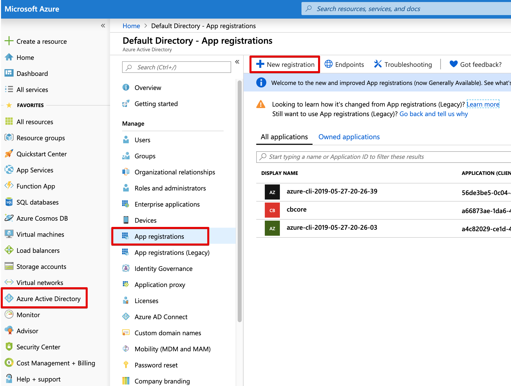

Give the registration a useful name, select who can authenticate and the `redirect URL`.

This URL needs to be configured and MUST be the actual URL of your CloudBees Core installation.

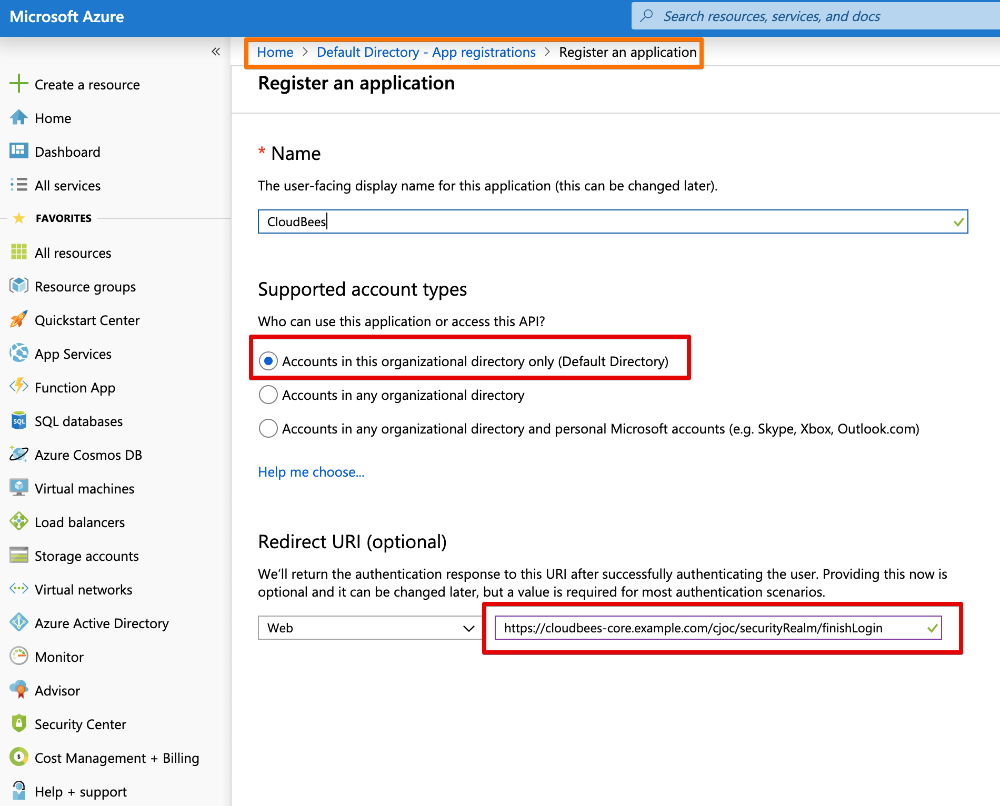

!!! Important 
    To have Client Masters as a fallback for login, incase Operations Center is down, you have to add another redirect URL for each Master.
    
    Azure AD -> App Registrations -> <App> -> Authentication -> Web -> `https://example.com/teams-cat/securityRealm/finishLogin`

#### App Registration Data To Write Down

Depending on the plugin you're going to use (SAML or Azure AD) you need information from your Azure AD / App Registration.

* **Tentant ID**
* **Object ID**
* **Client ID**
* **Federation Metadata Document** 
    * you can use the document XML content or the URL

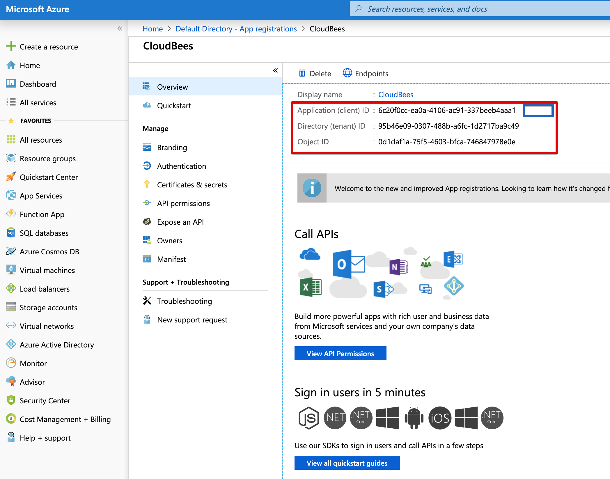

Click on the `Endpoints` button to open the side-bar with the links.

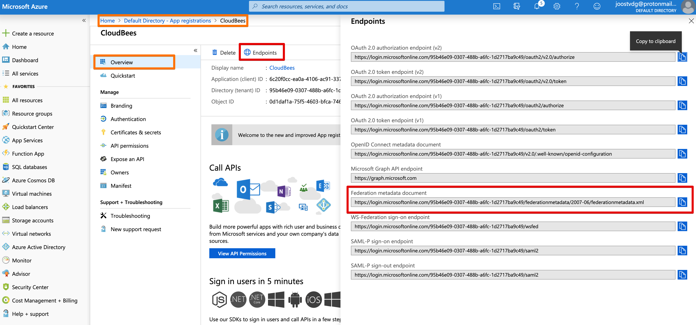

#### App ID

We need the `App ID` - even if the SAML plugin doesn't mention it.

Azure generates an `APP ID` URI for you. You can also use CloudBees Core's URL as the URI. The URI is shown when there is an error, so it recommended to use a value you can recognize.

!!! Info
    `App ID` must match in both Azure AD (set as `App ID URI`) and the SAML plugin (set as `Entity ID`) configuration in Jenkins. So write it down.

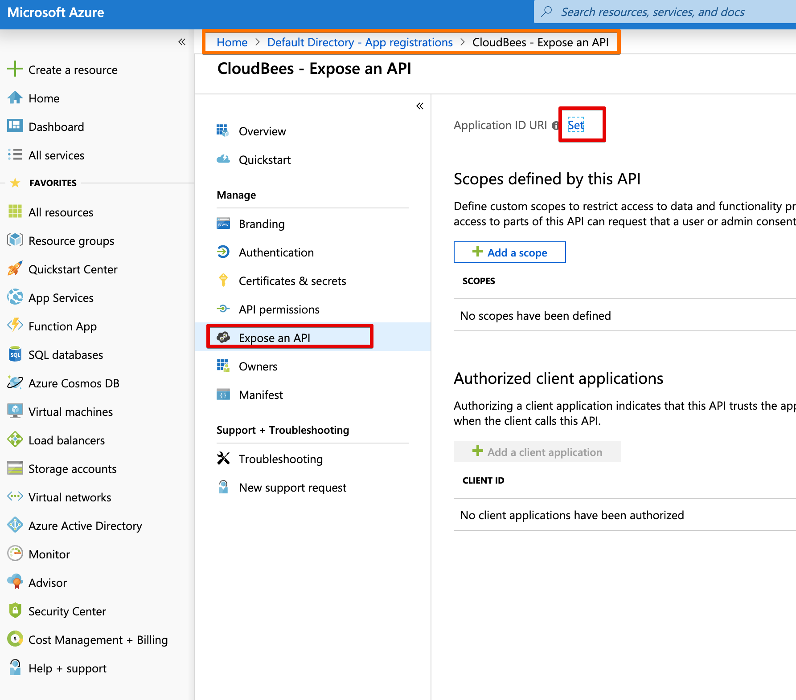

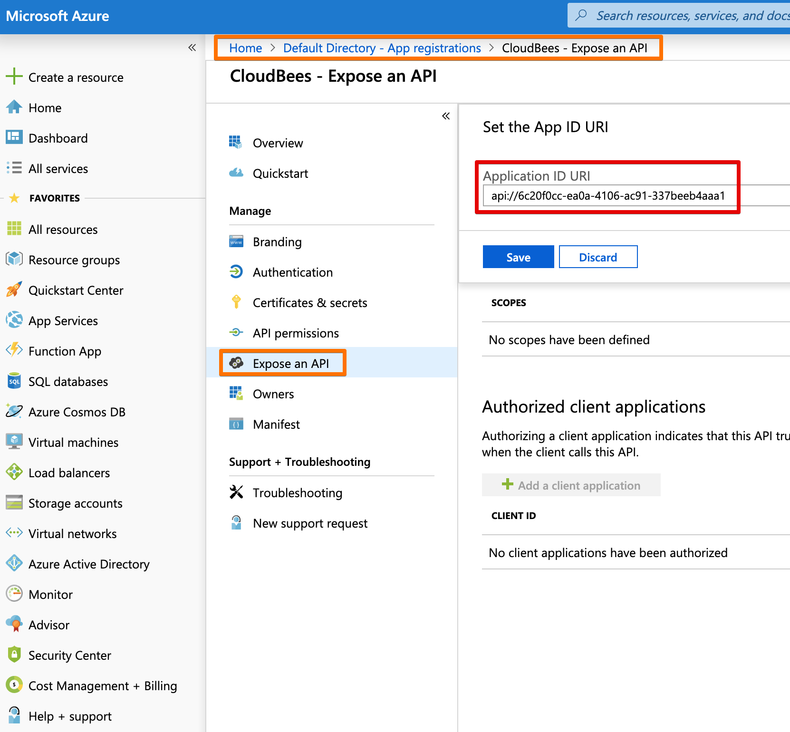

#### API Permissions

Of course, things wouldn't be proper IAM/LDAP/AD without giving some permissions.

If we want to retrieve group information and other fields, we need to be able to read the Directory information.


You find the Directory information via the `Microsoft Graph` api button.

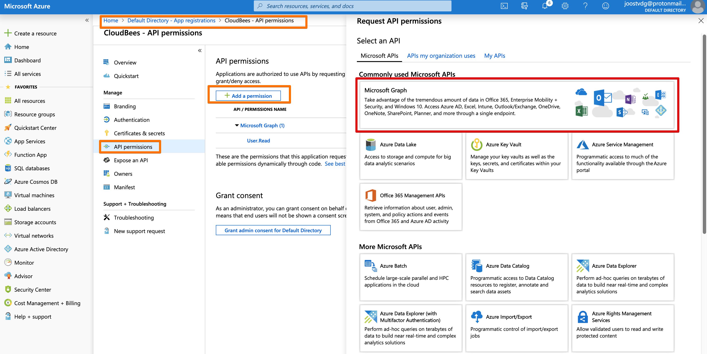

We select `Application Permissions` and then check `Directory.Read.All`. We don't need to write.

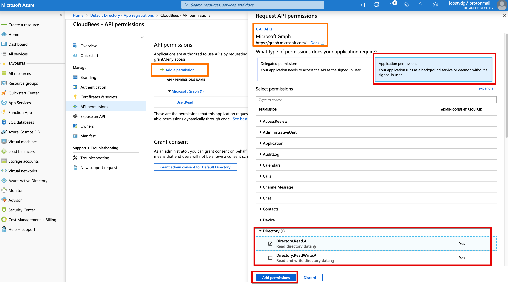

The Permissions have changed, so we require an Administrator account to consent with the new permissions.

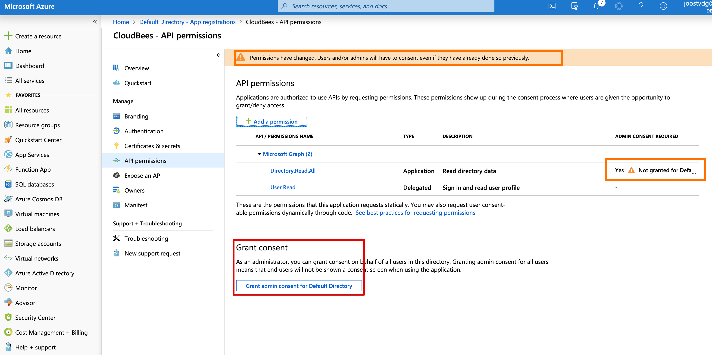

#### Update Manifest

As with the permissions, the default `Manifest` doesn't give us all the information we want.

We want the groups so we can configure RBAC, and thus we have to set the `groupMembershipsClaims` claim attribute.

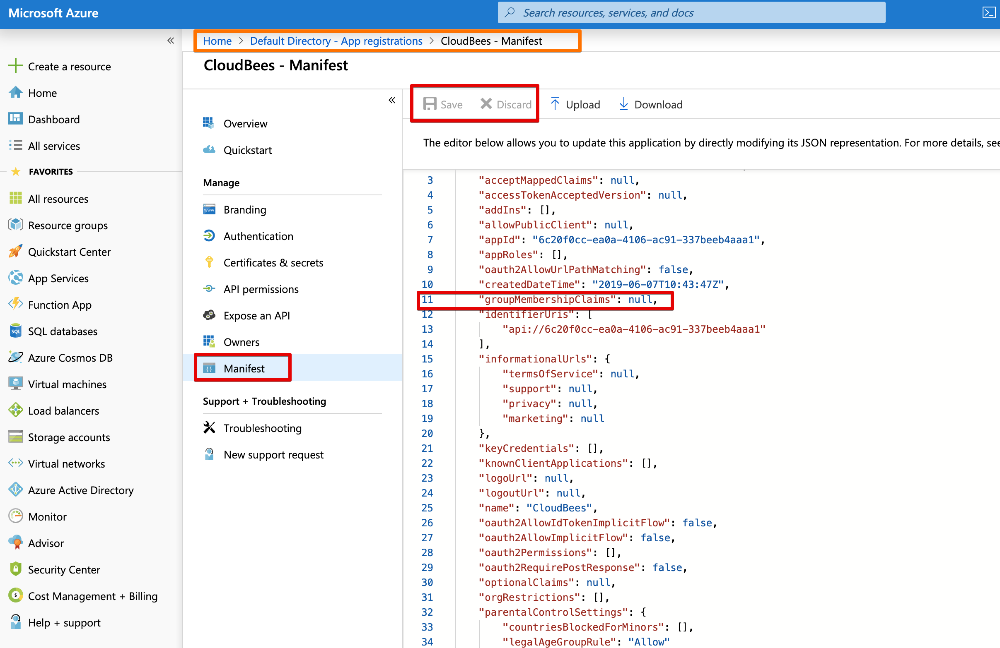

We change the `null` to `"SecurityGroup"`. Please consult the Microsoft docs (see reference below) for other options.

We can download, edit, and upload the manifest file. Alternatively, we can edit inline and hit save on top.

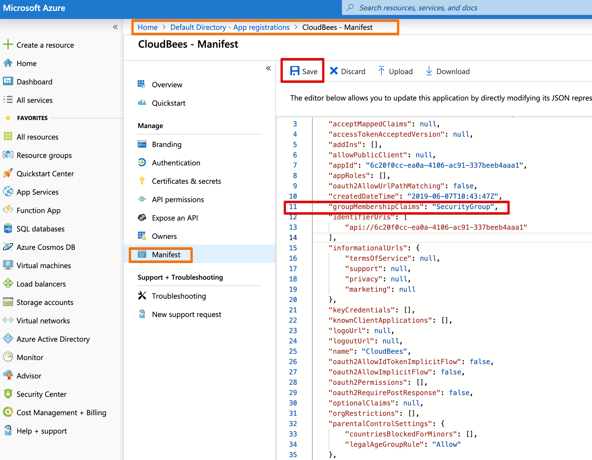

#### Retrieve Group Object ID

If we want to assign Azure AD groups to groups or roles in Jenkins' RBAC, we need to use the `Object ID`'s.

Each Group and User has an `Object ID`, which have a handy `Copy this` button on the end of the value box!

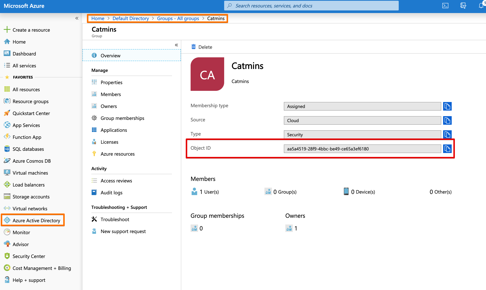

## Configure Jenkins

We now get to the point where we configure Jenkins. The SAML plugin is opensource, and thus it's configuration can also be used for [Jenkins](jenkins.io) or [CloudBees Jenkins Distribution](https://www.cloudbees.com/products/cloudbees-jenkins-distribution).

### Steps

Here are the steps we perform to configure Azure AD as the Single-Sign-On solution. 

* [install the SAML plugin](https://plugins.jenkins.io/saml)
    * I assume you know how to install plugins, so we skip this
    * if you don't know [Read the Managing Plugins Guide](https://go.cloudbees.com/docs/cloudbees-documentation/admin-instance/managing-plugins/)
* configure saml 2.0 in Jenkins
* setup groups (RBAC)
    * administrators -> admin group
    * browsers -> all other groups

### Visual Guide

Below is a visual guide with screenshots. Please pay attention to the hints in the screenshots.

* **Red**: this is the main thing
* **Orange**: this is how we got to the current page/view
* **Blue**: while you're in this screen, there might be other things you could do

#### Configure Security

To go to Jenkins' security configuration, follow this route:

* login with an Admin user
* go to the `Operations Center`
* `Manage Jenkins` -> `Global Security Configuration`

##### Configure RBAC

The SAML plugin configuration pollutes the screen with fields.

My advice is to enable RBAC first.

If you haven't got any groups/roles yet, I recommend using the `Typical Initial Setup` from the dropdown. The logged-in user is automatically registered as administrator. So if your Azure AD configuration doesn't work, this user can still manage Jenkins.

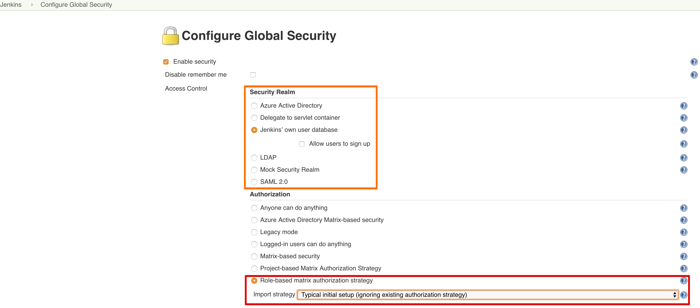

!!! Important
    Make sure you know the credentials of the current admin user.

    It will automatically be added to the `Administrators` group, and it will be your go-to account when you mess up the SAML configuration and you have to reset security. 

    For how to reset the security configuration, see the `For When You Mess Up` paragraph.

##### Configure SAML

Select `SAML 2.0` from the `Security Realm` options.

Here we first supply our `Federation Metadata Document` content or it's URL.

Each option - document content or URL - has its own `Validate ...` button, hit it and confirm it says `Success`.

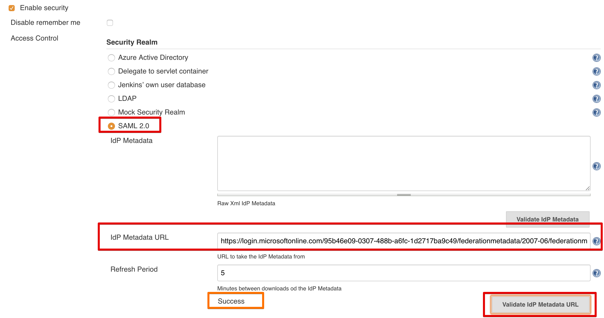

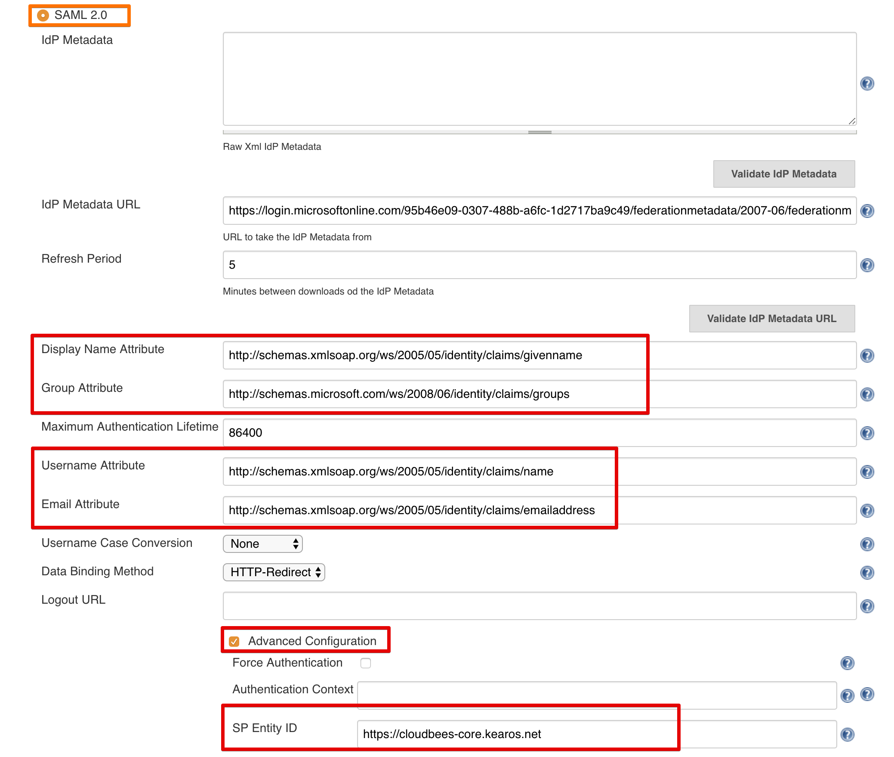

!!! Info
    You can leave `Displayname` empty, which gives you the default naming scheme from Azure AD.
    I think this is ugly, as it amounts to something like `${EMAIL_ADDRESS}_${AD_DOMAIN}_${AZURE_CORP_DOMAIN}`.
    There are other options, I've settled for `givenname`, as there isn't a `fullname` by default, and well, I prefer `Joost` to a long hard to recognize string.

###### Fields

* **Displayname**: `http://schemas.xmlsoap.org/ws/2005/05/identity/claims/givenname`
* **Group**: `http://schemas.microsoft.com/ws/2008/06/identity/claims/groups`
* **Username**: `http://schemas.xmlsoap.org/ws/2005/05/identity/claims/name`
* **Email**: `http://schemas.xmlsoap.org/ws/2005/05/identity/claims/emailaddress`
* **SP Entity ID**:  the `App ID` URI you configured in Azure AD (hidden behind `Advanced Configuration`)

#### Configure RBAC Groups

!!! Tip
    Once Azure AD is configured, and it works, you can configure groups for RBAC just as you're used to.

    Both for classic RBAC and Team Masters.

    Just make sure you use the Azure AD `Object ID`'s of the groups to map them.

    Bonus tip, add every Azure AD group to `Browsers`, so you can directly map their groups to Team Master roles without problems. 


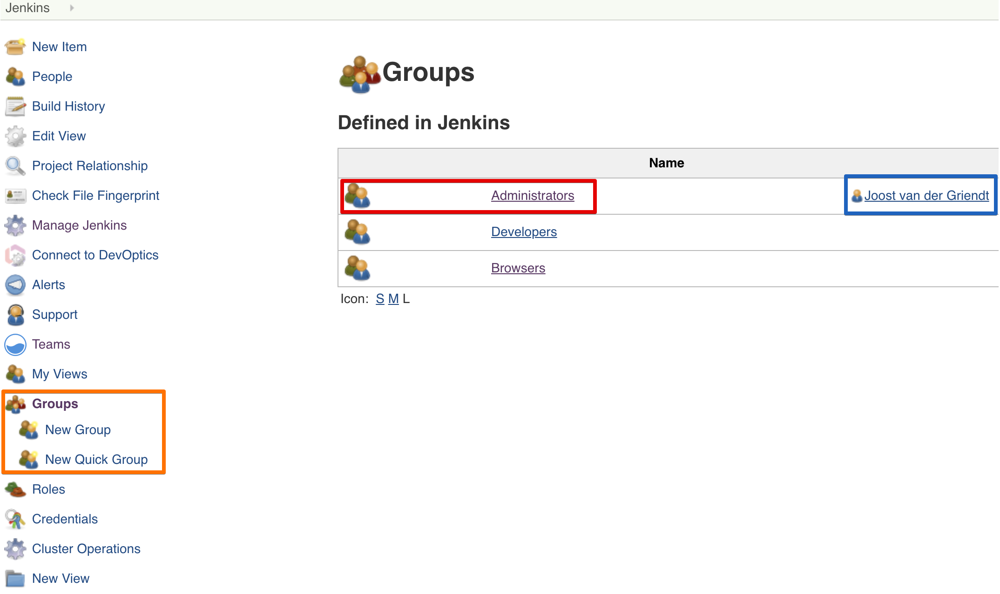

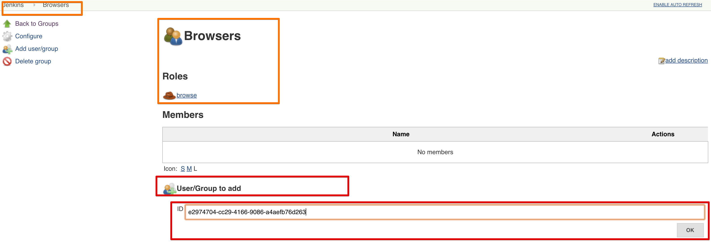

#### XML Config

```xml
  <useSecurity>true</useSecurity>
  <authorizationStrategy class="nectar.plugins.rbac.strategy.RoleMatrixAuthorizationStrategyImpl"/>
 <securityRealm class="org.jenkinsci.plugins.saml.SamlSecurityRealm" plugin="saml@1.1.2">
    <displayNameAttributeName>http://schemas.xmlsoap.org/ws/2005/05/identity/claims/givenname</displayNameAttributeName>
    <groupsAttributeName>http://schemas.microsoft.com/ws/2008/06/identity/claims/groups</groupsAttributeName>
    <maximumAuthenticationLifetime>86400</maximumAuthenticationLifetime>
    <emailAttributeName>http://schemas.xmlsoap.org/ws/2005/05/identity/claims/emailaddress</emailAttributeName>
    <usernameCaseConversion>none</usernameCaseConversion>
    <usernameAttributeName>http://schemas.xmlsoap.org/ws/2005/05/identity/claims/name</usernameAttributeName>
    <binding>urn:oasis:names:tc:SAML:2.0:bindings:HTTP-Redirect</binding>
    <advancedConfiguration>
      <forceAuthn>false</forceAuthn>
      <spEntityId>https://cloudbees-core.kearos.net</spEntityId>
    </advancedConfiguration>
    <idpMetadataConfiguration>
      <xml></xml>
      <url>https://login.microsoftonline.com/95b46e09-0307-488b-a6fc-1d2717ba9c49/federationmetadata/2007-06/federationmetadata.xml</url>
      <period>5</period>
    </idpMetadataConfiguration>
  </securityRealm>
  <disableRememberMe>false</disableRememberMe>
```

### Logout URL

Depending on the requirements, you may want to specify a logout url in the SAML configuration
to log you completely out of SAML, not just Core.

An example `https://login.windows.net/<tenant_id_of_your_app>/oauth2/logout?post_logout_redirect_uri=<logout_URL_of_your_app>/logout`

### For When You Mess Up

This is the default config for security in CloudBees Core.

This file is in `${JENKINS_HOME}/config.xml`, the XML tags we want to look at are quite near the top.

```xml
 <useSecurity>true</useSecurity>
  <authorizationStrategy class="hudson.security.FullControlOnceLoggedInAuthorizationStrategy">
    <denyAnonymousReadAccess>true</denyAnonymousReadAccess>
  </authorizationStrategy>
  <securityRealm class="hudson.security.HudsonPrivateSecurityRealm">
    <disableSignup>true</disableSignup>
    <enableCaptcha>false</enableCaptcha>
  </securityRealm>
  <disableRememberMe>false</disableRememberMe>
```

#### On CloudBees Core Modern / Kubernetes

To rectify a failed configuration, execute the following steps:

1. exec into the `cjoc-0` container: `kubectl exec -ti cjoc-0 -- bash`
1. open `config.xml`: ` vi /var/jenkins_home/config.xml`
1. replace conflicting lines with the above snippet
1. save the changes
1. exit the container: `exit`
1. kill the pod: `kubectl delete po cjoc-0`

!!! Tip
    For removing a whole line, stay in "normal" mode, and press `d d` (two times the `d` key).
    To add the new lines, go into insert mode by pressing the `i` key.
    Go back to "normal" mode by pressing the `esc` key.
    Then, save and quit, by writing: `:wq` followed by `enter`.

## References

* [CloudBees Guide on Azure AD for Core SSO](https://www.cloudbees.com/blog/securing-jenkins-role-based-access-control-and-azure-active-directory)(outdated)
* [SAML Plugin Docs for Azure AD](https://github.com/jenkinsci/saml-plugin/blob/master/doc/CONFIGURE_AZURE.md) (outdated)
* [Microsoft Doc for Azure AD Tokens](https://docs.microsoft.com/en-us/azure/active-directory/develop/reference-saml-tokens)
* [Microsoft Doc for Azure AD Optional Tokens](https://docs.microsoft.com/en-us/azure/active-directory/develop/active-directory-optional-claims)
* [Microsoft Doc for Azure AD Custom Tokens](https://docs.microsoft.com/en-us/azure/active-directory/develop/active-directory-saml-claims-customization)
* [Alternative Azure AD Plugin](https://github.com/jenkinsci/azure-ad-plugin) (very new)

!!! Info
    Currently, there is a limitation which requires you to use the `Object ID`'s which make searching groups and people less than ideal.  When the Alternative Azure AD Plugin is approved this may provide a more
    satisfactory solution.

