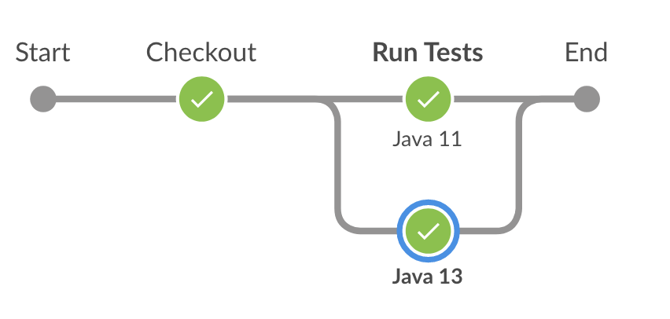
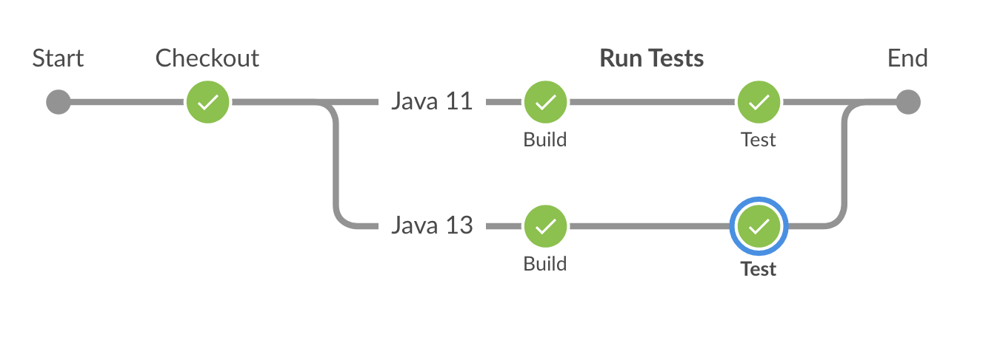
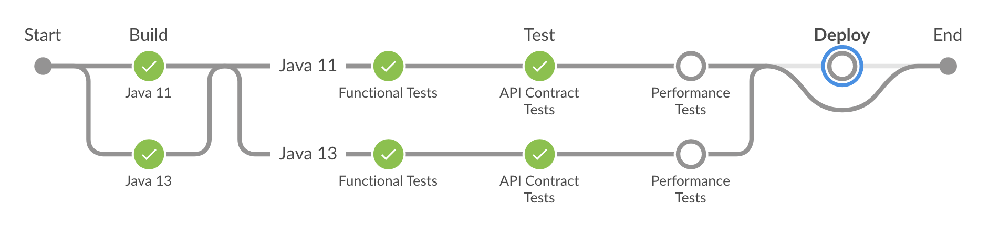
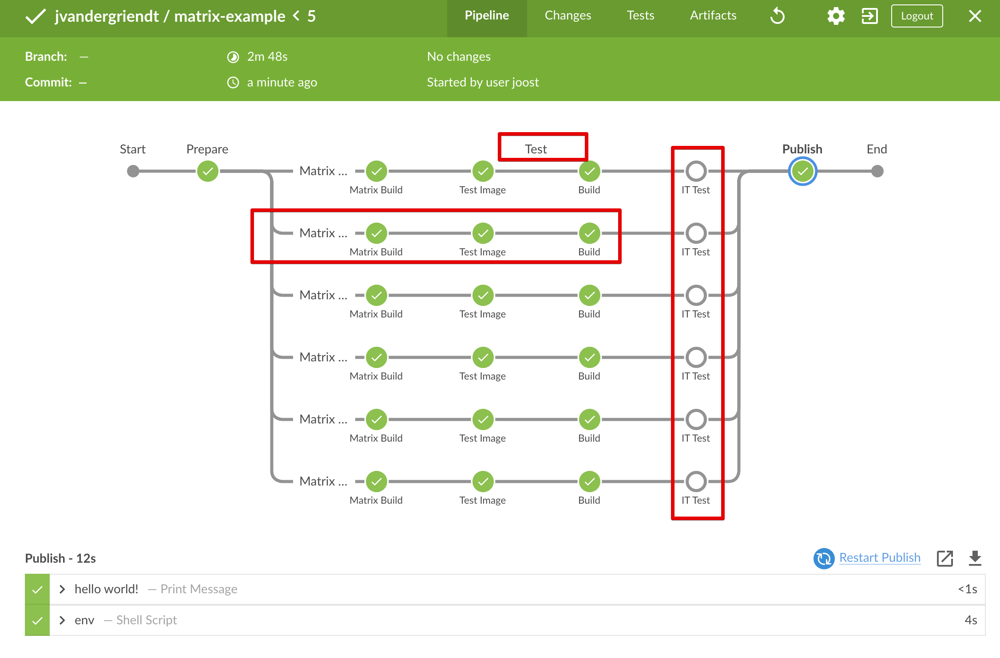

title: Jenkins Parallel Pipeline
description: The How And Why Of Using Parallel Stages In Your Jenkins Pipeline

# Parallel Pipeline

Building applications can be fun, but it can also cause a lot of wait time[^3].

There are many ways to speed up builds, do fewer tests, get bigger and better hardware, or run some tasks in parallel.

Jenkins Pipelines can do parallel stages for a while, even in the Declarative format[^1].

Although doing parallel pipelines, Jenkins didn't become awesome until ***Sequential Stages*** [^2].
We will dive into the magic of *Sequential Stages*, but first, let's start with building in parallel.

## Parallel Stages

This is an elementary example. We have an application we want to build in Java 11 - latest LTS - and the latest version of Java - now Java 13.

As both are running in their own containers, each can leverage its own resources - provided the underlying VM has them available.

```groovy
pipeline {
    agent {
        kubernetes {
            label 'jx-maven-lib'
            yaml """
apiVersion: v1
kind: Pod
spec:
  containers:
  - name: maven11
    image: maven:3-jdk-11
    command: ['cat']
    tty: true
  - name: maven13
    image: maven:3-jdk-13
    command: ['cat']
    tty: true
"""
        }
    }
    stages {
        stage('Checkout') {
            steps {
                git 'https://github.com/joostvdg/jx-maven-lib.git'
            }
        }
        stage('Run Tests') {
            parallel {
                stage('Java 11') {
                    steps {
                        container('maven11') {
                            sh 'mvn -V -e -C verify'
                        }
                    }
                }
                stage('Java 13') {
                    steps {
                        container('maven13') {
                            sh 'mvn -V -e -C -Pjava13 verify'
                        }
                    }
                }
            }
        }
    }
}
```

### Visualization

This will then look like this:



## Sequential

Before we dive into all the benefits of *Sequential Stages*, let's look at how the syntax changes.

With Parallel Stages, we can execute some steps in parallel, but with regards to visualizing individual steps, it is inferior.

Sequential Stages allows us to add Stages in ***sequence*** within a Parallel step, which is why I usually call them ***Parallel Sequential*** stages.

In summary, the syntax now becomes:

```groovy
stages {
    stage('Checkout') {
        stage('Run Tests') {
            parallel {
                stage('Java 11') {
                    stages {
                        stage('Build') {
                            steps {}
                        }
                    }
                }
            }
        }
    }
}
```

The full example:

```groovy
pipeline {
    agent {
        kubernetes {
            label 'jx-maven-lib'
            yaml """
apiVersion: v1
kind: Pod
spec:
  containers:
  - name: maven11
    image: maven:3-jdk-11
    command: ['cat']
    tty: true
  - name: maven13
    image: maven:3-jdk-13
    command: ['cat']
    tty: true
"""
        }
    }
    stages {
        stage('Checkout') {
            steps {
                git 'https://github.com/joostvdg/jx-maven-lib.git'
            }
        }
        stage('Run Tests') {
            parallel {
                stage('Java 11') {
                    stages {
                        stage('Build') {
                            steps {
                                container('maven11') {
                                    sh 'mvn -V -e -C package'
                                }
                            }
                        }
                        stage('Test') {
                            steps {
                                container('maven11') {
                                    sh 'mvn -V -e -C test'
                                }
                            }
                        }
                    }
                }
                stage('Java 13') {
                    stages {
                        stage('Build') {
                            steps {
                                container('maven13') {
                                    sh 'mvn -V -e -C -Pjava13 package'
                                }
                            }
                        }
                        stage('Test') {
                            steps {
                                container('maven13') {
                                    sh 'mvn -V -e -C -Pjava13 test'
                                }
                            }
                        }
                    }
                }
            }
        }
    }
}
```

### Visualization

The first thing we notice is that we get more indenting and more `{ }`.
But, we can also visualize independent stages within the parallel "streams".

If you're thinking, but can't I now do much more with stage individual stages?
You're right, and we'll dive into that next.



## Sequential With Separate Pods

The biggest downside of the previous examples is that the Kubernetes Pod is always there, including all the containers we need.

But what if some parallel tasks take much longer than others? It would be great if the other containers would be removed as soon if we're done with them.

With Sequential stages, we can achieve this. We first set `agent none`, to make sure we don't have a Pod running from start to finish.

This comes with a price, though, now every stage will need to have its own agent defined.
Luckily, combining Parallel and Sequential stages, we can give each parallel "stream" an agent - a Pod - and have each sequential stage use this.

In summary, we do this:

* Pipeline: no agent
    * parallel: Build
        * stream java 11: agent maven11
        * stream java 13: agent maven13
    * parallel: Test
        * stream java 11: agent maven11
            * Functional Tests
            * API Contract Tests
            * Performance Tests
        * stream java 13: agent maven13
            * Functional Tests
            * API Contract Tests
            * Performance Tests
    * Deploy

Another benefit is that each stage can leverage every `Declarative Directive`[^4], such as `when { }`[^5].
In this example, we've used `when { branch 'master' }` to avoid executing steps when we're not on branch `master`.

To extend this even further, we can now leverage both the dynamic Pod allocation and the When Directive.
When combined with `beforeAgent true`, we won't even spin up the Pod, avoiding unnecessary resource consumption and waiting.

```groovy hl_lines="2 3 4"
stage('Deploy') {
    agent { ... }
    when {
        branch 'master'
        beforeAgent true
    }
    steps { echo "hello" }
}
```

The complete example now looks like this.

```groovy
pipeline {
    agent none
    stages {
        stage('Build') {
            parallel {
                stage('Java 11') {
                    agent {
                        kubernetes {
                            label 'jxmavenlib-jdk11_build'
                            containerTemplate {
                                name 'maven11'
                                image 'maven:3-jdk-11'
                                ttyEnabled true
                                command 'cat'
                            }
                        }
                    }
                    steps {
                        container('maven11') {
                            sh 'mvn -v'
                        }
                    }
                }
                stage('Java 13') {
                    agent {
                        kubernetes {
                            label 'jxmavenlib-jdk13-build'
                            containerTemplate {
                                name 'maven13'
                                image 'maven:3-jdk-13'
                                ttyEnabled true
                                command 'cat'
                            }
                        }
                    }
                    steps {
                        container('maven13') {
                            sh 'mvn -v'
                        }
                    }
                }
            }
        }
        stage('Test') {
            parallel {
                stage('Java 11') {
                    agent {
                        kubernetes {
                            label 'jxmavenlib-jdk11-test'
                            containerTemplate {
                                name 'maven'
                                image 'maven:3-jdk-11'
                                ttyEnabled true
                                command 'cat'
                            }
                        }
                    }
                    stages {
                        stage('Functional Tests') {
                            steps {
                                echo 'Hello'
                            }
                        }
                        stage('API Contract Tests') {
                            steps {
                                echo 'Hello'
                            }
                        }
                        stage('Performance Tests') {
                            when {
                                branch 'master'
                            }
                            steps {
                                echo 'Hello'
                            }
                        }
                    }
                }
                stage('Java 13') {
                    agent {
                        kubernetes {
                            label 'jxmavenlib-jdk13-test'
                            containerTemplate {
                                name 'mavenjdk11'
                                image 'maven:3-jdk-13'
                                ttyEnabled true
                                command 'cat'
                            }
                        }
                    }
                    stages {
                        stage('Functional Tests') {
                            steps {
                                echo 'Hello'
                            }
                        }
                        stage('API Contract Tests') {
                            steps {
                                echo 'Hello'
                            }
                        }
                        stage('Performance Tests') {
                            when {
                                branch 'master'
                            }
                            steps {
                                echo 'Hello'
                            }
                        }
                    }
                }
            }
        }
        stage('Deploy') {
            agent {
                kubernetes {
                    label 'jxmavenlib-deployment'
                    containerTemplate {
                        name 'pl_deployment'
                        image 'cloudbees/docker-java-with-docker-client'
                        ttyEnabled true
                        command 'cat'
                    }
                }
            }
            when {
                branch 'master'
                beforeAgent true
            }
            steps {
                echo "hello"
            }
        }
    }
}
```

### Visualization

When visualized, we can spot which stages are skipped due to the `when {}` Directives.



## Sequential With Optional & Reusable Pods

We're not done yet — one more step to take.

While dynamically allocating Pods with containers sounds excellent, it comes at a cost.
If you do something in the build phase and you need the data in the latest stages, you've now lost it - new Pod = new workspace.

There are a few things you can do, but none of them pretty.
You can use `stash`[^6] and `unstash`[ˆ7], but these can be very costly in terms of I/O performance and time.

Alternatively, you can either look for externalizing your workspace or keep the Pod around for reuse.

!!! important
    If you can run more than one build at the same time - concurrent builds - you run the risk of having builds claim Pods another build has done work in.

    To avoid builds reusing Pods from other runs, you can disable concurrent builds.

    ```groovy
    options {
        disableConcurrentBuilds()
    }
    ```

    Alternatively, you can encode the build number into the name:

    ```groovy hl_lines="3"
    agent {
        kubernetes {
            label "jxmavenlib-jdk11-b${BUILD_NUMBER}"
            yaml ...
        }
    }
    ```

### Pod Reuse

To reuse a Pod, we have to override some default values in the PodTemplate[^10].

* `idleMinutes`: Allows the Pod to remain active for reuse until the configured number of minutes has passed since the last step was executed on it.

The configuration below means the Pod can be idle for about 5 minutes before it gets deleted.
Additionally, we changed the label not to include the phase name. Otherwise, we cannot get the same Pod. 

```groovy hl_lines="3"
agent {
    kubernetes {
        idleMinutes 5
        label 'jxmavenlib-jdk11'
        yaml """
spec:
  containers:
  - name: maven11
    image: maven:3-jdk-11
    command: ['cat']
    tty: true
"""
    }
}
```

### Volume For Externalizing Workspace

There are various ways to externalize your workspace, you can leverage NFS[^8] or Jenkins workspace related plugins[^9].

One way we'll look at here is to leverage a `PersistedVolume` in Kubernetes - which could be of any kind, incl NFS[^8].

We add a volume of type `persistentVolumeClaim` and point to an existing one by `claimName`.

```yaml
    volumeMounts:
      - name: build-cache
        mountPath: /tmp/cache
  volumes:
    - name: build-cache
      persistentVolumeClaim:
        claimName: azure-managed-disk
```

??? example "azure-managed-disk-pvc.yaml"

    ```yaml
    apiVersion: v1
    kind: PersistentVolumeClaim
    metadata:
      name: azure-managed-disk
    spec:
      accessModes:
      - ReadWriteOnce
      storageClassName: managed-premium
      resources:
        requests:
          storage: 5Gi
    ```

### Full Example

```groovy
pipeline {
    agent none
    options {
        disableConcurrentBuilds()
    }
    stages {
        stage('Build') {
            parallel {
                stage('Java 11') {
                    agent {
                        kubernetes {
                            idleMinutes 5
                            label "jxmavenlib-jdk11-b${BUILD_NUMBER}"
                            yaml """
spec:
  containers:
  - name: maven11
    image: maven:3-jdk-11
    command: ['cat']
    tty: true
    volumeMounts:
      - name: maven-cache
        mountPath: /root/.m2/repository
      - name: build-cache
        mountPath: /tmp/cache
  volumes:
    - name: maven-cache
      hostPath:
        path: /tmp
        type: Directory
    - name: build-cache
      persistentVolumeClaim:
        claimName: azure-managed-disk
"""
                        }
                    }
                    steps {
                        git 'https://github.com/joostvdg/jx-maven-lib.git'
                        container('maven11') {
                            sh 'mvn -V -e -C verify'
                            sh 'cp -R target/ /tmp/cache/'
                            sh 'ls -lath /tmp/cache/'
                        }
                    }
                }
                stage('Java 13') {
                    agent {
                        kubernetes {
                            idleMinutes 5
                            label "jxmavenlib-jdk13-b${BUILD_NUMBER}"
                            yaml """
spec:
  containers:
  - name: maven13
    image: maven:3-jdk-13
    command: ['cat']
    tty: true
    volumeMounts:
      - name: maven-cache
        mountPath: /root/.m2/repository
  volumes:
    - name: maven-cache
      hostPath:
        path: /tmp
        type: Directory
"""
                        }
                    }
                    steps {
                        git 'https://github.com/joostvdg/jx-maven-lib.git'
                        container('maven13') {
                            sh 'mvn -V -e -C -Pjava13 verify'
                        }
                    }
                }
            }
        }
        stage('Test') {
            parallel {
                stage('Java 11') {
                    agent {
                        kubernetes {
                            idleMinutes 5
                            label "jxmavenlib-jdk11-b${BUILD_NUMBER}"
                            yaml """
spec:
  containers:
  - name: maven11
    image: maven:3-jdk-11
    command: ['cat']
    tty: true
    volumeMounts:
      - name: maven-cache
        mountPath: /root/.m2/repository
      - name: build-cache
        mountPath: /tmp/cache
  volumes:
    - name: maven-cache
      hostPath:
        path: /tmp
        type: Directory
    - name: build-cache
      persistentVolumeClaim:
        claimName: azure-managed-disk
"""
                        }
                    }
                    stages {
                        stage('Functional Tests') {
                            steps {
                                container('maven11') {
                                    sh 'ls -lath /tmp/cache'
                                    sh 'cp -R /tmp/cache/ .'
                                    sh 'ls -lath'
                                }
                            }
                        }
                        stage('API Contract Tests') {
                            steps {
                                echo 'Hello'
                            }
                        }
                        stage('Performance Tests') {
                            when {
                                branch 'master'
                            }
                            steps {
                                echo 'Hello'
                            }
                        }
                    }
                }
                stage('Java 13') {
                    agent {
                        kubernetes {
                            idleMinutes 5
                            label "jxmavenlib-jdk13-b${BUILD_NUMBER}"
                            yaml """
spec:
  containers:
  - name: maven13
    image: maven:3-jdk-13
    command: ['cat']
    tty: true
    volumeMounts:
      - name: maven-cache
        mountPath: /root/.m2/repository
  volumes:
    - name: maven-cache
      hostPath:
        path: /tmp
        type: Directory
"""
                        }
                    }
                    stages {
                        stage('Functional Tests') {
                            steps {
                               container('maven13') {
                                    sh 'ls -lath'
                                }
                            }
                        }
                        stage('API Contract Tests') {
                            steps {
                                echo 'Hello'
                            }
                        }
                        stage('Performance Tests') {
                            when {
                                branch 'master'
                            }
                            steps {
                                echo 'Hello'
                            }
                        }
                    }
                }
            }
        }
        stage('Deploy') {
            agent {
                kubernetes {
                    label 'jxmavenlib-deployment'
                    containerTemplate {
                        name 'pl_deployment'
                        image 'cloudbees/docker-java-with-docker-client'
                        ttyEnabled true
                        command 'cat'
                    }
                }
            }
            when {
                branch 'master'
                beforeAgent true
            }
            steps {
                echo "hello"
            }
        }
    }
}
```

## Matrix

In late 2019, Jenkins released the `Matrix Build` feature.
It extends the Parallel and Sequential features and allows you to create a Matrix of options for parallel execution.

If you want to get a more in-depth look at this feature, I recommend reading Liam Newman's[^11] excellent introductory blog post.

When you've read this and Liam's posts, I recommend you go through the [^12] test cases of the `Matrix` build feature on GitHub.
They provide a wealth of information and worked-out examples.

### What Is It

The `Matrix` build feature extends the Parallel and Sequential features mentioned earlier in this article.
What it allows you to do is to specify multiple sets of values (`axis`), and then execute each entry of the cartesian product[^13].

`Matrix` acts as a special stage type, and can include an `agent{}` and `stages{}` definition.

```groovy
matrix {
    axes { }
    excludes {}
    agent {}
    stages {}
}
```

### Axis

The mechanism for specifying the sets of values is called `axis`.

You start by specifying the matrix build within a stage.

```groovy
pipeline {
    agent none
    stages {
        stage('matrix build') {
            matrix { } 
        }
    }
}
```

Within `matrix` you specify the `axis` with one or more `axis`.

```groovy
matrix {
    axes {
        axis {
            name 'JDK_VERSION'
            values '8','11', '13'
        }
        axis {
            name 'JDK_TYPE'
            values 'ibmjava','amazoncorretto', 'jdk'
        }
    }
}
```

In this case, we will get these nine combinations:

* jdk + 8, jdk + 11, jdk + 13
* ibmjava + 8, ibmjava + 11, ibmjava + 13
* amazoncorretto + 8, amazoncorretto + 11, amazoncorretto + 13

### Exclusions

Unfortunately, several of these are not valid combinations. 
The `ibmjava` only has a JDK 8 version, and the default (open)JDK is the only one with a JDK 13 version (at this time).

You can filter these out with a `when` directive, but that would pollute the pipeline view.
Wouldn't it be better to ensure the invalid combinations aren't even considered?

You can tell the `matrix` build feature just that, by setting `exclusions`.

You start with an `exclusions {}` followed by one or more `exclusion{}` blocks.

Let's exclude JDK 11 from IBM's java.

```groovy
excludes {
    exclude {
        axis {
            name 'JDK_VERSION'
            values '11'
        }
        axis {
            name 'JDK_TYPE'
            values "ibmjava"
        }
    }
}
```

Sometimes, you want to limit a combination to a single `axis`. 
Meaning, exclude every combination of `x`, except for `y`.

We can do just that, by specifying `notValues` in the exclusion.
Let's ensure only `jdk` will be paired with `13`.

```groovy
exclude {
    axis {
        name 'JDK_VERSION'
        values '13'
    }
    axis {
        name 'JDK_TYPE'
        notValues 'jdk' // double negative, make sure we only do 13 with jdk
    }
}
```

### Together With PodTemplates

As with previous examples of the Parallel and Sequential features, `Matrix` adds an extra dimension to using PodTemplates.

Remember the structure of a `Matrix`?

```groovy
matrix {
    axes { }
    excludes {}
    agent {}
    stages {}
}
```

It means we can structure of the `Sequential` stages, by adding a `stages {}` block and a single `agent{}` block for those stages.

Because the PodTemplate properties are variables, the values we put in there can be dynamic. This means we can leverage the `axis` values as input for which container images to use for our PodTemplate.

```groovy
matrix {
    axes {}
    agent {
        kubernetes {
            label "maven-${JDK_TYPE}-${JDK_VERSION}-test"
            containerTemplate {
                name 'maven'
                image "maven:3-${JDK_TYPE}-${JDK_VERSION}"
                ttyEnabled true
                command 'cat'
            }
        }
    }
    stages {}
}
```

### Visual Representation

In the visual representation, we can the benefits of the `Sequential` stages with Matrix. Each `axis` combination will have its own set of stages, which can also have their own `when{}` directives.



### Complete Example

```groovy
pipeline {
    agent none
    stages {
        stage('Prepare') {
            agent {
                kubernetes {
                    label "maven"
                    containerTemplate {
                        name 'maven'
                        image "maven"
                        ttyEnabled true
                        command 'cat'
                    }
                }
            }
            steps {
                println 'hello world!'
                container('maven') {
                    sh 'env'
                }
            }
        }
        stage('Test') {
            matrix {
                axes {
                    axis {
                        name 'JDK_VERSION'
                        values '8','11', '13'
                    }
                    axis {
                        name 'JDK_TYPE'
                        values 'ibmjava','amazoncorretto', 'jdk'
                    }
                }
                excludes {
                    exclude {
                        axis {
                            name 'JDK_VERSION'
                            values '13'
                        }
                        axis {
                            name 'JDK_TYPE'
                            notValues 'jdk' // double negative, make sure we only do 13 with jdk
                        }
                    }
                    exclude {
                        axis {
                            name 'JDK_VERSION'
                            values '11'
                        }
                        axis {
                            name 'JDK_TYPE'
                            values "ibmjava"
                        }
                    }
                }
                agent {
                    kubernetes {
                        label "maven-${JDK_TYPE}-${JDK_VERSION}-test"
                        containerTemplate {
                            name 'maven'
                            image "maven:3-${JDK_TYPE}-${JDK_VERSION}"
                            ttyEnabled true
                            command 'cat'
                        }
                    }
                }
                stages {
                    stage('Test Image') {
                        steps {
                            println "Using Image: maven:3-${JDK_TYPE}-${JDK_VERSION}"
                        }
                    }
                    stage("Build") {
                        steps {
                            sh 'uname -a'
                            git 'https://github.com/joostvdg/jx-maven-lib.git'
                            container('maven') {
                                sh 'mvn clean verify --show-version --strict-checksums -e'
                            }
                        }
                    }
                    stage("IT Test") {
                        when {
                            branch 'master'
                        }
                        steps {
                            echo "WE SHOULD NEVER GET HERE"
                        }
                    }
                }
            }
        }
        stage('Publish') {
            agent {
                kubernetes {
                    label "maven"
                    containerTemplate {
                        name 'maven'
                        image "maven"
                        ttyEnabled true
                        command 'cat'
                    }
                }
            }
            steps {
                println 'hello world!'
                container('maven') {
                    sh 'env'
                }
            }
        }
    }
}
```

## References

[^1]: [Jenkins Pipeline - Parallel Stages](https://jenkins.io/blog/2017/09/25/declarative-1/)
[^2]: [Jenkins Pipeline - Introducing Sequential Stages](https://jenkins.io/blog/2018/07/02/whats-new-declarative-piepline-13x-sequential-stages/)
[^3]: [XKCD - Code's Compiling](https://xkcd.com/303/)
[^4]: [Jenkins Pipeline Syntax](https://jenkins.io/doc/book/pipeline/syntax/#declarative-directives)
[^5]: [Jenkins Declarative Pipeline - When Directive](https://jenkins.io/doc/book/pipeline/syntax/#when)
[^6]: [Jenkins Pipeline - Step Stash](https://jenkins.io/doc/pipeline/steps/workflow-basic-steps/#stash-stash-some-files-to-be-used-later-in-the-build)
[^7]: [Jenkins Pipeline - Step Unstash](https://jenkins.io/doc/pipeline/steps/workflow-basic-steps/#unstash-restore-files-previously-stashed)
[^8]: [Kubernetes NFS Storage Provisioner](https://github.com/kubernetes-incubator/external-storage/tree/master/nfs)
[^9]: [Jenkins External Workspace Manager Plugin](https://github.com/jenkinsci/external-workspace-manager-plugin)
[^10]: [Jenkins Kubernetes Plugin - template values explained](https://github.com/jenkinsci/kubernetes-plugin#pod-and-container-template-configuration)
[^11]: [Jenkins Blog Introducing Matrix Build Feature](https://jenkins.io/blog/2019/11/22/welcome-to-the-matrix/)
[^12]: [GitHub Repository containing test examples of the Matrix Build Feature](https://github.com/jenkinsci/pipeline-model-definition-plugin/tree/master/pipeline-model-definition/src/test/resources/matrix)
[^13]: [Wikipedia - Cartesian Product](https://en.wikipedia.org/wiki/Cartesian_product)