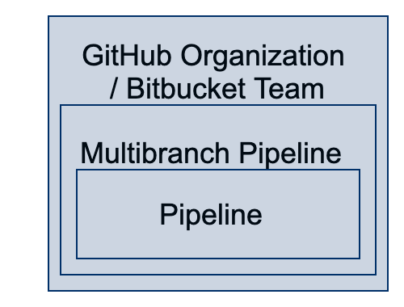
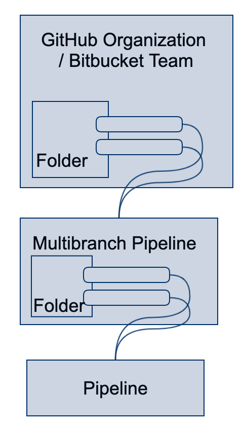
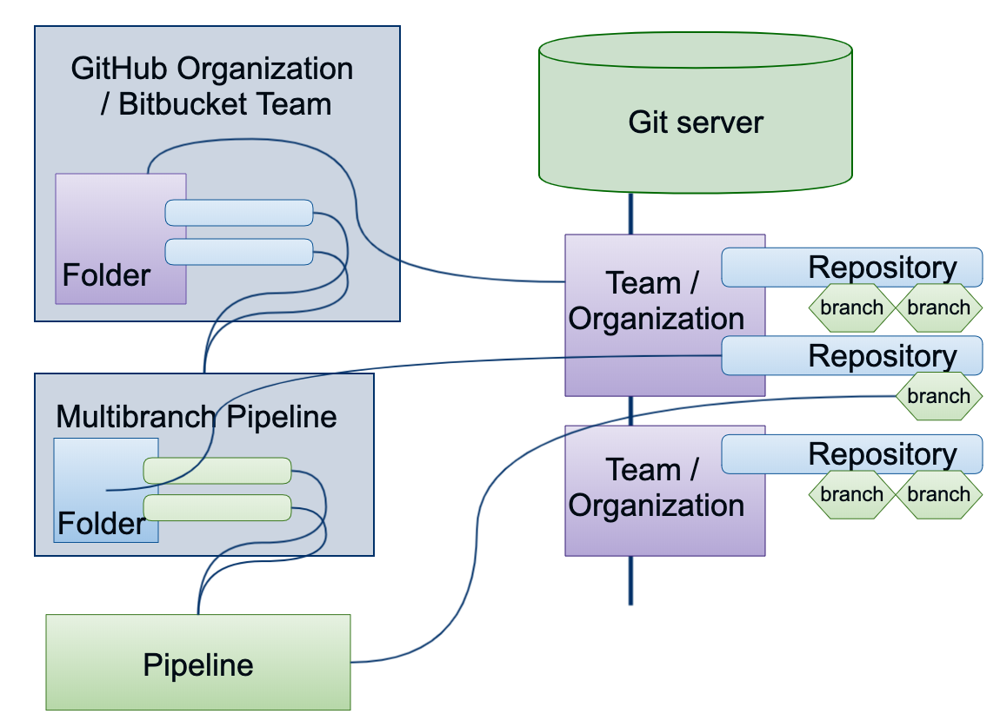

title: Jenkins Pipeline Job Types
description: Which Job Types Exist For Jenkins Pipelines And When To Use Them

# Jenkins Pipeline Job Types

Jenkins Pipelines are written as a `Jenkinsfile` and can have either a `Declarative`[^1] or `Scripted`[^2] format. Whenever possible for as much as possible, always write your pipelines in `Delcarative` format.

How they are configured and run is a classic case of `it depends...`. This page goes into the job types available and when to use which and why.

!!! caution
    This piece is full of personal opinions. While they are based on years of experience with writing Jenkins Pipelines and helping customers and clients with reviewing theirs, they're still just an opinion.

## Job Types

We classify the job types as follows:

* Something that isn't a pipeline job and you should never ever use (I'm looking at you `Freestyle`)
* Pipeline
* Multibranch Pipeline
* Organization Job (named after the most commonly used GitHub Organization Job)

### Pipeline

A `Pipeline` job[^9] is the most basic building block available. You can create a `New Item` in Jenkins and choose the type `Pipeline`.

Here you can choose two different configurations, either you write the pipeline *inline* or `from scm`.
Inline means that you write the Pipeline directly in the Job configuration itself. Where `from scm` let's check out a `Jenkinsfile` from a SCM (such as GitHub).

Aside from testing Snippets you should never use this Job type. It is very limited in what it offers beyond running a Pipeline.

!!! tip
    I use this Job type for testing sections of a larger Pipeline or new features. Once it works, I will commit it to a SCM source and use one of the other Job types.

### Multibranch Pipeline

Now this is starting to look like something we can use!

The Multibranch Pipeline[^3] allows you to map a Pipeline to a SCM Repository.
Where a Pipeline Job maps to a specific Branch (or Branch scheme) of a Repository, a Multibranch Pipeline Job targets the entire Repository.

This means that it will scan the Repository for its Branches. For each Branch that meets the criteria you set, it will create a Pipeline Job targeting this specific Branch.

By default, the only criteria configured is the existence of a file called `Jenkinsfile`. But you can add other criteria such as a Branch Naming Scheme - either based on Regex or Wildcards.

#### Benefits Beyond Pipeline Job

Aside from not having to manage Job configurations for branches, as Multibranch handles both creation and deletion, this job type has additional benefits. It will automatically populate Environment variables such as `BRANCH_NAME` and many other related to the Git Commit. This allows you to take full leverage of the `When`[^10] Directive.

```groovy
pipeline {
    stages {
        stage('Only Run If Master Branch') {
            when { branch 'master' }
            steps {
                echo 'This only runs iff we are in the master branch'
            }
        }
    }
}
```

In order to leverage the Multibranch Pipeline well, I recommend going through [this excellent end-to-end tutorial](https://jenkins.io/doc/tutorials/build-a-multibranch-pipeline-project/)[^4].

#### Branch Sources

The Multibranch Pipeline Job let's you configure to wich SCM Repository it should map to.
This can be simply pointing to a Git or SVN (please don't) repository, but more importantly, you can map it to specific `Branch Sources`.

What are `Branch Sources`? These are specific Git providers that 1) give Jenkins more information, and 2) have their own unique handler plugins providing better integration with the Git provider.

In most cases, this means you can also build Pull Requests and deal with Tags in a way that leverages Jenkins Pipeline Directives such as the already mentioned `When`[^10] directive.

As of this writing - August 2019 - there are four such Branch Source plugins available; GitHub[^5] (most mature), GitLab[^8] (latest addition), Bitbucket[^6], and Gitea[^7].

### Organization Job


## Models

### Abstract



### Basic



### Mapping



## References

[^1]: [Jenkins Declarative Pipeline Fundamentals](https://jenkins.io/doc/book/pipeline/#declarative-pipeline-fundamentals)
[^2]: [Jenkins Scripted Pipeline Fundamentals](https://jenkins.io/doc/book/pipeline/#scripted-pipeline-fundamentals)
[^3]: [Jenkins Pipeline Multibranch Plugin](https://plugins.jenkins.io/workflow-multibranch)
[^4]: [Tutorial On Creating a Multibranch Pipeline](https://jenkins.io/doc/tutorials/build-a-multibranch-pipeline-project/)
[^5]: [GitHub Branch Source Plugin](https://go.cloudbees.com/docs/plugins/github-branch-source/)
[^6]: [Bitbucket Branch Source Plugin](https://wiki.jenkins-ci.org/display/JENKINS/Bitbucket+Branch+Source+Plugin)
[^7]: [Integrate Jenkins And Gitea](https://mike42.me/blog/2019-05-how-to-integrate-gitea-and-jenkins)
[^8]: [GitLab Branch Source Plugin](https://jenkins.io/blog/2019/08/23/introducing-gitlab-branch-source-plugin/) 
[^9]: [Create Pipeline Job Via UI](https://jenkins.io/doc/book/pipeline/getting-started/#through-the-classic-ui)
[^10]: [Pipeline Syntax - When Directive](https://jenkins.io/doc/book/pipeline/syntax/#when)

