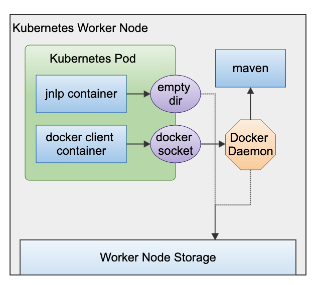
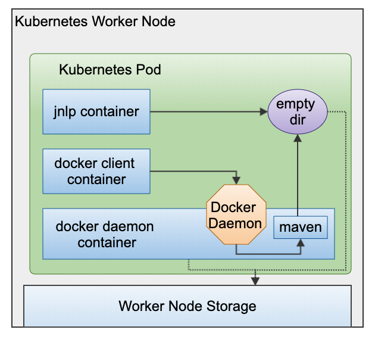

title: Jenkins Docker-in-Docker With PodTemplate
description: Jenkins on Kubernetes building with Docker in Docker via PodTemplate

# Docker-in-Docker With PodTemplates

First of all, doing Docker-In-Docker is a controversial practice to begin with[^1], creating just as many problems as it solves.

Second, if you're in [Kubernetes, one should not use Docker directly](/blogs/docker-alternatives/).

Ok, all caveats aside, there can be legitimate reasons for wanting to run Docker containers directly even in Kubernetes.

## Scenario: Pipeline Framework Based On Docker

I created the solution in this article for a client.
This client has created a internal framework around Jenkins Pipeline[^3].

This pipeline processes the requirements off the pipeline run and spins up the appropriate containers in parallel.
Running parallel container [can also be done with PodTemplates via the Kubernetes Plugin](/jenkins-pipeline/jenkins-parallel-pipeline/), which was deemed the way forward.

However, as one can expect, you do not rewrite a framework used by dozens of applications unless you're reasonably sure you can get everything to run as it should.
In order to bridge this period of running the pipelines as is, while evaluating Jenkins on Kubernetes, we got to work on achieving Docker-in-Docker with Jenkins Kubernetes Plugin[^4].

### Goal

The goal of the exercise, is to prove we can do a single git clone, and spin up multiple containers re-using the original namespace.

### Docker Socket

There's many ways to spin up Docker containers, and I would say the most common one is know as ***Docker-in-Docker*** or `dind`.

I find this misleading, because most of the time the second container doesn't run inside the original container, but parallel to it.
This is often achieved by mounting the docker socket as a volume - `/var/run/docker.sock` .
I call this: `Docker-On-Docker`. Because I want to stay close to the term Docker-in-Docker, but also signify it is different.

What Docker-In-Docker should be, is that we host a docker daemon in a docker container, which then hosts the new containers in itself.

Before we go into the differences, let's discuss why it matters.
Remember, the goal is to be able to re-use the git clone in the original container.
The default container with Jenkins Kubernetes Plugin is the ***jnpl***, which acts as an ephemeral agent.
It mounts a `emptyDir{}` as temporary volume as its workspace, which means this folder only exists within the Pod (practically speaking).

### Docker-On-Docker

Classic Docker-On-Docker, we have a VM which has a Docker Daemon.
We have a Docker client container which mounts the docker socket.
The docker client now pretends to talk to a local Docker Daemon, but this redirects to the VM's daemon instead.

When we do a `docker run`, the daemon will spawn a new container *next* to us.
While this is nice, and stays clear from virtulization inception, this new container - let's say, a `maven`container - cannot access our workspace.
Any volume flag we give to our container with `-v {origin}:{target}` maps a Host directory to our new container, but not the workspace volume (purple) in our Pod.

This is because the new container cannot access any volume inside the Pod. For this, we need true Docker-In-Docker.



#### Jenkinsfile Example

```groovy
podTemplate(yaml: """
apiVersion: v1
kind: Pod
spec:
  containers:
  - name: docker
    image: docker:1.11
    command: ['cat']
    tty: true
    volumeMounts:
    - name: dockersock
      mountPath: /var/run/docker.sock
  volumes:
  - name: dockersock
    hostPath:
      path: /var/run/docker.sock
"""
  ) {

  def image = "jenkins/jnlp-slave"
  node(POD_LABEL) {
    stage('Build Docker image') {
      git 'https://github.com/jenkinsci/docker-jnlp-slave.git'
      container('docker') {
        sh "docker build -t ${image} ."
      }
    }
  }
}
```

### Docker-In-Docker

True Docker-In-Docker means spinning up another container inside an existing container - as illustrated below.

This has a big benefit. The container now has access to all the volumes inside the Pod.
We can now do a git clone and use docker build on this workspace.
In addition, we can also spin up a new container and give it the workspace as a volume and have it build with it.



### Pod Configuration

The examples below contain some specific configuration elements required to make the magic happen.
So let's explore each configuration item to see what it does and why we set it.

#### Client Container

The Docker Client has to know where the Docker Daemon is.

We do this by setting the environment variable `DOCKER_HOST`[^2] to `tcp://localhost:2375`.
If we put the Daemon container within the same Pod, we can use `localhost` and then the default port of the daemon, being `2375`.

```yaml
env:
  - name: DOCKER_HOST
    value: tcp://localhost:2375
```

The client container will directly terminate unless we give it something to do.
If we put it to sleep for a significant amount of time, it should be there to execute our every command!

```yaml
command: ['sleep', '99d']
```

#### Daemon Container

As of Docker 18.09 the Docker Daemon container can use TLS, as of 19.03 it is configured by default.[^2]
So either you work around this or get the certificates sorted.

The easiest way around it, is to set the environment variable `DOCKER_TLS_CERTDIR` to `""`, which will disable TLS.

!!! caution
    Disabling TLS is at your OWN risk. Read the docs carefully for what this means[^2].

```yaml
env:
   - name: DOCKER_TLS_CERTDIR
     value: ""
```

In order for the Docker Daemon to create containers, it needs the `privileged` flag set to true.
This should be another warning to you, to be careful of what you do with it!

```yaml
securityContext:
  privileged: true
```

Last but not least, we would not want to store all the Docker Daemon data in the pods.
We might as well leverage local storage or a some specific volume.

The `volume` and `volumeMounts` configuration of the Daemon container ensures we can leverage the Docker build and image caches.

```yaml
  volumeMounts:
    - name: cache
      mountPath: /var/lib/docker
volumes:
  - name: cache
    hostPath:
      path: /tmp
      type: Directory
```


??? example "Docker Build"

    Now that we can directly use Docker to build, we can also leverage `buildkit`[^7].

    Because we have the workspace available to us, we can directly start our docker build.

    ```groovy
    pipeline {
        options {
            disableConcurrentBuilds()
        }
        agent {
            kubernetes {
                label 'docker-in-docker-maven'
                yaml """
    apiVersion: v1
    kind: Pod
    spec:
    containers:
    - name: docker-client
      image: docker:19.03.1
      command: ['sleep', '99d']
      env:
        - name: DOCKER_HOST
          value: tcp://localhost:2375
    - name: docker-daemon
      image: docker:19.03.1-dind
      env:
        - name: DOCKER_TLS_CERTDIR
          value: ""
      securityContext:
        privileged: true
      volumeMounts:
          - name: cache
            mountPath: /var/lib/docker
    volumes:
      - name: cache
        hostPath:
          path: /tmp
          type: Directory
    """
            }
        }
        stages {
            stage('Checkout') {
                steps {
                    git 'https://github.com/jenkinsci/docker-jnlp-slave.git'
                }
            }
            stage('Docker Build') {
                steps {
                    container('docker-client') {
                        sh 'docker version && DOCKER_BUILDKIT=1 docker build --progress plain -t testing .'
                    }
                }
            }
        }
    }
    ```

??? example "Docker Run With Workspace"

    In this example we're going to spin up another container to run our build with maven.

    This means it needs our workspace - see below - but it will also download a lot of Maven depencencies.
    We want to make sure we can leverage a local Maven Repository in order to speed up builds.

    We can do so by mounting a volume - or a `hostPath` to our Docker Client container.

    ```yaml
    volumeMounts:
      - name: cache
      mountPath: /tmp/repository
    ```

    We can then mount this into our new container via the Docker volume flag (`-v`).

    ```
    -v /tmp/repository:/root/.m2/repository
    ```

    Here we mount the workspace from our Jenkins Build. 
    Notice the double quotes - in the pipeline below - this means we interpolate our Jenkins Environment variables.

    ```
    -v ${WORKSPACE}:/usr/src/mymaven 
    ```

    The `-w` flag means ***work directory***, it makes sure our container works in the directory container our workspace.

    ```
    -w /usr/src/mymaven
    ```


    ```groovy
    pipeline {
        options {
            disableConcurrentBuilds()
        }
        agent {
            kubernetes {
                label 'docker-in-docker-maven'
                yaml """
    apiVersion: v1
    kind: Pod
    spec:
    containers:
    - name: docker-client
      image: docker:19.03.1
      command: ['sleep', '99d']
      env:
        - name: DOCKER_HOST
          value: tcp://localhost:2375
      volumeMounts:
        - name: cache
          mountPath: /tmp/repository
    - name: docker-daemon
      image: docker:19.03.1-dind
      env:
        - name: DOCKER_TLS_CERTDIR
          value: ""
      securityContext:
        privileged: true
      volumeMounts:
        - name: cache
          mountPath: /var/lib/docker
    volumes:
      - name: cache
        hostPath:
          path: /tmp
          type: Directory
    """
            }
        }
        stages {
            stage('Checkout') {
                steps {
                    git 'https://github.com/joostvdg/jx-maven-lib.git'
                }
            }
            stage('Build') {
                steps {
                    container('docker-client') {
                        sh "docker run -v ${WORKSPACE}:/usr/src/mymaven -v /tmp/repository:/root/.m2/repository -w /usr/src/mymaven maven:3-jdk-11-slim mvn clean verify"
                    }
                }
            }
        }
    }
    ```

## References

[^1]: [Using Docker-in-Docker - Jerome Petazzo](https://jpetazzo.github.io/2015/09/03/do-not-use-docker-in-docker-for-ci/)
[^2]: [Docker images on Dockerhub](https://hub.docker.com/_/docker?tab=description)
[^3]: [Jenkins Pipeline](https://jenkins.io/doc/book/pipeline/)
[^4]: [Jenkins Kubernetes Plugin](https://github.com/jenkinsci/kubernetes-plugin)
[^5]: [Jenkins Kubernetes Plugin - Docker In Docker Example](https://github.com/jenkinsci/kubernetes-plugin/blob/master/examples/dind.groovy)
[^6]: [Jenkins Kubernetes Plugin - Docker On Docker Example](https://github.com/jenkinsci/kubernetes-plugin/blob/master/examples/dood.groovy)
[^7]: [Docker Build Enchancements - Buildkit](https://docs.docker.com/develop/develop-images/build_enhancements/)
