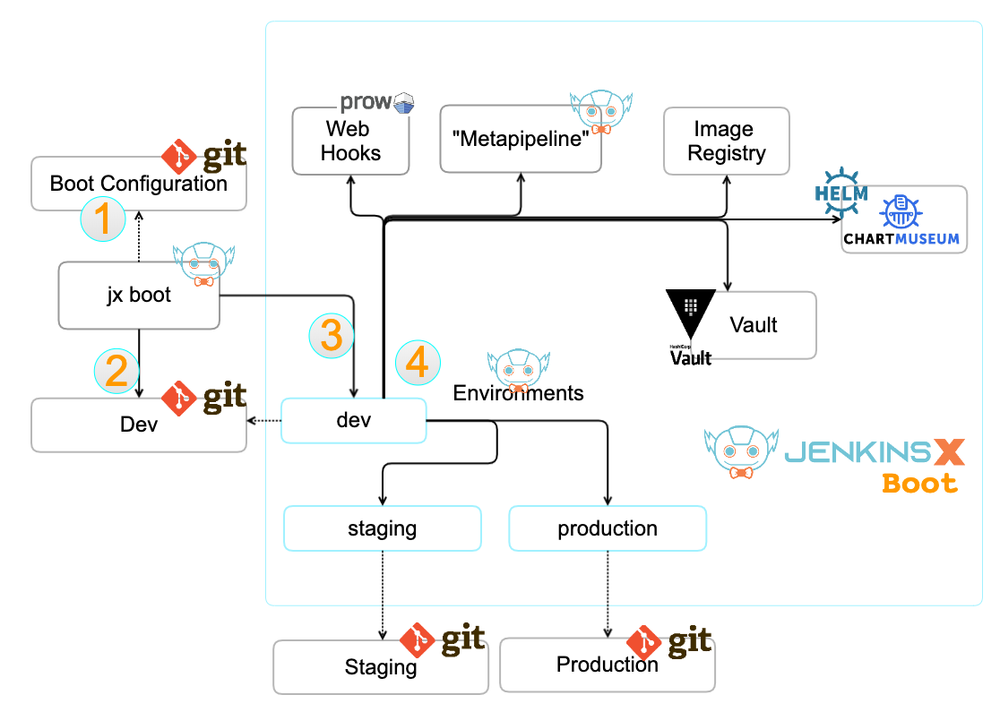

title: Jenkins X - JX Boot on GKE
description: Installing Jenkins X on GKE with jx boot (GitOps) + CloudDNS + TLS + Vault

# Jenkins X Boot

## What Is Jenkins X Boot

Jenkins X Boot is a way to install Jenkins X via the principles of *Configuration-as-Code* and *GitOps*.

What it does, is to run an initial pipeline that creates a `dev` environment repository. 
This repository contains all the information in order to install Jenkins X.

Once the `dev` environment (in Kubernetes) and it's backing git repository are created, it can run a pipeline to install the rest of Jenkins X.

### Process

1. You start with a configuration repository (boot config)
    * if you don't have one, Jenkins X will first create one for you
1. From there, Jenkins X will create the `dev` environment repository
1. Next Jenkins X leverages the repository to create the `dev` environment in your Kubernetes cluster
1. The pipeline of this dev environment will checkout the dev repository and install Jenkins X

### Architecture



## CloudBees Jenkins X Distribution

[CloudBees Jenkins X Distribution](https://docs.cloudbees.com/docs/cloudbees-jenkins-x-distribution/latest/) (or `CJXD`) is a version of Jenkins X maintained and supported by [CloudBees](https://www.cloudbees.com). It is often abreviated to `CJXD` for convenience.

There are three main differences between regular Jenkins X and CloudBees Jenkins X:

* there is more focus on stabilty and less on features, the release cadence is therefor once a month
* this distribution allows you to get paid support from CloudBees
* it contains a Web UI

As Jenkins X, this is also free (as in beer) software.

### Get CJXD

To use CJXD, you have to download the [CloudBees distribution](https://docs.cloudbees.com/docs/cloudbees-jenkins-x-distribution/latest/install-guide/macos) rather than relying on installes such as Homebrew or Chocolatey.

Before you can then leverage the additional features included - such as the UI - you have to set the *profile* to CloudBees.
To do so, run `jx profile cloudbees`.


## Initialize

* install [jx cli binary](https://jenkins-x.io/docs/getting-started/setup/install/)
* create a Kubernetes cluster
* initialize `jx` via [jx boot](https://jenkins-x.io/commands/jx_boot/) -> `jx boot`
* update `jx-requirements.yml` of your *boot configuration*  repository
* 


## Install On GKE

First, install a Kubernetes Cluster on Google Cloud GKE.
Either directly via Google's [gcloud](/kubernetes/distributions/install-gke/) CLI or via [Terraform](/kubernetes/distributions/gke-terraform/).

### Things To Know

#### Single Service Account

Currently - as of November 2019 - Jenkins X with `jx boot` on GKE still uses the default service account of the account used to create the cluster.

This is not the ideal situation, and is being worked upon. You can track the progress via GitHub issue [#5856](https://github.com/jenkins-x/jx/issues/5856).


## Useful Commands

!!! example "Restart From Specific Step"

    If you do not want to redo the entire `jx boot` process, you can start from a specific step.

    For example, if you changed the envionments configuration, you can start with the step `install-env`.

    ```bash
    jx boot --start-step install-env
    ```

!!! example "Confirm Jenkins X Status"

    ```bash
    jx status
    ```

## Add CJXD UI

If you use the CloudBees Jenkins X Distribution (CJXD), you can also install a web UI.

```
jx add app jx-app-ui --version=0.1.2
```

This will make a PR, which, when merged launches a Master Promotion build.

```
jx get activities --watch --filter environment-dev
```

```
jx get build log
```

```
jx ui -p 8081
```

## Add Environment

As of this writing - November 2019 - adding a new environment to Jenkins X with Config as Code is a bit tedious.

* https://jenkins-x.io/docs/managing-jx/faq/boot/#how-do-i-add-new-environments

### Create Environment

* copy existing resources into new (`env/templates/`) see `Get Resources`
* update values to suit new environment
* execute `jx boot`
* configure tls
  * cloud dns zone
  * external dns secret
  * dns domain forward
  * add cert and issuer to env repo
* if the environment has a separate domain, edit `exdns-external-dns` deployment
  * `kubectl edit deployment -n jx exdns-external-dns`

#### Get Resources

```
kubectl get env staging -oyaml > env/templates/cb.yaml
kubectl get sr joostvdg-env-cjxd-staging -oyaml > env/templates/cb-sr.yaml
```

#### Configure TLS

##### Configure Certificate & Issuer

If you want TLS certificates for your new Environment, you will configure this yourself.

The easiest way is to copy the current `CertificateIssuer` and `Certificate` from `jx` namespace and modify the data.

```
kubectl get issuer -n jx letsencrypt-prod -oyaml > env/templates/issuer.yaml
kubectl get cert -n jx tls-dev-cjxd-kearos-net-p -oyaml > env/templates/certificate.yaml
```

* Rename the namespace to your namespace
* Rename `domain` and `host` names to the new (sub-)domain
* Remove `status` segment
* Remove kubernetes managed fields (`uuid`, timestamps, etc)

```
git add env/
git commit -m "add certs"
```

```
git push
jx get activities -w
```

##### Create Cloud DNS Zone

If you leverage Cloud DNS and your new environment has a unique sub-domain, you have to create a new zone.

A zone in Google's CloudDNS has three values:

* **name**: the name of the configuration item in GCP
* **description**: the description of the configuration item
* **DNS Name**: the actual DNS name

```
ZONE_NAME=cb-cjxd-kearos-net
DESCRIPTION="joostvdg - cb env for cjxd"
DNS_NAME=cb.cjxd.kearos.net
```

```
gcloud dns managed-zones create ${ZONE_NAME} --description=${DESCRIPTION} --dns-name=${DNS_NAME}
```

Once you've created the new zone, you will have to update your Domain provider to point the subdomain to the DNS servers of this new Zone.


##### Configure CloudDNS Secrets

If you leverage CloudDNS, you will also have to copy over the CloudDNS configuration from the `jx` namespace to your new Environment's namespace.

```
kubectl get secret -n jx exdns-external-dns-token-cq5mv -oyaml > exdns-external-dns-token-env-cb.yaml
kubectl get secret -n jx external-dns-gcp-sa -oyaml > external-dns-gcp-sa-env-cb.yaml
```

* Rename the namespace to your namespace
* remove `status` segment
* remove kubernetes managed fields (`uuid`, timestamps, etc)

```
kubectl apply -f exdns-external-dns-token-env-cb.yaml
kubectl apply -f external-dns-gcp-sa-env-cb.yaml
```

#### Confirm Certificate Works

```
kubectl get cert -n cloudbees
```

## Common Issues

### ImagePullBackup

```
events:
  Type     Reason     Age                   From                                         Message
  ----     ------     ----                  ----                                         -------
  Normal   Scheduled  18m                   default-scheduler                            Successfully assigned jx-staging/jx-jx-qs-spring-boot-6-58b75446b4-pkd7x to gke-joost-cjxd-pool2-54e21b2f-hlhd
  Normal   Pulling    16m (x4 over 18m)     kubelet, gke-joost-cjxd-pool2-54e21b2f-hlhd  Pulling image "gcr.io/ps-dev-201405/jx-qs-spring-boot-6:0.0.1"
  Warning  Failed     16m (x4 over 18m)     kubelet, gke-joost-cjxd-pool2-54e21b2f-hlhd  Failed to pull image "gcr.io/ps-dev-201405/jx-qs-spring-boot-6:0.0.1": rpc error: code = Unknown desc = Error response from daemon: unauthorized: You don't have the needed permissions to perform this operation, and you may have invalid credentials. To authenticate your request, follow the steps in: https://cloud.google.com/container-registry/docs/advanced-authentication
  Warning  Failed     16m (x4 over 18m)     kubelet, gke-joost-cjxd-pool2-54e21b2f-hlhd  Error: ErrImagePull
  Normal   BackOff    8m24s (x42 over 18m)  kubelet, gke-joost-cjxd-pool2-54e21b2f-hlhd  Back-off pulling image "gcr.io/ps-dev-201405/jx-qs-spring-boot-6:0.0.1"
  Warning  Failed     3m18s (x64 over 18m)  kubelet, gke-joost-cjxd-pool2-54e21b2f-hlhd  Error: ImagePullBackOff
```

Then you're missing scopes in your GKE Node's.

```terraform
resource "google_container_node_pool" "nodepool2" {
  ... 
  node_config {
    machine_type = "n2-standard-2"
    oauth_scopes = [
      "https://www.googleapis.com/auth/compute",
      "https://www.googleapis.com/auth/devstorage.read_only",
      "https://www.googleapis.com/auth/logging.write",
      "https://www.googleapis.com/auth/monitoring",
    ]
  }
  ...
}
```

### Unable To Enable DNS API

```
valid: there is a Secret: external-dns-gcp-sa in namespace: jx
error: unable to enable 'dns' api: failed to run 'gcloud services list --enabled --project XXXXXX' command in directory '', output: 'ERROR: (gcloud.services.list) User [XXXXXX857-compute@developer.gserviceaccount.com] does not have permission to access project [XXXXXX] (or it may not exist): Request had insufficient authentication scopes.'
```

```
valid: there is a Secret: external-dns-gcp-sa in namespace: jx
error: unable to enable 'dns' api: failed to run 'gcloud services list --enabled --project GCP PROJECT B' command in directory '', output: 'ERROR: (gcloud.services.list) User [389413650857-compute@developer.gserviceaccount.com] does not have permission to access project [GCP PROJECT B] (or it may not exist): Request had insufficient authentication scopes.'

Pipeline failed on stage 'release' : container 'step-create-install-values'. The execution of the pipeline has stopped.
```

* Have to enable "Service Usage API": https://console.developers.google.com/apis/api/serviceusage.googleapis.com/overview?project=<PROJECTID>
* node pools (for example in terraform) need access to the security scope `https://www.googleapis.com/auth/cloud-platform`

```terraform
oauth_scopes = [
    "https://www.googleapis.com/auth/cloud-platform"
]
```

### Certmanager complaining about the wrong domain

In case Cert-Manager is complaining that while validating `x.y.example.com` it cannot find `example.com`.

See: https://github.com/jetstack/cert-manager/issues/1507

```
I1104 09:13:33.884549       1 base_controller.go:187] cert-manager/controller/challenges "level"=0 "msg"="syncing item" "key"="cloudbees/tls-cb-cjxd-kearos-net-p-2383487961-0"
I1104 09:13:33.884966       1 dns.go:104] cert-manager/controller/challenges/Present "level"=0 "msg"="presenting DNS01 challenge for domain" "dnsName"="cloudbees.cjxd.kearos.net" "domain"="cloudbees.cjxd.kearos.net" "resource_kind"="Challenge" "resource_name"="tls-cb-cjxd-kearos-net-p-2383487961-0" "resource_namespace"="cloudbees" "type"="dns-01"
E1104 09:13:34.141122       1 base_controller.go:189] cert-manager/controller/challenges "msg"="re-queuing item  due to error processing" "error"="No matching GoogleCloud domain found for domain kearos.net." "key"="cloudbees/tls-cb-cjxd-kearos-net-p-2383487961-0"
```

## Reset Installation

### Remove Environment Repos

* go to git and remove environment repo
* clear jx boot config folder
* clear cloud dns config (if used)
* clear requirements from env repo's if re-used

## Recreate Git Token

If for some reason the git token is invalid, you [can recreate it with the commands below](https://jenkins-x.io/docs/managing-jx/faq/issues/#invalid-git-token-to-scan-a-project).

```
jx delete git token -n github <yourUserName>
jx create git token -n github <yourUserName>
```

## References

* [Jenkins X - Managing FAQ](https://jenkins-x.io/docs/managing-jx/faq/)
* [Jenkins X - Using FAQ](https://jenkins-x.io/docs/using-jx/faq/)
* [Jenkins X - Pipeline FAQ](https://jenkins-x.io/docs/using-jx/faq/pipelines/#how-do-i-override-a-step)
* [Jenkins X - Boot FAQ](https://jenkins-x.io/docs/managing-jx/faq/boot/)
* [Jenkins X - Configure CloudDNS](https://jenkins-x.io/docs/reference/components/vault/#configuring-google-cloud-dns)
* [Jenkins X - Add New Environment](https://jenkins-x.io/docs/managing-jx/faq/boot/#how-do-i-add-new-environments)