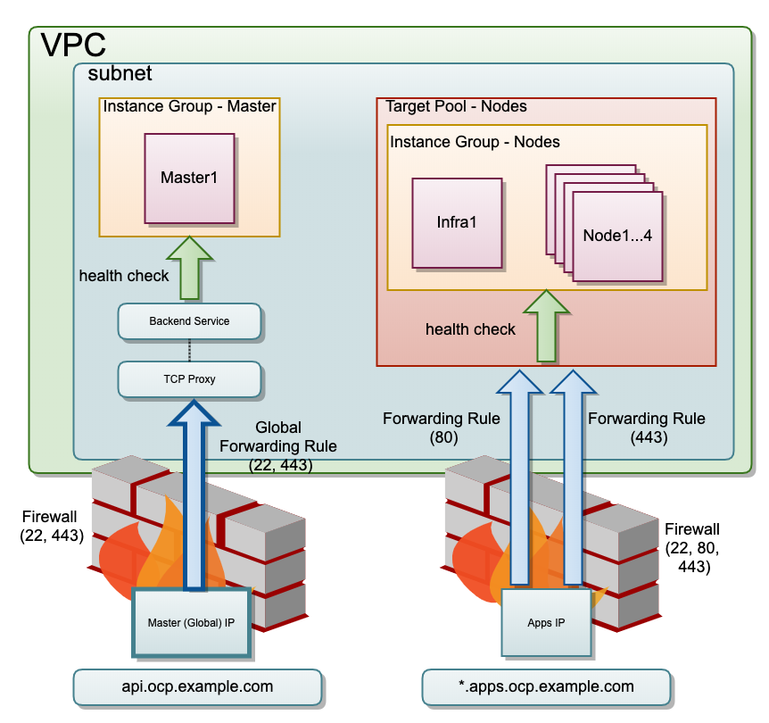

title: OpenShift 3.11 on GCP (Medium)
description: Installing RedHat OpenShift 3.11 on GCP a little more than minimal
Hero: OpenShift 3.11 on GCP - Medium

# RedHat OpenShift 3.11 on GCP - Medium

Initially, I wrote a guide to get [RedHat OpenShift 3.11 running on Google Cloud (GCP) with minimal effort](/openshift/rhos311-gcp-minimal/). It is based on the GCP guide from RedHat[^1], but limiting the configuration options to the bare minimum.

So, why another guide? Well, I wanted to go a few steps further. Creating a separated network to make the cluster more secure. I also want to ensure the Domain Name, IP, and load balancing are automated to improve the OpenShift installation.

I will guide you in creating a secured network, with an automated DNS configuration,  and automated TLS for our endpoints.

!!! note
    This guide is written early March 2020, using `jx` version `2.0.1212` and OpenShift version `v3.11.170`.

## Pre-requisites

What do we need to get started?

* active GCP account with billing enabled
* GCP project
* gcloud tool installed
* terraform `0.12`+  installed
* active RedHat account
    * which hasn't used its 60 day trial license of OpenShift yet
* domain name registration which can forward subdomains to name servers (class `CNAME`)

!!! important
    This doc contains a prefix for the VM's created in GCP. This prefix is set to `<prefix>`.
    Next to that, the user used, is set to `my_user`.

    You probably want to change that, so please take care with copy-pasting!

## Process

* create Terraform configuration for GCP VM's
* create the VM's in GCP with RedHat Enterprise Linux v7
* configure dns
* install OpenShift pre-requisites on each VM
* create OpenShift Ansible configuration
* install OpenShift via Ansible
* create initial users

## GCP Terraform

### What Do We Need

Having gone through the process of installing RHOS 3.11 once, I ran into an issue. The documentation makes it seems you only need `master` nodes, `compute` nodes and VM's for `etcd` (can be the same as `Master`). However, you also need at least one `infra` node.

You can opt for a HA cluster, with three `master` nodes, or a single `master` node for a test cluster. I'm going with the latter.
The `master` node will house the Kubernetes Control Plane, the `infra` node will house the OpenShift infra.
As we won't have cluster autoscaling - a bit fancy for a manual test cluster - we have to make sure the machines are beefy to take the entire workload.

Another thing we need for OpenShift, is having DNS that works between the nodes. For example, you should be able to say `node1` and end up at the correct machine. Due to GCP networking, this internal DNS works out-of-the-box for any machine with our network/project.

!!! important
    Our machines need to have unique names!

So I ended up with the following:

* 1x  `master` node -> `n1-standard-8`: 8 cores, 30gb mem
* 1x `infra` node ->  `n1-standard-8`: 8 cores, 30gb mem
* 4x `compute` node -> `n1-standard-4`: 4 cores, 15gb mem (each)

### VM Image

Of course, if you want to run RedHat OpenShift Enterprise (RHOS), your VM's need to run a RedHat Enterprise Linux distribution(RHEL).

In order to figure out which vm images are currently available, you can issue the following command via `gcloud`.

```bash
gcloud compute images list --project rhel-cloud
```

Which should give a response like this:

```bash
NAME                                                  PROJECT            FAMILY                            DEPRECATED  STATUS
rhel-6-v20200205                                      rhel-cloud         rhel-6                                        READY
rhel-7-v20200205                                      rhel-cloud         rhel-7                                        READY
rhel-8-v20200205                                      rhel-cloud         rhel-8                                        READY
```

For the VM image in our Terraform configuration, we will use the `NAME` of the image.
For RHOS 3.11, RedHat strongly recommends using RHEL 7, so we use `rhel-7-v20200205`.

### Terraform Configuration

Google Cloud networking can get a bit complicated. In order to make the configuration easier to digest, I've created the Terraform configuration in the form of Terraform Modules[^2].

There are four modules:

* **Instance**: VM image definition
* **IP**: static IP's and CloudDNS configuration
* **LB**: load balancers, port forwards and health checks 
* **VPC**: `vpc`, subnet, and firewalls

There are two main benefits to using the modules;

* the modules means we can reuse the terraform code - especially nice for the instances
* it is easier to port the outcome of one resource - for example an IP address - as input to another

For this case, each module - except `IP` - will have three files:

1. **main.tf**: contains the resource definitions of this module
1. **variables.tf**: contains the input for the module
1. **outputs.tf**: export values from created resources, to be used by other modules/resources

In the main folder we have:

* **main.tf**: creating the resources via the modules
* **variables.tf**: input variables
* **storage.tf**: Google Bucket[^3] as backing storage for the OpenShift (Docker) Registry[^4]

#### Model



#### Terraform Module IP

??? example "main.tf"

    ```Terraform
    resource "google_compute_global_address" "master" {
        name = "master"
    }

    resource "google_compute_address" "nodes" {
        name = "nodes"
    }

    resource "google_dns_record_set" "ocp" {
        name = "api.${google_dns_managed_zone.my_ocp_domain.dns_name}"
        type = "A"
        ttl  = 300
        managed_zone = google_dns_managed_zone.my_ocp_domain.name
        rrdatas = [google_compute_global_address.master.address]
    }

    resource "google_dns_record_set" "apps" {
        name = "*.apps.${google_dns_managed_zone.my_ocp_domain.dns_name}"
        type = "A"
        ttl  = 300
        managed_zone = google_dns_managed_zone.my_ocp_domain.name
        rrdatas = [google_compute_address.nodes.address]
    }

    resource "google_dns_managed_zone" "my_ocp_domain" {
        name     = "my-ocp-domain"
        dns_name = "my.ocp.domain."
    }
    ```

??? example "outputs.tf"

    ```Terraform
    output "master_ip" {
        value = google_compute_global_address.master.address
    }

    output "nodes_ip" {
        value = google_compute_address.nodes.address
    }
    ```

#### Terraform Module VPC

??? example "main.tf"

    ```Terraform
    resource "google_compute_network" "vpc_network" {
        name                                 =  var.vpc_name
        auto_create_subnetworks = "false"
        routing_mode                   = "GLOBAL"
    }

    resource "google_compute_subnetwork" "vpc_subnet_int" {
        name                         =  var.network_name_int
        ip_cidr_range            = var.network_name_int_range
        network                     = google_compute_network.vpc_network.self_link
        region                        = var.region
        private_ip_google_access = true
    } 

    resource "google_compute_firewall" "fw_access" {
        name    = "my-rhos311-fw-ext"
        network = google_compute_network.vpc_network.name

        allow {
            protocol = "icmp"
        }

        allow {
            protocol = "tcp"
            ports    = ["22", "80", "443"]
        }
        source_ranges = ["0.0.0.0/0"]
    }

    resource "google_compute_firewall" "fw_gcp_health_checks" {
        name    = "my-rhos311-fw-gcp-health-checks"
        network = google_compute_network.vpc_network.name

        allow {
            protocol = "tcp"
            ports    = ["0-65535"]
        }

        source_ranges = ["35.191.0.0/16","130.211.0.0/22"]
    }

    resource "google_compute_firewall" "allow-internal" {
        name    = "my-rhos311-fw-int"
        network = google_compute_network.vpc_network.name

        allow {
            protocol = "icmp"
        }
        
        allow {
            protocol = "tcp"
            ports    = ["0-65535"]
        }
        
        allow {
            protocol = "udp"
            ports    = ["0-65535"]
        }
        source_ranges = [
            var.network_name_int_range
        ]
    }
    ```

??? example "variables.tf"

    ```Terraform
    variable "region" {}
    variable "vpc_name" {}
    variable "network_name_int" {}

    variable "network_name_int_range" {
        default = "10.26.1.0/24"
    }
    ```

??? example "outputs.tf"

    ```Terraform
    output "vpc_link" {
        value = "${google_compute_network.vpc_network.self_link}"
    }

    output "vpc_subnet_int" {
        value =   "${google_compute_subnetwork.vpc_subnet_int.self_link}"
    }
    ```

#### Terraform Module LB

??? example "main.tf"

    ```Terraform
    resource "google_compute_health_check" "master" {
        name         = "https"
        healthy_threshold = 3
        unhealthy_threshold = 3
        timeout_sec        = 10
        check_interval_sec = 10
        https_health_check {
            request_path = "/healthz"
            port = "443"
        }
    }

    resource "google_compute_http_health_check" "nodes" {
        name         = "nodes"
        request_path = "/healthz"
        port = 1936
        healthy_threshold = 3
        unhealthy_threshold = 3
        timeout_sec        = 10
        check_interval_sec = 10
    }

    resource "google_compute_backend_service" "master" {
        name          = "backend-service-master"
        health_checks = [ "${google_compute_health_check.master.self_link}" ]
        # load_balancing_scheme  = "EXTERNAL"
        protocol = "TCP"
        session_affinity =  "CLIENT_IP"
        port_name   = "ocp-api"
        backend {
            group = var.instance_group_master
        }
    }

    resource "google_compute_target_tcp_proxy" "master_tcp_proxy" {
        name            = "master-tcp-proxy"
        backend_service = google_compute_backend_service.master.self_link
    }

    resource "google_compute_global_forwarding_rule" "master_forwarding" {
        name                  = "master-forwarding"
        ip_address         = var.master_ip
        target                = google_compute_target_tcp_proxy.master_tcp_proxy.self_link
        port_range            = 443
    }

    resource "google_compute_target_pool" "nodes" {
        name = "nodes"

        instances = var.instance_group_nodes

        health_checks = [
            google_compute_http_health_check.nodes.name
        ]
    }

    resource "google_compute_forwarding_rule" "network-load-balancer-http" {
        name                  = "network-load-balancer-http"
        ip_address         = var.nodes_ip
        target                  =   google_compute_target_pool.nodes.self_link
        port_range            = "80"
        ip_protocol           = "TCP"
    }

    resource "google_compute_forwarding_rule" "network-load-balancer-https" {
        name                  = "network-load-balancer-https"
        ip_address         = var.nodes_ip
        target                =     google_compute_target_pool.nodes.self_link
        port_range            = "443"
        ip_protocol           = "TCP"
    }
    ```

??? example "variables.tf"

    ```Terraform
    variable "region" {}
    variable "instance_group_master" {}
    variable "instance_group_nodes" {}
    variable "master_ip" {}
    variable "nodes_ip" {}
    ```

??? example "outputs.tf"

    ```Terraform
    output "health_check_master" {
        value =  "${google_compute_health_check.master.self_link}"
    }

    output "health_check_nodes" {
        value =  "${google_compute_http_health_check.nodes.self_link}"
    }
    ```

#### Terraform Module Instance

??? example "main.tf"

    ```Terraform
    resource "google_compute_instance" "instance" {
        name         = "${var.prefix}-${var.instance_name}"
        machine_type = var.machine_type
        zone         = var.zone
        allow_stopping_for_update = true

        boot_disk {
            initialize_params {
                image = var.vm_image
                size = var.disk_size
                type = "pd-ssd"
            }
        }

        network_interface {
            network = var.network
            subnetwork = var.vpc_subnet_int
            access_config  {
                # gives the node an external IP address
                # not sure if this is still required?
            }
        }

        metadata = {
            ssh-keys = var.ssh_key
        }
        service_account {
            scopes = [
                "https://www.googleapis.com/auth/compute",
                "https://www.googleapis.com/auth/devstorage.read_only",
                "https://www.googleapis.com/auth/logging.write",
                "https://www.googleapis.com/auth/monitoring",
                "https://www.googleapis.com/auth/ndev.clouddns.readwrite",
                "https://www.googleapis.com/auth/cloud-platform"
            ]
        }
    }
    ```

??? example "variables.tf"

    ```Terraform
    variable "machine_type" {
        default = "n1-standard-4"
    }

    variable "vm_image" {
        default ="rhel-7-v20200205"
    }

    variable "disk_size" {
        default = 100
    }

    variable "ssh_key" {}
    variable "prefix" {}
    variable "instance_name" { }
    variable "zone" {}
    variable "network" {}
    variable "vpc_subnet_ext" {}
    variable "vpc_subnet_int" {}
    ```

??? example "outputs.tf"

    ```Terraform
    output "link" {
        value = "${google_compute_instance.instance.self_link}"
    }
    ```

#### Terraform Main

??? example "main.tf"

    ```Terraform
    terraform {
        required_version = "~> 0.12"
    }

    # https://www.terraform.io/docs/providers/google/index.html
    provider "google" {
        version   = "~> 2.18.1"
        project   = var.project
        region    =  var.region
        zone      = "europe-west4-b"
    }

    module "vpc" {
        source = "./modules/vpc"
        region = var.region
        vpc_name = "vpc-my-rhos311"
        network_name_int = "network-my-rhos311-int"
        network_name_ext = "network-my-rhos311-ext"
    }

    module "master1" {
        source = "./modules/instance"
        machine_type = "n1-standard-8"
        instance_name = "master1"
        prefix = var.instance_prefix
        network = module.vpc.vpc_link
        vpc_subnet_int = module.vpc.vpc_subnet_int
        vpc_subnet_ext = module.vpc.vpc_subnet_ext
        zone = var.zone
        ssh_key = "my_user:${file("~/.ssh/id_rsa.pub")}"
    }

    module "infra1" {
        source = "./modules/instance"
        machine_type = "n1-standard-8"
        instance_name = "infra1"
        prefix = var.instance_prefix
        network = module.vpc.vpc_link
        vpc_subnet_int = module.vpc.vpc_subnet_int
        vpc_subnet_ext = module.vpc.vpc_subnet_ext
        zone = var.zone
        ssh_key = "my_user:${file("~/.ssh/id_rsa.pub")}"
    }

    module "node1" {
        source = "./modules/instance"
        instance_name = "node1"
        prefix = var.instance_prefix
        network = module.vpc.vpc_link
        vpc_subnet_int = module.vpc.vpc_subnet_int
        vpc_subnet_ext = module.vpc.vpc_subnet_ext
        zone = var.zone
        ssh_key = "my_user:${file("~/.ssh/id_rsa.pub")}"
    }

    module "node2" {
        source = "./modules/instance"
        instance_name = "node2"
        prefix = var.instance_prefix
        network = module.vpc.vpc_link
        vpc_subnet_int = module.vpc.vpc_subnet_int
        vpc_subnet_ext = module.vpc.vpc_subnet_ext
        zone = var.zone
        ssh_key = "my_user:${file("~/.ssh/id_rsa.pub")}"
    }

    module "node3" {
        source = "./modules/instance"
        instance_name = "node3"
        prefix = var.instance_prefix
        network = module.vpc.vpc_link
        vpc_subnet_int = module.vpc.vpc_subnet_int
        vpc_subnet_ext = module.vpc.vpc_subnet_ext
        zone = var.zone
        ssh_key = "my_user:${file("~/.ssh/id_rsa.pub")}"
    }

    module "node4" {
        source = "./modules/instance"
        instance_name = "node4"
        prefix = var.instance_prefix
        network = module.vpc.vpc_link
        vpc_subnet_int = module.vpc.vpc_subnet_int
        vpc_subnet_ext = module.vpc.vpc_subnet_ext
        zone = var.zone
        ssh_key = "my_user:${file("~/.ssh/id_rsa.pub")}"
    }

    resource "google_compute_instance_group" "master" {
        name = "my-rhos311-master"
        zone =  var.master_zone
        instances = [
            module.master1.link,
        ]

        named_port {
            name = "ocp-api"
            port = "443"
        }
    }

    resource "google_compute_instance_group" "nodes" {
        name = "my-rhos311-nodes"
        zone =  var.master_zone
        instances = [
            module.infra1.link,
            module.node1.link,
            module.node2.link,
            module.node3.link,
            module.node4.link
        ]

        named_port {
            name = "ocp-api"
            port = "1936"
        }
    }
    module "ips" {
        source = "./modules/ip"
    }

    module "lb" {
        source = "./modules/lb"
        region = var.region
        instance_group_master = "${google_compute_instance_group.master.self_link}"
        instance_group_nodes = [
        "${var.zone}/${var.instance_prefix}-infra1",
        "${var.zone}/${var.instance_prefix}-node1",
        "${var.zone}/${var.instance_prefix}-node2",
        "${var.zone}/${var.instance_prefix}-node3",
        "${var.zone}/${var.instance_prefix}-node4"
        ]
        master_ip = module.ips.master_ip
        nodes_ip =  module.ips.nodes_ip
    }
    ```

??? example "variables.tf"

    ```Terraform
    variable "project" { }

    variable "region" {
        default ="europe-west4"
    }

    variable "name" {
        description = "The name of the cluster (required)"
        default     = "jx-openshift-311"
    }

    variable "compute_machine_type" {
        default = "n1-standard-4"
    }

    variable "master_machine_type" {
        default = "n1-standard-8"
    }

    variable "instance_prefix" {
        default ="my-rhos311"
    }

    variable "vm_image" {
    default ="rhel-7-v20200205"
    }

    variable "master_zone" {
        description = "Zone in which the Master Node will be created"
        default = "europe-west4-a"
    }

    variable "zone" {
        default = "europe-west4-a"
    }
    ```

??? example "storage.tf"

    ```Terraform
    resource "google_storage_bucket" "ocp-registry" {
        name          = "my-rhos311-ocp-registry"
        location      = "EU"
    }
    ```

### Create VMs with Terraform

```bash
terraform init
```

```bash
terraform validate
```

```bash
terraform plan -out plan.out
```

```bash
terraform apply "plan.out"
```

We should end up with six nodes:

1. `<prefix>-master1`
1. `<prefix>-infra1`
1. `<prefix>-node1`
1. `<prefix>-node2`
1. `<prefix>-node3`
1. `<prefix>-node4`

### Verify VMs

Before we can install the OpenShift pre-requisites, we verify if the VMs are ready to use.
To verify the VMs, we will do the following:

1. confirm we can `ssh` into each VM
1. confirm we can use `sudo` in each VM
1. confirm the infra node can call each VM by name (`<prefix>-infra1`, `<prefix>-master1`, `<prefix>-node1`, `<prefix>-node2`, `<prefix>-node3`, `<prefix>-node4`)
1. confirm the infra node can `ssh` into all VMs (including itself!)

### SSH into VMs

There are several ways to ssh into the VMs. You can do so via `ssh` installed on your machine, you can do so via the GCP console.
I will use another option, using the `gcloud` CLI, using the ssh key I've configured in Terrafom (` ssh-keys = "my_user:${file("~/.ssh/id_rsa.pub")}"`).

Why am I using this form?
Well, it makes it easier to reason about which machine I ssh into, as I can use the VM *name*.

```bash
# your google project id
PROJECT_ID=
```

```bash
# the google zone the vm is in, for example: europe-west-4a
VM_ZONE=
```

```bash
gcloud beta compute --project $PROJECT_ID ssh --zone $VM_ZONE "<prefix>-infra1"
```

Confirm you can ssh into each VM by changing the zone/name accordingly.

### Confirm Sudo

Our ssh user isn't root - as it should be - so we need to use sudo for some tasks.

Confirm sudo works;

```bash
sudo cat /etc/locale.conf
```

### Confirm Local DNS

The OpenShift installation process and later OpenShift itself, relies on *local dns*.
This means, it assumes if there's a node called `<prefix>-master1`, it can do `ssh <prefix>-master1` and it works.

In GCP, DNS works within a Project by default. So assuming all the VMs  are within the same project this works out-of-the-box.
But, to avoid any surprises later, confirm it.

```bash
[my_user@master ~]$ ping <prefix>-master1
PING master.c.MY_PROJECT_ID.internal (10.164.0.49) 56(84) bytes of data.
64 bytes from <prefix>-master1.c.MY_PROJECT_ID.internal (10.164.0.49): icmp_seq=1 ttl=64 time=0.041 ms
64 bytes from <prefix>-master1.c.MY_PROJECT_ID.internal (10.164.0.49): icmp_seq=2 ttl=64 time=0.094 ms
```

!!! note
    As you might expect, `MY_PROJECT_ID` will be the Google project Id where your VMs are.
    I've hidden that as a safety precaution, confirm it looks correct!

### Infra Node can SSH into others

For the OpenShift installation, our installation VM has to be able to ssh into every other VM[^3]. This doesn't work out of the box.

!!! warning
    I used my own keys here directly, because this is a temporary project only used by me.
    If your usecase is different, and you're not sure how to proceed, consult a security professional!

We have to create the `ssh` public key on every node for our ssh user (in my case, `my_user`) and the private also for our installation host (for example, `<prefix>-infra1`).

This might not be a security best practice, but I did this by copying over my `~/.ssh/id_rsa` and `~/.ssh/id_rsa.pub` to each node's user home (`/home/my_user/.ssh/`).

!!! important 
    Once you've done this, ssh into the `infra` node, and confirm it can ssh to every other node.
    
    * `ssh my_user@<prefix>-node1`
    * `ssh my_user@<prefix>-node2`
    * `ssh my_user@<prefix>-node3`
     * `ssh my_user@<prefix>-node4`
    * `ssh my_user@<prefix>-master1`
    * `ssh my_user@<prefix>-infra1` -> YES, you have to ssh into yourself!

    This is important, because through this step, you can accept the prompt so the installation process can run ***unattended***!

Make sure to set the correct permissions to the `id_rsa` file via `sudo chmod 0400 ~/.ssh/id_rsa`!

### Fix Locale

I kept running into a `locale` warning, about using one that didn't exist on the VM.

If you want to get rid of this, you can change the `/etc/locale.conf` file.

```bash
sudo vim /etc/locale.conf
```

Make sure it looks like this.

```bash
LANG="en_US.UTF-8"
LC_CTYPE="en_US.UTF-8"
LC_ALL=en_US.UTF-8
```

## OpenShift Installation Pre-requisites

Before we can install OpenShift, we have to bring our nodes into a certain state.

We will do the following:

* register our VMs to RedHat
* register our VMs as part of our OpenShift Enterprise license
* configure `yum` for the installation process
* install and configure `docker` for the installation process
* login to the RedHat docker registry

### Register VMs

Please note, these steps have to be done on every VM!

If you use something like `iterm2`[^5], you can save yourself some time by having four parallel sessions for each VM.
You do this by creating a split window (`control` + `command`  + `D`), and once logged in, create a shared `cursor` via `command` + `shift`+ `i`.

We start by installing the subscription manager.

```bash
sudo yum install subscription-manager -y
```

We then register our instance with our RedHat account.

```bash
sudo subscription-manager register --username=<user_name> --password=<password>
```

```bash
sudo subscription-manager refresh
```

Find the OpenShift subscription and you should get a single option. Use the id as the `--pool` in the next command.

```bash
sudo subscription-manager list --available --matches '*OpenShift*'
```

```bash
sudo subscription-manager attach --pool=?
```

### Configure Yum Repos

There's commands to disable each individual repository, but I found it easier to disable all, and then add those we need after.

```bash
sudo subscription-manager repos --disable="*"
sudo yum repolist
```

```bash
sudo yum-config-manager --disable \*
```

### Install Default Packages

As we've disable all of our `yum` repositories, we first add the once we need.

```bash
sudo subscription-manager repos \
    --enable="rhel-7-server-rpms" \
    --enable="rhel-7-server-extras-rpms" \
    --enable="rhel-7-server-ose-3.11-rpms" \
    --enable="rhel-7-server-ansible-2.8-rpms"
```

Once we have a set of usable `yum` repositories, we can then install all the packages we need.

```bash
sudo yum install wget git net-tools bind-utils yum-utils iptables-services bridge-utils bash-completion kexec-tools sos psacct openshift-ansible atomic python-docker-py docker device-mapper-libs device-mapper-event-libs -y
```

!!! note
    There have been some bugs in the past, related to docker versions. If, for some reason, you have to downgrade to a known working version of docker, this is a way of doing that.

    ```bash
    sudo yum downgrade docker-rhel-push-plugin-1.13.1-75.git8633870.el7_5  docker-client-1.13.1-75.git8633870.el7_5 docker-common-1.13.1-75.git8633870.el7_5 docker-1.13.1-75.git8633870.el7_5
    ```

Once we have all the packages installed, make sure they're updated and then we reboot our machines.

```bash
sudo yum update -y
sudo reboot
```

### Install Docker

I sneaked the docker packages into the previous installation command already, so we only have to enable/configure docker at this point.

If you want to configure more details, such as where docker stores its volumes/data, please take a look at RedHat's installation guide[^6].

```bash
sudo systemctl start docker.service
sudo systemctl enable docker.service
```

To confirm docker works:

```bash
sudo systemctl status docker.service
```

Make sure that on each node, your default user can use docker.

```bash
sudo setfacl --modify user:my_user:rw /var/run/docker.sock
```

### Setup Registry Authentication

The images for OpenShift come from RedHat's own docker registry.
We have to login, before we can use those images[^7].

So use your RedHat account credentials.

```bash
docker login https://registry.redhat.io -u <USER> -p <PASS>
```

## Create Ansible Inventory File

OpenShift comes with two ways of installing, via docker or via Ansible.
The fun part, the docker container will use Ansible to install anyway.

So no matter which way you will install OpenShift, you need to create a InventoryFile.

RedHat has a couple of example files[^8], but these aren't complate - you need `infra` nodes as well!

### Important Configuration Items

Bellow follow some variables I recommend configuring, for information, consult the RedHat documentation[^9].

* **OSEv3:children**:  the types of nodes to be configured
* **OSEv3:vars**: variables for the installation process
    * **ansible_become**: set the `True` if Ansible can not run as root
    * **ansible_ssh_user**: if Ansible cannot run as root, as which user should it ssh into the other nodes
    * **oreg_url**: template for the docker images used by OpenShift, this should be `registry.access.redhat.com/openshift3/ose-${component}:${version}`, it will be used by components such as ETCD, Kubelet and so on
    * **oreg_auth_user**: your RedHat account username
    * **oreg_auth_password**: your RedHat account password
    * **openshift_cloudprovider_kind**: the kind of cloud provider where RHOS is installed on, in the case of GCP its `gce` (don't ask me)
    * **openshift_gcp_project**: is required to allow OpenShift the ability to create local disks in GCP for PersistentVolumes, should be your Google Project ID
    * **openshift_gcp_prefix**: prefix used for all the GCP resources, makes it easier to correlate, and reduces the chance of naming conflicts
    * **openshift_gcp_network_name**: the name of the `vpc` created with Terraform
    * **openshift_gcp_multizone**: set this to `False`, unless you have **more** than *one* master, in more than *one* gcp zone
    * **openshift_master_api_port=443**:  by default OpenShift uses `8443`, but this is not supported by GCP loadbalancers
   * **openshift_master_console_port=443**: by default OpenShift uses `8443`, but this is not supported by GCP loadbalancers
    * **os_firewall_use_firewalld**: use `firewalld` instead of iptables, seems to work better and is recommended by the RHOS 3.11 install guide (as of 2018+ I believe
    * **openshift_master_cluster_public_hostname**: 
* Node definitions (`etcd`, `masters`, `nodes`): instructs Ansible which machine should be configured and with what

!!! info
    If you want to use the internal OpenShift (Docker) Registry, you have to configure it here[^10].
    You can add these variables under `OSEv3:vars`.

    * **openshift_hosted_registry_replicas**: how many replicas, docs recommend `1`
    * **openshift_hosted_registry_storage_kind**: type of storage, if using the GCP Bucket, set this to `object`
    * **openshift_hosted_registry_storage_provider**: if using the GCP Bucket, set this to `gcs`
    * **openshift_hosted_registry_storage_gcs_bucket**: the full name of the GCP Bucket
    * **openshift_gcp_network_name**: the network the GCP Bucket is part of, irrelevant if the Bucket is `Global`[^11]

### Inventory File

```yaml
# Create an OSEv3 group that contains the masters, nodes, and etcd groups
[OSEv3:children]
masters
nodes
etcd

# Set variables common for all OSEv3 hosts
[OSEv3:vars]
# SSH user, this user should allow ssh based auth without requiring a password
ansible_ssh_user=my_user

# If ansible_ssh_user is not root, ansible_become must be set to true
ansible_become=true

openshift_deployment_type=openshift-enterprise
oreg_url=registry.access.redhat.com/openshift3/ose-${component}:${version}
oreg_auth_user="YOUR_RED_HAT_USERNAME"
oreg_auth_password="YOUR_RED_HAT_PASSWORD"
openshift_cloudprovider_kind=gce
openshift_gcp_project=YOUR_GOOGLE_PROJECT_ID
openshift_gcp_prefix=YOUR_PREFIX
# If deploying single zone cluster set to "False"
openshift_gcp_multizone="False"
openshift_hosted_registry_replicas=1
openshift_hosted_registry_storage_kind=object
openshift_hosted_registry_storage_provider=gcs
openshift_hosted_registry_storage_gcs_bucket=<prefix>-ocp-registry
openshift_gcp_network_name=vpc-<prefix>

#openshift_master_cluster_hostname=api.ocp.kearos.net
openshift_master_cluster_public_hostname=api.ocp.example.com
openshift_master_default_subdomain=apps.ocp.example.com

openshift_master_api_port=443
openshift_master_console_port=443
os_firewall_use_firewalld=True

# https://docs.openshift.com/container-platform/3.11/install_config/configuring_authentication.html#identity-providers_parameters
openshift_master_identity_providers=[{'name': 'htpasswd_auth', 'login': 'true', 'challenge': 'true', 'kind': 'HTPasswdPasswordIdentityProvider'}]
openshift_master_htpasswd_users={'administrator': 'password'}

# host group for masters
[masters]
<prefix>-master1.c.ps-dev-201405.internal

# host group for etcd
[etcd]
<prefix>-master1.c.ps-dev-201405.internal

# host group for nodes, includes region info
[nodes]
<prefix>-master1.c.ps-dev-201405.internal openshift_node_group_name='node-config-master'
<prefix>-node1.c.ps-dev-201405.internal openshift_node_group_name='node-config-compute'
<prefix>-node2.c.ps-dev-201405.internal openshift_node_group_name='node-config-compute'
<prefix>-node3.c.ps-dev-201405.internal openshift_node_group_name='node-config-compute'
<prefix>-node4.c.ps-dev-201405.internal openshift_node_group_name='node-config-compute'
<prefix>-infra1.c.ps-dev-201405.internal openshift_node_group_name='node-config-infra'
```

!!! Important

    Make sure to replace the `YOUR_...` placeholder values with your actual values. 

    * `oreg_auth_user` (YOUR_RED_HAT_USERNAME)
    *  `oreg_auth_password` (YOUR_RED_HAT_PASSWORD)
    *  `YOUR_GOOGLE_PROJECT_ID`

## Install RHOS 3.11 with Ansible

There are two ways to install RHOS 3.11. Via Ansible directly[^8], or via Ansible in a container[^9].
As our nodes are configured according to what the Ansible installation requires, there's no need to rely on the container.

Additionally, if you want to use the container way, you have to make sure the container can use the same DNS configuration as the nodes can themselves. I've not done this, so this would be on you!

### Final Preparations

Ansible creates a fact file. It does so at a location a non-root user doesn't have access to.

So it is best to create this file upfront - on every node - and chown it to the user that will do the ssh/Ansible install.

```bash
sudo mkdir -p /etc/ansible/facts.d
sudo chown -R my_user /etc/ansible/facts.d
```

### Install OpenShift

We install OpenShift via two scripts, `playbooks/prerequisites.yml` and `playbooks/deploy_cluster.yml`.
When we install `openshift-ansible atomic` via yum, we also get the Ansible playbooks for OpenShift.

Either go into the directory of those files, or use the entire path;

```bash
cd /usr/share/ansible/openshift-ansible
```

Execute OpenShift Pre-requisites script:

```bash
ansible-playbook -i /home/my_user/inventoryFile /usr/share/ansible/openshift-ansible/playbooks/prerequisites.yml
```

If all is successful, it will end with all actions in green and `finished successfully` (or similar) .
Once this is the case, execute OpenShift Installation:

```bash
ansible-playbook -i /home/my_user/inventoryFile  /usr/share/ansible/openshift-ansible/playbooks/deploy_cluster.yml
```

Now you should be able to run `oc get nodes` on the installation node.

## Create Users

In the `inventoryFile`, I've configured the OpenShift user management as follows:

```yaml
openshift_master_identity_providers=[{'name': 'htpasswd_auth', 'login': 'true', 'challenge': 'true', 'kind': 'HTPasswdPasswordIdentityProvider'}]
openshift_master_htpasswd_users={'administrator': 'password'}
```

!!! caution
    You probably do NOT want to do this for a production environment. RedHat has a guide on this[^11], I suggest you consult it for an overview of the options.

This configuration means that you have to create the users on the `<prefix>-master1` node, via `htpasswd`.

### Create user via htpasswd

```bash
sudo htpasswd /etc/origin/master/htpasswd <user>
```

Mind you, this user does not have any rights yet, nor a token with which they can login to the Kubernetes API!

### Give him admin rights

```bash
oc create clusterrolebinding registry-controller --clusterrole=cluster-admin --user=<user>
```

### Get Config

First, login with `oc login`, this will prompt you for a username and then password.
Fill in the values for the user you've created above with `htpasswd`.

Only once you've logged in via `oc login`, do you get a token.
Use the password for the console, but the token for kubeconfig/docker registry.

To view the token, first confirm you're logged in with the right user:

```bash
oc whoami
```

Then retrieve the token as follows:

```bash
oc whoami -t
```

To retrieve the config file for Kubernetes's API, you can issue the following command.

```bash
oc config view
```

### Login to OpenShift Registry

To retrieve the Registry URL:

```bash
kubectl get route --namespace default
```

Which should give you something like this:

```bash
NAME               HOST/PORT                                      PATH   SERVICES           PORT    TERMINATION   WILDCARD
docker-registry    docker-registry-default.apps.ocp.example.com           docker-registry    <all>   passthrough   None
registry-console   registry-console-default.apps.ocp..example.com          registry-console   <all>   passthrough   None
```

Unless you have configured a proper SSL certificate, docker won't let you login. See the next chapter for more information on that.

If you do have a SSL certificate, this is how you can login:

```bash
docker login -u <user> -p <token> registry-console-default.apps.ocp..example.com
```

## SSL Via Certmanager

There are many ways to get a valid SSL certificate for your domain.

Here I guide you through the following:

* install old certmanager - the latest requires Kubernetes 1.12+
* Confgure DNS Verification to let Certmanager use CloudDNS[^13]
* generate cert for `*.apps.ocp.kearos.net`
* add cert to the OpenShift Router and Docker Registry resources

### Install Compatible Certmanager

Luckily, Certmanager has documentation on how to install itself on OpenShift 3.11[^12].

Below are the steps, yes it is that simple.

```bash
oc create namespace cert-manager
```

```bash
oc apply --validate=false -f https://github.com/jetstack/cert-manager/releases/download/v0.14.0/cert-manager-legacy.yaml
```

### Confgure DNS Verification

First we need to setup a Google cloud service account[^14], and retrieve the `json` key.

Save this file as `credentials.json`, and then create a kubernetes `secret`.

```bash
kubectl create secret generic external-dns-gcp-sa --from-file=credentials.json
```

### Certificate Issuer

```yaml
apiVersion: cert-manager.io/v1alpha2
kind: Issuer
metadata:
  name: letsencrypt-prod
spec:
  acme:
    email: <INSERT_YOUR_EMAIL>
    privateKeySecretRef:
      name: letsencrypt-prod
    server: https://acme-v02.api.letsencrypt.org/directory
    solvers:
    - dns01:
        clouddns:
          project:  <INSERT_YOUR_GOOGLE_PROJECT_ID>
          serviceAccountSecretRef:
            key: credentials.json
            name: external-dns-gcp-sa
```

### Wildcard Certificate

```yaml
apiVersion: cert-manager.io/v1alpha2
kind: Certificate
metadata:
  name: acme-crt
spec:
  secretName: acme-crt-secret
  dnsNames:
  - apps.ocp.example.com
  - "*.apps.ocp.example.com"
  issuerRef:
    name: letsencrypt-prod
    # We can reference ClusterIssuers by changing the kind here.
    # The default value is Issuer (i.e. a locally namespaced Issuer)
    kind: Issuer
    group: cert-manager.io
```

!!! caution
    Don't forget to change the `dnsNames`!

### Configure Certificate In Router

HA Proxy expect a crt file with the key and cert, while the Certmanager secret's `tls.crt` file only contains the certificate - how unexpected.

So, what we have to do is the following:
* get `tls.crt` raw data (the actual certificate)
* get `tls.key` raw data
* add the data from `tls.key` to a file `tls.key`
* add the data from both `tls.key` and `tls.crt` to a file `tls.crt`
* create a new secret
* edit the Router to use our new secret
* kill the router pod to force it to load our new certificate

```bash
kubectl get secret acme-crt-secret -o yaml
```

```bash
echo "<base64 secret value> | base64 -D"
```

Or, if you have `jq`[^15] installed, you can do something like this.

```bash
kubectl get secret  -n default  acme-crt-secret  -o json | jq -r '.data | map_values(@base64d)'
```

Add them both the PEM certificate and the key to the file `tls.crt`, and the key to the file `tls.key`.

Create a new secret

```bash
kubectl create secret tls letsencrypt-copy --cert=tls.crt --key=tls.key
```

And then edit the Route, via the following command:

 `kubectl edit -n default  replicationcontrollers router-1`

Change the `secret.secretName` value of the volume named `server-certificate` from `router-certs` to `letsencrypt-copy`.

It should then look like this:

```yaml
      volumes:
      - name: metrics-server-certificate
        secret:
          defaultMode: 420
          secretName: router-metrics-tls
      - name: server-certificate
        secret:
          defaultMode: 420
          secretName: letsencrypt-copy
```

### Configure Certificate in Docker Registry

Edit docker registry as well:

```bash
kubectl edit replicationcontrollers docker-registry-1
```

Make sure to overide the naming convention of `registry.crt` and `registry.key` to the sensible `tls.key` and `tls.crt`.

```yaml
        - name: REGISTRY_HTTP_TLS_KEY
          value: /etc/secrets/tls.key
        - name: OPENSHIFT_DEFAULT_REGISTRY
          value: docker-registry.default.svc:5000
        - name: REGISTRY_CONFIGURATION_PATH
          value: /etc/registry/config.yml
        - name: REGISTRY_OPENSHIFT_SERVER_ADDR
          value: docker-registry.default.svc:5000
        - name: REGISTRY_HTTP_TLS_CERTIFICATE
          value: /etc/secrets/tls.crt
```  

## References

[^1]: https://access.redhat.com/documentation/en-us/reference_architectures/2018/html/deploying_and_managing_openshift_3.9_on_google_cloud_platform/
[^2]: https://www.terraform.io/docs/modules/index.html
[^3]: https://cloud.google.com/storage/docs/key-terms#buckets
[^4]: https://docs.openshift.com/container-platform/3.11/install_config/registry/index.html
[^5]: https://iterm2.com/
[^6]: https://access.redhat.com/documentation/en-us/openshift_container_platform/3.11/html/installing_clusters/install-config-install-host-preparation#configuring-docker-storage
[^7]: https://access.redhat.com/RegistryAuthentication
[^8]: https://access.redhat.com/documentation/en-us/openshift_container_platform/3.11/html-single/installing_clusters/index#install-config-example-inventories
[ ^9]: https://access.redhat.com/documentation/en-us/openshift_container_platform/3.11/html/installing_clusters/install-config-configuring-inventory-file#configuring-cluster-variables
[^10]: https://access.redhat.com/documentation/en-us/openshift_container_platform/3.11/html/installing_clusters/install-config-configuring-inventory-file#advanced-install-registry-storage
[^11]:  https://docs.openshift.com/container-platform/3.11/install_config/configuring_authentication.html#identity-providers_parameters
[^12]: https://cert-manager.io/docs/installation/openshift/
[^13]: https://cloud.google.com/dns/
[^14]: https://access.redhat.com/documentation/en-us/reference_architectures/2018/html-single/deploying_and_managing_openshift_3.9_on_google_cloud_platform/index#google_cloud_platform_service_account
[^15]: https://stedolan.github.io/jq/