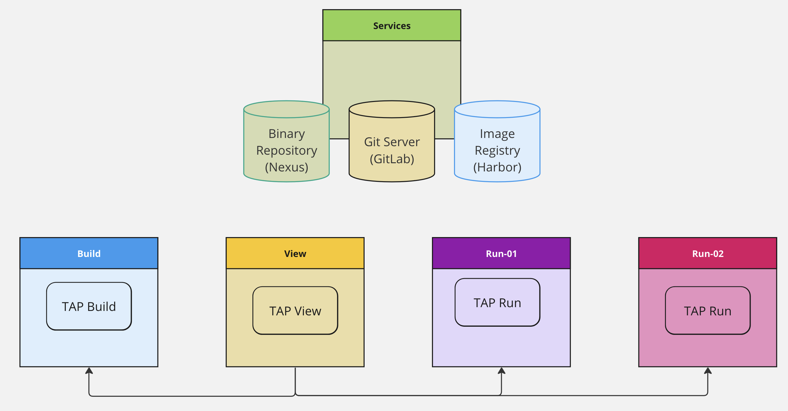

---
tags:
  - TKG
  - TAP
  - GitOps
  - Carvel
  - Tanzu
---

title: TAP GitOps
description: Tanzu Application Platform GitOps Installation

# TAP GitOps

We can install Tanzu Application Platform, or TAP, in one of two supported ways.

1. Scripted[^2]
1. GitOps[^1]

In the Scripted way, we run CLI and Shell commands to configure the prerequisites, configure the installation values, and install the TAP package. This is the original, and currently only GA method.

The GitOps manner, leverages the increasingly more common way of having a Kubernetes Controller synchronizing Kubernetes Manifests from a Git Repository.

TAP uses the Git synchronization feature of the KAPP Controller to manage the TAP package installation.
Continuously synchronizing a bootstrapped Git repository containing all the TAP installation values to update the installation.

## Goals of this Guide

The goals of this are the following:

1. Provide a more presciptive guide for installing TAP with GitOps than the official documentation provides
1. Provide concrete examples of the repositories involved (for TAP install and the application management after)
1. Provide a example of how to create a complete environment setup, leveraging GitOps for resources outside of the TAP Install scope

In other words, we want to make sure we can install TAP via its GitOps install.
And explore how to do so in the broader context of managing an environment spanning multiple clusters with some dedicated to running applications.

The difference between this and the official documentation is that this guide is prescriptive.
It makes choices and chooses a singular path.

More paths and options exist, and they can (and usually are) equally valid.

One such choice to make, is where to store secrets that need to end up in the Kubernetes clusters, used by TAP components and applications alike.

## Choose Secrets Management

TAP currently supports two ways of managing the secrets the installation requires.

1. [TAP with External Secrets Operator](https://docs.vmware.com/en/VMware-Tanzu-Application-Platform/1.5/tap/install-gitops-eso.html)[^3]
2. [TAP with SOPS](https://docs.vmware.com/en/VMware-Tanzu-Application-Platform/1.5/tap/install-gitops-sops.html)[^4]

The [External Secrets Operator](https://external-secrets.io)[^5] is a Kubernetes operator that synchronizes secrets from external secret management systems into Kubernetes.

!!! Warning
    TAP 1.5 only supports AWS's KMS.

[Secrets OPerationS](https://github.com/getsops/sops)[^6] is a tool for managing your secrets within your Git repository.

Both options are solid solutions used by many.

For the purposes of this guide, we'll work with SOPS.

## Environment To Build

Through this guide, we build an environment consisting of five clusters:

1. Shared **Services**: this cluster houses services that all the other clusters need. Such as the image registry (Harbor), Git server (GitLab), and more.
1. **Build**: where we install TAP with a Build profile, to build and test our software.
1. **View**: where we install TAP with a View profile, to explore the workloads in the other clusters.
1. **Run-01**: where we install TAP with a Run profile. We consider this our ***Staging*** environment.
1. **Run-02**: where we install TAP with a Run profile. We consider this our ***Production*** environment.

## Tools and CLIs

* Tanzu CLI (for TAP)
* yq
* jq
* flux
* knative
* [gnupg](https://www.gnupg.org/)[^12]
* [age](https://github.com/FiloSottile/age)[^13]
* [sops](https://github.com/getsops/sops)[^14]
* ...

## References

[^1]: [TAP 1.5 - GitOps Install introduction](https://docs.vmware.com/en/VMware-Tanzu-Application-Platform/1.5/tap/install-gitops-intro.html)
[^2]: [TAP 1.5 - Online Install (scripted)](https://docs.vmware.com/en/VMware-Tanzu-Application-Platform/1.5/tap/install-online-intro.html)
[^3]: [TAP 1.5 - GitOps with External Secrets Operator](https://docs.vmware.com/en/VMware-Tanzu-Application-Platform/1.5/tap/install-gitops-eso.html)
[^4]: [TAP 1.5 - GitOps with SOPS](https://docs.vmware.com/en/VMware-Tanzu-Application-Platform/1.5/tap/install-gitops-sops.html)
[^5]: [External Secrets Operator docs](https://external-secrets.io)
[^6]: [SOPS GitHub and Docs](https://github.com/getsops/sops)
[^7]: [Tanzu CLI]
[^8]: [yq]
[^9]: [jq]
[^10]: [Flux CLI]
[^11]: [Knative CLI]
[^12]: [gnupg](https://www.gnupg.org/)
[^13]: [age - simple, modern and secure file encryption tool](https://github.com/FiloSottile/age)
[^14]: [SOPS - Secret OPerationS](https://github.com/getsops/sops)
