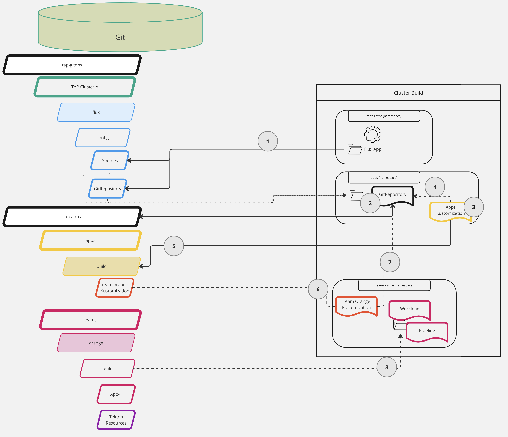

---
tags:
  - TKG
  - TAP
  - GitOps
  - Carvel
  - Tanzu
---

title: TAP GitOps - TAP Build Cluster
description: Tanzu Application Platform GitOps Installation

# TAP Build

For large-scale deployments of TAP, we recommend separating the Build and Test phases of the supply chain into a separate Build cluster.

TAP supports this via the [build profile](https://docs.vmware.com/en/VMware-Tanzu-Application-Platform/1.5/tap/multicluster-reference-tap-values-build-sample.html), only installing the components related to these activities [^1].

The components installed, among others, are Cartographer, Tekton, Tanzu Build Service, and Grype.

This chapter focuses on creating a GitOps install of the Build profile and configuring TAP to integrate with our tools of choice.

We will take a look at the following:

1. Install Tanzu Build Service and its dependencies via GitOps
1. Configure Build Profile
1. Add ServiceAccount for the View profile
1. Manage Workloads

!!! Warning
    Before diving into the Build profile topics, the [GitOps Prep](/tanzu/tap-gitops/tap-gitops-prep/) page is considered a pre-requisite.

## Install TBS

Unsurprisingly, with such a name, one of the significant components of the Build profile is the component that does the building: Tanzu Build Service (***TBS***).

Unfortunately, TBS can be unwieldy.
It requires a good chunk of storage for ContainerD (~100GB), downloads a lot of (container) images, and relies on DockerHub images.

### Relocate TBS Dependencies

For these reasons, we recommend to always [relocate the TBS dependencies](https://docs.vmware.com/en/VMware-Tanzu-Application-Platform/1.5/tap/install-offline-tbs-offline-install-deps.html) to a registry you control, preferably close (network wise) to your clusters[^4].

The docs are very straightforward, so I won't repeat it here; please follow them and return [^4].

!!! Danger "TAP TBS, not TBS"
    One thing that has bitten some customers is that they "know" TBS.

    So what they do is they download the TBS product and its dependencies.

    Unfortunately, what TAP relies on isn't the same packaging.

    Please make sure you relocate `tanzu-application-platform/full-tbs-deps-package-repo`!

If you need help determining which version of the TBS dependencies you need, you can verify this with a TAP Package Repository.

Please refer to the ***Retrieving Package Schemas*** section in the [TAP GitOps Prep](/tanzu/tap-gitops/tap-build/#non-sensitive-values-file) page if you are unsure how to check what versions are in a Package Repository quickly.

### TBS and TAP GitOps Install

For our installation, we want to install everything via GitOps.

By default, TAP installs TBS in online mode.
We run into a slight issue when we point our TAP install to our relocated packages instead.

We also need the TAP TBS Full Dependency ***Package Repository*** and the ***Package** installed.
This is a different Package Repository, so it is not included in the TAP install.

This is where community members like [vrabbi](https://vrabbi.cloud/about/) come in[^2].
He has written on how to [handle this](https://vrabbi.cloud/post/tap-1-5-gitops-installation/), and has an example repository[^3]

!!! Info
    [vrabbi](https://vrabbi.cloud/about/) has a lot of good blog posts related to TAP.
    
    I recommend visiting his blog whenever a new version of TAP is released; he usually does a breakdown of what changed.

The solution comes down to the following:

1. Add additional properties to our custom Schema file (`cluster-config/config/custom/00-custom-schema.yaml`)
1. Add manifest for the Package Repository (Carvel K8S CR)
1. Add manifest for the Package Installation (Carvel K8S CR)

Let's get to it.

In the existing custom schema file, add the following:

```yaml title="cluster-config/config/custom/00-custom-schema.yaml"
custom:
  tbs_full_dependencies:
    enabled: true
    pkgr_version: "1.10.10" #! matches TAP 1.5.4 I believe
    pkgr_repo_url: harbor.services.my-domain.com/buildservice/tbs-full-deps
```

Then, we create a `tbs-install` folder parallel to the `tap-install` folder in `cluster-config/config`.
We create the files `00-pkgr.yaml` and `01-pkgi.yaml` for the Package Repository and Package Install, respectively.

The folder structure should look like this now (limited to relevant files/folders):

```sh
build-01
├── cluster-config
│   ├── config
│   │   ├── custom
│   │   │   ├── 00-custom-schema.yaml
│   │   │   ├── 01-shared.yaml
│   │   │   └── 02-flux-sync.yaml
│   │   ├── tap-install
│   │   └── tbs-install
│   │       ├── 00-pkgr.yaml
│   │       └── 01-pkgi.yaml
│   └── values
├── flux
├── ns-provisioner
└── tanzu-sync
```

And for the content:

```yaml title="cluster-config/config/tbs-install/00-pkgr.yaml"
#@ load("@ytt:data", "data")
---
#@ if data.values.custom.tbs_full_dependencies.enabled:
apiVersion: packaging.carvel.dev/v1alpha1
kind: PackageRepository
metadata:
  name: tbs-full-deps-repository
  namespace: tap-install
  annotations:
    kapp.k14s.io/change-group: pkgr
spec:
  fetch:
    imgpkgBundle:
      image: #@ "{}:{}".format(data.values.custom.tbs_full_dependencies.pkgr_repo_url,data.values.custom.tbs_full_dependencies.pkgr_version)
#@ end
```

The Package Install:

```yaml title="cluster-config/config/tbs-install/01-pkgi.yaml"
#@ load("@ytt:data", "data")
---
#@ if data.values.custom.tbs_full_dependencies.enabled:
apiVersion: packaging.carvel.dev/v1alpha1
kind: PackageInstall
metadata:
  name: full-tbs-deps
  namespace: tap-install
  annotations:
    kapp.k14s.io/change-group: tbs
    kapp.k14s.io/change-rule.0: "upsert after upserting pkgi"
    kapp.k14s.io/change-rule.1: "delete before deleting pkgi"
spec:
  serviceAccountName: tap-installer-sa
  packageRef:
    refName: full-tbs-deps.tanzu.vmware.com
    versionSelection:
      constraints: #@ data.values.custom.tbs_full_dependencies.pkgr_version
#@ end
```

## Configure Build Profile

Now that we have taken care of our dependencies, we can look at the Build profile proper[^1].

I'm preparing the profile to use the Out Of The Box Supply Chain ***Testing & Scanning***[^5].

Let's look at what sections we need to provide:

1. Profile generics, `profile`, `shared`, `ceip_policy_disclosed`, and `contour`
1. BuildService configuration
1. Supply Chain configuration (`ootb_supply_chain_testing_scanning`)
1. `scanning.metadataStore` for legacy reasons

We split the profile values into **sensitive** and **non-sensitive**.

Let's start with the non-sensitive values.

### Non-Sensitive

#### Shared

I recommend configuring the TAP Install Registry as sensitive, so that leaves us with two properties for the `shared`:
The `shared.ingress_domain` is the DNS "wildcard" for this profile/cluster, and, if required, a Custom CA cert via `shared.ca_cert_data`.

```yaml
ingress_domain: build.my-domain.com
ca_cert_data: |-
  ...
```

#### Build Service

The build service, by default, leverages the registry from the `shared.image_registry`.
As we've relocated the packages, that is a **different** registry.

We also have to tell it not to install the dependencies and instead pull them from our defined TBS registry (`kp_default_repository`).

We that as follows:

```yaml
buildservice:
  pull_from_kp_default_repo: true
  exclude_dependencies: true
  #! registry for TBS Dependencies
  kp_default_repository: "harbor.services.my-domain.com/buildservice/tbs-full-deps"
```

It still does leverage the _credentials_ used for the `shared.image_registry`.
See the **sensitive** values section below if you need different credentials.

#### OOTB Supply Chain

First, we declare which supply chain we use on the top level (e.g., `tap_install.values.`).
We do so by setting `supply_chain` to our desired Supply Chain, in my case, `testing_scanning`.

As before, we want to do everything as GitOps.

TAP supports two Workload flows[^7]:

1. **Registry Ops**: Build, Test, and end with a Cartographer `Deliverable` CR, which a _Run_ profile can install
1. **GitOps**: Build, Test, and end with a PullRequest(PR) (or Merge Request for GitLab) containing the Knative Service CR

We choose the GitOps flow.
This means we need to tell it several things, such as the server, repository, branch, and some information for the PR.

Last but not least, we inform it of the repository for storing the container images made by TBS (or Kaniko).

```yaml
supply_chain: testing_scanning
ootb_supply_chain_testing_scanning:
  external_delivery: true
  gitops:
    server_address: https://gitlab.services.my-domain.com
    repository_owner: root
    repository_name: tap-apps
    branch: main
    commit_strategy: pull_request
    pull_request:
      server_kind: gitlab
      commit_branch: ""
      pull_request_title: ready for review
      pull_request_body: generated by supply chain
  registry:
    server: harbor.services.my-domain.com
    repository: tap-apps #! registry project for Workload images
```

!!! Danger "Secret for the PullRequests"

    By default, the PullRequest (or MergeRequest) is made by a Tekton Pipeline.

    Tekton requires a specific kind of [Secret format](https://tekton.dev/docs/pipelines/auth/) as described in the Tanzu Docs[^7] and Tekton Docs[^8].

    This secret needs to be assigned the `default` ServiceAccount in the namespace (this is the default, pun intended).
    As you might remember from our [GitOps Prepare](/tanzu/tap-gitops/tap-gitops-prep/#share-secrets) page, we create the appropriate secrets and use the Namespace Provisioner to add them to the ServiceAccount. This is why!

#### Full Example

??? Example "Full Profile Example"

    ```yaml title="platforms/clusters/build-01/cluster-config/values/tap-non-sensitive-values.yaml"
    ---
    tap_install:
      values:
        profile: build
        shared:
          ingress_domain: build.my-domain.com
          ca_cert_data: |- #! if you need a custom support a custom Certificate Authority (CA)
            -----BEGIN CERTIFICATE-----
            iUdqs7FZN2uKkLKekdTgW0QkTFEJTk5Yk9t/hOrjnHoWQfB+mLhO3vPhip
            ...
            vhs=
            -----END CERTIFICATE-----
        buildservice:
          pull_from_kp_default_repo: true
          exclude_dependencies: true
          #! registry for TBS Dependencies
          kp_default_repository: "harbor.services.my-domain.com/buildservice/tbs-full-deps"

        supply_chain: testing_scanning
        ootb_supply_chain_testing_scanning:
          external_delivery: true
          gitops:
            server_address: https://gitlab.services.my-domain.com
            repository_owner: root
            repository_name: tap-apps
            branch: main
            commit_strategy: pull_request
            pull_request:
              server_kind: gitlab
              commit_branch: ""
              pull_request_title: ready for review
              pull_request_body: generated by supply chain
          registry:
            server: harbor.services.my-domain.com
            repository: tap-apps #! registry project for Workload images
        
        scanning:
          metadataStore:
            url: "" #! a bug requires this setting for TAP 1.4 and 1.5 (not sure about 1.6)

        ceip_policy_disclosed: true
        contour:
          envoy:
            service:
              type: LoadBalancer

        #! this is from the GitOps Preparation page
        namespace_provisioner:
          controller: false
          gitops_install:
            ref: origin/main
            subPath: platforms/clusters/build-01/ns-provisioner/install
            url: git@github.com:joostvdg/tap-gitops.git
            secretRef:
              name: github-ssh
              namespace: shared
              create_export: false
          additional_sources:
          - git:
              ref: origin/main
              subPath: platforms/clusters/build-01/ns-provisioner/additional-sources
              url: git@github.com:joostvdg/tap-gitops.git
              # secretRef section is only needed if connecting to a Private Git repo
              secretRef:
                name: github-ssh-1
                namespace: shared
                create_export: false
            path: _ytt_lib/testing-scanning-supplychain-setup
    ```

### Sensitive Values

Below are the sensitive values.

The `shared.image_registry` with the URL, username, and password.

Mind you, the example below is _before_ encryption with SOPS (or ESO); encrypt it before placing it at that location.

```yaml title="platforms/clusters/build-01/cluster-config/values/tap-sensitive-values.sops.yaml"
tap_install:
    sensitive_values:
        shared:
            #! registry for the TAP installation packages
            image_registry:
                project_path: harbor.services.mydomain.com/tap/tap-packages
                username: #! username
                password: #! password or PAT
custom:
  sensitive_values:
    github:
      ssh:
        private_key: |
          ...
        known_hosts: |
          ...
```

!!! Warning "Same credentials for TAP and TBS"

    Mind you, the example below is _before_ encryption with SOPS (or ESO); encrypt it before placing it at that location.

    ```yaml title="platforms/clusters/build-01/cluster-config/values/tap-sensitive-values.sops.yaml"
    tap_install:
      sensitive_values:
        buildservice:
          kp_default_repository: #! registry, e.g.,  "index.docker.io/joostvdgtanzu/build-service"
          kp_default_repository_username: #! username
          kp_default_repository_password: #! password or PAT
    ```

## Add View ServiceAccount

One of the essential features of TAP is its GUI.

For the TAP GUI to show the Supply Chains, one of its core features, it needs access to the Kubernetes cluster hosting them.

In this scenario, we separate the Build cluster from the cluster the TAP GUI runs in (View cluster).
So, we must provide the TAP GUI with alternative means to view the Supply Chain resources.

We do that by creating a [ServiceAccount in each cluster](https://docs.vmware.com/en/VMware-Tanzu-Application-Platform/1.5/tap/tap-gui-cluster-view-setup.html) we want the TAP GUI to have visibility[^9].
Then, copy the token of that ServiceAccount into the View profile configuration.

Add this ServiceAccount with the required permission and a Token to our additional Kubernetes resources.

Let's place this in the folder `cluster-config/config/custom`, and call the file `03-tap-gui-service-account.yaml`.

??? Example "TAP GUI Viewer Service Account"

    ```yaml title="platforms/clusters/build-01/cluster-config/config/custom/03-tap-gui-service-account.yaml"
    apiVersion: v1
    kind: Namespace
    metadata:
      name: tap-gui
    ---
    apiVersion: v1
    kind: ServiceAccount
    metadata:
      namespace: tap-gui
      name: tap-gui-viewer
    ---
    apiVersion: v1
    kind: Secret
    metadata:
      name: tap-gui-viewer
      namespace: tap-gui
      annotations:
        kubernetes.io/service-account.name: tap-gui-viewer
    type: kubernetes.io/service-account-token
    ---
    apiVersion: rbac.authorization.k8s.io/v1
    kind: ClusterRoleBinding
    metadata:
      name: tap-gui-read-k8s
    subjects:
    - kind: ServiceAccount
      namespace: tap-gui
      name: tap-gui-viewer
    roleRef:
      kind: ClusterRole
      name: k8s-reader
      apiGroup: rbac.authorization.k8s.io
    ---
    apiVersion: rbac.authorization.k8s.io/v1
    kind: ClusterRole
    metadata:
      name: k8s-reader
    rules:
    - apiGroups: ['']
      resources: ['pods', 'pods/log', 'services', 'configmaps', 'limitranges']
      verbs: ['get', 'watch', 'list']
    - apiGroups: ['metrics.k8s.io']
      resources: ['pods']
      verbs: ['get', 'watch', 'list']
    - apiGroups: ['apps']
      resources: ['deployments', 'replicasets', 'statefulsets', 'daemonsets']
      verbs: ['get', 'watch', 'list']
    - apiGroups: ['autoscaling']
      resources: ['horizontalpodautoscalers']
      verbs: ['get', 'watch', 'list']
    - apiGroups: ['networking.k8s.io']
      resources: ['ingresses']
      verbs: ['get', 'watch', 'list']
    - apiGroups: ['networking.internal.knative.dev']
      resources: ['serverlessservices']
      verbs: ['get', 'watch', 'list']
    - apiGroups: [ 'autoscaling.internal.knative.dev' ]
      resources: [ 'podautoscalers' ]
      verbs: [ 'get', 'watch', 'list' ]
    - apiGroups: ['serving.knative.dev']
      resources:
      - configurations
      - revisions
      - routes
      - services
      verbs: ['get', 'watch', 'list']
    - apiGroups: ['carto.run']
      resources:
      - clusterconfigtemplates
      - clusterdeliveries
      - clusterdeploymenttemplates
      - clusterimagetemplates
      - clusterruntemplates
      - clustersourcetemplates
      - clustersupplychains
      - clustertemplates
      - deliverables
      - runnables
      - workloads
      verbs: ['get', 'watch', 'list']
    - apiGroups: ['source.toolkit.fluxcd.io']
      resources:
      - gitrepositories
      verbs: ['get', 'watch', 'list']
    - apiGroups: ['source.apps.tanzu.vmware.com']
      resources:
      - imagerepositories
      - mavenartifacts
      verbs: ['get', 'watch', 'list']
    - apiGroups: ['conventions.apps.tanzu.vmware.com']
      resources:
      - podintents
      verbs: ['get', 'watch', 'list']
    - apiGroups: ['kpack.io']
      resources:
      - images
      - builds
      verbs: ['get', 'watch', 'list']
    - apiGroups: ['scanning.apps.tanzu.vmware.com']
      resources:
      - sourcescans
      - imagescans
      - scanpolicies
      - scantemplates
      verbs: ['get', 'watch', 'list']
    - apiGroups: ['tekton.dev']
      resources:
      - taskruns
      - pipelineruns
      verbs: ['get', 'watch', 'list']
    - apiGroups: ['kappctrl.k14s.io']
      resources:
      - apps
      verbs: ['get', 'watch', 'list']
    - apiGroups: [ 'batch' ]
      resources: [ 'jobs', 'cronjobs' ]
      verbs: [ 'get', 'watch', 'list' ]
    - apiGroups: ['conventions.carto.run']
      resources:
      - podintents
      verbs: ['get', 'watch', 'list']
    - apiGroups: ['appliveview.apps.tanzu.vmware.com']
      resources:
      - resourceinspectiongrants
      verbs: ['get', 'watch', 'list', 'create']
    ```

## Add Workload Specific Resources

The main question to ask: how do you separate Workloads and their specific resources?

In TAP, a likely answer is to separate Workloads in TAP's _Developer_ Namespaces.

Sure, you might have a Team with more than one similar kind of application (or at least a repository).
Beyond that, it makes sense to separate them via Kubernetes Namespaces.

So, what resources are we talking about?

1. The `Workload` definition, as a starter
1. The Tekton test Pipeline, see next section on why
1. Any other possible resource, such as a Secret, ConfigMap, or what have you

Unfortunately, where we are in the GitOps install, we hit a bit of a snag:

* We cannot add them to the Tanzu Sync folder(`cluster-config/config`), as the Namespace Provisioner manages the namespaces (i.e., they aren't guaranteed to exist yet, blocking reconciliation)
* We cannot add them to the Namespace Provisioner, as we need different ones per Namespace

While technically, we could add them to the Namespace Provisioner's `namespaces.yaml` file, I believe it is the wrong place to do so.

### Possible Solution

In the GitOps preparation page, we explored how we can add additional FluxCD controllers and resources.
We should leverage those to move the responsibility to synchronize these resources outside TAP.

This also gives us more flexibility in terms of which (Git) repositories to use:

1. Create a Namespace called `apps`
1. Create a `GitRepository` in there, pointing to a Git repository containing the teams/applications and their resources per environment
1. Add a `Kustomization` to instruct FluxCD which resources to synchronize (from that GitRepository)
1. We can then freely add any other FluxCD resources we want to synchronize in that Git repository

How do we do that?

In my case, we create a Source, a `GitRepository`.
This ensures FluxCD keeps an up-to-date clone of that repository in the cluster.

??? Example "GitRepository"

    ```yaml title="platforms/clusters/build-01/cluster-config/config/flux-sources/apps-git-repository.yaml
    apiVersion: source.toolkit.fluxcd.io/v1beta2
    kind: GitRepository
    metadata:
      name: apps
      namespace: apps
      annotations:
        kapp.k14s.io/change-rule: upsert after upserting GitRepository
    spec:
      gitImplementation: go-git
      ignore: |
        !.git
      interval: 1m0s
      ref:
        branch: main
      secretRef:
        name: apps-gitlab
      url: https://gitlab.services.my-domain.com/root/tap-apps.git
    ```

And then we can choose, do we want to manage Workload specific `Kustomization`'s directly in the same Git repository, or do we want some indirection.

I create an abstraction layer by having my Workload specific `Kustomization` in a directory in the Git repository we synchronize.

The `Kustomization` we include in the TAP install repository points to that directory instead.


??? Example "Kustomization"

    ```yaml
    apiVersion: kustomize.toolkit.fluxcd.io/v1beta2
    kind: Kustomization
    metadata:
      name: apps
      namespace: apps
    spec:
      interval: 5m0s
      path: ./tap/apps/build
      prune: true
      targetNamespace: apps
      sourceRef:
        kind: GitRepository
        name: apps
    ```


TODO: describe folder structure/Git repository structure
    * add diagram

For example, my `tap-apps` Git repository looks as follows:

```sh
.
├── tap
│   └── apps
│       ├── build
│       │   └── team-orange-kustomization.yaml
│       ├── run-01
│       └── run-02
└── teams
    └── orange
        ├── backstage
        │   ├── team.yaml
        │   └── user-example.yaml
        ├── build
        │   ├── namespace-setup.yaml
        │   ├── tap-demo-03
        │   │   └── workload.yaml
        │   ├── tap-demo-04
        │   │   └── workload.yaml
        │   └── tekton
        │       └── java-test-pipeline.yaml
        ├── prod
        │   └── tap-demo-04
        │       └── delivery.yml
        └── staging
            ├── tap-demo-03
            │   └── tap-demo-03.yaml
            └── tap-demo-04
                └── delivery.yml
```

The `Kustomization` in the `tap-gitops` repository points to the `tap/apps/build` folder, synchronizing all applicable files to the cluster.

As you can see, one of those files is `team-orange-kustomization.yaml`.

This file points to `teams/orange/build/` and synchronizes all the `Workload` manifests we need.
It also includes a file `namespace-setup.yaml` to create the namespace and any secret we need.

A folder named `tekton` includes any team-specific Tekton resource, such as its Pipeline for testing.

In my case, the production and staging resources for the `run-01` and `run-02` clusters are in the same repository.
But that is mainly because this is a compacted example; you might separate those into distinct Git repositories instead.

### Add Tekton Pipeline

Speaking of Tekton pipelines, there is a reason we included the Pipeline for testing in this example.

To the surprise of many, the ***Testing & Scanning*** OOTB Supply Chain still needs to be completed.
It misses the _Test_ Pipeline, which is expected to be a Tekton Pipeline with the Label `apps.tanzu.vmware.com/pipeline: test`.

The Cartographer Supply Chains are written to be reusable across applications and tech stacks.
A Tekton Pipeline is not, which is one of the reasons Cartographer exists in the first place.

So we recommend to:

1. Leverage Tekton Tasks in the Tekton Pipelines
1. Include the Tasks in the Namespace Provisioner so each Workload Namespace has all of them
1. Separately synchronize the team or application-specific Tekton Pipeline for testing

We've tackled steps two and three. The contents of the Pipeline is out of scope for this guide, see the [TAP Supply Chain Customization](/tanzu/supplychain/overview/) section for more information on that.

### Visualization

This might be a complex situation, hard to grasp with just words alone.

Hopefully, we can make it easier to digest with a visualization:



Let's break down the interactions in the cluster with this setup.

We start with two Git repositories: `tap-gitops` without TAP install configuration and `tap-apps`, with everything related to our Workloads.

1. The FluxCD synchronization we set up in the GitOps preparation synchronizes the (FluxCD) `GitRepository` and Apps `Kustomization`
1. The `GitRepository` points to our `tap-apps` Git repository, making FluxCD do a Git clone
1. The `Kustomization` in the `apps` Namespace lets FluxCD synchronize resources from a sub-path of a Git repository
1. The `Kustomization` also points towards the `GitRepository,` so FluxCD knows which Git clone to use
1. The `Kustomization` tells FluxCD to synchronize the `tap-apps/apps/build` folder and its subdirectories
1. This includes, among other things, another `Kustomization`, for Team Orange
1. This `Kustomization` is pointing to the same `GitRepository` (as I'm using a single Git repository)
1. In this "Team Orange" `Kustomization`, we have the `Workload` (the Cartographer CR) and other resources, such as the Tekton Pipeline for testing

## Install

You are now ready to install the TAP Build profile.

It has been a long journey, but each subsequent cluster and profile is similar. 

For the actual install commands, I refer to the [docs](https://docs.vmware.com/en/VMware-Tanzu-Application-Platform/1.5/tap/install-gitops-sops.html#deploy-tanzu-sync-11) [^10].

## References

[^1]: [TAP Install 1.5 - Build profile](https://docs.vmware.com/en/VMware-Tanzu-Application-Platform/1.5/tap/multicluster-reference-tap-values-build-sample.html)
[^2]: [VRABBI - Blogs on VMware/Tanzu products](https://vrabbi.cloud/about/)
[^3]: [VRABBI - ](https://vrabbi.cloud/post/tap-1-5-gitops-installation/)
[^4]: [TAP - Offline Install - Tanzu Build Service & Dependencies](https://docs.vmware.com/en/VMware-Tanzu-Application-Platform/1.5/tap/install-offline-tbs-offline-install-deps.html)
[^5]: [TAP - OOTB Supply Chain - Testing & Scanning](https://docs.vmware.com/en/VMware-Tanzu-Application-Platform/1.5/tap/getting-started-add-test-and-security.html)
[^6]: [TAP - OOTB Supply Chain - Tekton Test Pipeline Example](https://docs.vmware.com/en/VMware-Tanzu-Application-Platform/1.5/tap/getting-started-add-test-and-security.html#tekton-pipeline-config-example-3)
[^7]: [TAP - OOTB Supply Chain - Registry Ops vs. GitOps](https://docs.vmware.com/en/VMware-Tanzu-Application-Platform/1.5/tap/scc-gitops-vs-regops.html)
[^8]: [Tekton - Git server secrets](https://tekton.dev/docs/pipelines/auth/)
[^9]: [TAP GUI - View resources on multiple clusters](https://docs.vmware.com/en/VMware-Tanzu-Application-Platform/1.5/tap/tap-gui-cluster-view-setup.html)
[^10]: [TAP 1.5 Install - GitOps Install with SOPS deploy](https://docs.vmware.com/en/VMware-Tanzu-Application-Platform/1.5/tap/install-gitops-sops.html#deploy-tanzu-sync-11)