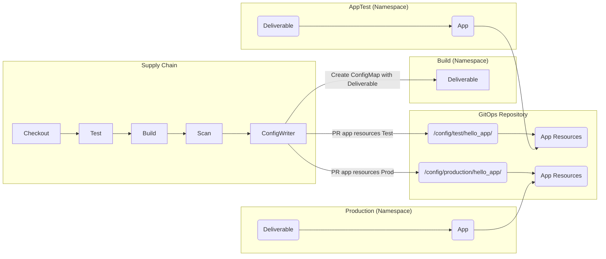
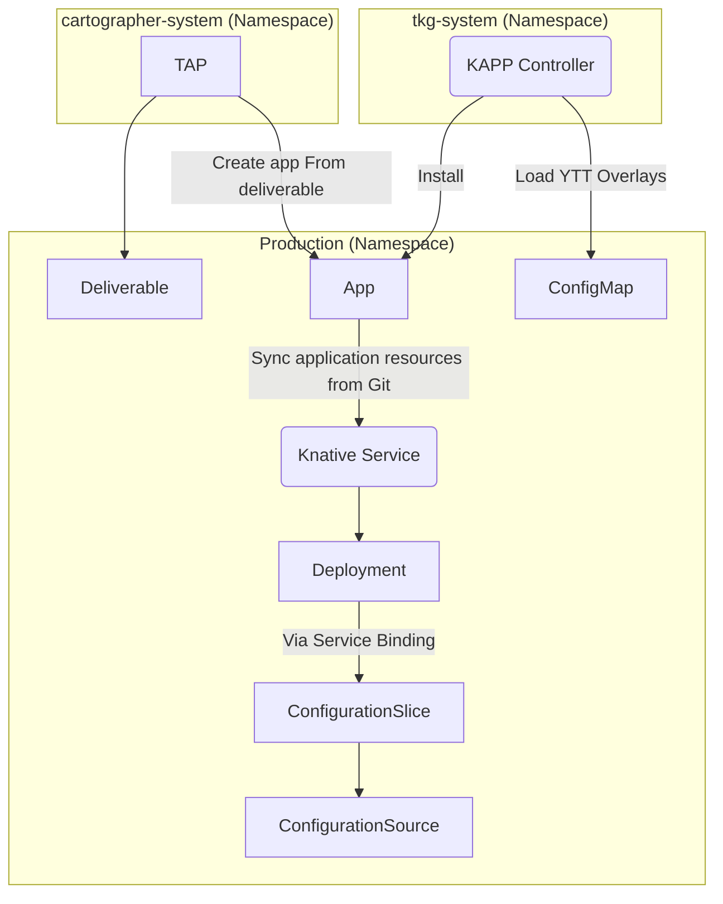

---
tags:
  - TAP
  - Tanzu
  - Cartographer
  - Buildpacks
  - Supply Chain
  - CI/CD
---

title: Automated Multi-Environment Promotion with TAP
description: Automate promoting DotNet workloads to multiple environments with TAP

# Automated Multi-Environment Promotion with TAP

In this guide we're going to create a commonly requested workflow in TAP.

## Context and Goals

The ask is usually, _how can we automate promoting an app to more than one environment?_, and there isn't an easy answer.

It is difficult to make this easy.

The main problem stems from the following:

* **Automated**: the promotion must be automated, but not _automatic_
* **GitOps**: we should use Git as source of truth
* **KISS**: what we promote should be the as simple as possible
* **Environment Specific**: the application needs environment specific configuration

### Automated Not Automatic

While in lower (e.g. Test) environments we can probably get away with automatic updates, in higher (e.g., Production) environments we cannot.

However, a big problem, is that we do not want to rely on human discipline to ensure the latest version is promoted to each target environment.

So the workflow must automate the promotion to each desired environment, and support human approval for some if not all of these environments.

### GitOps

While not the only game in town, and certainly not a silver bullet, it is built-in into TAP.

So let's use what TAP already does for us, and we get a long without too much effort.

When doing GitOps, as with many other workflows, one should avoid using [using branches for GitOps environments](https://codefresh.io/blog/stop-using-branches-deploying-different-gitops-environments/).

So our solution much target either the same repository but different folders, or different repositories for each environment.

### KISS

**K** eep **I** t **S** imple **S** tupid, is an acronym used in software development (and likely many more places/industries).
It is used to keep you reflecting on wether your solution is really the simplest it could be.
This relates to both in general complexity of the solution as to how it can be understood by _other_ humans than the writer.

The reason I mention this here, is that we need a process that is simple enough that everyone involved can understand it.
In addition, the changes made the PullRequest(PR), Git + Automated not Automatic makes PRs a logical choice, must be as simple as possible to reduce the chance of conflicts from occuring.

### Environment Specific

We aim to keep the difference between the PRs to each environment as limited as possible

When deployed, however, the application does need environment specific configuration.
We might need to talk to different databases, have different settings for logging, featureflags, CPU and Memory requirements, and so on and so forth.

In terms of TAP, this means we'll also take a look at the Deployment workflow.

## Solution Design

We'll be sing TAP 1.7 / 1.8, using the Cartographer Supply Chains.

First, we design the PullRequest Workflow to make multiple PR's for each desired environment, with the same base configuration.

Then we ensure our Delivery Workflow deploys and configures the application with environment specific configuration.

### PR Workflow

The diagram below is limited to two environments for the sake of readability.

We can do this for as many environments as we want.

The Supply Chain ends with the ConfigWriter, which does two things:

1. generate a general Deliverable CR as payload in a ConfigMap
1. generate a PullRequest with the Application resources

What Application resources are, depends on the Application Configuration Template that is used.
The **Web** template generates a **Knative** `Service`, and the **Server** template generates vanilla Kubernetes `Service` and `Deployment` CRs.

The `Deliverable` CR contains the configuration for the Carvel Delivery Supply Chain (`ClusterDelivery`) which takes the contents and generates a Carvel `App` CR.
This `App` in turn, points back to the application resources folder populated by the PR made by the ConfigWriter.



### Delivery Workflow

Overal Workflow continues when we apply the `Deliverable` CR to a TAP cluster that can deploy (Run, Iterate, Full).

The TAP Delivery workflow (Cartographer's `ClusterDelivery`) uses the `Deliverable` CR to stamp out a `App` CR.

The `App` CR is from the Carvel suite and is owned by the KAPP Controller.
This `App` CR points to the folder containing the Application resources, and synchronized them to the cluster (also managed by _KAPP Controller_).

We provide a `ConfigMap` with YTT overlays references via the `App` templating.
Through this, the KAPP Controller overwrites our application's deployed resources so we can make it environment specific.

While this sounds a bit risky, using custom logic per environment, through Knative Serving we control how our application's Rollout goes.
So we should never end up with 100% traffic on a broken application.



## PR Workflow Implementation

There are several ways we can achieve this workflow with TAP.

We can create a new Supply Chain and build it from scratch, we can augment the existing one, we can use YTT Overlays to change the defaults and so on.

For guiding someone through this process, I believe the following approach works best:

* copy the existing Supply Chain
* copy any Template we need to change
* update the Supply Chain to use our Template copies

!!! Warning "Delivery vs Deliverable"
    It confused me a bit, but there is a difference between the **Delivery** and the **Deliverable** and related resources:

    * **Delivery**: the process of deploying the application into the target environment
    * **Deliverable**: the CR providing input to the `ClusterDelivery` Supply Chain
    * **ClusterDelivery**: Cartographer CR, similar to the `ClusterSupplyChain`, but focused on deploying applications
    * **ClusterDeploymentTemplate**: translating the `Deliverable` to _deployable_ resources (e.g., `App`)
    * **Deployment**: applying resources to the Kubernetes cluster

### TAP Install Values

In order for this to work well, we should already make TAP use the GitOps workflow.

We choose a OOTB Supply Chain, in my case `testing_scanning`, and then configure the Supply Chain component with the following:

* **external_delivery**: this ensures the Supply Chain generates a `ConfigMap` with a `Deliverable` CR to apply elsewhere (e.g., another Namespace of Cluster)
* **registry**: this is where we upload the build Bundles and Container Images, not required, but recommended to make this a unique repository
* **gitops**: we configure to use the GitOps workflow
* **commit_strategy**: we set the strategy to `pull_request` to make TAP generate PRs

!!! Example "TAP Install Values"

    ```yaml title="tap-install-values.yaml"
    supply_chain: testing_scanning # Can take testing, testing_scanning.
    ootb_supply_chain_testing_scanning:
      external_delivery: true
      registry:
        server: harbor.example.com
        repository: tap-apps
      gitops:
        # Azure DevOps
        ssh_secret: azure-devops
        server_address: https://dev.azure.com
        repository_owner: joostvandergriendt/my-first-repo
        repository_name: my-first-repo
        branch: main
        commit_strategy: pull_request
        pull_request:
          server_kind: azure
          commit_branch: ""
          pull_request_title: ready for review
          pull_request_body: generated by supply chain
    ```

### Copy Existing Supply Chain

Which Supply Chain you have we can start with, depends on the OOTB Supply Chain component you install with TAP.

Assuming you use the Testing & Scanning OOTB Supply Chain, the command would be as follows:

```shell
kubectl get ClusterSupplyChain \
    source-test-to-url \
    -oyaml > source-test-to-url-2.yaml
```

We then strip away all the "runtime" labels, annotations, and other fields of the Supply Chain and rename it.

In my case, the "top" of the file now looks likes this:

```yaml title="source-test-to-url-2.yaml"
apiVersion: carto.run/v1alpha1
kind: ClusterSupplyChain
metadata:
  name: source-test-scan-to-url-2
spec:
```

Those are all the changes so far, we'll come back to this file.

### Copy And Update Config Writer PR Template

Same as with the Cluster Supply Chain, we start with retrieving the existing Template.

```shell
kubectl get ClusterTemplate \
   config-writer-and-pull-requester-template \
   -oyaml > config-writer-and-pull-requester-template-2.yaml
```

We then do the same cleanup and rename:

```yaml title="config-writer-and-pull-requester-template-2.yaml"
apiVersion: carto.run/v1alpha1
kind: ClusterTemplate
metadata:
  name: config-writer-and-pull-requester-template-2
spec:
```

Here we do make a change.

By default the PR goes to the **Namespace** the `Workload` is in.

Inspired by the blogs from [Kostis Kapelonis](https://codefresh.io/blog/how-to-model-your-gitops-environments-and-promote-releases-between-them/) we want to structure our GitOps repository to have subfolders for each environment.

And so, our PRs need to go to those subfolders.

The line to change is at the end of the file.

We change the `param` **sub_path** to reflect our desired folder structure.

For example, `config/<EnvName>/<AppName>`, which we codify as follows:

```yaml title="config-writer-and-pull-requester-template-2.yaml"
params:
  - name: sub_path
    value: #@ "config/" + data.values.params.env + "/" + data.values.workload.metadata.name
```

This now leads us to make **three** changes in the Cluster Supply Chain.

1. Reference our copy of the `config-writer-and-pull-requester-template` Template
1. Rename the stage, to reflect the environment it is writing configuration for
1. Provide the `env` Paranmeter when calling this Template

```yaml title="source-test-to-url-2.yaml" hl_lines="6 10 11 19"
spec:
  resources:
  - configs:
    - name: config
      resource: api-descriptors
    name: config-writer-test
    params:
    - default: default
      name: serviceAccount
    - name: env
      value: test
    - name: registry
      value:
        ca_cert_data: ""
        repository: tap-apps
        server: harbor.example.com
    templateRef:
      kind: ClusterTemplate
      name: config-writer-and-pull-requester-template-2
```

We repeat this section for every PullRequest we want, change the `env` value and the `name` to the respective environment name.

For example, for **Staging**, we add this section again, and make these changes:

```yaml
spec:
  resources:
  - name: config-writer-staging
    params:
    - name: env
      value: test
```

### External Delivery Template - Optional

This is an optional step.

The PR Workflow generates, among other things, the `Deliverable` CR in a `ConfigMap` in the build namespace.

Later, we want to distinguish our Delivery workflow from the others, and we do that via selectors.

We have to modify the `Deliverable` object for two reasons:

1. Change the Selector, to select a different ClusterDelivery workflow
1. Change the folder to checkout for the application resources, as to select the folder for the appropriate environment

We have to extract the `Deliverable` from this ConfigMap before we can deploy it.
So the question is, do we want to generate an appropriate `Deliverable` for each environment automatically, or do make a manual change?

Let's look at the changes first, then the way to automate it.

#### Deliverable Changes

We change the Label `app.tanzu.vmware.com/deliverable-type` from `web` to `custom` or whatever name we want to use for our new Delivery workflow.

And change the `spec.source.subPath` to reflect the sub directory in GitOps repository belonging to our target repository.

```yaml title="deliverable.yaml" hl_lines="9 28"
apiVersion: carto.run/v1alpha1
kind: Deliverable
metadata:
  name: spring-native
  labels:
    app.kubernetes.io/part-of: spring-native
    apps.tanzu.vmware.com/custom: "true"
    apps.tanzu.vmware.com/has-tests: "true"
    apps.tanzu.vmware.com/workload-type: web
    app.kubernetes.io/component: deliverable
    app.tanzu.vmware.com/deliverable-type: web
    carto.run/cluster-template-name: external-deliverable-template-2
    carto.run/resource-name: deliverable
    carto.run/supply-chain-name: source-test-scan-to-url-2
    carto.run/template-kind: ClusterTemplate
    carto.run/template-lifecycle: mutable
    carto.run/workload-name: spring-native
    carto.run/workload-namespace: dev
spec:
  params:
    - name: gitops_ssh_secret
      value: azure-devops
  source:
    git:
      url: https://dev.azure.com/joostvandergriendt/my-first-repo/_git/my-first-repo
      ref:
        branch: main
    subPath: config/dev/spring-native
```

#### Automate Deliverable changes

We start with collecting the current one:

```sh
kubectl get ClusterTemplate \
  external-deliverable-template \
  -oyaml > external-deliverable-template-2.yaml
```

And as usual, we clean it up:

```yaml
apiVersion: carto.run/v1alpha1
kind: ClusterTemplate
metadata:
  name: external-deliverable-template-2
spec:
```

We then change the several sections in the YTT:

1. `Deliverable` Label
1. the subPath property in the `Deliverable`
1. the `ConfigMap` name, to reflect the environment


```yaml
labels: #@ merge_labels({ "app.kubernetes.io/component": "deliverable", "app.tanzu.vmware.com/deliverable-type": "custom" })
```

```yaml
subPath: #@ "config/" + data.values.params.env + "/" + data.values.workload.metadata.name
```

```yaml
kind: ConfigMap
metadata:
  name: #@ data.values.workload.metadata.name + "-deliverable-" + data.values.params.env
```

The full example is listed below, with the others.

And the same as with the _ConfigWriter_ `ClusterTemplate` we must call this custom template, and supply it with **env** parameter in the Supply Chain.

```yaml
  - name: deliverable-test
    params:
    - name: registry
      value:
        ca_cert_data: ""
        repository: tap-apps
        server: harbor.example.com
    - default: go-git
      name: gitImplementation
    - name: env
      value: test
    templateRef:
      kind: ClusterTemplate
      name: external-deliverable-template-2
```

This will generate the config for the `test` environment.
To support another environment, we duplicate the section and change the `name` and the -env_ param's `value`:

```yaml
  - name: deliverable-prod
    params:
    - name: registry
      value:
        ca_cert_data: ""
        repository: tap-apps
        server: harbor.example.com
    - default: go-git
      name: gitImplementation
    - name: env
      value: prod
    templateRef:
      kind: ClusterTemplate
      name: external-deliverable-template-2
```


### Change Workload Selectors

Assuming we want the original Supply Chain to keep working, we need to make a couple more changes.

Right now, our copy has the same selectors and this creates a Cartographer conflict; it doesn't know which Supply Chain to use for your Workload.

So, the easiest solution here, is to change the selector.

We do so at two places:

* Cluster Supply Chain
* Workload definition

We need to make sure our Supply Chain has a unique selector and our Workload has those unique labels, so there is only one matching Supply Chain.

#### Supply Chain

At the end of the Supply Chain, we find the `Selector` and `selectorMatchExpressions` fields.
Let's add `selector` label for our custom work:

```yaml title="source-test-to-url-2.yaml" hl_lines="4"
spec:
  selector:
    apps.tanzu.vmware.com/has-tests: "true"
    apps.tanzu.vmware.com/custom: "true"
  selectorMatchExpressions:
    - key: apps.tanzu.vmware.com/workload-type
      operator: In
      values:
        - web
        - server
        - worker
```

!!! Note
    The selector:

    ```yaml
    spec:
      selector:
        apps.tanzu.vmware.com/has-tests: "true"
    ```

    Doesn't appear when you use OOTB Supply Chain **Basic**.

#### Workload

We add our custom Label to the Workload.

For a Web Workload that participates in the Test (& Scanning) Supply Chain, it now looks like this:

```yaml title="workload.yaml" hl_lines="8"
apiVersion: carto.run/v1alpha1
kind: Workload
metadata:
  labels:
    app.kubernetes.io/part-of: spring-native
    apps.tanzu.vmware.com/has-tests: "true"
    apps.tanzu.vmware.com/workload-type: web
    apps.tanzu.vmware.com/custom: "true"
  name: spring-native
spec:
```

### Full Examples - PRs

??? Example "Cluster Supply Chain"

    ```yaml title="source-test-scan-to-url-2.yaml"
    apiVersion: carto.run/v1alpha1
    kind: ClusterSupplyChain
    metadata:
      name: source-test-scan-to-url-2
    spec:
      params:
      - default: ""
        name: ca_cert_data
      - name: maven_repository_url
        value: https://repo.maven.apache.org/maven2
      - default: main
        name: gitops_branch
      - default: supplychain
        name: gitops_user_name
      - default: supplychain
        name: gitops_user_email
      - default: supplychain@cluster.local
        name: gitops_commit_message
      - default: azure-devops
        name: gitops_ssh_secret
      - default: https://dev.azure.com
        name: gitops_server_address
      - default: dev.azure.com
        name: gitops_server_host
      - default: joostvandergriendt/my-first-repo
        name: gitops_repository_owner
      - default: my-first-repo
        name: gitops_repository_name
      - default: azure
        name: gitops_server_kind
      - default: ""
        name: gitops_commit_branch
      - default: ready for review
        name: gitops_pull_request_title
      - default: generated by supply chain
        name: gitops_pull_request_body
      - name: image_scanning_service_account_publisher
        value: default
      - default: default
        name: image_scanning_service_account_scanner
      - name: image_scanning_cli
        value:
          image: harbor.example.com/tap/tap-packages@sha256:675673a6d495d6f6a688497b754cee304960d9ad56e194cf4f4ea6ab53ca71d6
      - default: 4Gi
        name: image_scanning_workspace_size
      - name: image_scanning_active_keychains
        value: []
      - name: image_scanning_workspace_bindings
        value: []
      - name: image_scanning_steps_env_vars
        value: []
      resources:
      - name: source-provider
        params:
        - default: default
          name: serviceAccount
        - default: go-git
          name: gitImplementation
        templateRef:
          kind: ClusterSourceTemplate
          name: source-template
      - name: source-tester
        sources:
        - name: source
          resource: source-provider
        templateRef:
          kind: ClusterSourceTemplate
          name: testing-pipeline
      - name: image-provider
        params:
        - default: default
          name: serviceAccount
        - name: registry
          value:
            ca_cert_data: "" 
            repository: tap-apps
            server: harbor.example.com
        - default: default
          name: clusterBuilder
        - default: ./Dockerfile
          name: dockerfile
        - default: ./
          name: docker_build_context
        - default: []
          name: docker_build_extra_args
        sources:
        - name: source
          resource: source-tester
        templateRef:
          kind: ClusterImageTemplate
          options:
          - name: kpack-template
            selector:
              matchFields:
              - key: spec.params[?(@.name=="dockerfile")]
                operator: DoesNotExist
          - name: kaniko-template
            selector:
              matchFields:
              - key: spec.params[?(@.name=="dockerfile")]
                operator: Exists
      - images:
        - name: image
          resource: image-provider
        name: image-scanner
        params:
        - default: scan-policy
          name: scanning_image_policy
        - default: private-image-scan-template
          name: scanning_image_template
        - name: registry
          value:
            ca_cert_data: ""
            repository: tap-apps
            server: harbor.example.com
        templateRef:
          kind: ClusterImageTemplate
          name: image-scanner-template
      - images:
        - name: image
          resource: image-scanner
        name: config-provider
        params:
        - default: default
          name: serviceAccount
        templateRef:
          kind: ClusterConfigTemplate
          name: convention-template
      - configs:
        - name: config
          resource: config-provider
        name: app-config
        templateRef:
          kind: ClusterConfigTemplate
          options:
          - name: config-template
            selector:
              matchLabels:
                apps.tanzu.vmware.com/workload-type: web
          - name: server-template
            selector:
              matchLabels:
                apps.tanzu.vmware.com/workload-type: server
          - name: worker-template
            selector:
              matchLabels:
                apps.tanzu.vmware.com/workload-type: worker
      - configs:
        - name: app_def
          resource: app-config
        name: service-bindings
        templateRef:
          kind: ClusterConfigTemplate
          name: service-bindings
      - configs:
        - name: app_def
          resource: service-bindings
        name: api-descriptors
        templateRef:
          kind: ClusterConfigTemplate
          name: api-descriptors
      - configs:
        - name: config
          resource: api-descriptors
        name: config-writer-test
        params:
        - default: default
          name: serviceAccount
        - name: env
          value: test
        - name: registry
          value:
            ca_cert_data: ""
            repository: tap-apps
            server: harbor.example.com
        templateRef:
          kind: ClusterTemplate
          name: config-writer-and-pull-requester-template-2
      - configs:
        - name: config
          resource: api-descriptors
        name: config-writer-pre
        params:
        - default: default
          name: serviceAccount
        - name: env
          value: pre
        - name: registry
          value:
            ca_cert_data: ""
            repository: tap-apps
            server: harbor.example.com
        templateRef:
          kind: ClusterTemplate
          name: config-writer-and-pull-requester-template-2
      - name: deliverable-test
        params:
        - name: registry
          value:
            ca_cert_data: ""
            repository: tap-apps
            server: harbor.example.com
        - default: go-git
          name: gitImplementation
        - name: env
          value: test
        templateRef:
          kind: ClusterTemplate
          name: external-deliverable-template-2
      - name: deliverable-prod
        params:
        - name: registry
          value:
            ca_cert_data: ""
            repository: tap-apps
            server: harbor.example.com
        - default: go-git
          name: gitImplementation
        - name: env
          value: prod
        templateRef:
          kind: ClusterTemplate
          name: external-deliverable-template-2
      selector:
        apps.tanzu.vmware.com/has-tests: "true"
        apps.tanzu.vmware.com/custom: "true"
      selectorMatchExpressions:
        - key: apps.tanzu.vmware.com/workload-type
          operator: In
          values:
            - web
            - server
            - worker
    ```

??? Example "ClusterTemplate - ConfigWriter"

    ```yaml title="config-writer-and-pull-requester-template-2.yaml"
    apiVersion: carto.run/v1alpha1
    kind: ClusterTemplate
    metadata:
      name: config-writer-and-pull-requester-template-2
    spec:
      lifecycle: tekton
      params:
        - name: env
          default: dev
      ytt: |
        #@ load("@ytt:data", "data")
        #@ load("@ytt:json", "json")
        #@ load("@ytt:base64", "base64")

        #@ def merge_labels(fixed_values):
        #@   labels = {}
        #@   if hasattr(data.values.workload.metadata, "labels"):
        #@     exclusions = ["kapp.k14s.io/app", "kapp.k14s.io/association"]
        #@     for k,v in dict(data.values.workload.metadata.labels).items():
        #@       if k not in exclusions:
        #@         labels[k] = v
        #@       end
        #@     end
        #@   end
        #@   labels.update(fixed_values)
        #@   return labels
        #@ end

        ---
        apiVersion: tekton.dev/v1beta1
        kind: TaskRun
        metadata:
          generateName: #@ data.values.workload.metadata.name + "-config-writer-pull-requester" + "-" + data.values.params.env + "-"
          labels: #@ merge_labels({ "app.kubernetes.io/component": "config-writer-pull-requester" })
        spec:
          serviceAccountName: #@ data.values.params.serviceAccount
          taskRef:
            resolver: cluster
            params:
              - name: kind
                value: task
              - name: namespace
                value: tap-tasks
              - name: name
                value: commit-and-pr-2
          workspaces:
            - name: ws
              emptyDir: { }
          params:
            - name: git_server_kind
              value: #@ data.values.params.gitops_server_kind
            - name: gitops_server_host
              value: #@ data.values.params.gitops_server_host
            - name: git_server_address
              value: #@ data.values.params.gitops_server_address
            - name: repository_owner
              value: #@ data.values.params.gitops_repository_owner
            - name: repository_name
              value: #@ data.values.params.gitops_repository_name
            - name: commit_branch
              value: #@ data.values.params.gitops_commit_branch
            - name: pull_request_title
              value: #@ data.values.params.gitops_pull_request_title
            - name: pull_request_body
              value: #@ data.values.params.gitops_pull_request_body
            - name: base_branch
              value: #@ data.values.params.gitops_branch
            - name: git_user_name
              value: #@ data.values.params.gitops_user_name
            - name: git_user_email
              value: #@ data.values.params.gitops_user_email
            - name: git_commit_message
              value: #@ data.values.params.gitops_commit_message
            - name: git_files
              value: #@ base64.encode(json.encode(data.values.config))
            - name: sub_path
              value: #@ "config/" + data.values.params.env + "/" + data.values.workload.metadata.name
            - name: ca_cert_data
              value: #@ data.values.params.ca_cert_data
    ```

??? Example "ClusterTemplate - External Delivery"

    ```yaml title="external-deliverable-template-2.yaml"
    apiVersion: carto.run/v1alpha1
    kind: ClusterTemplate
    metadata:
      name: external-deliverable-template-2
    spec:
      lifecycle: mutable
      params:
      - default: {}
        name: registry
      ytt: |
        #@ load("@ytt:yaml", "yaml")
        #@ load("@ytt:data", "data")
        #@ load("@ytt:assert", "assert")

        #@ def merge_labels(fixed_values):
        #@   labels = {}
        #@   if hasattr(data.values.workload.metadata, "labels"):
        #@     exclusions = ["kapp.k14s.io/app", "kapp.k14s.io/association"]
        #@     for k,v in dict(data.values.workload.metadata.labels).items():
        #@       if k not in exclusions:
        #@         labels[k] = v
        #@       end
        #@     end
        #@   end
        #@   labels.update(fixed_values)
        #@   if hasattr(data.values, "labels"):
        #@     labels.update(data.values.labels)
        #@   end
        #@   return labels
        #@ end

        #@ def is_monorepo_approach():
        #@   if 'gitops_server_address' in data.values.params and 'gitops_repository_owner' in data.values.params and 'gitops_repository_name' in data.values.params:
        #@     return True
        #@   end
        #@   if 'gitops_server_address' in data.values.params or 'gitops_repository_owner' in data.values.params or 'gitops_repository_name' in data.values.params:
        #@     'gitops_server_address' in data.values.params or assert.fail("missing param: gitops_server_address")
        #@     'gitops_repository_owner' in data.values.params or assert.fail("missing param: gitops_repository_owner")
        #@     'gitops_repository_name' in data.values.params or assert.fail("missing param: gitops_repository_name")
        #@   end
        #@   return False
        #@ end

        #@ def has_git_params():
        #@   if 'gitops_repository_prefix' in data.values.params:
        #@     return True
        #@   end
        #@
        #@   if 'gitops_repository' in data.values.params:
        #@     return True
        #@   end
        #@
        #@   return False
        #@ end

        #@ def is_gitops():
        #@   return is_monorepo_approach() or has_git_params()
        #@ end

        #@ def param(key):
        #@   if not key in data.values.params:
        #@     return None
        #@   end
        #@   return data.values.params[key]
        #@ end

        #@ def strip_trailing_slash(some_string):
        #@   if some_string[-1] == "/":
        #@     return some_string[:-1]
        #@   end
        #@   return some_string
        #@ end

        #@ def mono_repository():
        #@   strip_trailing_slash(data.values.params.gitops_server_address)
        #@   if param("gitops_server_kind") == "azure":
        #@     return "/".join([
        #@       strip_trailing_slash(data.values.params.gitops_server_address),
        #@       strip_trailing_slash(data.values.params.gitops_repository_owner),
        #@       "_git",
        #@       data.values.params.gitops_repository_name,
        #@     ])
        #@   end
        #@
        #@   return "/".join([
        #@     strip_trailing_slash(data.values.params.gitops_server_address),
        #@     strip_trailing_slash(data.values.params.gitops_repository_owner),
        #@     data.values.params.gitops_repository_name,
        #@   ]) + ".git"
        #@ end

        #@ def git_repository():
        #@   if is_monorepo_approach():
        #@     return mono_repository()
        #@   end
        #@
        #@   if 'gitops_repository' in data.values.params:
        #@     return param("gitops_repository")
        #@   end
        #@
        #@   prefix = param("gitops_repository_prefix")
        #@   if param("gitops_server_kind") == "azure":
        #@     return prefix + data.values.workload.metadata.name
        #@   end
        #@   return prefix + data.values.workload.metadata.name + ".git"
        #@ end

        #@ def image():
        #@   return "/".join([
        #@    data.values.params.registry.server,
        #@    data.values.params.registry.repository,
        #@    "-".join([
        #@      data.values.workload.metadata.name,
        #@      data.values.workload.metadata.namespace,
        #@      "bundle",
        #@    ])
        #@   ]) + ":" + data.values.workload.metadata.uid
        #@ end

        #@ def deliverable():
        apiVersion: carto.run/v1alpha1
        kind: Deliverable
        metadata:
          name: #@ data.values.workload.metadata.name
          labels: #@ merge_labels({ "app.kubernetes.io/component": "deliverable", "app.tanzu.vmware.com/deliverable-type": "custom" })
        spec:
          #@ if/end hasattr(data.values.workload.spec, "serviceAccountName"):
          serviceAccountName: #@ data.values.workload.spec.serviceAccountName

          #@ if/end is_gitops():
          params:
            - name: "gitops_ssh_secret"
              value: #@ param("gitops_ssh_secret")

          source:
            #@ if/end is_gitops():
            git:
              url: #@ git_repository()
              ref:
                branch: #@ param("gitops_branch")

            #@ if/end not is_gitops():
            image: #@ image()

            #@ if/end is_monorepo_approach():
            subPath: #@ "config/" + data.values.params.env + "/" + data.values.workload.metadata.name
        #@ end

        ---
        apiVersion: v1
        kind: ConfigMap
        metadata:
          name: #@ data.values.workload.metadata.name + "-deliverable-" + data.values.params.env
        data:
          deliverable: #@ yaml.encode(deliverable())
    ```

??? Example "Workload"

    ```yaml title="workload.yaml"
    apiVersion: carto.run/v1alpha1
    kind: Workload
    metadata:
      labels:
        app.kubernetes.io/part-of: spring-native
        apps.tanzu.vmware.com/has-tests: "true"
        apps.tanzu.vmware.com/workload-type: web
        apps.tanzu.vmware.com/custom: "true"
      name: spring-native
    spec:
      params:
      - name: annotations
        value:
          autoscaling.knative.dev/min-scale: "1"
      - name: gitops_ssh_secret
        value: azure-devops
      source:
        git:
          ref:
            branch: main
          url: https://joostvandergriendt@dev.azure.com/joostvandergriendt/tap-examples/_git/spring-native-image
    ```

## Implement Delivery Workflow

So now we have a Supply Chain that can generate the desired PRs.
And we have a Workload that can use this Supply Chain.

Now comes the part where we deploy the application into those target environments.

To achieve the design, we do the following:

* Change `ClusterDeploymentTemplate` to add customization option for the App via ConfigMap
* Change `ClusterDelivery` to use our new `ClusterDeploymentTemplate`
* Create `ConfigMap` for our `Workload` so we can customize it

Beyond those, we can look at other things that are useful to customize deployments across environments.

!!! Info
    The next set of steps happen on every cluster you want to deploy the application(s) with TAP.

    If you have a Full cluster, it will be on the same as the `ClusterSupplyChain`.
    Else, make sure you change context.

### Change External Deliverable Template

There are several ways we can tackle the desired change.

For recap, we want to make sure our Application resources are the same for each environment, 
but when we deploy those resources they must be unique for the target environment.

I'm comfortable with [Carvel's YTT](https://carvel.dev/ytt/), so I chose the route of using a `ConfigMap` with [YTT Overlays](https://carvel.dev/ytt/docs/v0.39.0/ytt-overlays/).

YTT Overlays let us change anything related to the resources we apply to the cluster with a structured language.
Which means we get massive power for a minor change (see below).

Let's collect the original Template:

```shell
kubectl get ClusterDeploymentTemplate \
  app-deploy -oyaml > app-deploy-2.yaml
```

And we clean it up like the others:

```yaml title="app-deploy-2.yaml"
apiVersion: carto.run/v1alpha1
kind: ClusterDeploymentTemplate
metadata:
  name: app-deploy-2
spec:
```

The thing to change is the `ytt` field.
Which contains a YTT script with a `App` CR resource.

I won't bother you with all the details of YTT, how the Carvel `App` is processed.
There are several blogs or guides, like [this one](https://carvel.dev/blog/deploying-apps-with-ytt-kbld-kapp/), that explain some of the workings.

Essentially, we want to add additional [templating capabilities](https://carvel.dev/kapp-controller/docs/v0.36.1/app-overview/#spectemplate) with YTT via a `ConfigMap`.

```yaml title="app-deploy-2.yaml" hl_lines="5 6 7 8 9 10"
spec:
  ytt: |
    spec:
      template:
        - ytt:
            ignoreUnknownComments: true
            inline:
              pathsFrom:
              - configMapRef:
                  name: #@ data.values.deliverable.metadata.name
        - kbld: {}
```

So we add the above snippet to the Template file.
To ensure the `ConfigMap` can is unique and its obvious which `ConfigMap` belongs to which Application, we re-use the `Deliverable`'s name.

We do so via the **YTT** way of templating, `#@ data.values.deliverable.metadata.name`.

We look at the `ConfigMap` contents later.

### Change Cluster Deployment Template

Before our delivery process uses our new `ClusterDeploymentTemplate`, we must update the `ClusterDelivery`.

We collect the current one:

```shell
kubectl get ClusterDelivery \
  delivery-basic \
  -oyaml > delivery-basic-2.yaml
```

And as before, we clean it up, so it looks like this:

```yaml title="delivery-basic-2.yaml"
apiVersion: carto.run/v1alpha1
kind: ClusterDelivery
metadata:
  name: delivery-basic-2
spec:
```

We then change the `deployer` _resource_ to use our `ClusterDeploymentTemplate`:

```yaml
spec:
  - name: deployer
    params:
    templateRef:
      kind: ClusterDeploymentTemplate
      name: app-deploy-2
```

And we change the selector:

```yaml
spec:
  selector:
    app.tanzu.vmware.com/deliverable-type: custom
```

### Customize Application At Runtime

To customize the Application when deployed in different environments, we currently have one mechanism setup.

The `ConfigMap` used by the **KAPPController** to use our supplied **YTT** templating to override values in the _to be applied_ Kubernetes resources.

#### Application Environment ConfigMap

Again, if you want to figure out how to make your own changes, [watch this video on YTT Overlays](https://www.youtube.com/watch?v=15YGMYZ7Vv0) or use the [YTT Playground](https://carvel.dev/ytt/#playground).

For now, let's say I want to change an environment variable, to inform the application in which environment it is in.

Let's say this is a Spring application, we set `SPRING_PROFILES_ACTIVE` to some default in our Workload and now override it.

The **YTT** on its own, would be something like this:

```yaml
#@ load("@ytt:overlay", "overlay")
#@ load("@ytt:data", "data")

#@overlay/match by=overlay.subset({"kind":"Service"}),expects="1+"
---
spec:
  template:
    spec:
      containers:
      #@overlay/match by=overlay.subset({"name": "workload"}), expects="1+"
      -
        env:
          #@overlay/match by=overlay.subset({"name": "SPRING_PROFILES_ACTIVE"}), expects=[0,1]
          - name: SPRING_PROFILES_ACTIVE
            value: #@ data.values.environment
```

First, we load the **YTT** modules that we need.

Then we use the `overlay` capability to match on a specific resource.

To clarify, this is limited to the resources in the folder the `App` CR is going to synchronize.
So we're not querying the Kubernetes cluster, so we don't have to be very specific.

We match on the `Kind: Service`, which is the default Knative Serving Service.

We then match on a container named `workload`, which is the default name for our own built container.
There might be others, a sidecar here or there, for some other purposes.
But this is the container we want to update.

We then match on the environment variable `SPRING_PROFILES_ACTIVE`, but it is _oke_ if it doesn't exist yet (`expects=[0,1]`).

We then set the value to some propery.

This is a bit optional, but I prefer seperating the structure from the values want to set.

So we create a second file in the ConfigMap to hold our data schema.
To avoid duplicating things, we'll set our desired values as default.

The benefit of using a YTT Schema, is that we set some rules so get validation for free to avoid (or reduce) silly mistakes.

```yaml
schema.yml: |
  #@data/values-schema
  ---
  environment: production
```

The end resulting `ConfigMap` now looks like this:

```yaml title="app-production-configmap.yaml"
apiVersion: v1
kind: ConfigMap
metadata:
  name: spring-native
  namespace: production
data:
  overlay.yml: |
    #@ load("@ytt:overlay", "overlay")
    #@ load("@ytt:data", "data")
    #@overlay/match by=overlay.subset({"kind":"Service"}),expects="1+"
    ---
    spec:
      template:
        spec:
          containers:
          #@overlay/match by=overlay.subset({"name": "workload"}), expects="1+"
          -
            env:
              #@overlay/match by=overlay.subset({"name": "SPRING_PROFILES_ACTIVE"}), expects=[0,1]
              - name: SPRING_PROFILES_ACTIVE
                value: #@ data.values.environment
              #@overlay/match by=overlay.subset({"name": "MANAGEMENT_SERVER_PORT"}), expects=[0,1]
  schema.yml: |
    #@data/values-schema
    ---
    environment: production
```

### Full Examples - Delivery

??? Example "ClusterDelivery"

    ```yaml title="delivery-basic-2.yaml"
    apiVersion: carto.run/v1alpha1
    kind: ClusterDelivery
    metadata:
      name: delivery-basic-2
    spec:
      resources:
      - name: source-provider
        params:
        - default: default
          name: serviceAccount
        - default: go-git
          name: gitImplementation
        templateRef:
          kind: ClusterSourceTemplate
          name: delivery-source-template
      - deployment:
          resource: source-provider
        name: deployer
        params:
        - default: default
          name: serviceAccount
        templateRef:
          kind: ClusterDeploymentTemplate
          name: app-deploy-2
      selector:
        app.tanzu.vmware.com/deliverable-type: custom
    ```

??? Example "ClusterDeploymentTemplate"

    ```yaml title="app-deploy-2"
    apiVersion: carto.run/v1alpha1
    kind: ClusterDeploymentTemplate
    metadata:
      name: app-deploy-2
    spec:
      healthRule:
        multiMatch:
          healthy:
            matchConditions:
              - status: "True"
                type: ReconcileSucceeded
          unhealthy:
            matchFields:
              - key: status.conditions[?(@.type=="ReconcileFailed")].status
                messagePath: .status.usefulErrorMessage
                operator: In
                values:
                  - "True"
      lifecycle: mutable
      observedCompletion:
        failed:
          key: .status.conditions[?(@.type=="ReconcileSucceeded")].status
          value: "False"
        succeeded:
          key: .status.conditions[?(@.type=="ReconcileSucceeded")].status
          value: "True"
      params:
        - default: default
          name: serviceAccount
      ytt: |
        #@ load("@ytt:data", "data")
        #@ load("@ytt:assert", "assert")

        #@ def merge_labels(fixed_values):
        #@   labels = {}
        #@   if hasattr(data.values.deliverable.metadata, "labels"):
        #@     exclusions = ["kapp.k14s.io/app", "kapp.k14s.io/association"]
        #@     for k,v in dict(data.values.deliverable.metadata.labels).items():
        #@       if k not in exclusions:
        #@         labels[k] = v
        #@       end
        #@     end
        #@   end
        #@   labels.update(fixed_values)
        #@   return labels
        #@ end

        ---
        apiVersion: kappctrl.k14s.io/v1alpha1
        kind: App
        metadata:
          name: #@ data.values.deliverable.metadata.name
          labels: #@ merge_labels({ "app.kubernetes.io/component": "deploy" })
        spec:
          syncPeriod: 10m0s
          serviceAccountName: #@ data.values.params.serviceAccount
          fetch:
            - http:
                url: #@ data.values.deployment.url or assert.fail("missing required deployment config url")
                #@ if hasattr(data.values.deliverable.spec.source, "subPath"):
                subPath: #@ data.values.deliverable.spec.source.subPath
                #@ elif hasattr(data.values.params, "gitops_sub_path"):
                subPath: #@ data.values.params.gitops_sub_path
                #@ end
          template:
            - ytt:
                ignoreUnknownComments: true
                inline:
                  pathsFrom:
                  - configMapRef:
                      name: #@ data.values.deliverable.metadata.name
            - kbld: {}
          deploy:
            - kapp: {}
    ```

## Possible Next Steps

There are additional things we can automate into this workflow.

Think about datasources, we can customize the generation of the [ServiceClaims](https://docs.vmware.com/en/VMware-Tanzu-Application-Platform/1.8/tap/getting-started-claim-services.html) that TAP Supports.

Another thing we can use, is the [Application Configuration Service](https://docs.vmware.com/en/VMware-Tanzu-Application-Platform/1.8/tap/application-configuration-service-about.html).

This service can bring configuration files from a Git repository into an application.
Leveraging the same Service Bindings technology as the ServiceCLaims.

### Application Configuration Service

To use the [Application Configuration Service](https://docs.vmware.com/en/Application-Configuration-Service-for-VMware-Tanzu/2.2/acs/GUID-gettingstarted-configuringworkloads.html) with our workflow, we take the following steps:

1. create a `ConfigurationSource`
1. create a `ConfigurationSlice` for every application and environment combination
1. create a `ResourceClaim`
1. claim the Resource via a `ServiceClaim` on the `Workload`
1. for a Java Spring app, set the `SPRING_CONFIG_IMPORT` environment variable, so it can load the application configuration file(s)

I won't go into details here, as the documentation has copy pastable examples.

The main question is, how and where do we automate the `ConfigurationSlice` and `ResourceClaim` resources in this workflow?

Assuming this is application and environment specific, one option is to include it in the application's `ConfigMap` we created earlier.

We can add more files to the ConfigMap to create:

```yaml
---
apiVersion: config.apps.tanzu.vmware.com/v1alpha4
kind: ConfigurationSlice
metadata:
  name: weatherforecast-csharp-config-slice
spec:
  configurationSource: weatherforecast-csharp-config-source
  plainTextContent: #@ data.values.configFiles
```

We also add the data into the Schema:

```yaml
schema.yml: |
  #@data/values-schema
  ---
  environment: Production

  #@schema/default ["weatherforecast-csharp/weatherforecast-csharp_pre.properties"]
  configFiles:
  - ""
```

And we can also add `ResourceClaim` in for good measure.

Which means the `ConfigMap` for this application's Production environment, **weatherforecast-csharp**, looks like this:

```yaml
apiVersion: v1
kind: ConfigMap
metadata:
  name: weatherforecast-csharp
data:
  schema.yml: |
    #@data/values-schema
    ---
    environment: Production

    #@schema/default ["weatherforecast-csharp/weatherforecast-csharp_prod.properties"]
    configFiles:
    - ""
  overlay.yml: |
    #@ load("@ytt:overlay", "overlay")
    #@ load("@ytt:data", "data")
    #@overlay/match by=overlay.subset({"kind":"Service"}),expects="1+"
    ---
    spec:
      template:
        spec:
          containers:
          #@overlay/match by=overlay.subset({"name": "workload"}), expects="1+"
          -
            env:
              #@overlay/match by=overlay.subset({"name": "ASPNETCORE_ENVIRONMENT"}), expects="1+"
              - name: ASPNETCORE_ENVIRONMENT
                value: #@ data.values.environment

    ---
    apiVersion: config.apps.tanzu.vmware.com/v1alpha4
    kind: ConfigurationSlice
    metadata:
      name: weatherforecast-csharp-config-slice
    spec:
      configurationSource: weatherforecast-csharp-config-source
      plainTextContent: #@ data.values.configFiles
    ---
    apiVersion: services.apps.tanzu.vmware.com/v1alpha1
    kind: ResourceClaim
    metadata:
      name: weatherforecast-csharp-config-claim
    spec:
      ref:
        apiVersion: config.apps.tanzu.vmware.com/v1alpha4
        kind: ConfigurationSlice
        name: weatherforecast-csharp-config-slice
        namespace: production
```